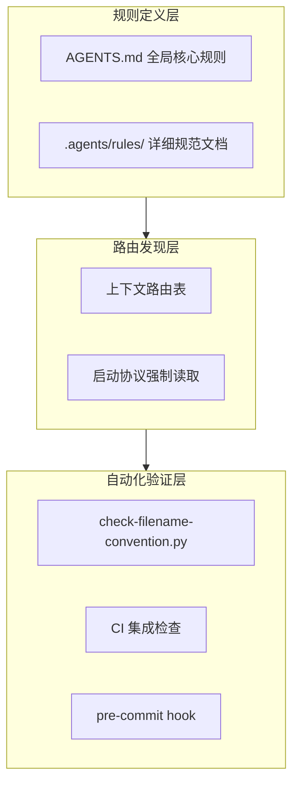

+++
id = "retrospective-tuyaopen-learning-report-optimization-20260630-insight"
date = "2026-06-30"
type = "insight-extraction"
source = "docs/knowledge/learning/tuya-open-learning-report.md"
+++

# 洞察萃取

## 洞察概览

从 TuyaOpen 学习报告优化任务中萃取了 **3 项核心洞察** 和 **2 条规律认知**。

## 核心洞察

### 洞察 1：规范前置化是预防违规的根本手段

**发现**：本次问题的根本原因是 AGENTS.md 缺少文件创建前的强制检查规则，导致智能体在创建文档时跳过了规范查阅环节。

**深层含义**：
- 规范文档存在但未被智能体在执行任务时自动加载，等于不存在
- 需要将规范检查嵌入到智能体的启动协议和任务路由中，而非依赖智能体的自觉行为
- 「全局核心规则」是规范前置化的最佳载体，所有智能体启动时都会读取

**验证证据**：
- 修复前：文件命名规范存在于 `.agents/rules/file-naming-convention.md`，但路由表中无对应条目
- 修复后：在 AGENTS.md 全局核心规则中新增强制性检查规则，在路由表中新增条目
- 效果：下次创建文件时将自动触发规范检查流程

### 洞察 2：双重违规往往暴露流程漏洞

**发现**：本次问题同时违反了文件放置规范和文件名命名规范，说明智能体在创建新文件时缺乏系统性的检查流程。

**深层含义**：
- 单一违规可能是偶然疏忽，双重违规必然是流程漏洞
- 需要建立"查目录归属 → 查命名规范 → 运行自动化验证"的三步检查流程
- 自动化工具（如 `check-filename-convention.py`）应在创建流程中被强制调用

**验证证据**：
- 原文件同时违反两项规范：中文命名 + 根目录放置
- 修复方案中新增的「文件创建纪律」明确要求三步检查：查目录、查命名、运行验证
- 验证脚本在修复后运行通过，证明检查流程有效

### 洞察 3：路由表是规范可发现性的关键

**发现**：文件命名规范虽然存在，但由于未在上下文路由表中列出，智能体在创建文件时无法自动路由到该规范文档。

**深层含义**：
- 规范文档的价值不仅在于内容本身，更在于可发现性
- 路由表是智能体查找规范的入口，必须覆盖所有常用任务场景
- 创建文件是高频任务，必须在路由表中占一席之地

**验证证据**：
- 修复前：上下文路由表中有"技术知识库查阅"条目，但无"文件命名规范"条目
- 修复后：在路由表中新增"文件命名规范（创建任何新文件前必读）"条目
- 位置：与"技术知识库查阅"条目相邻，创建文件时可被同时读取

## 规律认知

### 规律 1：规范约束的三层次模型

**模型描述**：规范约束需要三个层次的保障——规则定义层、路由发现层、自动化验证层。

| 层次 | 职责 | 本次修复内容 |
|------|------|-------------|
| 规则定义层 | 定义规范内容 | AGENTS.md 新增「文件创建纪律」规则 |
| 路由发现层 | 确保规范可被发现 | 上下文路由表新增命名规范条目 |
| 自动化验证层 | 强制验证合规性 | check-filename-convention.py 验证 |

### 规律 2：文档治理的双维度检查

**模型描述**：创建新文档时必须同时检查两个维度——位置维度和命名维度。

| 检查维度 | 检查项 | 合规标准 | 验证工具 |
|---------|--------|---------|---------|
| 位置维度 | 文件放置目录 | 是否在 docs/knowledge/ 下的正确分类目录 | 查阅 docs/knowledge/README.md |
| 命名维度 | 文件名称格式 | kebab-case、纯英文、无中文、无空格 | check-filename-convention.py |

**适用场景**：
- 任何创建新文档的任务
- 文档重构和迁移
- CI/CD 流程中的文档检查

## 可复用模式候选

### 模式候选 1：文件创建前置检查模式

**模式名称**：file-creation-precheck-pattern

**模式描述**：在创建任何新文件前，强制执行三步检查流程：①查阅分类体系确定归属目录；②查阅命名规范确定文件名格式；③运行自动化验证脚本确认合规性。

**核心流程**：

**适用场景**：
- 创建新文档
- 创建新代码文件
- 文档迁移和重命名

**成熟度评估**：L2（已通过本次任务实践验证）

### 模式候选 2：规范可发现性保障模式

**模式名称**：spec-discoverability-guarantee

**模式描述**：确保每一项重要规范都在三个位置有映射——AGENTS.md 全局规则中引用、上下文路由表中列出、自动化脚本中执行。

**三层映射表**：

| 规范 | AGENTS.md 引用 | 路由表条目 | 自动化脚本 |
|------|---------------|-----------|-----------|
| 文件命名规范 | 文件创建纪律规则 | 文件命名规范条目 | check-filename-convention.py |
| Spec 目录规范 | Spec 目录规范规则 | Spec 全局看板条目 | check-spec-consistency.py |
| 代码风格规范 | 代码修改规则 | CI 综合检查条目 | ci-check.py |

**适用场景**：
- 新增规范文档时的自检
- 规范文档完整性审计
- 智能体流程设计

**成熟度评估**：L1（从本次任务中提炼，尚未独立验证）

## 关联资源

- [学习笔记](../../../../knowledge/learning/tuya-open-learning-report.md)
- [执行复盘](execution-retrospective.md)
- [导出建议](export-suggestions.md)
- [方法论模式库](../../../patterns/methodology-patterns/README.md)