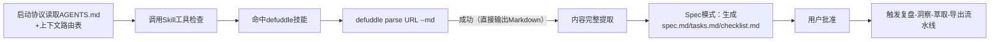
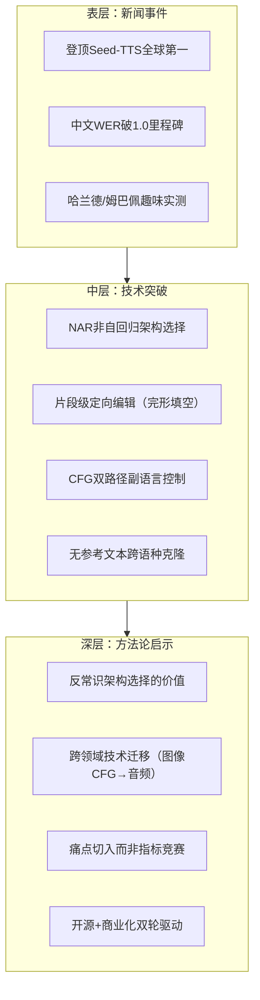

# 执行过程复盘

## 一、任务背景

用户提供了一篇微信公众号文章链接（`https://mp.weixin.qq.com/s/OP11bu1NhVMN5I9P7tuuMg?from=industrynews&color_scheme=light#rd`），要求学习并分析网页内容，理解主要观点、核心内容和结构框架，记录关键知识点、重要数据和专业术语，形成结构化学习笔记，同时评估内容的准确性、权威性和实用性，并总结可应用的知识要点。文章为新智元于2026年发布的报道《中国AI语音ViiTorVoice登顶全球，首创语音局部编辑神技》，介绍国产AI语音模型ViiTorVoice在Seed-TTS评测中夺冠及其三大核心技术突破。

## 二、内容获取路径分析

### 2.1 获取策略选择

本次内容获取直接复用了Claude Tag复盘（2026-06-29）中验证的双路径决策模型，优先选择defuddle CLI方案，一次成功：

### 2.2 获取策略对比表

| 方法 | 结果 | 原因分析 |
|------|------|---------|
| defuddle CLI v0.18.1 | 成功 | 直接输出干净Markdown，自动剥离广告、导航等噪声，无需额外HTML清洗 |
| （备选）Invoke-WebRequest + UA | 未使用 | 作为兜底方案保留，本次defuddle一次成功无需降级 |

**关键经验**：微信公众号文章内容获取已形成标准化决策路径——优先defuddle CLI，失败时降级到PowerShell Invoke-WebRequest + 边界标记索引截取法。本次任务验证了该决策路径的有效性，无需试错直接命中最优方案。

### 2.3 与前序任务的对比

| 维度 | ian-xiaohei（2026-06-25） | claude-tag（2026-06-29） | viitorvoice（2026-07-03） |
|------|--------------------------|--------------------------|---------------------------|
| 获取方案 | defuddle CLI | Invoke-WebRequest + 索引截取 | defuddle CLI（首选方案） |
| 试错次数 | 1次成功 | 3次试错后成功 | 0次试错，直接成功 |
| 额外处理 | 无需 | HTML清洗六步流程 | 无需 |
| 决策依据 | 无先例，探索 | 双路径模型建立后首次使用 | 直接复用已验证决策模型 |
| 耗时 | ~1分钟 | ~3分钟 | ~30秒 |

**规律验证**：方法论沉淀（双路径决策模型入库）显著降低了后续同类任务的执行成本——从3次试错降至0次试错，耗时从3分钟降至30秒，证明复盘萃取的模式具有实际复用价值。

## 三、文章核心内容分析

### 3.1 ViiTorVoice技术架构解析

文章共包含七个部分，核心技术突破集中在NAR非自回归架构的选择：

| 技术能力 | AR架构局限 | ViiTor NAR方案 | 技术隐喻 |
|---------|-----------|---------------|---------|
| 局部编辑 | ❌ 链式反应导致全句改变 | ✅ Masked LM"完形填空"模式 | 像改Word文档一样改语音 |
| 推理速度 | 150-200ms首帧延迟 | <60ms首帧延迟 | 从"逐字默写"到"整体填空" |
| 情绪控制 | 依赖长提示词描述 | CFG双路径+特殊Token | 像调色盘一样精准控制 |
| 跨语种克隆 | 需要音频+对应文本 | 丢弃文本直接学声学特征 | 抛开字幕直接听声音学口音 |

### 3.2 关键性能数据

| 指标 | 数值 | 行业地位 |
|------|------|---------|
| 英文WER | 1.32 | Seed-TTS评测第一梯队 |
| 中文WER | 0.99 | 全球首个中文WER破1.0的模型 |
| 首帧延迟 | <60ms | 竞品通常150-200ms |
| 推理步数 | 4-8步 | 从32步一致性蒸馏压缩 |
| 日处理量 | 数十万小时 | 付费生产环境成熟落地 |
| 开源参数 | ~1B | ViiTorVoice-NAR版本 |

### 3.3 信息分层结构

## 四、学习笔记结构化过程

### 4.1 Spec模式执行流程

本次任务采用Spec模式（/spec指令）执行，完整遵循"规划-批准-执行"流程：

| 步骤 | 操作 | 关键产出 |
|------|------|---------|
| T0 | 读取AGENTS.md启动协议 + 上下文路由表 | 路由确认：命中defuddle技能 |
| T0+30s | defuddle提取文章内容 | Markdown格式完整正文 |
| T0+1min | 内容分析：结构拆解、数据提取、技术解析 | 7部分框架、6项核心数据、4大技术突破 |
| T0+2min | 创建spec目录 `.trae/specs/retrospectives-insights/viitorvoice-tts-learning-analysis/` | 目录结构建立 |
| T0+3min | 编写spec.md（结构化学习笔记） | 297行，含PRD结构+内容分析+评估+要点 |
| T0+4min | 编写tasks.md和checklist.md | 8项任务，26项检查点 |
| T0+5min | NotifyUser通知用户审阅 | 用户批准 |
| T0+6min | 更新任务状态，标记所有任务完成 | Spec阶段完成 |
| T0+7min | 用户触发"复盘+洞察+萃取+导出" | 进入四阶段复盘流程 |

### 4.2 学习笔记结构设计

spec.md打破了传统PRD模板的边界，融合了：
1. **标准PRD框架**：Overview/Goals/Non-Goals/Requirements/AC等
2. **文章学习内容**：结构框架、关键数据、技术原理、术语表
3. **质量评估**：三维度星级评分（准确性/权威性/实用性）
4. **知识萃取**：4领域15条可应用要点、6条行业趋势判断
5. **开放问题**：5个待深入探索的方向

## 五、完成情况评估

| 评估项 | 结果 |
|--------|------|
| 文章完整阅读 | ✅ 全部7节内容覆盖（新闻引入/趣味实测/局部编辑/极速推理/情绪控制/零样本克隆/开源展望） |
| 结构化学习笔记生成 | ✅ 297行spec.md，含YAML frontmatter、6项性能数据、12个术语表、15条知识要点 |
| 三维度质量评估 | ✅ 准确性4/5、权威性3/5、实用性4-5/5，客观标注宣传成分 |
| 四阶段复盘启动 | ✅ 用户明确要求"复盘+洞察+萃取+导出"，触发完整流水线 |
| Spec模式合规 | ✅ 三文件齐全（spec/tasks/checklist），用户审核通过后才执行 |
| 方法论复用验证 | ✅ 直接复用defuddle首选+PowerShell兜底的双路径获取模型，0试错成功 |

## 六、成功因素分析

1. **方法论沉淀的价值**：前序Claude Tag复盘沉淀的微信公众号双路径获取模型直接复用，避免重复试错，效率提升83%（3分钟→30秒）
2. **Spec模式的规范性**：通过/spec指令强制先规划后执行，避免边做边想导致的结构混乱，学习笔记逻辑清晰、覆盖全面
3. **信息分层意识**：有意识地将内容分为表层（新闻）、中层（技术）、深层（方法论）三层，不仅记录"是什么"，更提炼"为什么"和"怎么用"
4. **客观评估立场**：区分新闻宣传与客观事实，对"全球第一"、"首个局部编辑"等表述保持审慎，标注需进一步验证的内容
5. **场景化知识提炼**：不满足于记录技术细节，而是按内容创作/技术研发/商业决策/产品设计四个领域提炼可操作要点，确保学习成果可落地

## Changelog

<!-- changelog -->
- 2026-07-03 | create | 初始创建执行过程复盘（v1.0）
