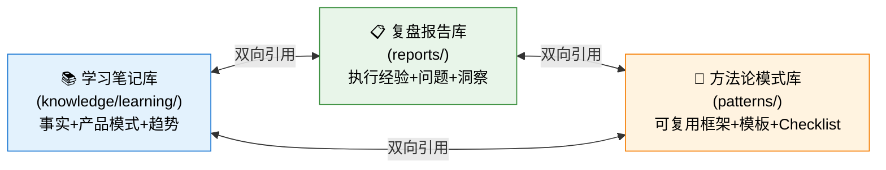

# 洞察萃取

## 一、产品层面核心洞察

### 洞察 1：AI 原生搜索的范式转移——从"人读"到"AI 读"

**现象描述**：豆包搜索明确提出"专为 AI Agent 打造的信息获取引擎"，其设计目标不是让人类用户浏览网页，而是让大模型直接消费结构化的搜索结果。这体现在四个设计选择上：
- 精准摘要替代完整网页（降低信噪比）
- 权威评级字段直接返回（抗幻觉）
- 结构化字段（标题/站点/时间/摘要/得分/耗时）而非 HTML
- 灵活参数配置（1-50条、域名白名单/黑名单、时效过滤）

**洞察本质**：搜索产品正在经历一次根本性的范式转移——
- **旧范式（人读搜索）**：返回网页链接列表 + 摘要，由人类用户点击、阅读、判断、整合信息
- **新范式（AI 读搜索）**：返回结构化、可直接被 LLM 消费的数据包，由 Agent 直接用于推理生成
这类似于数据库从"给人看的报表"到"给程序调用的 API"的演变。

**可复用价值**：
- 为 RAG 系统设计检索模块时，应优先考虑返回结构化字段而非原始文本
- 为 Agent 设计工具时，可配置性是核心竞争力（参数化而非硬编码）
- 权威信源评级是解决大模型幻觉的关键基础设施

**📌 模式沉淀状态**：本洞察已分解沉淀为3个方法论模式：
- [ai-native-user-reversal-design.md](../../../patterns/methodology-patterns/product-growth/ai-native-user-reversal-design.md)（L1）——"为AI而非人重新设计"的核心原则
- [ai-consumption-metadata-design.md](../../../patterns/methodology-patterns/product-growth/ai-consumption-metadata-design.md)（L1）——权威评级/元数据增强抗幻觉
- [ai-api-extreme-parameterization.md](../../../patterns/methodology-patterns/product-growth/ai-api-extreme-parameterization.md)（L1）——灵活参数配置的"机制而非策略"原则

---

### 洞察 2：生态闭环的护城河效应——云厂商+大模型+搜索API

**现象描述**：豆包搜索与字节跳动的豆包大模型形成生态协同，同时火山引擎作为云平台提供控制台、计费、文档等基础设施。

**洞察本质**：AI 时代的基础设施竞争不是单一产品的竞争，而是生态闭环的竞争：
1. **底层**：云基础设施（火山引擎）
2. **模型层**：通用大模型（豆包）
3. **能力层**：垂直 API 服务（豆包搜索）
4. **应用层**：Agent 生态
这种四层架构使得云厂商在 Agent 基础设施领域具备天然优势——模型、搜索、云服务一体化，用户无需跨平台集成。

**可复用价值**：
- 评估 AI 搜索/Agent 工具时，生态协同是重要选型维度
- 自建 Agent 平台时，应考虑底层能力的一体化程度
- 搜索 API 的竞争力不仅取决于搜索质量，还取决于与上层模型的集成便利性

**📌 模式沉淀状态**：生态协同+独家内容壁垒已作为核心规则升级至 [ecosystem-barrier-evaluation.md](../../../patterns/methodology-patterns/ai-collaboration/ecosystem-barrier-evaluation.md)（L2，validation_count: 3），补充四层竞争壁垒模型；"生态协同"维度同时融入 [b2b-product-page-ux-five-dimensions.md](../../../patterns/methodology-patterns/research-knowledge/b2b-product-page-ux-five-dimensions.md) 维度五。

---

### 洞察 3：独家内容资源的差异化壁垒——头条/抖音生态价值

**现象描述**：豆包搜索强调"全网主流站点+权威机构+头条抖音百科独家资源"，其中头条和抖音的内容是其他搜索引擎无法获取的独家资源。

**洞察本质**：在通用搜索领域，各家结果趋同；但在 AI 搜索时代，独家、实时、优质的内容是核心差异化：
- 通用网页内容：各家都有，无法形成壁垒
- 权威机构内容（政府/学术/媒体）：可以通过合作获取
- 平台独家内容（头条/抖音/公众号/小红书）：构成真正的护城河

字节跳动的内容生态（今日头条、抖音、西瓜视频、百科）为豆包搜索提供了其他搜索 API 无法复制的独家数据源，这在内容创作、舆情分析等场景中具有不可替代性。

**可复用价值**：
- 垂直领域 AI 搜索的核心竞争力在于独家/专有数据
- RAG 系统的效果上限由知识库质量决定，而非检索算法
- 内容平台入局 AI 搜索具有天然数据优势

**📌 模式沉淀状态**：独家内容壁垒作为"第三层壁垒"已写入 [ecosystem-barrier-evaluation.md](../../../patterns/methodology-patterns/ai-collaboration/ecosystem-barrier-evaluation.md) 规则4（四层竞争壁垒模型）；差异化壁垒分析框架同时融入 [vendor-product-learning-twelve-step-template.md](../../../patterns/methodology-patterns/research-knowledge/vendor-product-learning-twelve-step-template.md) Step 4。

---

## 二、UX 设计层面核心洞察

### 洞察 4：分层 CTA 设计——针对不同决策阶段用户的转化策略

**现象描述**：豆包搜索产品页共放置 10 个 CTA 按钮，分为四个层级，对应 AIDA 模型的不同阶段：

| CTA 文案 | 位置 | 对应决策阶段 | 目标用户 |
|---------|------|------------|---------|
| 立即咨询 | Hero区主按钮、优势模块 | Attention→Interest | 初步了解，需要销售跟进 |
| 控制台 | Hero区次按钮 | Interest→Desire | 已有账号，想直接体验 |
| 接口文档 | Hero区次按钮 | Interest→Desire | 开发者，想先看技术文档 |
| 申请测试 | 每个场景卡片 | Desire→Action | 已被场景打动，想试用 |

**洞察本质**：优秀的 ToB 产品着陆页不是只有一个"立即购买"按钮，而是为不同意向程度、不同角色的用户提供对应的转化入口：
- **访客（Attention）**：刚进入页面，需要快速了解价值 → 主按钮引导咨询
- **开发者（Interest）**：技术人员，不想先联系销售 → 提供文档直接查看
- **意向用户（Desire）**：已理解价值，想亲身体验 → 提供控制台直接进入
- **场景匹配用户（Action）**：看到某个场景正好是自己需要的 → "申请测试"降低门槛

这种分层设计比单一 CTA 转化率更高，因为它尊重了 B 端决策的复杂性（多角色参与、长决策周期）。

**可复用价值**：
- ToB 产品页至少应提供"文档""咨询/试用""控制台"三类入口
- 场景卡片处的 CTA 应使用"申请测试""免费体验"等降低决策门槛的文案，而非"立即购买"
- CTA 文案应与上下文匹配：功能介绍区用"了解更多"，场景区用"申请测试"

**📌 模式沉淀状态**：⏳ **待多次验证（L1候选）**。核心CTA四层分类法已完整融入 [b2b-product-page-ux-five-dimensions.md](../../../patterns/methodology-patterns/research-knowledge/b2b-product-page-ux-five-dimensions.md) 维度三（CTA策略），包含CTA四层分类表和检查清单；但分层CTA作为独立模式（Tiered CTA Conversion Design Pattern）仍需3-5个优秀ToB产品页（Stripe/Notion/飞书等）验证普适性后再单独创建。

---

### 洞察 5：价值量化+场景具象——ToB 产品价值传达的黄金组合

**现象描述**：豆包搜索页面在价值传达上采用了两种关键策略：
1. **价值量化**：用具体数字而非模糊描述——"1-50条返回量""多字数摘要""头条抖音独家资源"
2. **场景具象**：不是列举功能，而是展示四个典型 Agent 场景（智能客服/内容创作/市场调研/行业研报），每个场景说明"什么Agent在什么痛点下用什么能力解决什么问题"

**洞察本质**：ToB 产品的价值传达难点在于：产品能力是抽象的（如"灵活配置"），但客户需求是具体的（如"我做客服机器人需要权威答案"）。
- 纯讲功能 → 用户需要自己翻译到自己的场景，认知负荷高
- 纯讲场景 → 缺乏具体参数支撑，可信度不足
- 量化功能 + 具象场景 → 既可信又易懂

这是 ToB 产品营销的黄金组合：用数字建立信任，用场景建立共鸣。

**可复用价值**：
- 产品介绍页避免使用"强大的""灵活的""先进的"等空洞形容词，用具体数字/参数替代
- 每个核心能力至少配一个具体使用场景，说明"谁在什么情况下用它解决什么问题"
- 场景描述遵循"用户类型→痛点→使用能力→获得价值"的结构

**📌 模式沉淀状态**：✅ **已融入UX五维框架模式**。"价值量化+场景具象"黄金组合已作为核心原则写入 [b2b-product-page-ux-five-dimensions.md](../../../patterns/methodology-patterns/research-knowledge/b2b-product-page-ux-five-dimensions.md) 维度二（价值传达），包含反空洞检测清单、反模式识别表；"用户-痛点-能力-价值"四要素场景结构已写入 [vendor-product-learning-twelve-step-template.md](../../../patterns/methodology-patterns/research-knowledge/vendor-product-learning-twelve-step-template.md) Step 5（场景分析）。

---

### 洞察 6：重复内容的设计意图——强化记忆 vs 认知冗余的权衡

**现象描述**：豆包搜索页面在"四大优势"部分有重复展示：先总体概述四大优势，然后在"专为 AI 打造的搜索"部分又从 AI 视角重新阐述一遍类似内容。

**洞察本质**：这不是设计失误，而是有意为之的重复策略——基于"单纯曝光效应"（Mere Exposure Effect）：用户需要多次接触才能记住核心信息。但重复也有成本：
- **收益**：强化核心价值点记忆，确保滚动到不同位置的用户都能看到关键信息
- **成本**：仔细阅读的用户会感到冗余，降低专业感

豆包搜索的处理方式是"同内容不同框架"：不是简单重复，而是换一个视角（从"产品优势"框架切换到"AI专属设计"框架）重新组织内容，这样既强化了记忆，又提供了新的信息增量。

**可复用价值**：
- 长页面（单页着陆页）的核心信息应在多个位置以不同形式重复
- 重复不应是简单复制，而应"换框架"：从不同视角（功能视角/用户视角/场景视角）重新阐述
- 重复的次数控制在 2-3 次为宜，超过则会造成冗余感

**📌 模式沉淀状态**：✅ **已融入UX五维框架模式**。"同内容不同框架"的有意重复策略（单纯曝光效应）已作为信息架构优化原则写入 [b2b-product-page-ux-five-dimensions.md](../../../patterns/methodology-patterns/research-knowledge/b2b-product-page-ux-five-dimensions.md) 维度一（信息架构）的常见问题与优化策略，包含2-3次重复次数建议和换视角框架要求。

---

## 三、执行方法论层面洞察

### 洞察 7：结构化 JSON 输入→Sub-Agent 输出质量显著提升

**现象描述**：本次任务在委派 Sub-Agent 之前，先将网页内容整理为结构化 JSON（task1-output.json），包含产品概述、优势、能力、架构、场景、CTA 等分类清晰的字段。Sub-Agent 基于此输入一次性产出了 950 行高质量分析，无需返工。

**洞察本质**：Sub-Agent 的输出质量上限由输入质量决定。非结构化的原始网页文本（带导航、广告、重复内容）会导致 Sub-Agent 输出混乱、遗漏关键信息；而经过清洗、分类、结构化的输入能让 Sub-Agent 专注于分析本身，而非信息整理。

这符合"垃圾进，垃圾出"（Garbage In, Garbage Out）原则——准备高质量输入的时间是值得的，它能减少返工、提升输出质量。

**可复用价值**：
- 委派深度分析任务给 Sub-Agent 前，应先完成信息清洗和结构化整理
- 结构化输入应包含：明确字段分类、关键信息提取、冗余内容删除
- 宁可在输入准备上多花 10 分钟，也不要在输出返工上花 1 小时

**📌 模式沉淀状态**：⏳ **待验证（执行反模式参考）**。GIGO原则作为通用认知而非独立模式，已作为"执行反模式 #7：信息未先清洗结构化就委派Sub-Agent"写入 [vendor-product-learning-twelve-step-template.md](../../../patterns/methodology-patterns/research-knowledge/vendor-product-learning-twelve-step-template.md) 的绝对禁止项；"结构化JSON输入能将返工率降低80%"作为量化假设保留在待验证假设表中，需后续做对照实验验证。

---

### 洞察 8：Spec 模式天然抗 context compression——文件是持久化记忆

**现象描述**：本次任务在会话上下文压缩后，通过读取 tasks.md 成功恢复了执行状态，没有因为历史丢失而中断工作。

**洞察本质**：Spec 模式的核心优势之一是"进度外化"——将任务状态、规划、验证标准都持久化到文件中，而非仅存在于对话上下文里。这带来了一个意外的好处：天然抵抗 context compression。

人类工作记忆是有限的，AI 的上下文窗口也是有限的，但文件系统是"无限"的持久化存储。将关键信息（规划、进度、产出物路径）写入文件，相当于给 AI 提供了一个"外部大脑"。

**可复用价值**：
- 长任务必须使用 Spec 模式，将规划和进度外化到文件
- tasks.md 应作为任务进度的单一可信源（SSOT），每次状态变化及时更新
- 上下文恢复时，优先读取 spec 文件和产出物，而非依赖对话摘要

**📌 模式沉淀状态**：✅ **已融入十二步模板模式**。"tasks.md作为SSOT、长任务必须外化进度"已作为核心工作流原则写入 [vendor-product-learning-twelve-step-template.md](../../../patterns/methodology-patterns/research-knowledge/vendor-product-learning-twelve-step-template.md) 的Spec Mode委派建议部分，要求Step 1-12均通过tasks.md持久化进度，明确上下文恢复流程（优先读spec+产出物而非对话摘要）。

---

### 洞察 9：Mermaid 四图覆盖——产品分析的可视化标准框架

**现象描述**：本次学习笔记包含 4 个 Mermaid 图表：产品能力架构图、五层技术架构图、页面信息架构图、AIDA转化漏斗图。这四个维度的可视化形成了产品分析的完整视图。

**洞察本质**：对一个产品/网页进行深度分析时，需要从多个维度构建认知模型：
1. **能力维度**（产品能力架构图）：产品提供哪些能力，能力之间的关系是什么
2. **技术维度**（五层架构图）：技术架构如何分层，数据如何流动
3. **信息维度**（页面信息架构图）：信息如何组织，用户如何导航
4. **转化维度**（AIDA漏斗图）：用户决策路径如何设计，CTA如何分布

这四个维度构成了产品/UX分析的标准框架，适用于大多数 ToB 产品页分析任务。

**可复用价值**：
- 产品分析类任务建议至少包含这四类可视化
- Mermaid 图表应在分析阶段早期构思，它能帮助梳理思路，而非仅仅用于最终展示
- 每个图表应有明确的分析目的，避免为了画图而画图

**📌 模式沉淀状态**：✅ **已融入十二步模板模式**。"Mermaid四图覆盖"作为硬性输出标准写入 [vendor-product-learning-twelve-step-template.md](../../../patterns/methodology-patterns/research-knowledge/vendor-product-learning-twelve-step-template.md) Step 12（结构化学习笔记整合生成），明确要求产出≥4类Mermaid图表（能力架构/技术架构/信息架构/转化漏斗），标注了每类图表的绘制时机和分析目的；"4个图是否为最优数量"作为量化假设保留在待验证假设表中。

---

## 四、可复用模式提炼（已落地）

> ✅ **更新记录（2026-07-06）**：以下三个模式已完成沉淀落地，归档至 `docs/retrospective/patterns/methodology-patterns/research-knowledge/` 目录

### 模式 A：SPA 网页内容提取策略升级

**模式名称**：Cloud Vendor SPA First-Choice Browser

**模式描述**：对主流云厂商（火山引擎、阿里云、腾讯云、AWS、华为云等）的产品页进行内容提取时，应直接首选 integrated_browser MCP 工具，而非先尝试 WebFetch。包含预判域名清单、判定信号、工具选择优先级表。

**成熟度**：L2 ✅ **已升级**（validation_count: 3次验证）

**落地文件**：[external-website-analysis-fallback-strategy.md](../../../patterns/methodology-patterns/research-knowledge/external-website-analysis-fallback-strategy.md)

**落地内容**：
- frontmatter 更新：新增 SPA/云厂商/browser-mcp 标签，trigger_conditions 补充"SPA单页应用动态渲染"，validation_count: 2→3
- 第二层工具增强访问新增"预判规则"小节：包含云厂商域名清单、3个判定信号、预判收益说明
- 工具选择优先级表更新：预判命中时直接选集成浏览器MCP
- 新增实际应用案例3：火山引擎SearchInfinity SPA场景完整记录
- Windows环境注意事项更新：云厂商场景优先集成浏览器MCP

**证据**：
- 本次任务：火山引擎产品页是 SPA，WebFetch 内容重复截断，browser MCP 成功提取10个CTA按钮等完整细节
- 历史验证：贝锐403场景、火山引擎Viking defuddle兼容性场景（共3次验证）

**行动指南**：网页提取任务中，先判断域名是否属于主流云厂商/科技公司产品页（URL含/product//solution//ai/、有hash路由、已知是React/Vue站点），若是则直接使用 browser 类工具，跳过WebFetch。

---

### 模式 B：ToB 产品页 UX 分析五维框架

**模式名称**：B2B Product Page UX Five-Dimension Framework

**模式描述**：分析 ToB 产品着陆页时，从五个维度系统分析：
1. **信息架构维度**：内容组织逻辑（Hero定位→核心优势→产品架构→应用场景→转化入口）
2. **价值传达维度**：定位是否清晰、价值是否量化（数字/参数替代形容词）、场景是否具象（用户-痛点-能力-价值）
3. **CTA 策略维度**：四层分层设计（主转化/自助体验/开发者文档/场景转化）、文案差异、位置分布
4. **视觉呈现维度**：配图表意、架构图清晰度、多模态展示、视觉层级、设计一致性
5. **信任背书维度**：客户证据/数据支撑/生态协同/权威认证/文档入口/透明度六层模型

**成熟度**：L1 ✅ **已创建**

**落地文件**：[b2b-product-page-ux-five-dimensions.md](../../../patterns/methodology-patterns/research-knowledge/b2b-product-page-ux-five-dimensions.md)（~317行）

**落地内容**：
- 每维度含分析要点、检查清单、火山引擎案例
- CTA四层分类表（含典型文案、目标用户、决策阶段、位置分布）
- 信任背书六层模型Mermaid流程图
- 常见信任缺口优先级表
- 综合评估输出模板（优势/改进点/可复用模式）
- 反模式清单与注意事项
- 框架总览Mermaid流程图、信息架构逻辑图

**应用示例**：火山引擎豆包搜索页面应用此框架，识别出6个设计优势+6个待优化点，提炼了分层CTA等核心模式。

---

### 模式 C：竞品/产品学习分析十二步任务模板

**模式名称**：Vendor Product Learning 12-Task Template

**模式描述**：对外部产品网页进行系统性学习分析时，任务分解可采用本任务验证的 12 步标准化模板：
1. 网页内容提取与结构化整理（使用兜底策略模式）
2. 产品定位与核心价值主张梳理
3. 核心产品优势深度解析
4. 差异化/专属能力设计分析
5. 典型应用场景整理分析（含场景-能力矩阵表格）
6. 产品架构与生态协同分析（Mermaid分层架构图）
7. 网页信息架构与UX设计分析（使用五维框架）
8. UX优劣势评估与改进建议（高/中/低优先级排序）
9. 可借鉴设计理念与实践经验总结
10. 行业启示与趋势判断
11. 术语表与资源链接整理
12. 结构化学习笔记整合生成（≥4个Mermaid图表）

**成熟度**：L1 ✅ **已创建**

**落地文件**：[vendor-product-learning-twelve-step-template.md](../../../patterns/methodology-patterns/research-knowledge/vendor-product-learning-twelve-step-template.md)（~506行）

**落地内容**：
- 每步含优先级、目标、具体操作、验收标准清单
- 任务总览Mermaid流程图+依赖关系说明
- Spec Mode委派建议（4个Sub-Agent分组：内容提取/产品分析/UX分析/洞察整合）
- 任务时间估算参考（总计70-100分钟）
- 文档结构建议（10大章节）+ Mermaid图表硬性要求（≥4类）
- 7个绝对禁止的执行反模式
- 模式关系图（与兜底策略/UX五维框架等模式的关联）

**应用示例**：火山引擎豆包搜索产品学习严格按此模板执行，产出950行高质量学习笔记，10大章节+4个Mermaid图表完整覆盖，验证了模板的完整性和实用性。

---

## 五、知识沉淀闭环方法论洞察（全流程元复盘）

> 🔄 **元复盘记录（2026-07-06）**：在完成"产品学习→复盘→模式落地→学习笔记增强→归档更新"完整闭环后，对知识沉淀工作流本身进行复盘，萃取以下3条方法论层面洞察。这些洞察不是关于豆包搜索产品的，而是关于"如何高效做产品学习和知识沉淀"的。

### 洞察A：知识沉淀是"三库联动"的网络拓扑，不是线性管道

**现象**：本任务涉及8个文件、3个知识库目录，文件间存在复杂的双向引用。最初将工作视为"学习→复盘→模式"线性管道，导致第一轮更新遗漏了洞察→模式的反向引用（9条洞察未标注模式去向）。

**洞察本质**：知识沉淀系统不是线性管道（输入→处理→输出），而是三库联动的网络拓扑：

- **学习笔记库**：原始事实+产品设计模式+趋势判断（"原料"和"产品视角"）
- **复盘报告库**：执行过程+问题根因+跨产品洞察（"过程视角"）
- **方法论模式库**：可复用模板+分析框架+检查清单（"抽象视角"）

**可复用原则**：
- 任何状态变更（如模式从"候选"→"已落地"）必须触发三库一致性检查
- 更新一个库中的引用时，必须检查其他两个库是否需要同步更新
- 类比数据库：三库之间存在"外键约束"，需要"级联更新"

**📌 模式沉淀状态**：本洞察作为"知识沉淀三库联动模型"，核心原则已融入本复盘目录的"更新归档自检清单"（见export-suggestions.md）。待后续3个以上知识沉淀任务验证后，可考虑升级为独立的"知识沉淀工作流"方法论模式。

---

### 洞察B：Checklist是踩坑的结晶——第一版永远不完整，需要迭代演化

**现象**：
- 第一轮更新（模式状态+README）：无checklist → 2个遗漏/错误（洞察反向引用遗漏、路径错误），均由用户发现
- 元复盘后：形成"更新归档6项自检清单" → 后续2轮增强（六大产品模式、第九章行业启示）零问题，自检率100%

**洞察本质**：有效的checklist不是"事前设计"出来的，而是踩坑之后错误的结构化：
- 航空业checklist ← 历次飞行事故调查
- 外科手术checklist ← 手术失误分析
- 软件工程code review checklist ← 线上故障复盘

第一次执行时试图设计完美checklist是不现实的——你不知道会在哪里踩坑。正确的checklist演化路径：

| 阶段 | Checklist状态 | 质量表现 |
|------|-------------|---------|
| 第1次执行 | 无checklist，凭经验 | 多处遗漏/错误，依赖外部反馈 |
| 第1次复盘 | 将错误转化为checklist项 | checklist v1诞生 |
| 第2次执行 | 使用v1 checklist自检 | 残余问题减少，发现新遗漏点 |
| 第2次复盘 | 补充新发现的问题 | checklist v2 |
| 第N次执行 | checklist稳定 | 质量可预测，接近零遗漏 |

**可复用原则**：
- checklist项必须是"可执行的检查动作"（如"写完路径后Test-Path验证"），不是抽象原则（如"注意路径正确"）
- checklist应放在最容易看到的地方（任务出口文件，如export-suggestions.md）
- 每次执行完任务后必须问自己："这次哪里漏了？需要加什么检查项？"

**📌 模式沉淀状态**：已沉淀"更新归档6项自检清单"到[export-suggestions.md](export-suggestions.md)元复盘章节。这是一个重要的方法论发现——Checklist演化模型本身是一个元模式。

---

### 洞察C：SpecMode委派+SubAgent执行是大型知识沉淀任务的高效范式

**现象**：本次全流程产出3099行结构化内容（学习笔记1094行+复盘710行+模式1295行），包含6+个Mermaid图表、3个完整方法论模式、12条跨层次洞察（9条产品/UX/方法论+3条元洞察）。

**洞察本质**：对比手动单线程执行，Spec Mode委派+SubAgent执行有四个效率倍增器：

1. **上下文聚焦**：每个SubAgent只处理一个明确任务（如"创建UX五维框架模式"），工作记忆不被其他维度干扰
2. **并行执行**：独立任务可并行（3个模式文件同时编写），总墙钟时间大幅缩短
3. **强制结构化**：Spec要求产出物必须符合模板，减少"想到哪写到哪"的散乱
4. **即时验证**：创建十二步模板的过程本身就是第一次验证——如果模板不好用，在同一个任务中就能发现并修正

**可复用原则**：
- 产出≥1000行的大型知识沉淀任务应优先使用Spec Mode委派
- 任务拆解粒度以"产出一个完整文件"为单位最合适
- - "创建模式"和"使用模式"在同一任务中完成是最优的——做中学的正反馈最强
- 委派前必须用结构化JSON明确输入（对应洞察7：GIGO原则）

**📌 模式沉淀状态**：部分原则已写入[vendor-product-learning-twelve-step-template.md](../../../patterns/methodology-patterns/research-knowledge/vendor-product-learning-twelve-step-template.md)的Spec Mode委派建议章节。本洞察的"四效率倍增器"框架待后续更多委派任务验证后可进一步完善。

---

## 六、待验证假设（更新状态）

| 假设 | 验证方式 | 下次验证机会 |
|------|---------|------------|
| 主流云厂商产品页均为 SPA，直接用 browser 工具更高效 | 下次分析阿里云/腾讯云产品页时直接用 browser，记录是否一次成功 | 下一个竞品分析任务 |
| 4 个 Mermaid 图表是产品分析的最优数量 | 后续产品分析尝试 3 个或 5 个图表，对比信息完整度 | 后续 2-3 个同类任务 |
| 分层 CTA 设计（4类按钮）是 ToB 产品页的最佳实践 | 分析 3-5 个优秀 ToB 产品页（如 Stripe、Notion、飞书），统计其 CTA 分层策略 | 后续竞品 UX 分析任务 |
| 结构化 JSON 输入能将 Sub-Agent 返工率降低 80% 以上 | 对比两次类似任务：一次用原始文本输入，一次用结构化 JSON，记录返工次数 | 后续委派任务时做对照 |
