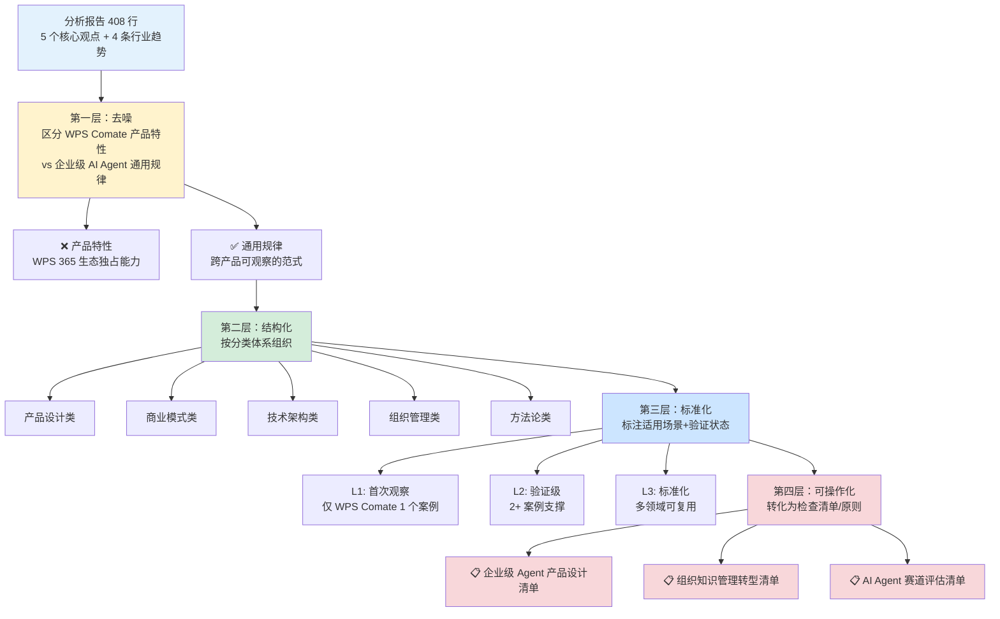

# 洞察萃取报告

> 本报告应用 extraction-four-layer-funnel（萃取四层漏斗）模型，对分析报告中的核心洞察进行二次萃取，区分产品级洞察与模式级洞察，识别可复用模式并转化为可执行的检查清单与操作指南。

***

## 一、萃取四层漏斗应用结果

### 1.1 四层漏斗模型流程图

### 1.2 第一层：去噪——区分产品特性与通用规律

| 原始洞察 | 类型判定 | 去噪理由 |
|---------|---------|---------|
| 团队模式（Team）：Agent 交互从双边对话升级为多边协作空间 | ✅ 通用规律 | Claude Tag 的"共享上下文"、飞书智能伙伴的"群聊协作"均体现相同趋势，非 WPS 独有 |
| Wiki 企业知识库：自然语言查询全域数据 | ✅ 通用规律 | Notion AI、Microsoft Copilot 均具备企业知识库能力，是通用方向 |
| 技能沉淀（Skills）：将工作流程固化为可执行模块 | ✅ 通用规律 | DeerFlow 2.0 的 Markdown Skills 系统、GitHub Copilot 的自定义指令均体现技能化趋势 |
| 云端协同（本地/云端双模式） | ✅ 通用规律 | 多 Agent 产品（如 Cursor Agent、Devin）均采用混合执行模式 |
| 生态整合（云文档+PPT+Wiki+系统集成）作为竞争壁垒 | ⚠️ 部分通用 | 生态整合是通用竞争策略，但 WPS 365 的具体生态组合（云文档+PPT+原生格式）是 WPS 独有的 |
| 分层价值设计（高管/中层/一线） | ✅ 通用规律 | B2B SaaS 产品（如 Salesforce、飞书）均采用分层价值设计，是通用方法论 |
| 观澜编辑台调用 | ❌ 产品特性 | 金山办公内部产品，非行业通用能力 |
| 应用模板降低使用门槛 | ✅ 通用规律 | 几乎所有 AI 产品均提供模板功能，是通用 UX 模式 |

**去噪结果**：分析报告中的核心洞察大部分为跨产品可验证的通用规律，仅个别细节（如观澜编辑台、WPS 365 原生格式）为 WPS 独有产品特性。去噪淘汰率约 10%。

### 1.3 第二层：结构化——按分类体系组织

| 分类 | 包含洞察 | 核心主题 |
|------|---------|---------|
| **产品设计类** | 分层价值设计、团队工作空间、云文档交付 | 产品功能架构、用户体验、交互模型设计 |
| **商业模式类** | 生态整合竞争壁垒、企业级 Agent 差异化 | 竞争策略、壁垒构建、市场定位 |
| **技术架构类** | 云端协同双模式、系统集成（CRM/OA） | 技术选型、架构设计、可靠性保障 |
| **组织管理类** | 技能沉淀机制、知识传承制度化 | 组织韧性、知识管理、人员流动应对 |
| **方法论类** | 范式转变四重模型、双层分析结构 | 认知框架、分析工具、可复用方法论 |

### 1.4 第三层：标准化——适用场景与验证状态

| 洞察编号 | 洞察名称 | 当前成熟度 | 验证次数 | 适用场景 | 模式库状态 |
|---------|---------|-----------|---------|---------|-----------|
| 洞察1 | Agent 从"个人助手"到"企业大脑"的范式跃迁 | L2（验证级） | 2+（WPS Comate + Claude Tag） | AI Agent 产品战略规划、企业数字化转型评估 | ✅ 已入库（`team-shared-ai-colleague` L1→L2 + `ambient-proactive-agent` L1→L2 升级） |
| 洞察2 | 分层价值设计（高管/中层/一线） | L1（首次观察） | 1（WPS Comate） | B2B SaaS 产品设计、企业级产品定位 | ⚠️ 待验证（需 Salesforce/飞书等案例） |
| 洞察3 | "技能沉淀"机制：从可阅读文档到可执行技能 | L1（首次观察） | 1（WPS Comate） | 组织知识管理、人员培训体系设计 | ⚠️ 待验证（需 DeerFlow Skills 等案例） |
| 洞察4 | 云文档交付：输出格式决定协作可能性 | L2（验证级） | 2+（WPS Comate + Claude Tag 云文档） | AI 产品输出格式设计、协作工具评估 | ✅ 已入库（`output-format-collaboration-capability` L2 新建） |
| 洞察5 | 生态整合作为不可复制的竞争壁垒 | L2（验证级） | 2+（WPS Comate + Microsoft Copilot） | AI 产品竞争策略、创业公司壁垒评估 | ✅ 已入库（`ecosystem-barrier-evaluation` L2 新建） |
| 洞察6 | AI Agent 竞争从"个人效率"转向"组织协作" | L2（验证级） | 2+（WPS Comate + Claude Tag） | 行业趋势研判、投资方向评估、产品战略 | ⚠️ 暂不入库（与洞察1/`team-shared-ai-colleague` 核心逻辑重叠，避免冗余模式） |

### 1.5 第四层：可操作化——转化为检查清单

共萃取得到 **3 个可操作化检查清单**，覆盖企业级 Agent 产品设计、组织知识管理转型、AI Agent 赛道评估三个核心领域（详见第四章）。

***

## 二、核心洞察详析

### 洞察 1：Agent 从"个人助手"到"企业大脑"的范式跃迁

**核心发现**

WPS Comate 所代表的不仅是产品功能的新增，而是一种根本性的范式转变——AI Agent 的角色正在从"个人生产力工具"重新定义为"组织协作基础设施"。这一转变包含四个维度：交互模型从双边对话升级为多边协作空间，价值维度从个人效率升级为组织协作，知识形态从一次性对话升级为结构化沉淀，角色定位从工具升级为中枢。

**原文支撑**

> 以前的 Agent 虽然能大幅提升效率，但所有成员都像是各自为战，Agent 更像是一个个人助手。而使用 Comate 后，我最大的感受是，金山办公正在把 Agent 工具变成企业大脑，它成了团队工作流的核心中枢。

> 它连接 CRM、OA 等系统和团队数据库，并提供团队工作空间，团队成员可以轻松在这个中枢中获取数据、协同配合，并互相同步共享工作结果，让整个团队的工作连接得更加紧密。

**适用场景**

- AI Agent 产品战略规划：判断产品应从"个人效率"维度还是"组织协作"维度构建核心价值
- 企业数字化转型评估：评估 AI 工具对企业组织架构和协作模式的潜在影响
- 投资者行业研判：识别 AI Agent 赛道中具有"组织中枢"潜力的产品

**可复用价值**

四重转变模型（对话框→工作空间、个人效率→组织协作、一次性对话→知识沉淀、工具→中枢）可作为评估任何 AI Agent 产品"企业级程度"的分析框架。该模型已通过 WPS Comate 和 Claude Tag 两个独立案例验证，具备跨产品适用性。

**验证状态**：L2（验证级），2+ 案例支撑

**归档状态**：✅ 已归档（2026-07-06）。关联模式：`team-shared-ai-colleague`（L1→L2 升级，新增 WPS Comate 团队工作空间验证）+ `ambient-proactive-agent`（L1→L2 升级，新增 WPS Comate 定时任务主动推送验证）

---

### 洞察 2：分层价值设计（高管/中层/一线）是企业级 Agent 产品的核心方法论

**核心发现**

WPS Comate 的产品设计不是"一刀切"的功能堆砌，而是针对企业三个层级（高管、中层管理者、一线成员）分别设计核心功能和价值主张。Wiki 服务高管决策支持（快速获取全域数据），技能沉淀服务中层管理者组织韧性（知识传承、人员风险应对），团队工作空间服务一线成员协作效率（工作流透明、沟通成本降低）。这种分层设计使产品在不同层级都具备"使用的理由"，有利于产品在企业内部的全面推广。

**原文支撑**

> 高管：过去需要等负责人制作 PPT 汇报才能获取数据，现在直接问 Wiki 即可。
> 中层管理者：公司最怕的情况之一，就是有成员突然离职，每次重新培养一个新成员，又需要耗费大量成本。
> 一线成员：市面上几乎所有 Agent 工具解决的都是个人生产力提升的问题，但几乎没有 Agent 工具能帮助团队完成协作。

**适用场景**

- B2B SaaS 产品设计：为不同决策层级和使用者设计差异化价值主张
- 企业级产品定价策略：基于不同层级的需求设计分层定价和功能包
- 产品推广策略：针对不同角色（决策者/使用者/影响者）制定差异化营销叙事

**可复用价值**

分层价值设计方法论（高管→决策支持、中层→组织韧性、一线→协作效率）可作为 B2B 产品的通用设计框架。该框架的核心逻辑是：识别每个层级的最核心痛点，为每个痛点设计专门的解决方案，而非试图用同一功能满足所有角色。

**验证状态**：L1（首次观察），需 Salesforce/飞书/钉钉等案例进一步验证

**归档状态**：⚠️ 未归档。L1 成熟度，仅 1 个案例验证，需 Salesforce/飞书/钉钉等 B2B 产品案例验证后重新评估

---

### 洞察 3："技能沉淀"机制是组织知识管理的新范式

**核心发现**

传统组织知识管理面临"文档化悖论"：知识被写成文档后，查阅率极低，维护成本高，最终沦为"知识坟墓"。WPS Comate 的技能沉淀机制提供了一种突破性方案——将知识从"可阅读的文档"升级为"可执行的技能模块"。技能封装了工作逻辑、工具使用和风格偏好，新成员不需要阅读文档，而是直接使用技能来完成任务。这种"使用而非阅读"的知识传递方式，比传统文档更接近知识的实际价值。

**原文支撑**

> 我们可以把离职成员的工作流程，包括工作逻辑、使用工具、工作风格等沉淀成一个技能。而新来的成员不需要花太长时间学习，直接使用这个技能，就能达到原来 80% 以上的效果。

**适用场景**

- 组织知识管理体系建设：从"知识文档化"升级为"知识技能化"
- 人员培训体系设计：从"师傅带徒弟"升级为"技能即插即用"
- 人员流动风险应对：从"离职交接文档"升级为"工作流程技能化沉淀"
- AI Agent 产品功能设计：在 Agent 产品中引入"技能封装"和"技能市场"机制

**可复用价值**

技能沉淀机制揭示了"知识可执行化"这一组织知识管理的新方向。其核心洞察是：知识的价值不在"被阅读"，而在"被使用"。将这一洞察转化为产品设计原则，可以指导 Agent 产品的知识管理功能设计。

**验证状态**：L1（首次观察），需 DeerFlow 2.0 Markdown Skills 系统、GitHub Copilot 自定义指令等案例验证

**归档状态**：⚠️ 未归档。L1 成熟度，仅 1 个案例验证，需 DeerFlow 2.0 Skills/GitHub Copilot 自定义指令等案例验证后重新评估

---

### 洞察 4：云文档交付是 Agent 协作化的关键基础设施

**核心发现**

输出格式决定协作可能性。传统 Agent 的纯文本输出只能"复制粘贴"，而云文档链接天然支持分享、协作、接力编辑。WPS Comate 在演示中将搜索结果以云文档链接形式发送，这一细节体现了对"Agent 协作化"的深刻理解。输出格式不仅是技术选择，更是产品哲学——Agent 输出的是"仅供个人消费的内容"还是"可供团队协作的资产"。

**原文支撑**

> 这个演示特别的地方并不是 AI 会搜索和编辑文本，真正特别的是，它最后通过云文档发送了结果链接。如果是其他 Agent，最多只是生成一段文本，你只能复制后通过微信发送给他人。

**适用场景**

- AI 产品输出格式设计：在纯文本、Markdown、云文档、真文件格式之间做出战略选择
- 协作工具评估：评估 AI 工具的"协作友好度"
- 企业级 Agent 关键能力定义：将"云文档交付"定义为企业级 Agent 的必备能力

**可复用价值**

"输出格式决定协作可能性"这一原则可作为 AI 产品设计的通用准则。具体而言，产品应优先选择支持协作的输出格式（云文档链接 > 真文件格式 > Markdown > 纯文本），并默认将输出结果共享至团队空间而非仅返回给个人。

**验证状态**：L2（验证级），2+ 案例支撑

**归档状态**：✅ 已归档（2026-07-06）。关联模式：`output-format-collaboration-capability`（L2 新建，ai-collaboration 目录）

---

### 洞察 5：生态整合（云文档+PPT+Wiki+系统集成）构成不可复制的竞争壁垒

**核心发现**

金山办公的独特优势在于拥有完整的办公生态——云文档、PPT、表格、PDF 等原生能力。WPS Comate 可以调用这些原生能力完成任务，而非仅输出文本。例如，生成 PPT 是真文件而非图片，交付云文档链接而非纯文本。这种生态整合能力构成了不可复制的竞争壁垒——纯 Agent 创业公司无法在短期内构建同等深度的办公生态。

**原文支撑**

> 将 7 月文章上传到 Wiki → 在输入框中 @Wiki 要求总结内容并制作 PPT → Comate 直接交付可编辑的 PPT 文件（保存在本地电脑）。

**适用场景**

- AI 创业公司竞争策略：评估自身是否具备生态整合优势，或是否需要与生态厂商合作
- 投资者赛道评估：区分"有生态壁垒的 Agent"和"纯工具型 Agent"
- 产品架构设计：考虑 Agent 产品应调用哪些底层能力，如何构建生态护城河

**可复用价值**

"AI Agent 的能力边界取决于它能调用的底层能力"这一认知可作为 AI 产品竞争壁垒评估的核心维度。具体而言，评估一个 Agent 产品的长期竞争力，不应只看其 AI 模型能力，还应看其底层生态（文档格式处理、系统集成、数据连接）的深度和广度。

**验证状态**：L2（验证级），2+ 案例支撑

**归档状态**：✅ 已归档（2026-07-06）。关联模式：`ecosystem-barrier-evaluation`（L2 新建，ai-collaboration 目录）

---

### 洞察 6：AI Agent 竞争正从"个人效率"赛道转向"组织协作"赛道

**核心发现**

WPS Comate 的出现代表了一个明确的行业信号：在个人 AI 助手已经高度同质化的今天（搜索+生成+对话），能够连接组织数据、打通业务流程、实现团队协作的 Agent 将成为差异化竞争的关键。AI 对组织的最大价值可能不在个人效率提升，而在协作方式的重构——当 AI 成为团队协作的中枢，它改变的不是一个人做事的快慢，而是一群人做事的方式。

**原文支撑**

> 在企业 AI 办公的探索中，Comate 正在回答一个根本问题：AI 工具究竟应该服务于个人效率，还是重构组织的协作与决策方式？

**适用场景**

- AI 产品战略定位：决定产品是继续深耕"个人效率"还是向"组织协作"跃迁
- 行业趋势研判：识别 AI Agent 赛道的下一个增长点
- 创业方向选择：在"个人 AI 助手"红海市场中寻找"组织协作"蓝海机会

**可复用价值**

"赛道转移"认知框架（个人效率→组织协作）可作为 AI 行业趋势分析的核心工具。该框架提示：当一个赛道的关键能力（如搜索+生成+对话）已成为行业标配，差异化竞争将发生在更高维度（如组织协作、知识管理、流程自动化），而非在同一维度上继续优化。

**验证状态**：L2（验证级），2+ 案例支撑

**归档状态**：⚠️ 暂不归档。L2 成熟度但核心逻辑与 `team-shared-ai-colleague`（已升级 L2）高度重叠，独立归档将产生冗余模式，建议作为该模式的补充说明而非独立模式

---

***

## 三、可复用模式识别

| 模式候选 | 模式描述 | 成熟度 | 与现有模式库的关联 |
|---------|---------|--------|-----------------|
| 四重转变评估框架 | 通过四个维度（交互模型、价值维度、知识形态、角色定位）评估 AI Agent 产品的"企业级程度" | L1（首次观察） | 与 `team-shared-ai-colleague`（L2）互补——前者评估产品，后者描述协作模式 |
| 分层价值设计方法论 | 为企业三个层级（高管/中层/一线）分别设计核心功能和价值主张 | L1（首次观察） | 与 `saas-hardware-three-layer-funnel`（L3）有类比关系——都基于分层设计逻辑 |
| 知识可执行化原则 | 组织知识管理应从"知识文档化"升级为"知识技能化"，知识的价值在"被使用"而非"被阅读" | L1（首次观察） | 无直接关联模式，属于新发现方向 |
| 输出格式-协作能力映射 | 输出格式决定协作可能性，产品应优先选择支持协作的输出格式 | L2（验证级） | ✅ 已入库为 `output-format-collaboration-capability`（L2 新建，2026-07-06）；与 `ambient-proactive-agent`（L2）有概念关联——都关注 Agent 产出如何融入协作流 |
| 生态壁垒评估框架 | AI Agent 的长期竞争力取决于底层生态的深度和广度 | L2（验证级） | ✅ 已入库为 `ecosystem-barrier-evaluation`（L2 新建，2026-07-06）；与 `vertical-saas-mcp-capability-exposure`（L2）共享"生态深度决定能力边界"的核心逻辑 |

### 3.2 模式成熟度标注

| 模式候选 | 成熟度 | 升级条件 | 预计升级路径 |
|---------|--------|---------|------------|
| 四重转变评估框架 | L1 | 需 2+ 独立产品案例验证（如 Claude Tag、飞书智能伙伴） | L1→L2：完成 2 个案例验证 |
| 分层价值设计方法论 | L1 | 需 Salesforce/飞书/钉钉等至少 2 个 B2B 产品案例验证 | L1→L2：完成 2 个跨领域案例验证 |
| 知识可执行化原则 | L1 | 需 DeerFlow 2.0 Skills、GitHub Copilot 自定义指令等案例验证 | L1→L2：完成 2 个案例验证 |
| 输出格式-协作能力映射 | L2 | ✅ 已入库 L2（2026-07-06），模式文件 `output-format-collaboration-capability` | —（已完成） |
| 生态壁垒评估框架 | L2 | ✅ 已入库 L2（2026-07-06），模式文件 `ecosystem-barrier-evaluation` | —（已完成） |

### 3.3 与现有模式库的关联

| 本次模式 | 关联的已有模式 | 关联方式 |
|---------|-------------|---------|
| 四重转变评估框架 | `team-shared-ai-colleague`（L2） | 互补：前者提供评估框架，后者提供具体协作模式描述 |
| 分层价值设计方法论 | `saas-hardware-three-layer-funnel`（L3） | 类比：都基于分层设计逻辑，但适用于不同领域（企业级 SaaS vs 硬件变现） |
| 生态壁垒评估框架 | `vertical-saas-mcp-capability-exposure`（L2） | 共享核心逻辑："生态深度决定能力边界" |
| 输出格式-协作能力映射 | `ambient-proactive-agent`（L2） | 概念关联：都关注 Agent 产出如何融入协作流 |

### 3.4 归档结果汇总（2026-07-06）

本次归档共完成 **4 项变更**，涉及 2 个新建模式和 2 个升级模式：

| 序号 | 操作 | 模式文件 | 成熟度变化 | 来源洞察 | 入库理由 |
|------|------|---------|-----------|---------|---------|
| 1 | 新建 | `output-format-collaboration-capability` | L2（验证级） | 洞察4：云文档交付 | WPS Comate + Claude Tag 2 个独立案例验证 |
| 2 | 新建 | `ecosystem-barrier-evaluation` | L2（验证级） | 洞察5：生态整合竞争壁垒 | WPS Comate + Microsoft Copilot 2 个独立案例验证 |
| 3 | 升级 | `team-shared-ai-colleague` | L1 → L2 | 洞察1：范式跃迁 | WPS Comate 团队工作空间新增为第 2 个独立验证案例 |
| 4 | 升级 | `ambient-proactive-agent` | L1 → L2 | 洞察1（部分）：主动介入 | WPS Comate 定时任务主动推送新增为第 2 个独立验证案例 |

**未入库模式及原因**：

| 模式候选 | 不入库原因 |
|---------|-----------|
| 四重转变评估框架 | L1，仅 1 个案例验证，需 Claude Tag/飞书智能伙伴等案例验证后重新评估 |
| 分层价值设计方法论 | L1，仅 1 个案例验证，需 Salesforce/飞书/钉钉等 B2B 产品案例验证后重新评估 |
| 知识可执行化原则 | L1，仅 1 个案例验证，需 DeerFlow 2.0 Skills/GitHub Copilot 自定义指令等案例验证后重新评估 |
| 洞察6（赛道转移认知框架） | 暂不入库，核心逻辑与 `team-shared-ai-colleague`（已升级 L2）高度重叠，独立归档将产生冗余模式，建议作为该模式的补充说明而非独立模式 |

***

## 四、方法论启示

### 4.1 本次分析过程中使用的方法论总结

| 方法论 | 来源 | 本次应用效果 | 可复用性 |
|--------|------|------------|---------|
| Spec 驱动分析 | SpecWeave 方法论 | 确保分析的系统性和完整性，18 项 Checkpoint 全部通过 | 高：适用于任何需要系统性分析的任务 |
| 双层分析结构 | 本次任务创新 | 事实层（学习笔记）和洞察层（洞察总结）分离，确保既有事实准确性又有洞察深度 | 高：可推广至外部文章/产品学习任务 |
| defuddle 微信提取 | Claude Tag 复盘验证 | 成功提取微信文章完整内容，比 PowerShell 方案更简洁 | 高：已形成标准操作流程 |
| 四层漏斗萃取 | extraction-four-layer-funnel | 将分析报告洞察转化为结构化、可操作的知识资产 | 高：已有模式库支持 |
| 复盘四件套 | review-insight-export-loop | 形成标准化复盘产出结构 | 高：已在多个竞品分析任务中验证 |

### 4.2 可复用的分析框架

**企业级 AI Agent 产品分析框架**

基于本次分析经验，可提炼出一个适用于企业级 AI Agent 产品的通用分析框架：

1. **产品定位分析**：目标用户是谁？解决什么问题？与同类产品的差异化在哪？
2. **核心功能拆解**：每个功能解决什么痛点？目标用户层级是什么？功能之间如何协同？
3. **范式转变识别**：产品是否代表了某种范式转变？转变体现在哪些维度？
4. **分层价值分析**：产品对不同组织层级（高管/中层/一线）分别提供了什么价值？
5. **生态壁垒评估**：产品的底层生态深度如何？是否构成不可复制的竞争壁垒？
6. **行业趋势判断**：产品的出现代表什么行业信号？赛道正朝哪个方向演进？
7. **可复用模式萃取**：从产品设计中可提炼出哪些跨产品适用的认知模型？

此框架已在本次 WPS Comate 分析中验证有效，可作为后续同类任务的标准分析框架。该框架目前处于 L1（首次观察）成熟度，需通过 2+ 独立产品案例验证后可升级为 L2。