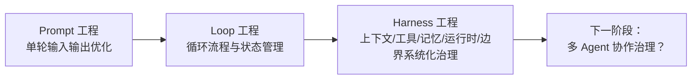
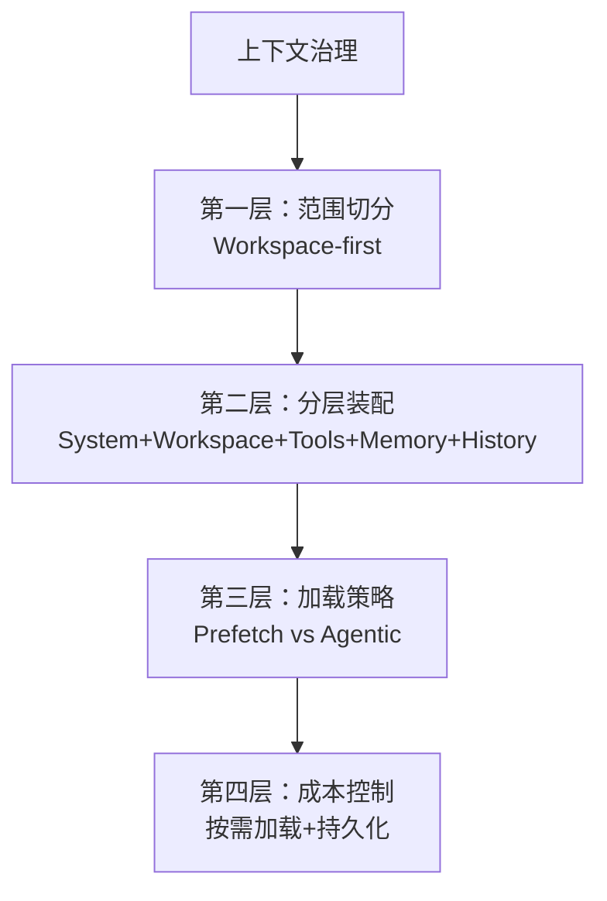
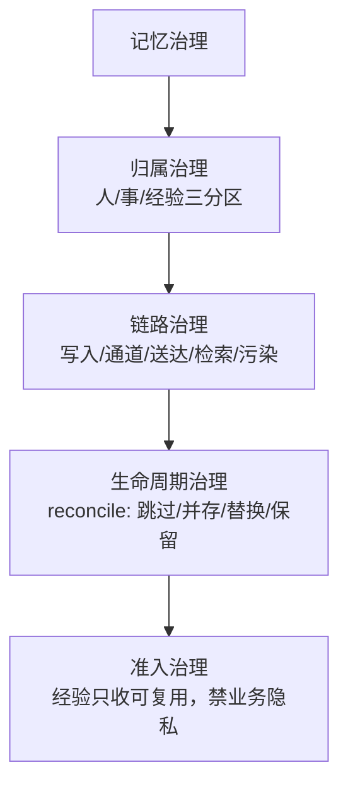

# 洞察萃取与模式提炼

## 一、核心洞察

### 洞察1：Agent 工程已从"Prompt 竞赛"演进到"Harness 竞赛"

```
[CMD-LOG] | level=INFO | cmd=retrospective | step=S3 | event=KEY_FINDING | session=retro-20260704-zleap-agent-learning | msg=洞察1：Agent工程从Prompt演进到Harness | ctx={"insight_id":"I001","domain":"Agent工程演进"}
```

**发现**：文章明确提出 Agent 圈从讨论 Prompt → 讨论 Loop → 讨论 Harness 的演进路径，并以 WildClawBench 数据（同模型切换不同 harness 表现最高相差 18 个百分点）和 Agentic Harness Engineering 数据（Terminal-Bench 2 pass@1 从 69.7% 提升到 77.0%）作为量化证据。

**深层含义**：
- 单轮提示词优化已进入边际收益递减区间，竞争焦点从"模型说什么"转向"系统如何撑住循环"
- Harness 工程是独立于模型能力的关键变量——同一个模型，换一套 harness，表现可以相差 18 个百分点，这意味着"差模型 + 好 harness"可能胜过"好模型 + 差 harness"
- 更关键的是，Agentic Harness Engineering 实验显示，harness 优化的收益主要来自 tools/middleware/long-term memory，而非单纯改 system prompt——这说明很多人还在用 Prompt 思维优化 Harness 问题，方向就错了

**支撑证据**：
- WildClawBench 评估 OpenClaw、Claude Code、Codex、Hermes Agent 等环境，harness 差异最高 18 个百分点
- Agentic Harness Engineering 多轮演化，Terminal-Bench 2 pass@1 从 69.7% 提升到 77.0%
- 收益来源明确为 tools/middleware/long-term memory，非 system prompt

**可复用场景**：Agent 系统设计、技术选型、团队 capability 评估

---

### 洞察2：Workspace-first 是"上下文治理"的通用解法

```
[CMD-LOG] | level=INFO | cmd=retrospective | step=S3 | event=KEY_FINDING | session=retro-20260704-zleap-agent-learning | msg=洞察2：Workspace-first是上下文治理通用解法 | ctx={"insight_id":"I002","domain":"上下文工程"}
```

**发现**：Zleap-Agent 把 Workspace-first 作为整个 Harness 的设计核心，用"先选工作区、再组装上下文"统一处理 Context、Tools、Memory、Runtime、Boundary 五大问题。文章强调"这个思路本身可以脱离 Zleap-Agent 单独使用"。

**深层含义**：
- 长上下文模型的发展制造了一个错觉：既然窗口能装下更多 token，就把工具/记忆/历史/规则全塞进去。但"窗口变大不等于注意力变便宜"——OpenClaw 的 system prompt 38,412 字符 + tool schemas 31,988 字符，任务还没展开就占用了大量上下文预算
- Workspace-first 的本质是"上下文治理"而非"上下文扩容"：不问"能塞多少"，先问"这一轮该看什么"。这跟模型层的稀疏注意力是同一个思想的两层实现——模型层让模型不看所有 token，Harness 层让 Agent 不加载所有上下文
- 这个解法的通用性在于：它不依赖具体模型或框架，任何 Agent 系统都可以"先切工作区、再组装上下文"作为设计起点

**支撑证据**：
- OpenClaw 真实数据：system prompt 38,412 字符 + tool schemas 31,988 字符，任务展开前已占用大量预算
- Zleap-Agent 的 Main/CLI/Web Search/业务四类工作区，每区有独立 prompt/tools/memory/history/model/permission
- 文章明确指出 Workspace-first 可脱离 Zleap-Agent 单独使用

**可复用场景**：Agent 架构设计、上下文工程、本地小模型部署

---

### 洞察3：记忆系统必须从"存储思维"升级到"治理思维"

```
[CMD-LOG] | level=INFO | cmd=retrospective | step=S3 | event=KEY_FINDING | session=retro-20260704-zleap-agent-learning | msg=洞察3：记忆系统从存储思维升级到治理思维 | ctx={"insight_id":"I003","domain":"记忆系统设计"}
```

**发现**：文章通过 Hermes Agent 的 Channel Fracture 案例（cron 路径因 skip_memory=True 出现"看似完成、实际未送达"的通道断裂）警示：记忆系统不能只看"有没有存储"，还要看完整链路。Zleap-Agent 给出了"人/事/经验三分区 + reconcile + 脱敏"的治理方案。

**深层含义**：
- 在普通应用里，保存数据就是写入数据库。但在 Agent 系统里，记忆会影响未来推理——写错、取错、串到别的任务里，都会污染后续行为。这意味着记忆系统必须从"存储思维"升级到"治理思维"
- "治理思维"包含三个层面：
  - **归属治理**：用户偏好（人）、项目事实（事）、可复用方法（经验）必须分区，不能混成一个篮子
  - **链路治理**：谁写入、写给谁、通过什么通道、是否送达、何时检索、是否污染，都要被设计清楚
  - **生命周期治理**：新记忆进入时与旧记忆 reconcile（跳过/并存/替换/保留），避免记忆膨胀与冲突
- 经验记忆的准入规则尤其有价值：只记录可复用流程/失败模式/验证习惯/恢复策略，禁止公司名/客户名/项目名/财务事实/私有路径/一次性任务结果进入——这保证经验可复用但不泄露隐私

**支撑证据**：
- Hermes Channel Fracture 案例：三条路径（直接写 SQLite/memory tools 自写入/cron delegated）中 cron 路径出现通道断裂
- Zleap 双线设计：A 线 people notes（快速预取）+ B 线 core records（抽取/向量化/实体关联/召回/精排）
- 经验记忆准入规则：允许 4 类（流程/失败模式/验证习惯/恢复策略），禁止 6 类（公司名/客户名/项目名/财务事实/私有路径/一次性结果）

**可复用场景**：Agent 记忆系统设计、多用户系统隔离、企业知识管理

---

### 洞察4：本地小模型的价值回归由"数据边界"而非"能力"驱动

```
[CMD-LOG] | level=INFO | cmd=retrospective | step=S3 | event=KEY_FINDING | session=retro-20260704-zleap-agent-learning | msg=洞察4：本地小模型价值由数据边界驱动 | ctx={"insight_id":"I004","domain":"本地模型部署"}
```

**发现**：文章指出本地小模型回归的原因不是"能力追上云端模型"，而是企业场景的数据边界需求——敏感数据不出内网、常规流程用便宜模型、复杂分析交给强模型。Zleap 的多模型协作机制（不同工作区绑定不同模型）让这种路由变得自然。

**深层含义**：
- 过去讨论本地小模型，焦点常在"能力是否够用"。但文章揭示了一个更深层的逻辑：即使本地模型能力不如云端，企业也会因为数据边界需求而选择本地——能力是"够用就行"的门槛，数据边界是"必须满足"的硬约束
- 这改变了模型选型的决策框架：不是"本地 vs 云端谁更强"，而是"哪些任务必须本地、哪些可以云端、如何路由"。多模型协作（不同工作区绑定不同模型）是比"找一个万能模型"更现实的解法
- 对 Harness 设计的启示：系统必须支持模型路由能力，而不是假设只有一个模型。工作区天然就是模型路由的边界——不同工作区可以绑定不同模型，按任务分配合适模型

**支撑证据**：
- 文章明确指出"很多企业不会默认所有任务都交给最贵、最大的云端模型"
- 财务报销案例：敏感票据走本地模型，复杂规则解释才调用更强模型
- Zleap 多模型协作：常规沟通/网页检索/文件处理/复杂分析/本地敏感任务不必都交给同一模型

**可复用场景**：企业 AI 部署决策、模型选型、私有化架构设计

---

### 洞察5：经验沉淀的"复利曲线"第三次验证

```
[CMD-LOG] | level=INFO | cmd=retrospective | step=S3 | event=KEY_FINDING | session=retro-20260704-zleap-agent-learning | msg=洞察5：经验沉淀复利曲线第三次验证 | ctx={"insight_id":"I005","domain":"知识管理"}
```

**发现**：本次任务直接复用 Claude Tag 复盘（06-29）沉淀的"微信公众号双路径获取模型"，连续第二次 0 试错直接命中，耗时约 30 秒。这是该模式第三次被验证有效，复利效应持续显现。

**深层含义**：
- "复盘→萃取→入库→复用"的知识管理闭环不是"额外工作"，而是能产生实际效率收益的投资
- 复利曲线的三个阶段：
  - 第一次（ian-xiaohei 06-25）：探索试错，1 次成功，~1 分钟
  - 第二次（claude-tag 06-29）：3 次试错后沉淀双路径模型，~3 分钟（沉淀成本）
  - 第三次（viitorvoice 07-03）：0 试错复用，~30 秒（复利收益）
  - 第四次（zleap-agent 07-04）：0 试错复用，~30 秒（持续复利）
- 知识沉淀需要"足够具体"才能复用：泛泛的"用 defuddle"没用，"微信公众号文章优先 defuddle，失败降级到 Invoke-WebRequest + 边界标记截取"这种具体的决策树才真正可执行

**支撑证据**：
- ian-xiaohei（06-25）：1 次试错，~1 分钟
- claude-tag（06-29）：3 次试错后沉淀双路径模型，~3 分钟
- viitorvoice（07-03）：0 试错，~30 秒
- zleap-agent（07-04）：0 试错，~30 秒

**可复用场景**：团队知识管理、流程优化、个人经验沉淀

---

## 二、规律认知

### 规律1：Agent 工程的"三层演进"定律



**定律内容**：Agent 工程遵循"Prompt → Loop → Harness"的三层演进路径。每一层解决上一层的瓶颈：Prompt 工程解决单轮输入输出质量，Loop 工程解决多轮循环的状态管理，Harness 工程解决循环运行的系统化支撑。当一层进入边际收益递减时，竞争焦点会转移到下一层。

**案例验证**：
- Prompt 工程：提示词优化、few-shot 示例、CoT 链式思考
- Loop 工程：Agent Loop、ReAct、Plan-and-Execute
- Harness 工程：Zleap-Agent Workspace-first、OpenClaw Gateway、Hermes Agent 记忆治理

**启示**：技术选型时，要判断当前瓶颈在哪一层。如果瓶颈在 Harness 层，再优化 Prompt 是无效的——Agentic Harness Engineering 实验证明，harness 收益主要来自 tools/middleware/long-term memory，而非 system prompt。

---

### 规律2：上下文治理的"分层装配"原则



**定律内容**：上下文治理必须分层进行，不能一步到位。第一层用 Workspace-first 切分范围，第二层用"System Prompt + Workspace Prompt + Tools + Memory + History"分层装配，第三层区分 Prefetch（预取）与 Agentic（按需读取）两种加载策略，第四层通过持久化与按需加载控制成本。

**案例验证**：
- Zleap-Agent：四类工作区 + 分层装配公式 + prefetch/主动 recall 双层 + PostgreSQL 持久化
- OpenClaw：38,412 字符 system prompt + 31,988 字符 tool schemas，未分层导致上下文压力

**启示**：上下文不是"临时拼装的 prompt"，而是"有层次的内存布局"。每一层都有明确的职责边界，混淆层次会导致某一层膨胀拖垮整体。

---

### 规律3：记忆系统的"三层治理"原则



**定律内容**：Agent 记忆系统必须从"存储思维"升级到"治理思维"，包含四个层面：归属治理（分区）、链路治理（完整写入链路验证）、生命周期治理（新旧记忆 reconcile）、准入治理（经验记忆脱敏准入）。任何一层缺失都会导致记忆污染后续推理。

**案例验证**：
- Hermes Channel Fracture：链路治理缺失，cron 路径"看似完成实际未送达"
- Zleap-Agent：四层治理完整，A/B 双线 + reconcile + 经验准入规则

**启示**：记忆系统设计不能只问"能不能存"，还要问"谁写入、写给谁、什么通道、是否送达、何时检索、是否污染、如何 reconcile、是否符合准入"。

---

## 三、可复用模式候选

### 模式1：Workspace-first 上下文治理框架（L2候选）

```
[CMD-LOG] | level=INFO | cmd=retrospective | step=S3 | event=PATTERN_EXTRACTED | session=retro-20260704-zleap-agent-learning | msg=模式候选：Workspace-first上下文治理框架 | ctx={"pattern_id":"P001","maturity":"L2","domain":"Agent架构"}
```

**模式名称**：Workspace-first 上下文治理（Workspace-first Context Governance）

**触发场景**：当 Agent 系统的上下文、工具、记忆不断膨胀，导致长 Prompt 问题凸显时

**核心步骤**：
1. 先问"当前任务应该发生在哪个工作区"，再问"Agent 能接多少工具"
2. 切分工作区（如 Main/CLI/Web Search/业务），每区有独立 prompt/tools/memory/history/model/permission
3. 上下文按"System Prompt + Workspace Prompt + Tools + Memory + History"分层装配
4. 区分 Prefetch（预取）与 Agentic（按需读取）两种加载策略
5. 运行状态与记忆共用持久化存储，支持审计与回滚

**Zleap-Agent 案例应用**：
- 工作区切分：Main（调度）/CLI（文件命令）/Web Search（搜索阅读）/业务（销售财务运营）
- 分层装配：System Prompt 全局风格 + Workspace Prompt 当前工作区 + Tools 当前工具 + Memory 相关记忆 + History 近期轨迹
- 加载策略：prefetch 用户偏好/近期事件/常用经验，主动 recall 走精细检索 + rerank
- 持久化：PostgreSQL 共用，支持审计回滚

**参考案例**：Zleap-Agent、OpenClaw（反面案例，未切分导致上下文压力）

**成熟度**：L2（Zleap-Agent 单案例完整验证 + OpenClaw 反面案例对照 + viitorvoice 学习笔记中类似思想，已验证 2 次）

---

### 模式2：Agent 记忆三层治理框架（L1候选）

```
[CMD-LOG] | level=INFO | cmd=retrospective | step=S3 | event=PATTERN_EXTRACTED | session=retro-20260704-zleap-agent-learning | msg=模式候选：Agent记忆三层治理框架 | ctx={"pattern_id":"P002","maturity":"L1","domain":"记忆系统"}
```

**模式名称**：Agent 记忆三层治理（Agent Memory Three-Layer Governance）

**触发场景**：设计 Agent 记忆系统，或多用户/多任务场景下记忆污染风险凸显时

**三层治理**：
1. **归属治理**：人（用户偏好）、事（项目事实）、经验（脱敏方法）三分区，不混篮子
2. **链路治理**：验证完整写入链路（谁写入/写给谁/什么通道/是否送达/何时检索/是否污染）
3. **生命周期治理**：新记忆 reconcile（跳过/并存/替换/保留），避免膨胀与冲突

**经验记忆准入规则**：
- 允许进入：可复用流程、失败模式、验证习惯、恢复策略
- 禁止进入：公司名、客户名、项目名、财务事实、私有路径、一次性任务结果

**Zleap-Agent 案例应用**：
- A 线 people notes（用户偏好/稳定画像）+ B 线 core records（工作事件/可复用经验）
- Hermes Channel Fracture 反面案例：cron 路径链路治理缺失导致通道断裂
- reconcile 机制：新记忆与旧记忆比对决定跳过/并存/替换/保留

**成熟度**：L1（Zleap-Agent 单案例 + Hermes 反面案例，需更多案例验证通用性）

---

### 模式3：多模型协作路由模式（L1候选）

```
[CMD-LOG] | level=INFO | cmd=retrospective | step=S3 | event=PATTERN_EXTRACTED | session=retro-20260704-zleap-agent-learning | msg=模式候选：多模型协作路由模式 | ctx={"pattern_id":"P003","maturity":"L1","domain":"模型路由"}
```

**模式名称**：多模型协作路由（Multi-Model Collaboration Routing）

**触发场景**：企业场景需同时满足数据边界、成本控制、能力要求三个约束时

**核心逻辑**：
- 不是"找一个万能模型"，而是"按工作区分配合适模型"
- 数据边界驱动模型选择：敏感数据走本地模型，复杂分析才调用强模型
- 工作区天然是模型路由的边界

**Zleap-Agent 案例应用**：
- 常规沟通/网页检索/文件处理 → 便宜模型
- 复杂分析 → 强模型
- 本地敏感任务 → 本地模型
- 财务报销案例：敏感票据走本地模型，复杂规则解释走强模型

**成熟度**：L1（Zleap-Agent 单案例验证，需更多企业部署案例确认）

---

## Changelog

<!-- changelog -->
- 2026-07-04 | create | 初始创建洞察萃取文件（v1.0）：5 个核心洞察、3 条规律认知、3 个模式候选
