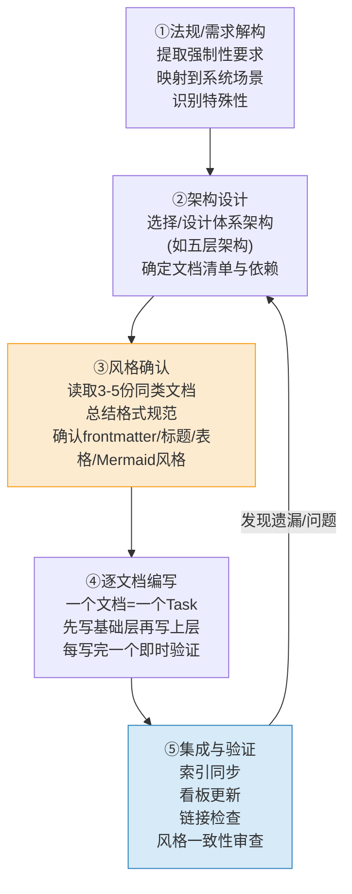

+++
id = "retrospective-ai-agent-data-security-governance-20260629-insight"
date = "2026-06-29"
type = "insight-extraction"
source = "docs/retrospective/reports/governance/retrospective-ai-agent-data-security-governance-20260629/execution-retrospective.md"
+++

# 洞察萃取

## 关键洞察

### 洞察1：治理规则文档"五层架构"是通用的治理体系建设模式

**事实**：本次数据安全治理体系采用五层架构（基础层→技术防护层→流程控制层→运行监控层→组织保障层），9份规则文档+1份模块README按层分布，层间依赖关系单向清晰。

**分析**：五层架构不是数据安全领域特有的，而是一个通用的治理体系建设模式：

| 层级 | 数据安全实例 | 通用含义 |
|------|------------|---------|
| 基础层 | 数据分类分级 | 定义"是什么"——分类标准、术语定义、基线标准 |
| 技术防护层 | 脱敏、加密 | 定义"怎么防"——技术手段、工具规范、实现标准 |
| 流程控制层 | 出境评估、供应商准入/审计 | 定义"怎么管"——流程制度、审批机制、合规检查 |
| 运行监控层 | 安全监控、应急响应 | 定义"怎么看、怎么救"——监控指标、告警机制、应急处置 |
| 组织保障层 | 角色职责矩阵 | 定义"谁来做"——职责划分、权限边界、问责机制 |

**洞察**：任何治理体系建设（代码规范、安全合规、质量管控、运维治理）都可以套用这五层架构。它解决了"文档怎么组织"的问题——先定义标准（基础），再给技术手段（防护），再建管理制度（流程），再加监控应急（运行），最后落实到人（组织）。

---

### 洞察2：合规驱动的规则建设方法论

**事实**：本次建设以国家AI智能体互联国标为起点，从法规条文出发推导规则体系，而非从零设计。具体路径：国标要求→场景映射→规则编写→检查清单→门禁集成。

**分析**：对比"竞品锚定"（阶段守卫借鉴SpecForge）和"经验驱动"（硬编码治理从实践中总结），合规驱动有其独特优势：
- **有明确的外部基线**：法规条文是"必须满足"而非"可以借鉴"，减少了设计上的摇摆
- **有审计视角**：每一条规则都能追溯到法规条款，合规审计时有据可查
- **有完整框架**：法规通常覆盖全生命周期（分类→保护→监测→处置→问责），避免遗漏关键环节
- **有时效约束**：法规有实施日期，形成天然的项目deadline

**洞察**：合规驱动的规则建设可提炼为五步法：
1. **法规解构**：提取法规中的强制性要求和推荐性要求
2. **场景映射**：将法规要求映射到本系统的具体场景（如"数据出境"映射到"调用GPT/Claude API"）
3. **规则编写**：将法规语言转化为可执行的操作规则和技术规范
4. **检查清单**：为每条规则设计可验证的检查项（checklist格式）
5. **门禁集成**：将检查项嵌入开发流程守卫点，实现自动化/半自动化合规门禁

---

### 洞察3："不新增角色"原则——优先扩展而非新增

**事实**：Spec中Open Questions提出"是否需要建立专门的数据安全官（DSO）角色"，最终决定不新增独立角色，而是通过RACI矩阵将数据安全职责扩展到现有5个角色（orchestrator、architect、developer、reviewer、tester）+ co-founder。

**分析**：新增角色看似"职责清晰"，但会带来三个问题：
- **角色膨胀**：每新增一个治理维度就新增角色，最终角色体系庞大难以维护
- **职责灰色地带**：新角色与现有角色的边界需要重新定义，容易出现职责重叠或真空
- **认知负担**：智能体需要加载更多角色定义，上下文窗口被角色描述占据

**洞察**：治理体系建设中应遵循"角色最小化"原则——优先通过RACI矩阵扩展现有角色职责，而非新增角色。只有当某项职责完全无法被现有角色覆盖（需要完全不同的能力模型和决策权限）时，才考虑新增角色。判断标准：如果某个角色80%的职责都可以映射到现有角色，就不应该新增。

---

### 洞察4：AI场景数据安全的三个特殊性

**事实**：编写数据分类分级和脱敏规范时发现，AI智能体互联场景下的数据安全与传统Web/企业数据安全有三个本质区别。

**分析**：

1. **Prompt中可能包含PII**：用户发送给AI的prompt是自由文本，可能无意中包含身份证号、手机号、地址等个人信息。传统数据安全是"先分级再处理"，但AI场景下prompt是动态输入，无法预先分级标注
2. **Conversation history是新的数据类型**：多轮对话历史是AI场景特有的数据形式，它可能累积大量上下文信息，单独看每条消息可能不敏感，但聚合后可能推断出敏感信息（如根据对话推断健康状况、财务状况）
3. **模型输出可能泄露训练数据**：第三方模型（尤其是境外模型）的输出可能包含其训练数据中的记忆信息，存在训练数据污染和知识产权风险；同时输出内容也可能被用于反向推断输入数据

**洞察**：AI场景数据安全不能简单套用传统数据安全框架，必须针对这三个特殊性设计专门的防护措施：
- 动态PII检测与脱敏（prompt发出前自动扫描）
- 对话历史分级管理（按轮次/时长/敏感度分级存储和清理）
- 输出内容过滤与审计（检测模型输出中的敏感信息泄露）

---

### 洞察5：供应商管理的全生命周期闭环模型

**事实**：本次将第三方API供应商管理拆分为两个文档——vendor-admission（准入）和vendor-audit（持续审计），形成准入→审计→评级→处置的闭环。

**分析**：传统供应商管理常犯的错误是"准入即终点"——通过准入评估后不再持续监督。但数据安全风险是动态的：
- 供应商可能被收购、更换数据中心位置
- 供应商可能发生安全事件但未主动通报
- 供应商的安全策略可能随业务变化而调整
- 新的漏洞和攻击手段不断出现

全生命周期模型：

| 阶段 | 核心活动 | 关键产出 |
|------|---------|---------|
| 准入 | 资质审查、安全评估、合规承诺、接入测试 | 准入评估报告、安全协议、黑白名单 |
| 审计 | 定期评估、日志审计、合规检查、渗透测试 | 审计报告、安全评级、问题清单 |
| 评级 | 根据审计结果动态调整安全等级 | A/B/C/D级供应商分类 |
| 处置 | 整改通知、暂停接入、永久拉黑、退出机制 | 处置记录、供应商状态更新 |

**洞察**：供应商管理不是一次性动作而是持续循环——审计结果反馈回准入标准（发现新风险点更新准入checklist），评级结果影响审计频率（C级供应商加密审计频次），处置结果更新黑白名单。这个闭环模型适用于所有外部依赖管理（云服务商、SaaS工具、开源组件等）。

---

### 洞察6："约定优于配置"——先观察再编写

**事实**：初期按照spec中的NFR-1描述为规则文档添加了TOML frontmatter，后来发现`.agents/rules/`下所有现有文档均不使用frontmatter，不得不回退修正。

**分析**：这个问题的本质是"文档描述vs代码库现实"的冲突。Spec中的NFR描述了"TOML frontmatter"，但这是从spec模板继承的惯性描述，实际代码库的约定是：
- 治理规则文档（.agents/rules/下）：无frontmatter
- Spec文档（.trae/specs/下）：有YAML/TOML frontmatter
- 复盘报告（docs/retrospective/下）：有TOML frontmatter

**洞察**：在编写新文档时，"观察现有文档风格"应该是第一步，而不是依赖需求文档中的格式描述。这是"约定优于配置"原则在文档规范中的体现——项目代码库中已形成的约定，其优先级高于任何文档中描述的规范要求。具体实践：
1. 先读3-5份同类现有文档
2. 总结其格式模式（frontmatter、标题层级、表格风格、Mermaid使用等）
3. 按照已有模式编写新文档
4. 如果发现spec描述与实际不一致，以实际为准并修正spec

## 反模式识别

### 反模式1：规则文档加TOML frontmatter

**表现**：为`.agents/rules/`下的治理规则文档添加TOML frontmatter（id/date/type/source字段），与现有规则文档风格不一致。

**根因**：
- 上下文压缩导致认知视野收窄：编写新文档时注意力集中在"写内容"上，忽略了"看风格"
- Spec中的NFR描述产生误导：NFR-1明确写了"TOML frontmatter"，但该描述未与实际代码库对齐验证
- 复盘报告和Spec文档都使用frontmatter，形成"所有文档都有frontmatter"的错误假设

**改进方向**：在spec模板中增加"文档风格确认"检查项，要求在编写任何新文档前先读取3份以上同类文档确认格式规范。

### 反模式2：多文档合并为单任务

**表现**：初期将多个独立文档合并为一个任务组（如将出境评估+脱敏+加密合并为一个Task，供应商准入+审计合并为一个Task），导致单任务验收标准过于复杂，无法独立追踪进度和验证。

**根因**：
- 按逻辑层次划分任务而非按交付物划分：五层架构的"层"成为任务划分依据，但一个层内可能有多个独立文档
- 任务分解时追求"任务数量少"，错误认为任务少=效率高
- 低估了每个文档的独立复杂度（每个规则文档都有Mermaid图、矩阵表、checklist，不是简单的段落）

**改进方向**：任务分解遵循"一个交付物=一个Task"原则——每个独立的文档/脚本/配置文件对应一个Task，有独立的验收标准和测试要求。如果一个Task的验收标准超过5条，考虑拆分。

### 反模式3：先写文档后查风格

**表现**：按照spec描述直接开始编写文档，未先读取现有同类文档确认风格，等写完2-3个文档后才发现frontmatter问题，需要回退修正。

**根因**：
- "完成焦虑"：急于开始"真正的工作"（写内容），将"读现有文档"视为非必要的准备工作
- 过度自信：认为自己已经了解项目风格（毕竟之前做过阶段守卫复盘），不需要再确认
- Spec描述的"权威光环"：认为spec中写了的就一定是对的

**改进方向**：将"读取3份同类文档确认风格"作为每个文档编写Task的第一个子步骤，写入Task描述中，强制执行。

## 根因分析：为什么这些反模式会出现？

三个反模式有共同的深层原因：**上下文压缩导致认知视野收窄**。

在长任务执行过程中，智能体的注意力会逐渐聚焦于"当前正在做的具体事情"（写文档内容），而弱化对"周边上下文"（项目风格约定、任务规划合理性、文档一致性）的感知。这类似于人类编程时的"管视效应"——专注于写代码时容易忽略代码风格、命名规范、架构约束。

具体机制：
1. **目标窄化**：从"建设一个符合现有风格的治理体系"窄化为"写完这10个文档"
2. **验证滞后**：风格一致性问题在写完多个文档后才通过对比发现，而非在写第一个文档时就确认
3. **Spec依赖**：将spec视为不可变的"法律条文"，而非需要与现实对齐的"设计方案"

对策：
- 在Task 1中显式包含"读取现有文档、总结风格模式"的步骤
- 写完第一个文档后立即进行风格验证，而非等全部写完再检查
- 保持"spec是参考而非教条"的认知，发现不一致时及时修正spec

## 治理规则体系建设五步法

基于本次和前两次治理规则建设的经验，提炼出通用的治理规则体系建设方法论：

其中步骤③（风格确认）是本次教训中最需要强调的环节——它成本极低（读3份文档约2-3分钟），但可以避免大量返工。
