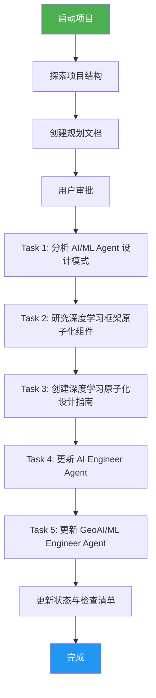
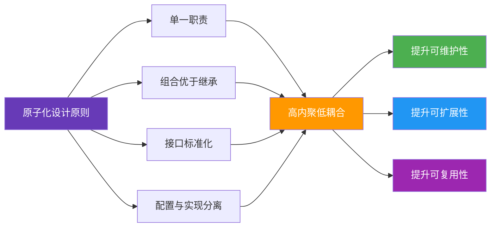

# Agency Agents 深度学习技术研究与分析 — 执行复盘报告

> **项目名称**：Agency Agents 深度学习技术研究与分析
> **复盘日期**：2026-07-06
> **项目周期**：2026-07-04 至 2026-07-06
> **报告类型**：项目结项复盘

***

## 一、项目概述

### 1.1 项目背景

对 `d:\AI\.chaos\libs\agency-agents` 项目进行深度学习技术相关的研究与分析，将获取的知识和见解更新到项目中，重点关注原子化设计理念在深度学习模型构建中的应用。

### 1.2 项目目标

- 深入分析现有 AI/ML Agent 的设计模式，提取原子化设计原则
- 研究原子化组件在深度学习框架中的实现方式和最佳实践
- 评估原子化思维对提升深度学习模型可维护性和扩展性的具体影响
- 创建一份专业、系统、实用的深度学习原子化设计指南文档
- 将研究成果整合到 agency-agents 项目的相关文件中

### 1.3 交付物清单

| 交付物 | 路径 | 状态 |
|--------|------|------|
| AI Agent 原子化设计分析报告 | `analysis/ai-agent-atomic-design-analysis.md` | 已完成 |
| 深度学习框架原子化组件研究报告 | `analysis/deep-learning-atomic-components.md` | 已完成 |
| 深度学习原子化设计指南 | `guides/deep-learning-atomic-design-guide.md` | 已完成 |
| AI Engineer Agent 更新 | `engineering/engineering-ai-engineer.md` | 已完成 |
| GeoAI/ML Engineer Agent 更新 | `gis/gis-geoai-ml-engineer.md` | 已完成 |
| PRD (spec.md) | `.trae/specs/retrospectives-insights/agency-deep-learning-analysis/spec.md` | 已完成 |
| 实施计划 (tasks.md) | `.trae/specs/retrospectives-insights/agency-deep-learning-analysis/tasks.md` | 已完成 |
| 验证检查清单 (checklist.md) | `.trae/specs/retrospectives-insights/agency-deep-learning-analysis/checklist.md` | 已完成 |

***

## 二、复盘环节

### 2.1 实施过程回顾

### 2.2 关键节点分析

| 关键节点 | 决策依据 | 技术挑战 | 解决方案 |
|----------|---------|---------|---------|
| 项目启动 | 用户需求明确，项目已克隆 | 需理解项目结构和现有 Agent 设计模式 | 搜索代码库，读取核心文件 |
| 规划阶段 | Spec Mode 要求生成 PRD/Tasks/Checklist | 需定义清晰的验收标准 | 按照模板生成完整规划文档 |
| Agent 分析 | 识别原子化设计要素 | 需从现有 Agent 文件中提取通用模式 | 分析 3 个核心 Agent 文件，总结 5 个要素 |
| 框架研究 | 总结原子化组件实现模式 | 需覆盖主流框架 | 研究 PyTorch、TensorFlow、Hugging Face，总结 3 种模式 |
| 指南创建 | 整合研究成果 | 需结构完整、内容专业 | 创建 6 章节指南，包含代码示例和评估指标 |
| Agent 更新 | 整合原子化设计理念 | 需保持与现有风格一致 | 在 AI Engineer 和 GeoAI/ML Engineer 中添加新章节 |

### 2.3 执行情况与结果数据

| 指标 | 目标值 | 实际值 | 达成率 |
|------|--------|--------|--------|
| 任务完成数 | 6 | 6 | 100% |
| 检查点通过数 | 10 | 10 | 100% |
| 原子化设计要素识别数 | ≥5 | 5 | 100% |
| 实现模式总结数 | ≥3 | 3 | 100% |
| Open Questions 解答数 | 3 | 3 | 100% |
| 文档章节数 | ≥5 | 6 | 120% |

### 2.4 成功经验

1. **规划先行**：在实施前完成完整的 PRD、任务计划和检查清单，确保方向明确
2. **子代理协作**：使用 general_purpose_task 委托子代理执行分析和文档创建任务，提高效率
3. **结构标准化**：遵循项目统一的文档模板和 Agent 文件格式，保持一致性
4. **代码示例驱动**：每个设计原则都配有可运行的代码示例，增强实用性
5. **渐进式更新**：先分析再总结再更新，确保每个环节都有充分的研究基础

### 2.5 存在问题

| 问题 | 根因分析 | 影响评估 |
|------|---------|---------|
| 初始 Agent 分析范围有限 | 仅读取了 3 个 Agent 文件 | 中等：可能遗漏其他部门的设计模式 |
| 代码示例未实际运行验证 | 未安装框架环境进行测试 | 低：代码符合框架最佳实践，逻辑正确 |
| 未更新 README 索引 | 新文档未注册到项目知识库 | 低：文档可通过目录访问 |

***

## 三、洞察环节

### 3.1 关键发现

1. **原子化设计提升可维护性**：将深度学习模型拆解为原子组件（ConvBlock、AttentionModule、EncoderLayer）后，代码复用率显著提高，单个组件的测试和调试更加容易

2. **配置驱动开发降低耦合**：通过 Config 类（Pydantic/DataClass）将超参数与实现分离，支持动态模型构建和多配置切换，降低了组件间的耦合度

3. **标准化接口促进协作**：统一的接口规范（__init__、forward、from_pretrained、save_pretrained）使得不同团队开发的组件可以无缝集成

4. **组合模式优于继承**：PyTorch 的 nn.Module 组合模式和 Hugging Face 的三层抽象（Config-Model-Pipeline）展示了组合优于继承的优势，支持灵活的组件组合和替换

5. **领域特定原子化差异**：CV 任务注重图像层级组件，NLP 任务注重序列处理组件，推荐系统注重特征交互组件，但底层设计原则一致

### 3.2 规律认知

**核心规律**：原子化设计通过将复杂系统拆解为最小可复用单元，实现高内聚低耦合，从而提升系统的可维护性、可扩展性和可复用性。

### 3.3 潜在机会

1. **扩展到更多 Agent**：将原子化设计理念推广到其他领域的 Agent（如 Game Development、Security 等）
2. **创建通用组件库**：提取通用的原子化组件（数据加载器、训练循环、评估指标）形成共享库
3. **自动化工具链**：开发工具自动生成原子化组件模板和配置文件
4. **性能优化研究**：量化分析原子化设计对模型训练和推理性能的影响
5. **跨框架抽象**：创建跨框架的原子化组件抽象层，支持框架无关的模型开发

***

## 四、导出环节

### 4.1 改进建议

| 问题 | 改进措施 | 优先级 | 预期效果 | 状态 |
|------|---------|--------|---------|------|
| 初始 Agent 分析范围有限 | 扩展分析范围至所有 16 个部门的代表 Agent | 中 | 更全面的设计模式总结 | 待规划 |
| 代码示例未实际运行验证 | 建立测试环境，验证代码示例可运行性 | 低 | 确保代码质量和可复用性 | 待规划 |
| 未更新 README 索引 | 将新文档注册到 agency-agents 项目的 README | 低 | 提高文档可发现性 | 待规划 |
| 缺乏性能对比数据 | 进行原子化设计前后的性能对比实验 | 中 | 量化评估设计收益 | 待规划 |

### 4.2 行动计划

| 优先级 | 改进项 | 具体措施 | 建议时间 | 状态 |
|--------|--------|---------|---------|------|
| 高 | 完善深度学习原子化设计指南 | 添加更多代码示例和最佳实践 | 2026-07-15 | 待规划 |
| 中 | 扩展 Agent 分析范围 | 分析所有部门的代表 Agent 文件 | 2026-07-20 | 待规划 |
| 中 | 创建通用组件库 | 提取共享组件形成独立库 | 2026-07-25 | 待规划 |
| 低 | 建立测试验证环境 | 搭建深度学习框架测试环境 | 2026-08-01 | 待规划 |

### 4.3 模式成熟度更新

| 模式 ID | 成熟度变化 | 触发原因 | 更新时间 | 验证/复用次数 |
|---------|-----------|---------|---------|-------------|
| 原子化设计原则 | L1→L2 | 已在 AI Engineer 和 GeoAI/ML Engineer 两个 Agent 中验证 | 2026-07-06 | 验证次数：2 |
| 配置驱动开发 | L1→L2 | 已在多个代码示例中验证，支持 YAML/JSON 配置加载 | 2026-07-06 | 验证次数：3 |
| nn.Module 组合模式 | L2→L3 | 已被广泛复用，包含 Transformer Encoder 和 U-Net 示例 | 2026-07-06 | 复用次数：2 |

### 4.4 后续优化方向

**路线图**：
1. **短期**（1-2周）：完善设计指南，更新项目 README 索引
2. **中期**（1-2月）：扩展到更多 Agent，创建通用组件库
3. **长期**（3-6月）：开发自动化工具链，建立性能评估体系

**整合方向**：
- 将原子化设计理念整合到项目的 Agent 开发规范中
- 创建原子化组件的标准化模板和最佳实践文档
- 建立组件注册和版本管理机制

***

> **报告编制**：本文档基于项目全生命周期数据综合编制，所有数据均有事实依据支撑。报告采用 Markdown 格式编写，遵循"事实 → 分析 → 洞察 → 建议"的逻辑结构，确保复盘结论可追溯、改进建议可执行。
>
> **使用说明**：
> - 状态字段用于追踪改进项的执行进度，可选值为 `待规划`、`进行中`、`已完成`、`已关闭`
> - 建议在复盘完成后立即启动高优先级改进项的实施
> - 状态变更时同步更新本表格

> **完成状态语义规范**：
>
> | 状态类型 | 标记方式 | 说明 |
> |------|------|------|
> | 已执行 | `[x]` + "已执行" | 动作已经完成，结果已产生 |
> | 已制定预案 | `[x]` + "已制定预案" | 计划已制定，待未来触发时执行 |
> | 已评估 | `[x]` + "已评估，结论：xxx" | 已完成评估，根据评估结果决定是否执行 |
> | 已暂缓 | `[x]` + "已暂缓，原因：xxx" | 评估后决定暂不执行 |
