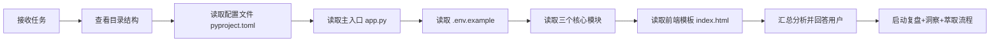

# 执行过程复盘

## 一、任务背景

用户询问 `.temp/AI/ai-code-assistant` 目录下的项目是做什么的。这是一个典型的代码理解任务，需要通过阅读项目文件来推断其功能、架构和用途。

## 二、执行流程回顾

### 2.1 执行时间线

| 时间节点 | 操作 | 关键产出 |
|---------|------|---------|
| T0 | 接收用户问题 | 明确任务目标：理解项目功能 |
| T0+1min | 调用 LS 查看目录结构 | 获取 7 个文件清单 |
| T0+2min | 并行读取 pyproject.toml + app.py + .env.example | 了解项目元信息、入口、依赖 |
| T0+3min | 并行读取 3 个模块文件 | 理解三个核心功能的实现逻辑 |
| T0+4min | 读取前端模板 index.html | 了解 UI 交互和用户流程 |
| T0+5min | 汇总信息，结构化回答用户 | 完整的项目功能说明 |
| T0+6min | 启动复盘流程 | 本报告 |

### 2.2 代码阅读策略

本次采用了**自顶向下、配置优先**的阅读策略：

1. **先看配置**：[pyproject.toml](../../../../../../apps/ai-code-assistant/pyproject.toml) 提供了项目名称、描述、依赖列表、启动脚本，快速建立项目概览
2. **再看入口**：[app.py](../../../../../../apps/ai-code-assistant/app.py) 展示了路由结构和模块组装方式，明确了 API 边界
3. **后看模块**：三个 modules 文件实现了具体业务逻辑，每个模块职责单一
4. **最后看前端**：[index.html](../../../../../../apps/ai-code-assistant/templates/index.html) 验证了功能完整性和用户交互流程

### 2.3 关键发现记录

#### 发现 1：项目元信息直接揭示了用途
从 pyproject.toml 的 description 字段直接获得："AI Programming Learning Assistant - MVP for TRAE AI Creativity Competition"。这是最高效的信息来源。

#### 发现 2：经典的 MVC 简化架构
- 后端路由层（app.py）负责 HTTP 请求分发
- 业务逻辑层（modules/）封装三个独立的 AI 功能
- 视图层（templates/）提供单页面前端

#### 发现 3：提示词工程的场景化设计
三个模块的 system prompt 都针对编程学习场景做了专门设计：
- 代码解释器：4 段式结构化输出（功能→逻辑→技术点→优化建议）
- 问答引擎：4 条回答规范（中文+示例+定义+简洁）
- 学习路径：5 段式规划（评估→阶段→周任务→资源→项目）

#### 发现 4：前端设计的完整性
- Tab 切换实现三个功能模块的无刷新切换
- Loading 状态反馈
- 响应式设计（移动端适配）
- 渐变紫色主题，现代感强

## 三、执行结果评估

### 3.1 完成情况

| 评估项 | 结果 |
|--------|------|
| 项目功能理解 | ✅ 完整覆盖三大核心功能 |
| 技术栈识别 | ✅ Flask + OpenAI API + 原生前端 |
| 架构分析 | ✅ 三层模块划分清晰 |
| 代码参考链接 | ✅ 所有文件引用使用 clickable 格式 |
| 回答语言 | ✅ 使用中文，符合用户偏好 |

### 3.2 成功经验

1. **并行读取提高效率**：配置、入口、环境文件并行读取，三个模块并行读取，减少等待时间
2. **结构化输出**：按照"概述→核心功能→技术栈→使用方式"的结构组织回答，逻辑清晰
3. **代码引用规范**：严格遵循 AGENTS.md 要求，使用 `[text](file:///absolute/path)` 格式

### 3.3 可改进之处

1. **未启动本地服务验证**：仅通过静态代码分析理解项目，未实际运行验证功能
2. **未检查 .gitignore**：遗漏了对 .gitignore 文件的查看，虽然不影响功能理解，但属于完整项目分析的一部分
3. **未做代码质量评估**：仅回答了"做什么"，没有主动评估代码质量或给出改进建议（除非用户询问）
