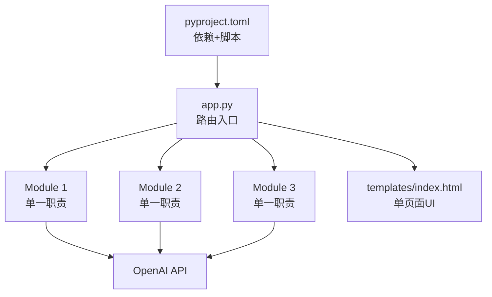
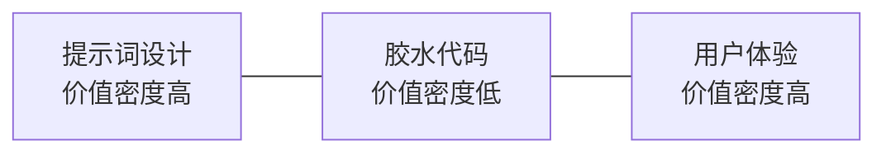

# 洞察萃取

## 一、关键发现与深层分析

### 洞察 1：AI 应用 MVP 的最小可行架构

**事实**：ai-code-assistant 用约 500 行代码实现了完整可运行的 AI Web 应用。

**深层含义**：
- 后端仅需 1 个入口文件 + N 个职责单一的模块文件
- 前端可以在单个 HTML 文件中完成（CSS + JS 内联）
- AI 能力的核心差异在提示词设计，而非代码量
- PDM 作为依赖管理+脚本运行器，简化了项目配置

**架构抽象**：

### 洞察 2：提示词的场景化分层设计

**事实**：三个模块的 system prompt 结构清晰，且针对各自场景做了输出格式约束。

**对比分析**：

| 模块 | Temperature | 输出结构约束 | 目标用户 |
|------|-------------|-------------|---------|
| 代码解释器 | 0.3（低） | 4 段式（功能/逻辑/技术点/建议） | 初学者 |
| 问答引擎 | 0.4（中） | 4 条规范（中文/示例/定义/简洁） | 提问者 |
| 学习路径 | 0.5（中高） | 5 段式（评估/阶段/任务/资源/项目） | 规划者 |

**规律**：
- 确定性要求高的任务（代码解释）用低 temperature
- 创造性要求高的任务（路径规划）用稍高 temperature
- 所有提示词都明确指定了"使用中文"和"适合初学者"
- 输出结构约束越具体，AI 输出质量越稳定

### 洞察 3：参赛作品的"快速验证"特征

**事实**：这是一个 TRAE AI 创意大赛的 MVP 作品，体现了明显的快速原型特征：

1. **零前端框架依赖**：原生 HTML/CSS/JS，无需构建工具
2. **零状态管理**：无数据库、无会话存储，纯请求-响应模式
3. **错误处理极简**：前端只有简单的 try-catch，后端无显式错误处理
4. **功能边界清晰**：三个 Tab 对应三个独立 API，互不耦合
5. **配置外置**：API Key 和模型名称通过环境变量配置

**价值**：这种架构非常适合在比赛/黑客松场景中快速验证想法，技术风险低，部署简单。

### 洞察 4：代码理解任务的信息层级

**事实**：本次代码分析仅用 6 分钟就完成了对陌生项目的完整理解。

**信息获取效率层级**：

| 信息源 | 信息密度 | 获取速度 | 优先级 |
|--------|---------|---------|--------|
| pyproject.toml description | ⭐⭐⭐⭐⭐ | 最快 | P0 |
| app.py 路由定义 | ⭐⭐⭐⭐ | 快 | P0 |
| 模块类/方法签名 | ⭐⭐⭐ | 中 | P1 |
| 提示词内容 | ⭐⭐⭐⭐ | 中 | P1 |
| 前端交互逻辑 | ⭐⭐⭐ | 中 | P2 |
| 实现细节（循环/条件） | ⭐⭐ | 慢 | P3 |

**方法论**：理解陌生项目应遵循"配置→入口→接口→实现"的顺序，高信息密度源优先。

## 二、规律认知

### 规律 1：AI 应用的"哑铃型"价值分布

AI 应用的代码量主要集中在中间的"胶水代码"（API 调用、参数传递、HTTP 路由），这部分技术含量低、可替代性强；真正的差异化价值在两端：
- **左端**：提示词工程（场景理解、输出约束、角色设定）
- **右端**：用户体验（交互设计、反馈机制、视觉呈现）

### 规律 2：MVP 的"三不原则"

从该项目可以归纳出 AI 应用 MVP 的三个原则：
1. **不引入不必要的依赖**：能用原生就不用框架，能少装包就少装
2. **不做过早抽象**：三个模块直接实例化，不用工厂模式/依赖注入
3. **不处理边缘情况**：先跑通主流程，错误处理和边界情况后续迭代

### 规律 3：静态代码分析的"信噪比"控制

理解陌生项目时，应主动控制信噪比：
- ✅ **优先读**：配置文件、入口文件、公共接口、类型定义
- ⚠️ **选择性读**：业务逻辑实现（根据需要深入）
- ❌ **跳过**：工具函数、样式细节、注释（除非必要）

## 三、潜在机会识别

### 机会 1：参赛作品的快速评估模板

基于本次分析，可以提炼出一套"AI 应用 MVP 快速评估清单"，用于批量评估 .temp/ 下的参赛作品。

### 机会 2：提示词模板库

三个模块的提示词结构清晰，可以作为编程教育类 AI 应用的提示词模板。

### 机会 3：.temp/ 项目的元数据提取

pyproject.toml 和 package.json 等配置文件包含丰富的项目元信息，可以编写脚本自动扫描 .temp/ 目录，生成项目索引清单，无需逐个阅读代码。
