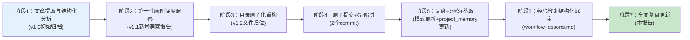

# 执行复盘：Cursor Cloud Agents文章深度洞察分析全流程

> 复盘范围：从初始文章内容提取→结构化分析→第一性原理深度洞察→目录原子化重构→原子提交→工作流经验沉淀的完整工作流
> 复盘日期：2026-07-14

---

## 1. 项目背景与目标

### 1.1 原始需求

用户初始需求为对微信公众号「AI战地笔记」文章《Cursor团队自己都不按Tab了》进行第一性原理洞察分析并导出成果。在执行过程中用户追加了三项要求：
1. 对分析报告进行第一性原理深度拆解
2. 纠正部分文件存放位置（目录原子化）
3. 原子提交变更
4. 复盘+洞察+萃取+更新整个工作流
5. 经验教训+洞察结构化沉淀
6. 全面复盘更新（本复盘）

### 1.2 任务目标

- ✅ 完成文章内容提取与结构化学习笔记
- ✅ 基于第一性原理六步法进行根本性拆解，产出可操作洞察
- ✅ 确保目录结构符合原子化规范（execution/insights子目录组织）
- ✅ 原子提交所有变更，遵循Conventional Commits规范
- ✅ 复盘整个工作流，提炼可复用经验教训
- ✅ 更新project_memory和相关模式文件

---

## 2. 时间线与关键节点

| 阶段 | 关键活动 | 产出物 | 版本 |
|------|---------|--------|------|
| 1.初始归档 | 从spec目录迁移已有产出，创建初始README | article-content.md, analysis-report.md, task2-6执行产物 | v1.0 |
| 2.第一性原理洞察 | 六步法分析：问题定义→剥离假设→识别要素→提取公理→自底向上重构→方案验证 | insights/first-principles-insight.md（5公理+5洞察+4反直觉发现+16行动建议） | v1.1 |
| 3.目录原子化重构 | 用户指出文件位置不对；创建execution/和insights/子目录；移动文件归位 | execution/README.md, insights/README.md, 更新根README | v1.2 |
| 4.原子提交 | 拆分2个原子提交；踩到Git文件移动删除暂存陷阱 | ec3dde7e(docs)+7cb4c69c(refactor) | - |
| 5.复盘+洞察+萃取 | 复盘工作流；识别Git陷阱为认知偏差模式第8个验证案例；更新project_memory | 模式validation_count更新+project_memory两条新规则 | - |
| 6.经验教训沉淀 | 结构化3个经验教训为独立文档 | insights/workflow-lessons.md | v1.3 |
| 7.全面复盘 | 生成本执行复盘报告；更新所有索引 | execution-retrospective.md, 根README更新为v1.4 | v1.4 |

---

## 3. 事实数据汇总

### 3.1 产出物统计

| 类别 | 数量 | 行数 | 说明 |
|------|------|------|------|
| 根目录文件 | 4 | 约420行 | README.md(73行), analysis-report.md(133行), article-content.md(74行), execution-retrospective.md(本文件) |
| execution/子目录 | 6 | 约1031行 | README.md(26行) + task2-6共5个中间产物(1005行) |
| insights/子目录 | 3 | 约468行 | README.md(22行), first-principles-insight.md(316行), workflow-lessons.md(130行) |
| **合计** | **13** | **约1919行** | 所有Markdown文件 |

### 3.2 第一性原理分析成果

| 指标 | 数值 |
|------|------|
| 核心公理 | 5个（价值锚定/约束守恒/验证层级/并行扩展/ROI临界点） |
| 核心洞察 | 5个 |
| 反直觉发现 | 4个 |
| 分角色行动建议 | 16条（技术领导者/架构师/一线开发者/工具选型/个人开发者） |
| 分析方法 | 第一性原理v1.0工程快速版（六步法） |

### 3.3 原子提交统计

| Commit | 类型 | 消息 | 文件变更 |
|--------|------|------|---------|
| ec3dde7e | docs | docs(cursor-cloud-agents): 新增第一性原理洞察+目录原子化+索引更新 | 新增8个文件，修改2个文件 |
| 7cb4c69c | refactor | refactor(cursor-cloud-agents): 删除根目录下已迁移到子目录的旧位置文件 | 删除5个文件 |

### 3.4 质量验证结果

- ✅ 链接有效性：24个本地引用全部有效（1个目录链接警告为已知情况）
- ✅ 目录结构：符合原子化规范（根目录仅顶层文件，中间产物在execution/，深度洞察在insights/）
- ✅ 原子提交：2个提交各自单一职责，遵循Conventional Commits
- ✅ 中文编码：commit message无乱码（使用UTF-8安全提交流程）

---

## 4. 过程分析

### 4.1 做得好的地方

#### 4.1.1 第一性原理分析方法论执行完整

严格按照第一性原理v1.0六步法（问题定义→剥离假设→识别要素→提取公理→自底向上重构→方案验证）执行，产出了5个自洽的核心公理体系，并从公理推导出5个洞察和16条可操作建议。分析质量较高，反直觉发现（如"代码审查瓶颈转移"比"自动补全淘汰"更具洞察力）体现了深度思考。

#### 4.1.2 用户反馈响应迅速，根因定位准确

用户指出"部分文件的存放位置好像不对"后，快速定位问题根因——不是简单的文件移动，而是参考样本选择偏差（选择了简单归档目录而非原子化规范目录作为参考），然后彻底重构目录结构，新增execution/和insights/子目录，更新所有索引和相对路径。

#### 4.1.3 认知偏差模式识别能力

原子提交时踩到Git陷阱后，立即识别出这不是"粗心"而是认知-践行鸿沟的典型表现——读过Skill文档§9 Gotchas的明确警告，但在多步骤任务执行中仍因认知资源竞争而遗漏检查点。将其作为第8个验证案例更新到cognitive-practice-gap-recursive-defense模式，而不是简单归因为个人失误。

#### 4.1.4 预提交验证执行到位

目录重构后和每次提交后都运行了check-links.py验证链接有效性，在workflow-lessons.md创建后发现了1个相对路径计算错误（../../../→../../../../../）并立即修复，避免了断链入库。

#### 4.1.5 原子提交拆分正确

最终将变更拆分为2个原子提交：docs提交（新增洞察+目录+索引）和refactor提交（删除旧文件），每个提交单一职责，符合Conventional Commits规范，中文commit message编码安全。

### 4.2 遇到的问题与根因分析

#### 问题1：文件初始放置位置错误（参考样本选择偏差）

- **现象**：创建first-principles-insight.md时放在根目录而非insights/子目录；task2-6文件初始也在根目录
- **影响**：用户需要指出问题，导致额外的重构工作
- **直接原因**：格式一致性检查时读取了gpt56/codex等"方便样本"（简单归档目录，文件堆在根目录），而非architecture-priority等"规范样本"（有完整原子化子目录结构）
- **5-Whys根因**："格式一致性优先原则"只要求"读取同目录现有文件"，但未指导"选择什么样本"——规则本身缺少样本选择维度
- **已有应对**：创建正确子目录，移动文件归位，更新所有相对路径和索引
- **预防措施**：已在project_memory中补充参考样本选择三规则（结构完整性优先>版本新鲜度优先>避免过渡状态）

#### 问题2：Git文件移动删除暂存陷阱（认知-践行鸿沟）

- **现象**：读过atomic-commit-cmd §9 Gotchas的明确警告（"git add新目录不自动暂存旧文件删除"），但第一次提交后5个旧文件删除未暂存
- **影响**：需要第二个提交补删，提交历史多出一个refactor commit
- **直接原因**：构建commit message时System 2注意力被占用，"显式add删除文件"这个检查点被System 1自动跳过
- **5-Whys根因**：认知资源竞争——学习陷阱时System 2活跃（"我知道了"），但执行提交时System 2被commit message撰写占用，陷阱记忆未被激活
- **已有应对**：第二个提交显式add删除文件并提交
- **预防措施**：三查暂存法中强制执行"查删除"——用`git status --short`输出检查D状态行，而非依赖记忆

#### 问题3：workflow-lessons.md相对路径计算错误

- **现象**：workflow-lessons.md中引用cognitive-practice-gap-recursive-defense.md的相对路径写为../../../，实际应为../../../../../
- **影响**：1个断链，被check-links.py捕获
- **直接原因**：从insights/子目录到patterns/目录需要向上5级（insights→cursor目录→external-learning→insight-extraction→reports→retrospective），但少算了2级
- **根因**：跨多目录层级的相对路径心算容易出错
- **已有应对**：修正为正确的相对路径
- **预防措施**：跨深层目录引用时必须用check-links.py验证，不能心算后直接提交

### 4.3 流程瓶颈与改进机会

#### 4.3.1 格式参考检查缺乏"规范样本"发现机制

当前"格式一致性优先原则"要求读取同目录现有文件，但在存在多个同类目录时（如external-learning下有20+个分析目录），如何快速发现"最规范的样本"是一个瓶颈。目前依赖人工记忆哪个目录是最新整理的，效率低且容易出错。

**改进机会**：可以为docs/retrospective/下的各分类目录维护一个"规范样本索引"，标注哪个目录是当前最佳实践参考。

#### 4.3.2 Git陷阱防御依赖人工执行三查暂存法

虽然atomic-commit-cmd提供了三查暂存法，但"查删除"这个步骤目前依赖人工记忆强制执行。在多步骤任务中，人工检查点容易被跳过。

**改进机会**：在atomic-commit-cmd或git-commit-utf8.py中增加自动检测——如果暂存区有新增文件（A状态）但存在未暂存的删除文件（D状态在工作区），则警告或阻止提交。

---

## 5. 关键决策回顾

| 决策点 | 最终选择 | 备选方案 | 决策依据 | 事后评估 |
|--------|---------|---------|---------|---------|
| 洞察文件初始位置 | 根目录（错误） | insights/子目录（正确） | 参考了方便样本（gpt56）而非规范样本 | ❌选错，需重构 |
| 目录重构策略 | 创建execution/+insights/双子目录 | 只移动洞察文件到insights/ | 遵循architecture-priority目录的原子化结构 | ✅正确，结构清晰 |
| 原子提交拆分 | 2个提交（docs新增+refactor删除） | 1个合并提交 | Git无法自动识别跨目录重命名；原子提交单一职责 | ✅正确，可审查可回滚 |
| Git陷阱归类 | 认知偏差模式验证案例 | 个人粗心失误 | 读过文档仍踩坑是认知-践行鸿沟的典型表现 | ✅正确，更新了模式验证计数 |
| workflow-lessons.md位置 | insights/子目录 | 根目录或单独目录 | 属于深度洞察范畴，与first-principles-insight.md并列 | ✅正确 |
| 相对路径验证 | check-links.py每次修改后运行 | 心算后直接提交 | 深层目录相对路径心算易错 | ✅正确，捕获了1个路径错误 |

---

## 6. 知识沉淀与模式更新

### 6.1 模式验证更新

| 模式文件 | 更新内容 |
|---------|---------|
| [cognitive-practice-gap-recursive-defense.md](../../../../patterns/methodology-patterns/governance-strategy/cognitive-practice-gap-recursive-defense.md) | validation_count 7→8；新增第6条验证实例（Git陷阱：读过文档仍踩坑）；新增changelog记录 |

### 6.2 Project Memory更新

| 更新项 | 内容 |
|--------|------|
| 格式一致性优先原则强化 | 补充参考样本选择三规则（结构完整性优先>版本新鲜度优先>避免过渡状态）；新增本次验证记录 |
| Git文件移动删除暂存规则新增 | 明确记录"git add新目录不自动暂存旧文件删除，必须显式add D状态文件"；强调三查暂存法中"查删除"为强制步骤 |

### 6.3 洞察萃取决策

| 经验教训 | 萃取决策 | 原因 |
|---------|---------|------|
| 格式参考样本选择偏差 | ❌ 暂不萃取为正式模式 | 单案例（首次发现），违反"单案例不得萃取"红线。已通过project_memory规则强化处理，待积累≥2个跨任务验证案例后再考虑 |
| Git陷阱认知-践行鸿沟 | ❌ 不萃取新模式 | 已有成熟模式cognitive-practice-gap-recursive-defense完全覆盖，作为第8个验证案例补充即可 |
| 原子提交拆分原则（新增+清理分离） | ❌ 暂不萃取 | 本质是原子提交单一职责原则的具体应用场景，待积累更多文件移动类提交案例后可考虑作为子模式/反模式补充 |

---

## 7. 改进建议概要

### 7.1 短期改进（已执行）

- ✅ 更新project_memory格式一致性优先原则的参考样本选择规则
- ✅ 更新cognitive-practice-gap-recursive-defense模式validation_count至8
- ✅ 创建结构化workflow-lessons.md沉淀3个经验教训
- ✅ 目录原子化重构完成，文件全部归位

### 7.2 中期改进（后续任务验证）

- 在后续外部文章分析任务中验证"参考样本选择三规则"的有效性
- 观察三查暂存法"查删除"步骤的执行率，评估是否需要工具化强制检查

### 7.3 长期改进（方法论层面）

- 考虑为docs/retrospective/各分类目录维护"规范样本索引"，降低格式参考的选择成本
- 评估在atomic-commit-cmd/git-commit-utf8.py中增加"未暂存删除文件"自动检测的可行性

---

## 8. 导航

- [🏠 返回目录索引](README.md)
- [📊 结构化学习笔记](analysis-report.md)
- [🧠 第一性原理深度洞察](insights/first-principles-insight.md)
- [📝 工作流经验教训与洞察](insights/workflow-lessons.md)
- [📂 执行过程中间产物](execution/README.md)

---

*本复盘报告覆盖从初始分析到全面复盘的完整7阶段工作流，共识别2个主要问题（参考样本偏差、Git陷阱）、3个结构化经验教训、更新1个模式验证计数、强化2条project_memory规则。所有经验教训均为L1-candidate级别，待跨任务验证后考虑萃取为正式模式。*
