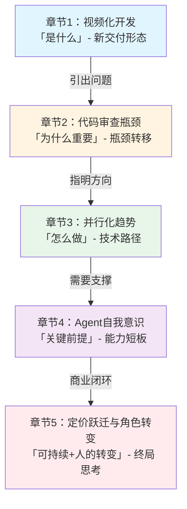

# Cursor Cloud Agents 文章论证逻辑与信息结构分析

## 一、整体论证结构分析

文章采用**"反直觉钩子→现象呈现→问题揭示→技术路径→能力演进→商业闭环→终极愿景"**的经典层层递进结构，属于典型的"范式变革"类论证框架：

| 结构层次 | 功能 | 对应内容 |
|---------|------|---------|
| **引入层（Hook）** | 打破读者预期，建立认知张力 | "Cursor团队自己都不按Tab了"——打造核心功能的团队却放弃使用该功能 |
| **现象层（What）** | 展示新范式的具体形态 | 视频化开发：Slack@Cursor启动Agent，半小时返回视频而非代码差异 |
| **问题层（Why Now）** | 揭示范式转移的必然性——旧瓶颈解决后新瓶颈出现 | 写代码变容易，但"敢不敢合"成了新卡点；CI/CD被Agent数量搞崩 |
| **技术路径层（How）** | 指出突破方向 | 不是让单个模型更强（加大水压），而是并行化（把管道变宽）；多模型"委员会"、子智能体 |
| **关键能力层（Enabler）** | 识别当前短板与演进方向 | Agent缺乏自我认知，正在构建环境感知、记忆补全、System Prompt自编辑能力 |
| **商业闭环层（Sustainability）** | 论证商业模式的合理性 | 定价三阶段跃迁：$20→几百→几千上万；一个人完成十个人的工作量则物有所值 |
| **愿景层（Ultimate）** | 描绘终极形态，升华主题 | "思维层面的无服务器架构"——只管说想要什么，剩下交给看不见的Agent |

**论证核心逻辑**：从一个反直觉的内部细节出发，逐步展示新范式是什么、为什么必然发生、技术上如何实现、需要什么关键能力、商业上如何闭环，最终指向一个革命性的终极愿景。整条链条以Cursor团队的一手内部实践为证据基础，而非纯理论推演。

---

## 二、章节逻辑关联与递进关系

五个核心章节之间存在清晰的**"现象→问题→方案→能力→商业/人"**的递进逻辑，而非平行并列关系：



### 章节递进关系详解

| 章节 | 核心命题 | 与前一章的逻辑关系 | 在整体论证中的角色 |
|-----|---------|------------------|------------------|
| **章节1：视频化开发** | 交付形态从代码差异变为视频 | 开篇钩子的具体化展开 | **感知锚点**：用极其具体、反常识的场景（"看视频"而非"审代码"）让读者直观感受到范式变化 |
| **章节2：代码审查瓶颈** | 瓶颈从写代码转移到代码合并 | 解释为什么视频化不是花哨功能而是必然——代码审查已成为不可承受之重 | **问题引擎**：揭示旧范式的崩溃点，论证范式转移的必要性和紧迫性 |
| **章节3：并行化趋势** | 突破方向是管道变宽（并行）而非水流更快（单模型） | 回答"既然旧范式不行了，新范式的核心技术逻辑是什么" | **路径指明**：给出技术方向上的核心判断，用"委员会"实验、子智能体等内部实践支撑 |
| **章节4：Agent自我意识** | Agent需要认识自己的运行环境与能力边界 | 并行化、规模化运行Agent的必要前提——如果Agent连自己能干什么都不知道，集群无从谈起 | **能力补全**：识别当前技术短板，展示演进方向，让整个论证显得完整而非盲目乐观 |
| **章节5：定价跃迁与角色转变** | 高定价合理，开发者从编码者变为Agent管理者 | 技术范式变革必然带来商业模式和人的角色变化，完成从技术到商业再到人的闭环 | **终局收束**：回答"这一切意味着什么"，把技术趋势落地到商业逻辑和人的工作方式上，最终升华为"思维层面的无服务器架构"愿景 |

**关键递进线索**：文章始终围绕"效率提升→新瓶颈出现→需要新技术突破→需要新能力支撑→带来新商业模式→改变人的角色"这一通用技术革命演进路径展开。

---

## 三、论证方法识别与举例

文章综合运用了至少**6种论证方法**，以内部实践案例为核心证据，辅以比喻、对比、数据、观察、预判等多种手段：

### 1. 内部实践案例引用（核心论证方法）

以Cursor团队真实发生的内部实践作为最主要的证据来源，这是文章可信度的基石。

**举例**：
- **Slack@Cursor工作流**："你在Slack频道里@Cursor，它会启动一个Cloud Agent，跑在独立的云端虚拟机。半小时后，它交回来的不是一堆代码差异——而是一段视频。"（article-content.md:33-35）
- **Bug修复流程**："Agent先复现Bug、录一段复现视频，然后修复、再录一段修复后的视频，证明同样的操作不再出问题。那种你在本地调试半天都没法确认'到底修没修好'的老大难Bug，现在可能90秒就直接合并了。"（article-content.md:46-49）
- **"委员会"实验**："他们做了一个实验叫'委员会'：同一个Prompt同时丢给多个不同模型，然后用一个合成层去整合结果。"（article-content.md:75）
- **CI/CD崩溃事件**："CI/CD系统直接被搞崩过——不是因为Cursor本身用户暴增，而是每个用户运行的Agent数量翻了十倍。"（article-content.md:63）

### 2. 比喻论证（让抽象概念具象化）

用通俗易懂的比喻解释技术方向判断，降低理解门槛，增强记忆点。

**举例**：
- **水流/管道比喻**（核心比喻，章节3标题直接使用）："之前整个行业都在想办法让单个模型干更多活，像是加大水压让水流更快。但真正的突破在于把管道变宽——并行化。"（article-content.md:71-73）
  - 这个比喻极其精准：水压=单模型能力，管道宽度=并行规模，水流=Token/代码产出。读者瞬间理解为什么"并行化"是比"提升单模型"更重要的方向。
- **操作系统比喻**："这意味着Agent不只是在执行任务，它还在根据任务需求调整自己的'操作系统'。"（article-content.md:105）——用"操作系统"比喻System Prompt，让非技术读者也能理解自编辑的意义。
- **无服务器架构比喻**："Cursor团队把自己想做成的东西叫'思维层面的无服务器架构'。"（article-content.md:133）——借用开发者熟悉的serverless概念（不用管服务器，只管写代码），类比到思维层面（不用管底层，只管提需求）。

### 3. 对比论证（新旧范式对照强化冲击）

通过旧模式与新模式的鲜明对比，让读者直观感受到变革的幅度。

**举例**：
- **代码审查vs视频审查**："换作以前，你得审查四份700行的代码差异，那简直是噩梦；但现在你扫一眼四个短视频，就能判断哪个值得继续打磨。"（article-content.md:43）——700行代码vs短视频，"噩梦"vs"扫一眼"，对比极其强烈。
- **本地调试vs Agent修复**："那种你在本地调试半天都没法确认'到底修没修好'的老大难Bug，现在可能90秒就直接合并了。"（article-content.md:49）——"半天"vs"90秒"，时间尺度对比。
- **单模型vs模型集群**："有意思的是，即便未来某个模型暂时领先，'模型集群'跑出来的综合效果仍然更好。一加一确实大于二。"（article-content.md:79）
- **3秒级vs小时级交互**："未来软件开发的节奏，会从现在的3秒级交互，变成3分钟、30分钟甚至3小时的任务处理。"（article-content.md:129）——交互时间尺度的数量级变化对比。
- **敲键盘vs管Agent**："你不再是那个敲键盘的人，你是那个看视频、做判断、切换上下文、管理一群Agent的人。"（article-content.md:127）——开发者角色的前后对比。

### 4. 数据支撑（用具体数字增强可信度）

穿插大量具体数据点，避免空泛论述。

**举例**：
- 时间数据：半小时交付、90秒合并Bug、3秒→3分钟→30分钟→3小时（article-content.md:35,49,129）
- 规模数据：4个模型并行、700行代码差异、百人团队跑几十个Agent、千人规模DevEx、Agent数量翻十倍、5个探索子Agent、成百上千个智能体、每秒数千个Token（article-content.md:41,43,61,63,81,85）
- 定价数据：$20/月→几百美元/月→几千甚至上万美元/月（article-content.md:113-115）
- 人效数据：一个人完成十个人的工作量（article-content.md:117）

### 5. 内部观察与团队轶事（增加真实感与亲和力）

引用团队内部的笑话、对话、真实感受，让文章有"内部人爆料"的真实感，而非官方通稿。

**举例**：
- **内部笑话**："他们内部有个笑话——讨论某个功能的时候，总有人说'我有个PR'。PR写出来很快，但你不敢合。"（article-content.md:57）——这个笑话极其生动地展现了"不敢合"的瓶颈，比任何抽象论述都有力。
- **团队成员感受**："团队里有人说，自己的野心比以前更大了，比任何时候都忙。不是因为AI让工作变少了，恰恰相反——能做的事情变多了，你只是在拼命跟上节奏。"（article-content.md:121-123）
- **团队原话引用**："当你看到系统里成百上千个智能体同时运行，每秒输出数千个Token时——用他们的话说——你就再也回不去旧时代了。"（article-content.md:85）

### 6. 趋势预判（基于当前实践的未来推演）

在已有观察基础上做出合理的未来判断，展示思想深度。

**举例**：
- **审查模式预判**："所以他们的判断是：未来你需要用AI来审查AI，或者干脆采用另一种模式——别审代码了，直接把运行结果给我看。"（article-content.md:65）
- **集群优势预判**："有意思的是，即便未来某个模型暂时领先，'模型集群'跑出来的综合效果仍然更好。"（article-content.md:79）
- **交互节奏预判**："未来软件开发的节奏，会从现在的3秒级交互，变成3分钟、30分钟甚至3小时的任务处理。"（article-content.md:129）
- **终极愿景预判**："思维层面的无服务器架构"（article-content.md:133）

---

## 四、叙事节奏与说服策略分析

文章在叙事节奏和说服策略上设计精巧，展现了优秀的科技评论写作技巧：

### 1. 反直觉开头：用"矛盾"瞬间抓住注意力

文章开头没有平铺直叙介绍Cloud Agents是什么，而是抛出一个极具认知张力的细节：

> "团队近期分享了一个耐人寻味的细节：内部成员如今早已不再使用Tab键。Tab自动补全是Cursor起家的核心功能，也是无数开发者依赖的实用工具，可亲手打造这项功能的团队，如今却基本不再使用。"（article-content.md:23-25）

**说服原理**：
- 制造**认知失调**："造工具的人不用自己造的工具"——这违背常识，读者立刻想知道"为什么"
- 建立**好奇心缺口**：读者会自动追问"那他们现在用什么？"
- 暗示**范式变革**：连核心功能都放弃了，说明变化是根本性的，不是小修小补

这个开头比"Cursor近日发布Cloud Agents更新"之类的平铺直叙有效10倍。

### 2. 层层递进：从具体场景到宏大愿景，每一步都建立在上一步基础上

文章的说服节奏遵循**"见自己→见天地→见众生"**的递进：
- **见自己（章节1-2）**：从具体的工作场景（看视频、不敢合PR）入手，让读者先有体感
- **见天地（章节3-4）**：上升到技术路径（并行化）和能力演进（自我意识），展示对技术方向的深度思考
- **见众生（章节5）**：落地到商业模式、人的角色、终极愿景，回答"这对所有人意味着什么"

**关键节奏控制**：每一章都先抛出一个反直觉的判断作为标题，然后用内部案例支撑，最后落到一个更大的趋势判断上，形成"小入口→深挖掘→大出口"的节奏。

### 3. 场景化说服：用"画面感"代替抽象论述

文章几乎不用"AI提升效率"这类空泛的话，而是给读者呈现极其具体的、可想象的场景：

- 你在Slack里@一下，半小时后收到一段视频
- 屏幕上同时放着四个短视频，你扫一眼就知道哪个行
- Agent先录一段Bug复现视频，再录一段修复视频，90秒后合并
- 团队开会时有人说"我有个PR"，大家会心一笑因为谁都不敢合
- 系统里成百上千个Agent在跑，每秒输出几千个Token

**说服原理**：人类大脑对"故事"和"画面"的记忆与信任度远高于抽象逻辑。读者可能记不住"并行化是趋势"这个判断，但会记住"看四个短视频代替审2800行代码"这个画面。

### 4. "Show, don't just tell"：用内部人的真实感受代替自吹自擂

文章很少直接说"Cloud Agents很厉害"，而是通过：
- CI/CD被搞崩（侧面说明Agent使用量爆炸式增长）
- "再也回不去旧时代了"（团队成员的真实感受）
- "野心比以前更大了，比任何时候都忙"（不是AI让人闲下来，而是能做的事变多了）
- 90秒合并以前调试半天的Bug（用结果说话）

这些细节比任何广告词都有说服力。

### 5. 承认问题：坦诚短板反而增加可信度

文章没有把Agent描绘成完美的，而是专门用一章（章节4）讨论Agent的致命短板——"它不知道自己能干什么"，甚至提到"任务明明就在眼前且完全可行，产品却直接拒绝了"这种看起来很"丢面子"的问题。

**说服原理**：主动承认问题会大幅提升可信度，让读者觉得作者是客观的，不是在写软文。同时，"正在解决这个问题"（让Agent具备自我意识、研究自编辑System Prompt）又展示了演进方向，把一个负面点转化成了"还有更大进步空间"的正面信号。

### 6. 收尾升华：用一个精准的概念命名终局，留下记忆点

文章最后没有平淡结束，而是抛出一个精心设计的概念——"思维层面的无服务器架构"，并用一句话解释清楚：

> "你不需要关心底层跑的是什么机器、哪个模型、怎么路由——你只管说你想要什么，剩下的，交给那群你看不见的Agent。"（article-content.md:135）

这个收尾的妙处在于：
- 借用了开发者已经熟悉的"serverless"概念，降低理解成本
- 精准概括了整篇文章描绘的终极图景
- 有画面感（"那群你看不见的Agent"）
- 留有余味，让读者读完后还会继续思考

---

## 五、隐含假设识别

文章的论证建立在几个未明确证明的隐含假设基础上，识别这些假设有助于更批判性地理解其观点：

### 隐含假设1：视频/运行结果验证足以替代代码审查的严谨性

**文章表述**："别审代码了，直接把运行结果给我看"（article-content.md:65）；视频化审查让90秒合并成为可能。

**假设内容**：观看Agent运行过程的视频，足以发现代码中可能存在的所有问题，包括：
- 边界情况（视频只演示了happy path，边缘case是否覆盖？）
- 安全漏洞（视频里看不到注入风险、权限问题）
- 架构腐化（代码能跑但写得很烂，未来维护成本极高）
- 隐性依赖（今天能跑，明天环境变了会不会崩？）

**潜在风险**：视频验证是"结果主义"的，无法替代对代码本身质量的审查。可能出现"演示完美，上线崩盘"的情况。

### 隐含假设2：多模型并行/集群智能的成本可接受，且1+1确实恒大于二

**文章表述**："一加一确实大于二"（article-content.md:79）；"管道变宽"是核心突破方向。

**假设内容**：
- 同时运行多个模型（比如4个）的额外成本，低于它们带来的效率提升
- 合成层整合多个模型结果的质量，稳定优于最好的单个模型
- 这种优势不会随着模型能力提升而消失（文章说"即便未来某个模型暂时领先，集群仍然更好"，但这是预判而非已验证事实）
- 成百上千个Agent同时运行的算力成本在商业上可持续

**潜在风险**：如果模型能力快速提升，单模型就足够好，或者并行成本过高，"管道变宽"可能不是最优解。

### 隐含假设3：市场会接受几千到上万美元/月的定价，且单人确实能稳定产出10人工作量

**文章表述**："如果一个人借助这些工具真的能完成十个人的工作量，那这笔钱就是物有所值"（article-content.md:117）。

**假设内容**：
- $10,000/月（约12万美元/年）的价格点，企业愿意支付
- 借助Agent的开发者确实能稳定、可重复地完成10个传统开发者的工作量
- 这种人效提升不是短期的"蜜月期"效应，而是长期可持续的
- 企业会愿意为工具支付接近人力成本的费用（历史上SaaS定价远低于人力成本）

**潜在风险**：定价跃迁幅度过大（$20→$10,000是500倍），可能遭遇市场阻力；人效提升可能被低估的协作、沟通、调试成本抵消。

### 隐含假设4：Agent自我编辑System Prompt不会导致不可控的风险

**文章表述**："更激进的是，他们已经在研究让模型编辑自己的System Prompt。这意味着Agent不只是在执行任务，它还在根据任务需求调整自己的'操作系统'。"（article-content.md:103-105）

**假设内容**：
- Agent自编辑System Prompt是安全的，不会产生目标漂移、能力失控等问题
- 存在有效的机制约束Agent自编辑的范围，不会让它突破安全边界
- 这种自编辑带来的收益大于引入的风险

**潜在风险**：自修改系统是经典的"控制问题"，历史上很多系统（包括简单的规则引擎）在允许自修改后都出现过难以预测的行为。文章完全没有讨论这方面的风险。

### 隐含假设5：开发者角色能够顺利转型为"Agent管理者"，且企业流程会适应新范式

**文章表述**："你不再是那个敲键盘的人，你是那个看视频、做判断、切换上下文、管理一群Agent的人。"（article-content.md:127）

**假设内容**：
- 大多数开发者具备"做判断、管Agent"所需的系统思维和决策能力
- 企业的开发流程、绩效评估、协作模式会快速适应这种新工作方式
- 不会出现"技能断层"——老开发者转不过来，新开发者不知道底层原理
- 管理Agent的认知负荷不会高于自己写代码

**潜在风险**：从"工匠"到"管理者"的角色转型是巨大的挑战，不是所有人都能适应；企业流程的变革往往比技术变革慢得多。

### 隐含假设6：现有DevEx/CI/CD体系要么会被压垮，要么会进化适应，而不会成为持久瓶颈

**文章表述**："一个百人团队跑几十个并行Agent，产出的代码量相当于以前千人规模大厂的DevEx才扛得住。CI/CD系统直接被搞崩过。"（article-content.md:61-63）

**假设内容**：
- DevEx/CI/CD的瓶颈是可以解决的（用AI审AI、看视频不审代码等）
- 这些瓶颈不会成为Cloud Agents大规模推广的持久障碍
- 现有企业的工具链和流程会快速迭代适应

**潜在风险**：如果视频审查、AI审AI等方案在实践中被证明不可靠，DevEx瓶颈可能长期存在，限制Agent的实际价值发挥。

---

## 六、完整论证链条

### 论证链条文字描述

文章的完整论证链条包含**8个核心节点**，形成从观察到终局的闭环：

| 节点序号 | 节点名称 | 核心内容 | 支撑证据 |
|---------|---------|---------|---------|
| **节点1** | 反直觉观察：造Tab的人不用Tab | Cursor团队内部已基本放弃Tab自动补全——这一核心起家功能 | 团队内部观察，作为开篇钩子 |
| **节点2** | 现象：交付形态视频化 | Cloud Agent在云端虚拟机自主运行（启服务、装依赖、跑测试），返回视频而非代码差异；4个模型并行返回4段视频；Bug修复复现+验证双视频，90秒合并 | 内部工作流案例、时间/规模数据 |
| **节点3** | 问题：瓶颈转移到"敢不敢合" | AI让写代码变容易，但代码审查成新卡点；"我有个PR"成内部笑话；几十个并行Agent产出等效千人DevEx；CI/CD被10倍Agent增长搞崩 | 内部轶事、规模数据、CI崩溃案例 |
| **节点4** | 方向：并行化（管道变宽）是核心突破 | 行业错误方向：加大水压让单模型更强；正确方向：把管道变宽（并行化）；"委员会"多模型合成，1+1>2；主Agent自主启动5个探索子Agent；成百上千Agent同时运行 | "委员会"实验案例、水流/管道比喻、子智能体功能、规模预判 |
| **节点5** | 能力：Agent需要"自我意识" | 当前致命短板：Agent不知道自己能干什么，明明可行的任务会拒绝；正在构建实用层面的自我意识：环境感知、密钥/功能状态认知、主动创建记忆文件补缺口；研究方向：自编辑System Prompt，调整自身"操作系统" | 内部观察到的问题、正在开发的功能、研究方向披露 |
| **节点6** | 商业：定价三阶段跃迁合理 | 阶段1（Tab）：$20/月；阶段2（本地交互）：几百/月；阶段3（云端并行Agent）：几千-上万/月；逻辑：一个人完成10人工作量则物有所值；用户会选择最好的产品 | 定价数据、价值逻辑 |
| **节点7** | 人：开发者角色转变 | 开发者不会失业（能做的事更多了），但角色剧变：从敲键盘的人变为看视频、做判断、管Agent的人；开发节奏从3秒级变为3分钟/30分钟/3小时级；交付物从代码片段变为可预览成果 | 团队成员感受、时间尺度预判、角色对比 |
| **节点8** | 终局：思维层面的无服务器架构 | 用户无需关心底层机器/模型/路由，只管表达需求；剩下的交给看不见的Agent集群 | 终极愿景，收束全文 |

### 论证链条Mermaid流程图

```mermaid
flowchart LR
    Start([开篇：Cloud Agents发布]) --> N1[节点1：反直觉观察<br/>造Tab的人不用Tab了]
    
    N1 -->|为什么？| N2[节点2：现象呈现<br/>交付形态视频化<br/>半小时返回视频而非代码<br/>4段视频vs2800行代码<br/>90秒合并疑难Bug]
    
    N2 -->|带来什么问题？| N3[节点3：瓶颈转移<br/>写代码容易了，但不敢合<br/>"我有个PR"成内部笑话<br/>CI/CD被10倍Agent搞崩<br/>代码审查成新卡点]
    
    N3 -->|突破方向在哪？| N4[节点4：技术路径<br/>不是加大水压，而是管道变宽<br/>并行化是核心<br/>"委员会"多模型合成<br/>子智能体自主协同<br/>1+1>2的集群智能]
    
    N4 -->|需要什么前提？| N5[节点5：关键能力<br/>Agent的致命短板：<br/>不知道自己能干什么<br/>需要环境感知/记忆补全<br/>研究自编辑System Prompt<br/>构建实用层面"自我意识"]
    
    N5 -->|商业上能否持续？| N6[节点6：商业闭环<br/>定价三阶段跃迁：<br/>$20→几百→几千-上万/月<br/>逻辑：1人干10人的活<br/>则高定价物有所值]
    
    N6 -->|对人意味着什么？| N7[节点7：角色转变<br/>开发者不失业，但角色剧变：<br/>从编码者→Agent管理者<br/>交互节奏：3秒→3分钟→30分钟→3小时<br/>交付物：代码片段→可预览成果]
    
    N7 -->|终极形态是什么？| N8[节点8：终极愿景<br/>"思维层面的无服务器架构"<br/>只管说你想要什么<br/>剩下交给看不见的Agent]
    
    N8 --> End([范式变革完成])
    
    style N1 fill:#ffcdd2
    style N2 fill:#e1f5ff
    style N3 fill:#fff4e1
    style N4 fill:#e8f5e9
    style N5 fill:#f3e5f5
    style N6 fill:#ffe0b2
    style N7 fill:#b2dfdb
    style N8 fill:#f8bbd0
```

### 论证链条逻辑关系说明

1. **因果递进**：每个节点都自然引出下一个节点——"不用Tab"引发好奇，展示视频化现象；视频化带来的效率提升导致代码量爆炸，引发审查瓶颈；瓶颈指明需要新的技术路径（并行化）；并行化需要Agent具备自我认知能力；能力演进支撑商业定价；商业逻辑落地到人的角色转变；所有线索最终汇聚到终极愿景。

2. **证据支撑**：链条的每个环节都有对应的内部案例、数据或观察作为支撑，不是纯逻辑推演。视频化有Slack工作流案例，瓶颈转移有CI崩溃事件和内部笑话，并行化有"委员会"实验，等等。

3. **闭环设计**：从"不用Tab"这个微小的行为变化出发，最终指向"思维层面的无服务器架构"这个宏大愿景，中间每个环节都承接上一环、引出下一环，形成完整的论证闭环。

4. **情绪曲线**：从开头的好奇（为什么不用Tab？）→ 震撼（90秒合并Bug、看视频不审代码）→ 认同（确实，审查是瓶颈）→ 信服（管道比喻很有道理）→ 理性（承认Agent有短板但在解决）→ 理解（定价逻辑说得通）→ 共鸣（角色转变确实在发生）→ 憧憬（无服务器架构的未来）。情绪曲线设计流畅。
