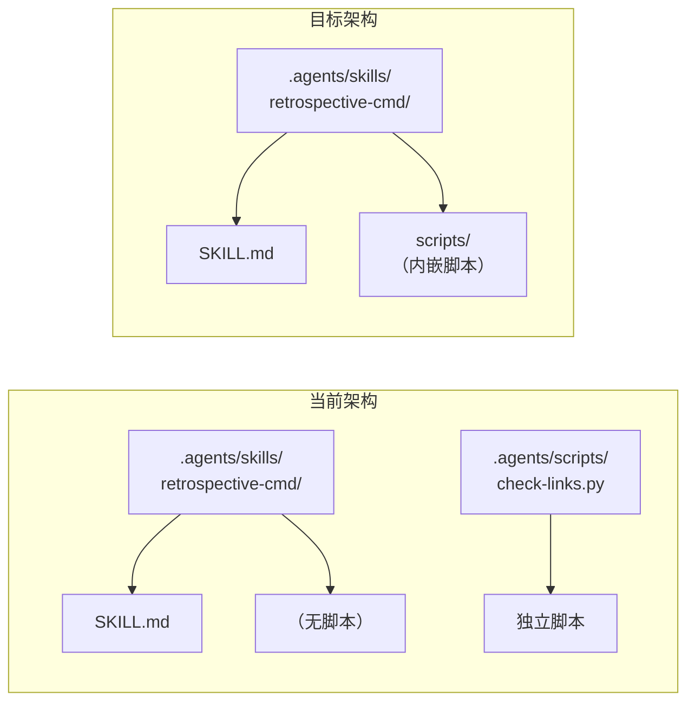

# Skills 文章学习·导出建议

> **导出日期**：2026-07-03
> **源报告**：[execution-retrospective.md](execution-retrospective.md) + [insight-extraction.md](insight-extraction.md)
> **报告类型**：知识捕获执行型复盘报告
> **导出格式**：Markdown（默认）

***

## 一、改进建议

| 编号 | 问题/机会 | 改进措施 | 优先级 | 预期效果 | 状态 |
|------|---------|---------|--------|---------|------|
| IMP-001 | 渐进式披露三层架构获外部验证，需升级成熟度 | 将已有模式从 L2 升级到 L3，补充外部验证证据 | 高 | 模式库首个 L3 标准化模式，具备对外推广资格 | 待规划 |
| IMP-002 | 知识调用时机反转模式待入库 | 新建模式文件，标注 L1 实验性，关联 SpecWeave Skill 体系作为实践案例 | 中 | 补充模式库的方法论维度，提供"反转预设"创新方法论 | 待规划 |
| IMP-003 | 可执行能力装备模式待入库 | 新建模式文件，标注 L1 实验性，关联 `.agents/scripts/` 作为部分实现 | 中 | 补充模式库的架构维度，指导 Skill 内嵌脚本的演进方向 | 待规划 |
| IMP-004 | AGENTS.md 常驻内容信噪比未量化 | 评估 AGENTS.md 中"模型本来就知道的"冗余内容，精简低信噪比段落 | 低 | 降低推理成本，提升任务聚焦度 | 待规划 |
| IMP-005 | 模式库（97 个模式）缺乏按需加载机制 | 评估为模式库建立"目录→正文→细节"三层渐进式披露的可行性 | 低 | 避免模式库检索时的上下文爆炸 | 待规划 |

***

## 二、行动计划

| 优先级 | 改进项 | 具体措施 | 建议时间 | 状态 |
|--------|--------|---------|---------|------|
| 高 | IMP-001 模式成熟度升级 | ①定位已有"渐进式披露三层架构"模式文件 ②补充 Anthropic Skills 外部验证证据 ③更新成熟度标记 L2→L3 ④更新 [pattern-maturity-levels.md](../../../concepts/pattern-maturity-levels.md) 资产快照 | 2026-07-10 | 待规划 |
| 中 | IMP-002 知识调用时机反转入库 | ①在 `patterns/methodology-patterns/ai-collaboration/` 新建模式文件 ②撰写核心思想、适用条件、反模式对照表 ③关联 SpecWeave Skill 体系实践 ④更新 [CATEGORIES.md](../../../patterns/methodology-patterns/CATEGORIES.md) 索引 | 2026-07-15 | 待规划 |
| 中 | IMP-003 可执行能力装备入库 | ①在 `patterns/architecture-patterns/` 新建模式文件 ②撰写隐性知识固化方法论 ③关联 `.agents/scripts/` 现状与改进方向 ④更新架构模式索引 | 2026-07-15 | 待规划 |
| 低 | IMP-004 AGENTS.md 信噪比审查 | ①扫描 AGENTS.md 中"模型本来就知道"的冗余内容 ②评估每段内容的信噪比 ③精简低信噪比段落或迁移到按需加载的 skill 中 | 2026-07-30 | 待规划 |
| 低 | IMP-005 模式库按需取改造评估 | ①调研模式库使用场景与加载频率 ②设计模式库的三层渐进式披露方案 ③评估实施成本与收益 | 2026-08-15 | 待规划 |

***

## 三、模式成熟度更新

| 模式 ID | 模式名称 | 成熟度变化 | 触发原因 | 更新时间 | 验证/复用次数 |
|---------|---------|-----------|---------|---------|-------------|
| progressive-disclosure-three-layer | 渐进式披露三层架构 | L2→L3 | Anthropic 官方 Skills 机制独立收敛到同一架构，外部权威验证 | 2026-07-03 | SpecWeave 内部验证 + Anthropic 外部验证 |
| knowledge-retrieval-timing-inversion | 知识调用时机反转 | 新建 L1 | 首次从外部文章萃取，待 SpecWeave 实践验证 | 2026-07-03 | 0（待入库） |
| executable-capability-equipment | 可执行能力装备 | 新建 L1 | 首次从外部文章萃取，SpecWeave 已有部分实现 | 2026-07-03 | 0（待入库） |

### 成熟度升级依据

**渐进式披露三层架构 L2→L3 升级依据**：

根据 [pattern-maturity-levels.md](../../../concepts/pattern-maturity-levels.md) 的成熟度标准：
- L2（已验证）：在 SpecWeave 项目内经过多次验证
- L3（标准化）：经过外部独立验证，具备推广条件

本次通过 Anthropic 官方 Skills 机制的独立收敛验证，满足 L3 升级条件：
1. ✅ 外部独立团队（Anthropic）独立实现了同一架构
2. ✅ 收敛不是模仿——SpecWeave 的架构在文章发布前已建立
3. ✅ 架构在两个独立系统中均有效运行

***

## 四、后续优化方向

### 方向 1：Skill 体系的可执行代码增强

文章指出 Skills 的核心优势是"能装可执行代码"。SpecWeave 当前 `.agents/scripts/` 与 `.agents/skills/` 是分离的，可评估将高频脚本内嵌到对应 skill 文件夹中。

### 方向 2：上下文信噪比量化工具

基于"上下文信噪比 > 信息量"规律，开发 AGENTS.md 信噪比评估工具：
- 扫描常驻文件中的每段内容
- 分类为"信号"（任务相关、模型不知道的）或"噪音"（模型本来就知道的/读代码能看出的）
- 输出信噪比报告，指导精简

### 方向 3：模式库按需取改造

为 97 个模式的模式库建立三层渐进式披露：
- L1：每个模式一行简介（类似 skill 的 description）
- L2：模式正文（按需加载）
- L3：模式的代码示例/参考文件（深度引用）

***

## 五、导出格式建议

| 格式 | 适用场景 | 当前状态 | 建议 |
|------|---------|---------|------|
| Markdown | 项目内归档、版本控制 | ✅ 已输出 | 默认格式，已归档至本目录 |
| JSON | 结构化数据分析 | 未输出 | 如需机器处理可从 frontmatter 提取 |
| PDF | 对外分享、打印 | 未输出 | 可通过 Pandoc 转换，当前非优先 |
| DOCX | 正式文档提交 | 未输出 | 可通过 Pandoc 转换，当前非优先 |

***

## 六、归档信息

| 项目 | 内容 |
|------|------|
| 归档目录 | `docs/retrospective/reports/insight-extraction/retrospective-skills-article-learning-20260629/` |
| 分类归属 | insight-extraction（洞察与萃取系列） |
| 文件清单 | README.md、execution-retrospective.md、insight-extraction.md、export-suggestions.md |
| 索引更新 | 需更新 `docs/retrospective/reports/README.md` 和 `docs/retrospective/README.md` |
| 链接检查 | 导出后需运行 `python .agents/scripts/check-links.py --path <报告目录>` |

***

> **报告编制**：本文档基于执行复盘和洞察萃取的产出编制，所有改进建议均有事实依据支撑。行动计划标注了优先级和建议时间，模式成熟度更新遵循 L1-L4 分级标准。
