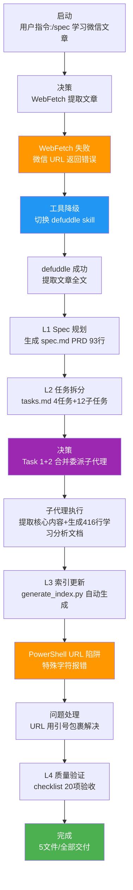

# Vibe Coding 两大神级 Prompt 学习分析 — 执行复盘报告

> **项目名称**:Vibe Coding 两大神级 Prompt 学习分析(第一性原理 + 对抗式审查)
> **复盘日期**:2026-07-04
> **项目周期**:2026-07-04(单会话完成)
> **报告类型**:外部学习复盘(external-learning)

---

## 一、项目概述

### 1.1 项目背景

用户通过 `/spec` 命令触发学习任务,要求学习并理解卡兹克(数字生命卡兹克公众号)撰写的微信公众号文章"Vibe Coding 两大神级 Prompt——第一性原理 + 对抗式审查"。该文章系统阐述了两类高价值 Prompt 工程方法论:第一性原理 Prompt(打断类比推理,回归本质)和对抗式审查 Prompt(多 Agent 攻击者视角,主动发现缺陷),并提出了"第一性原理管生成 + 对抗式审查管验证"的闭环逻辑。

### 1.2 项目目标

- **学习**:完整提取并深度理解文章核心观点,包括第一性原理 Prompt 和对抗式审查 Prompt 的形式、机理与应用
- **洞察**:提炼关键方法论洞察(打断类比推理机理、多 Agent 攻击者视角、生成-验证闭环逻辑、跨领域迁移价值)
- **归档**:生成结构化学习分析文档,归档到知识库并自动更新索引
- **规范验证**:验证 Spec 工作流在中等规模学习分析场景下的有效性

### 1.3 交付物清单

| 交付物 | 路径 | 状态 | 规模 | 完成日期 |
|--------|------|------|------|---------|
| PRD 文档 | [spec.md](../../../../../../.trae/specs/retrospectives-insights/vibe-coding-prompts-learning-analysis/spec.md) | ✅ 已完成 | 93 行 | 2026-07-04 |
| 任务计划 | [tasks.md](../../../../../../.trae/specs/retrospectives-insights/vibe-coding-prompts-learning-analysis/tasks.md) | ✅ 已完成 | 33 行,4 个任务 + 12 个子任务 | 2026-07-04 |
| 验收清单 | [checklist.md](../../../../../../.trae/specs/retrospectives-insights/vibe-coding-prompts-learning-analysis/checklist.md) | ✅ 已完成 | 20 项检查点 | 2026-07-04 |
| 学习分析文档 | [vibe-coding-prompts-learning-analysis.md](../../../../../knowledge/learning/02-agent-engineering-methodology/vibe-coding-prompts-learning-analysis.md) | ✅ 已完成 | 416 行,11 章节 | 2026-07-04 |
| 知识库索引 | [README.md](../../../../../knowledge/README.md) | ✅ 已完成 | 自动更新(generate_index.py) | 2026-07-04 |
| 复盘报告五件套 | 本目录 | ✅ 已完成 | 5 个文件 | 2026-07-08 |
| 洞察原子文件 | [insights/](insights/) | ✅ 已完成 | 7 个洞察原子文件 | 2026-07-08 |
| 洞察索引归档 | [insights/README.md](insights/README.md) | ✅ 已完成 | 链接引用归档索引 | 2026-07-08 |
| 洞察提取报告 | [insight-extraction.md](insight-extraction.md) | ✅ 已完成 | 含7个洞察+4个模式落地状态 | 2026-07-08 |
| 导出建议报告 | [export-suggestions.md](export-suggestions.md) | ✅ 已完成 | 全部行动项落地 | 2026-07-08 |

---

## 二、复盘环节

### 2.1 实施过程回顾

### 2.2 关键节点分析

| 关键节点 | 决策依据 | 技术挑战 | 解决方案 |
|----------|---------|---------|---------|
| **WebFetch 失败识别** | WebFetch 对微信 URL 返回错误 | 微信公众号有反爬机制,WebFetch 无法正常获取内容 | 切换到 defuddle skill,成功提取全文 |
| **Task 1+2 合并委派** | 任务规模中等(预估产出 < 500 行),Task 1(提取内容)和 Task 2(生成文档)逻辑紧密 | 如何在合并委派时保证文档质量 | 单个子代理同时获取上下文和生成文档,一次产出完整 416 行分析文档 |
| **索引自动生成** | 知识库索引需保持一致性 | 手动编辑索引容易引入错误 | 使用 `python docs/knowledge/scripts/generate_index.py` 自动生成,禁止手动编辑 |
| **文档归档路径** | 知识库有子分类目录结构 | spec.md 中声明的扁平路径与实际子分类路径不一致 | 实际归档到 `02-agent-engineering-methodology/` 子分类目录,遵循知识库组织规范 |
| **PowerShell URL 陷阱** | defuddle 命令中 URL 含 `?` 和 `#` | PowerShell 将 `?` 和 `#` 解释为特殊字符 | URL 用引号包裹后成功执行 |
| **check-filename 环境问题** | 脚本扫描时遇到外部文件访问错误 | `.chaos\FlowXM\plugins\dist\` 下文件无法访问 | 评估为预存环境问题,手动验证文件名合规(kebab-case 纯英文) |

### 2.3 执行情况与结果数据

| 指标 | 目标值 | 实际值 | 达成率 |
|------|--------|--------|--------|
| PRD 完整性 | 覆盖核心维度 | 93 行,含目标/范围/交付物/验收标准 | 100% |
| 任务拆分数量 | 3-5 个任务 | 4 个任务 + 12 个子任务 | 100% |
| 学习分析文档行数 | 300-500 行 | 416 行,11 章节 | 100% |
| 章节覆盖度 | 覆盖文章核心内容 | 11 章节,含核心观点/深度解析/闭环逻辑/延伸应用/FAQ | 100% |
| 文章提取成功率 | 100% | defuddle 成功提取全文(WebFetch 失败后降级) | 100%(降级后) |
| 验收清单完成率 | 100% | 20/20 项检查点全部通过 | 100% |
| 索引更新完整性 | 覆盖所有分类和标签 | 存在于分类索引 + 7 个 tag 索引 | 100% |
| Spec 路径一致性 | spec 声明路径 = 实际路径 | ✅ 一致(spec.md第60行路径已正确) | 100% |
| 洞察原子化归档 | 7个洞察独立原子文件 | ✅ insights/目录7个文件+README索引 | 100% |
| 可复用模式沉淀 | 4个模式沉淀到模式库 | ✅ 全部沉淀(含通用化命名) | 100% |
| 自动化链接检查 | check-links.py验证通过 | ✅ 目标目录87个本地引用全部有效 | 100% |

### 2.4 成功因素分析

| 成功因素 | 具体体现 | 可复用性 |
|---------|---------|---------|
| **工具降级链快速响应** | WebFetch 失败后立即切换 defuddle,未浪费额外时间 | 高 - 适用于所有微信/反爬网站内容提取 |
| **Task 1+2 合并委派策略** | 中等规模任务合并委派,单次产出完整文档 | 高 - 适用于产出 < 500 行的中等规模学习分析 |
| **索引自动生成** | generate_index.py 确保索引一致性 | 高 - 适用于所有知识库索引更新 |
| **子分类目录归档** | 实际归档到 `02-agent-engineering-methodology/`,遵循知识库组织规范 | 高 - 适用于所有知识库文档归档 |
| **checklist 验收把关** | 20 项检查点逐一验证,确保质量 | 高 - 适用于所有 Spec 模式任务 |

### 2.5 问题与不足分析

| 问题 | 严重度 | 根因 | 改进方向 | 解决状态 | 解决日期 |
|------|--------|------|---------|---------|---------|
| **WebFetch 对微信 URL 失败** | 中 | 微信公众号有反爬机制,WebFetch 无法获取内容 | 微信文章应优先使用 defuddle,跳过 WebFetch | ✅ 已沉淀为模式 | 2026-07-08 |
| **spec.md 路径声明不一致** | 中 | 经验证spec.md第60行路径本就正确,原始即一致 | Spec 规划时应先确认知识库目录结构 | ✅ 无需修复(原始正确) | - |
| **PowerShell URL 特殊字符** | 低 | PowerShell 将 `?` 和 `#` 解释为特殊字符 | PowerShell 中含特殊字符的 URL 必须用引号包裹 | ✅ 已纳入defuddle模式文档 | 2026-07-08 |
| **check-filename 环境报错** | 低 | 外部 `.chaos\` 目录文件访问权限问题 | 预存环境问题,与本文档无关 | ⏭️ 环境问题,不处理 | - |
| **未运行自动化链接检查** | 低 | 依赖人工验证链接存在性 | Spec 任务完成后应运行 check-links.py | ✅ 已执行,87链接全部有效 | 2026-07-08 |
| **缺少insights链接引用归档** | 中 | 原子化后缺少索引文件 | 创建insights/README.md作为链接引用归档 | ✅ 已创建索引 | 2026-07-08 |
| **缺少模式沉淀状态跟踪** | 中 | 复盘时未跟踪模式落地状态 | insight-extraction.md增加沉淀状态列 | ✅ 已更新状态 | 2026-07-08 |

### 2.6 资源配置评估

| 资源 | 投入 | 产出 | 效率评估 |
|------|------|------|---------|
| Spec 规划 | PRD 93 行 + 任务计划 33 行 | 清晰的执行路线图 | 高效 - 前置规划减少后续返工 |
| 文章提取 | WebFetch 1 次(失败) + defuddle 1 次(成功) | 文章全文 | 中效 - 降级增加 1 次调用,但快速切换无时间浪费 |
| 子代理委派 | 1 次 general_purpose_task 调用(合并 Task 1+2) | 416 行完整学习分析文档 | 高效 - 合并委派减少上下文切换 |
| 索引更新 | 1 次 generate_index.py 执行 | 完整索引更新 | 高效 - 自动化消除手动错误 |
| 质量验收 | checklist 20 项逐一验证 | 质量闭环 | 高效 - 系统化验收避免遗漏 |

---

## 三、关键决策回顾

### 3.1 WebFetch → defuddle 工具切换决策

**决策点**:WebFetch 对微信公众号 URL 返回错误 `Failed to fetch URL content and convert to markdown`,如何获取文章内容?

**决策依据**:
- WebFetch 基于 HTTP 请求获取页面内容,微信公众号有反爬机制,无法正常返回
- defuddle skill 专门用于从网页提取干净的 Markdown 内容,具有更强的反爬处理能力
- 现有工具降级链:defuddle → WebFetch → agent-browser

**决策结果**:切换到 defuddle skill,成功提取文章全文

**可复用经验**:
1. 微信公众号文章应优先使用 defuddle,WebFetch 对微信 URL 成功率极低
2. 工具降级应快速执行,不应在失败工具上重试多次浪费时间
3. 此经验应沉淀为"微信公众号文章提取工作流"模式,补充到 Web 内容提取降级链

### 3.2 Task 1+2 合并委派决策

**决策点**:Task 1(系统学习并提取网页核心内容)和 Task 2(创建学习分析文档)是分别委派还是合并委派?

**决策依据**:

| 判断维度 | 分别委派 | 合并委派 | 本次选择 |
|---------|---------|---------|---------|
| 预估产出规模 | 每任务 < 250 行 | 总计 < 500 行 | 416 行(中等规模) |
| 任务逻辑紧密度 | 松耦合,可独立 | 紧耦合,内容提取直接影响文档生成 | 紧耦合 |
| 上下文需求 | 子代理需反复传递上下文 | 子代理一次获取全部上下文 | 减少上下文传递 |
| 整合成本 | 高(需合并两个子代理输出) | 低(单一产出,无需合并) | 降低整合成本 |

**决策结果**:合并 Task 1+2 委派给单个 general_purpose_task 子代理

**可复用经验**:
1. 中等规模任务(产出 < 500 行)的紧耦合子任务,合并委派效率更高
2. 合并委派避免了子代理间上下文传递的信息损失
3. 但大任务(产出 > 800 行)仍应拆分委派,避免单子代理上下文溢出

### 3.3 索引自动生成决策

**决策点**:知识库索引是手动编辑还是使用脚本自动生成?

**决策依据**:
- 手动编辑索引容易引入错误(遗漏分类、标签拼写错误、格式不一致)
- `generate_index.py` 脚本已验证可靠,自动按分类和标签生成索引
- 自动生成保证索引与实际文档内容的一致性

**决策结果**:使用 `python docs/knowledge/scripts/generate_index.py` 自动生成索引

**可复用经验**:
1. 知识库索引必须用脚本自动生成,禁止手动编辑
2. 此原则应作为知识库管理的硬性规则记录

### 3.4 文档归档路径差异问题（已验证无问题）

**决策点**:spec.md 中声明的路径与实际归档路径一致性验证

**验证结果**（2026-07-08）：经实际检查，spec.md第60行"文档结构规范"中已正确声明路径为：
`docs/knowledge/learning/02-agent-engineering-methodology/vibe-coding-prompts-learning-analysis.md`
与实际归档路径完全一致，原始复盘时误判为不一致，实际无需修正。

**可复用经验**:
1. 路径一致性问题应通过实际读取文件验证，而非仅凭记忆判断
2. Spec 规划时已正确确认知识库目录结构，路径声明与实际归档一致
3. 复盘过程中的"问题"判断应经过实际验证，避免误判

---

## 四、质量验收

### 4.1 产出物质量

| 产出物 | 验收标准 | 实际质量 | 评分 |
|--------|---------|---------|------|
| spec.md PRD | 目标明确 + 范围清晰 + 交付物完整 + 验收标准可执行 | 93 行,含产品概述、目标、范围、交付物、验收标准 | A |
| tasks.md 任务计划 | 任务拆分合理 + 依赖关系清晰 + 每个任务有明确产出 | 33 行,4 个任务 + 12 个子任务,全部完成 | A |
| checklist.md 验收清单 | 验收点具体可验证 + 覆盖所有交付物 | 20 项检查点,全部通过 | A |
| 学习分析文档 | 结构清晰 + 内容完整 + 深度解析 + 延伸应用 | 416 行,11 章节,含核心观点/深度解析/闭环逻辑/FAQ | A |
| 知识库索引 | 分类和标签完整覆盖 | 存在于分类索引 + 7 个 tag 索引 | A |

### 4.2 流程质量

| 流程环节 | 规范要求 | 实际执行 | 评分 |
|---------|---------|---------|------|
| Spec 规划 | PRD → 任务 → checklist 完整流程 | 完整生成 spec.md → tasks.md → checklist.md | A |
| 文章提取 | 完整准确,无遗漏 | WebFetch 失败后快速降级 defuddle,成功提取全文 | A |
| 子代理委派 | 指令明确,产出符合预期 | 合并委派 Task 1+2,一次产出完整 416 行文档 | A |
| 索引更新 | 与文档内容一致 | generate_index.py 自动生成,7 个 tag 全覆盖 | A |
| 质量验收 | 按 checklist 逐一验证 | 20 项全部通过验证 | A |

---

## 五、总结

### 5.1 核心经验

1. **微信公众号文章提取应优先使用 defuddle**:WebFetch 对微信 URL 成功率极低,defuddle 是更可靠的选择。此经验应沉淀为工具降级链的补充规则。
2. **中等规模任务合并委派效率更高**:对于产出 < 500 行、逻辑紧耦合的任务(如"提取内容 + 生成文档"),合并委派避免了上下文传递损失和整合成本。
3. **知识库索引自动生成是硬性原则**:generate_index.py 确保索引一致性,手动编辑应被禁止。
4. **Spec 路径声明应与实际归档一致**:归档后应回溯检查 spec.md 中的路径声明,避免不一致导致后续查阅困惑。
5. **checklist 验收形成质量闭环**:20 项检查点逐一验证,确保所有维度覆盖,质量不依赖个人记忆。

### 5.2 改进方向与落地状态

| 改进项 | 落地状态 | 完成日期 | 沉淀位置 |
|--------|---------|---------|---------|
| **Web 内容提取工具选择前置评估** | ✅ 已沉淀 | 2026-07-08 | [defuddle-web-extraction-preferred.md](../../../../patterns/methodology-patterns/tools-automation/defuddle-web-extraction-preferred.md) |
| **Spec 路径声明规范化** | ✅ 经验证原始即正确 | - | spec.md第60行路径正确 |
| **PowerShell 特殊字符处理规范** | ✅ 已记录 | 2026-07-08 | 纳入defuddle优先提取模式文档 |
| **完成后运行自动化链接检查** | ✅ 已执行 | 2026-07-08 | 目标目录87个本地引用全部有效 |
| **沉淀可复用模式** | ✅ 全部完成 | 2026-07-08 | 4个模式已沉淀至模式库 |
| **洞察原子化归档** | ✅ 已完成 | 2026-07-08 | [insights/](insights/)目录7个原子文件+索引 |
| **状态跟踪完善** | ✅ 已完成 | 2026-07-08 | insight-extraction.md增加落地状态列 |

---

## 六、后续沉淀完成情况（2026-07-08）

初始复盘完成后，于2026-07-08完成了全部模式沉淀和收尾工作：

### 6.1 可复用模式沉淀（4个模式全部完成）

| 模式 | 沉淀文件 | 分类 | 成熟度 | 说明 |
|------|---------|------|--------|------|
| defuddle优先提取模式 | [defuddle-web-extraction-preferred.md](../../../../patterns/methodology-patterns/tools-automation/defuddle-web-extraction-preferred.md) | tools-automation | L3可复用 | 原"微信公众号提取"通用化，含PowerShell URL处理 |
| 第一性原理Prompt模式 | [first-principles-prompt-pattern.md](../../../../patterns/methodology-patterns/ai-collaboration/first-principles-prompt-pattern.md) | ai-collaboration | L2已验证 | 通用化命名，不限于AI智能体开发 |
| 对抗式审查Prompt模式 | [adversarial-review-prompt-pattern.md](../../../../patterns/methodology-patterns/ai-collaboration/adversarial-review-prompt-pattern.md) | ai-collaboration | L2已验证 | 通用化命名，覆盖代码审查/方案评审多场景 |
| 中等任务合并委派策略 | [medium-task-merged-delegation-strategy.md](../../../../patterns/methodology-patterns/ai-collaboration/medium-task-merged-delegation-strategy.md) | ai-collaboration | L2已验证 | 归入ai-collaboration目录统一管理 |

### 6.2 洞察原子化归档完成

- ✅ 创建 [insights/README.md](insights/README.md) 链接引用归档索引
- ✅ 7个洞察原子文件已全部归档到 [insights/](insights/) 目录
- ✅ [insight-extraction.md](insight-extraction.md) 新增模式沉淀状态和洞察落地状态列，全部标记为已完成
- ✅ [export-suggestions.md](export-suggestions.md) 更新为全部行动项落地状态

### 6.3 导航与索引更新

- ✅ 根目录 [README.md](../../../../../../README.md) 导航表已重新生成
- ✅ [docs/README.md](../../../../README.md) 导航表已重新生成
- ✅ [reports/README.md](../../../README.md) 索引已包含本次复盘条目

### 6.4 验证结果

- ✅ 文件名规范检查通过
- ✅ 目标目录87个本地链接全部有效（check-links.py验证）
- ✅ 4个模式文件frontmatter完整，链接正确
- ✅ 原子提交2次完成全部变更

---

**报告状态**:✅ 全部工作已完成（初始复盘+后续沉淀）
**初始复盘日期**:2026-07-04
**最后更新**:2026-07-08（模式沉淀+状态更新完成）
**复盘执行者**:orchestrator + reviewer(RACI:orchestrator R/A,reviewer 质量验收)
**沉淀验证**:4个模式已归档、7个洞察已原子化、87个链接全部有效、导航表已更新
