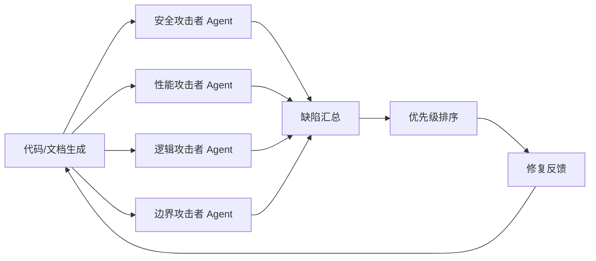

# 洞察2:对抗式审查的"多 Agent 攻击者视角"执行模式

**分类**:Prompt 工程类
**成熟度**:L2 已验证(validation_count=2)
**可复用性**:高 - 适用于所有需要深度审查的代码/文档/方案场景

## 洞察内容

对抗式审查 Prompt 的核心创新在于**多 Agent 攻击者视角**——不是让同一个 AI 既生成又审查,而是设计多个不同视角的"攻击者 Agent",每个 Agent 专注于发现一类缺陷(如安全漏洞、性能瓶颈、逻辑错误、边界条件)。这种"多角色对抗"模式比单一 AI 自审更有效,因为单个 AI 对自己的输出有"确认偏误",难以发现自己的盲点。

## 证据支撑

- 本次学习:卡兹克文章阐述对抗式审查采用"多角色攻击者"执行模式
- 典型 BUG 类型:文章列举了对抗式审查能发现的典型 BUG(安全漏洞、性能问题、逻辑错误、边界条件)
- 工具实践:文章提到对抗式审查可结合专用工具(如代码扫描器、测试覆盖率工具)增强效果

## 多 Agent 攻击者模式执行流程

## 单 Agent 自审 vs 多 Agent 对抗式审查对比

| 维度 | 单 Agent 自审 | 多 Agent 对抗式审查 |
|------|-------------|-------------------|
| **视角多样性** | 单一视角,有确认偏误 | 多视角,覆盖不同缺陷类型 |
| **发现能力** | 容易遗漏自己盲点 | 每个 Agent 专注一类缺陷,发现率更高 |
| **执行成本** | 低(1 次调用) | 高(多次调用,但可并行) |
| **适用场景** | 简单检查、快速验证 | 复杂系统、高风险场景、关键代码 |
| **典型缺陷覆盖** | 表面问题 | 安全/性能/逻辑/边界全覆盖 |

## 关联模式

- [adversarial-review-prompt-pattern.md](../../../../../patterns/methodology-patterns/ai-collaboration/adversarial-review-prompt-pattern.md)
