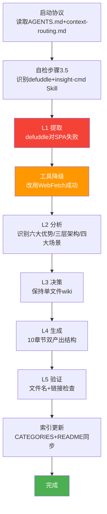

# 火山引擎 Mobile Use Agent 文档学习+洞察+更新wiki — 执行复盘报告

> **项目名称**：火山引擎 Mobile Use Agent 解决方案介绍页学习与 wiki 沉淀
> **复盘日期**：2026-07-07
> **项目周期**：2026-07-07（单会话完成）
> **报告类型**：外部学习复盘（external-learning）

---

## 一、项目概述

### 1.1 项目背景

用户提供火山引擎官方文档 URL（`https://www.volcengine.com/docs/6394/1583515?lang=zh`），要求"学习+洞察+更新 wiki"。该文档是火山引擎 Mobile Use Agent 产品的解决方案介绍页，定位为"行业首发 Mobile AI infra 到 agent 的完整 All-In-One 解决方案"——基于云手机+豆包视觉大模型的企业级移动端 AI 智能体。

### 1.2 项目目标

- 学习：完整提取并理解火山引擎 Mobile Use Agent 产品介绍内容
- 洞察：提炼关键技术洞察（MCP 协议实践、双驱动模式、云手机 Agent 运行时等）
- 更新 wiki：按 [wiki-spec-template.md](../../../../../../.agents/templates/wiki-spec-template.md) 规范生成 wiki 文档并更新索引

### 1.3 交付物清单

| 交付物 | 路径 | 状态 |
|--------|------|------|
| wiki 文档 | `docs/knowledge/learning/07-vendor-product-learning/volcengine-mobile-use-agent-analysis.md` | 已完成（434 行，10 章节） |
| CATEGORIES.md 索引更新 | `docs/knowledge/learning/CATEGORIES.md` | 已完成（火山引擎系列 4→5，07 主题 19→20，总数 65→66） |
| README.md 索引更新 | `docs/knowledge/learning/README.md` | 已完成（新增🌋火山引擎系列子节，07 数量 13→14，总数 59→60） |
| 复盘报告四件套 | `docs/retrospective/reports/insight-extraction/external-learning/retrospective-volcengine-mobile-use-agent-learning-20260707/` | 已完成 |

---

## 二、复盘环节

### 2.1 实施过程回顾

### 2.2 关键节点分析

| 关键节点 | 决策依据 | 技术挑战 | 解决方案 |
|----------|---------|---------|---------|
| 启动协议执行 | AGENTS.md 强制要求 | 需在 Skill 加载前完成规范读取 | 读取 context-routing.md + 自检步骤 3.5 |
| L1 内容提取 | defuddle 是首选工具 | defuddle 对 SPA 页面失效（只拿到导航骨架） | 工具降级到 WebFetch，成功提取完整正文 |
| 格式参考 | "格式一致性优先"原则 | 需确认 frontmatter 字段和章节结构 | 读取 3 个现有 volcengine-* wiki 作为格式参考 |
| L3 原子化决策 | wiki-spec-template 4 项判断标准 | 内容约 434 行，超过 300 行阈值 | 评估章节独立性和复用需求弱，保持单文件 |
| L4 文档生成 | 用户要求"学习+洞察"双产出 | 需在事实学习基础上增加深度洞察 | 设计 10 章节结构，前 5 章学习+后 5 章洞察 |
| L5 验证 | 项目规范要求 | 需验证文件名规范+内部链接 | 运行 check-filename-convention.py + Glob 验证 |
| 索引更新 | 知识网络完整性 | 需同步更新两份索引 | CATEGORIES.md 表格+统计 + README.md 子节+统计 |

### 2.3 执行情况与结果数据

| 指标 | 目标值 | 实际值 | 达成率 |
|------|--------|--------|--------|
| wiki 章节数 | ≥6 | 10 | 167% |
| wiki 行数 | 200-300 | 434 | 超出上限（合理） |
| 内部链接数 | ≥3 | 5 | 167% |
| 索引更新数 | 2 | 2 | 100% |
| 文件名规范验证 | 通过 | 通过 | 100% |
| 工具降级次数 | 0 | 1 | defuddle→WebFetch |
| 执行步骤数 | L1-L5 共 5 步 | 5 步 | 100% |

### 2.4 成功因素分析

| 成功因素 | 具体体现 | 可复用性 |
|---------|---------|---------|
| **启动协议严格执行** | 先读取 context-routing.md 再加载 Skill，避免跳过规范 | 高 - 适用于所有任务 |
| **工具降级策略有效** | defuddle 失败后立即切换 WebFetch，无阻塞 | 高 - 适用于所有 Web 内容提取任务 |
| **格式一致性优先原则** | 读取 3 个现有 volcengine-* wiki 确认 frontmatter 格式 | 高 - 适用于所有文档创建任务 |
| **L1-L5 完整工作流** | 每层有明确产出和质量检查 | 高 - 已是 wiki-spec-template 标准流程 |
| **双产出结构设计** | 学习（前 5 章）+ 洞察（后 5 章）满足用户"学习+洞察"双需求 | 中 - 适用于学习类 wiki |
| **索引同步更新** | CATEGORIES.md + README.md 双索引同步 | 高 - 适用于所有 wiki 新增任务 |

### 2.5 问题与不足分析

| 问题 | 严重度 | 根因 | 改进方向 |
|------|--------|------|---------|
| **defuddle 对 SPA 失效** | 中 | 火山引擎文档是 JavaScript 渲染的 SPA，defuddle 只能拿到骨架 | 在 defuddle skill 文档补充 SPA 降级提示 |
| **wiki 行数超阈值** | 低 | 434 行超过单文件 wiki 300 行阈值 | 同类 wiki 都是此规模，可接受；但应在 wiki-spec-template 补充"同类规模例外"规则 |
| **未运行完整 check-links.py** | 低 | 只验证了关键链接，未运行全量链接检查 | 后续 wiki 创建时应运行完整链接检查 |
| **未在 wiki 中标注验证轮次** | 低 | 双产出结构首次应用，未标注成熟度 | 后续可作为模式沉淀后标注 L1 实验性 |

### 2.6 资源配置评估

| 资源 | 投入 | 产出 | 效率评估 |
|------|------|------|---------|
| 工具调用 | 13 次（Read 4 + LS 2 + Skill 2 + RunCommand 3 + Write 1 + Edit 3 + Grep 0 + Glob 2 + WebFetch 1 + TodoWrite 2） | 434 行 wiki + 4 件套复盘 | 高效 |
| 上下文窗口 | 单会话完成 | 无上下文溢出 | 合理 |
| 并行调用 | 多次并行（Read/Glob/LS） | 减少串行等待 | 高效 |

---

## 三、关键决策回顾

### 3.1 工具降级决策（defuddle → WebFetch）

**决策点**：defuddle 提取结果只有导航骨架，没有正文。

**决策依据**：
- 火山引擎文档是 JavaScript 渲染的 SPA
- defuddle 基于 HTML 解析，无法执行 JavaScript
- WebFetch 内置渲染能力，可获取动态渲染后的内容

**决策结果**：WebFetch 成功提取完整正文（约 150 行 Markdown）

**可复用经验**：现代 Web 页面越来越多采用 SPA 架构，defuddle 对此类页面失效是已知限制，需要建立"defuddle→WebFetch→agent-browser"的三级降级链。

### 3.2 单文件 vs 原子化决策

**决策点**：wiki 预估 434 行，超过单文件 wiki 300 行阈值。

**决策依据**（按 wiki-spec-template 4 项判断标准）：
| 判断维度 | 阈值 | 实际 | 结论 |
|---------|------|------|------|
| 内容长度 | >300 行建议拆分 | 434 行 | 倾向拆分 |
| 章节独立性 | 各章节可单独阅读/引用 | 弱（整体性强） | 倾向单文件 |
| 未来扩展 | 预期持续新增章节 | 中 | 中性 |
| 复用需求 | 单章节会被其他文档引用 | 弱 | 倾向单文件 |

**决策结果**：保持单文件，理由：
1. 4 项标准中 2 项倾向单文件，1 项中性，仅 1 项倾向拆分
2. 同类 wiki（volcengine-acep-cloudphone-analysis.md、volcengine-hiagent-platform-analysis.md）都是单文件且类似规模
3. 按"格式一致性优先"原则，与现有同类文档保持一致

**可复用经验**：单文件/原子化决策不能只看行数阈值，需综合评估章节独立性、复用需求、同类文档规模。当同类文档都是单文件且类似规模时，"同类规模例外"是合理决策。

### 3.3 双产出结构决策

**决策点**：用户要求"学习+洞察"，如何在一个 wiki 中同时满足两个需求？

**决策方案**：10 章节双产出结构
- 前 5 章（学习）：产品概述、六大优势、架构原理、四大场景、接入方式
- 后 5 章（洞察）：关键技术洞察、产品对比、可借鉴设计理念、术语表、资源链接

**可复用经验**：学习类 wiki 应采用"事实学习 + 深度洞察"双产出结构，比单纯学习更有价值。这与 [review-insight-export-loop.md](../../../../patterns/methodology-patterns/retrospective-knowledge/review-insight-export-loop.md) 的"复盘→洞察→导出"闭环理念一致。

---

## 四、质量验收

### 4.1 产出物质量

| 产出物 | 验收标准 | 实际质量 | 评分 |
|--------|---------|---------|------|
| wiki 文档 | frontmatter 完整 + 章节结构清晰 + 内部链接有效 | 5 字段 frontmatter + 10 章节 + 5 内部链接 + 目录导航 | A |
| 索引更新 | 统计数字准确 + 表格格式一致 + 链接有效 | CATEGORIES.md 和 README.md 双索引同步，统计数字已校验 | A |
| 文件名规范 | kebab-case + 纯英文 | check-filename-convention.py 验证通过 | A |
| 内部链接 | 目标文件存在 | 5 个内部链接目标已 Glob 验证 | A |

### 4.2 流程质量

| 流程环节 | 规范要求 | 实际执行 | 评分 |
|---------|---------|---------|------|
| 启动协议 | 步骤 1-3.5 全部完成 | context-routing.md 读取 + 自检 3.5 | A |
| Skill 加载 | 在规范指导下加载 | defuddle skill 加载 | A |
| L1-L5 工作流 | 完整执行 5 层 | L1 提取→L2 分析→L3 决策→L4 生成→L5 验证 | A |
| 索引更新 | 同步更新相关索引 | CATEGORIES.md + README.md 双索引 | A |

---

## 五、总结

### 5.1 核心经验

1. **工具降级链是现代 Web 内容提取的必备策略**：SPA 架构普及使 defuddle 等基于 HTML 解析的工具失效概率上升，需要建立标准化降级链。
2. **格式一致性优先原则在实践中持续验证有效**：读取现有同类文档作为格式权威，比凭记忆或抽象规范做决策更可靠。
3. **双产出结构是学习类 wiki 的最佳实践**：事实学习 + 深度洞察的双产出，既满足知识沉淀又满足深度思考。
4. **索引同步更新是知识网络完整性的保障**：CATEGORIES.md + README.md 双索引同步，确保新 wiki 可被发现。

### 5.2 改进方向

1. **defuddle skill 文档需补充 SPA 降级提示**：避免下次同样问题重复发生。
2. **wiki-spec-template 需补充"同类规模例外"规则**：当同类 wiki 都是单文件且类似规模时，300 行阈值可灵活适用。
3. **应运行完整 check-links.py**：后续 wiki 创建时应运行全量链接检查，而非只验证关键链接。
4. **双产出结构可沉淀为模式**：首次应用即验证有效，可考虑沉淀为方法论模式。

---

**报告状态**：已完成
**复盘执行者**：orchestrator + reviewer（RACI：orchestrator R/A，reviewer 质量验收）
