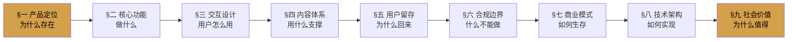

# 洞察 D：Spec 九节叙事弧是产品定义的完整 checklist

**发现**：spec.md 采用的九节结构（产品定位→核心功能→交互→内容→留存→合规→商业→技术→社会价值）形成了一个完整的叙事弧，确保产品定义没有遗漏关键维度。

## 九节设计逻辑（从内向外）

## 关键设计原则

1. **内核三节（§一-§三）**：定义产品本质——定位、功能、体验
2. **支撑两节（§四-§五）**：定义产品粘性——内容、留存
3. **边界两节（§六-§七）**：定义产品生存——合规、商业
4. **实现两节（§八-§九）**：定义产品落地——技术、意义

## 为什么比"功能列表"有效

九节结构强制产品设计者回答九个独立问题，避免"只定义功能不思考留存/合规/商业"的常见陷阱。竹简悟道单日产出完整 spec 证明这个结构是可快速填充的。

## 可迁移性

**极高**。尤其适合AI应用、文化产品、工具类产品。交易类/电商类可将§四替换为"交易体系"，§五替换为"增长模型"。

---
*所属报告：[竹简悟道 Specs 文档体系深度分析复盘](../../../../README.md)*
