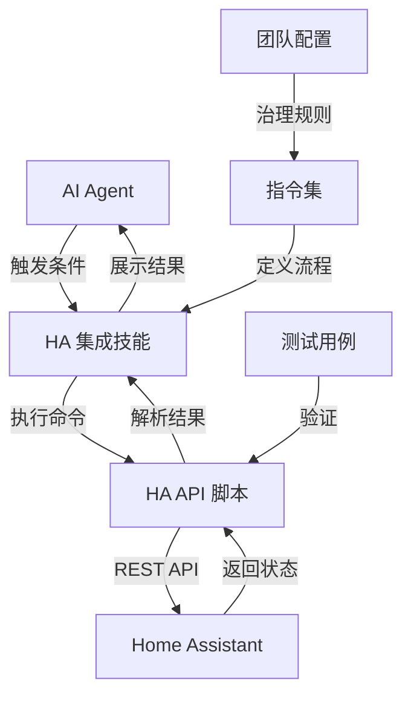
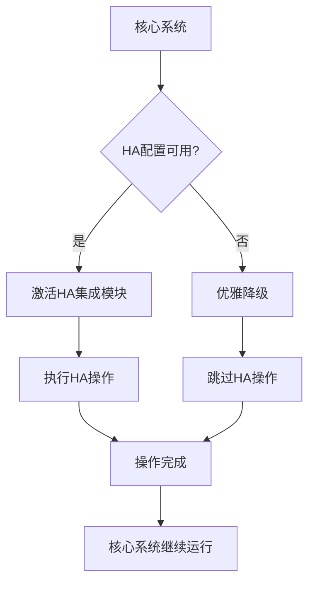

# Home Assistant 智能家居系统集成模块复盘报告

> **报告状态**：✅ **已完成**
> **模块位置**：`.agents/skills/home-assistant/`、`.agents/commands/home-assistant.md`、`.agents/teams/home-assistant-team.md`、`.agents/scripts/ha_api.py`
> **生成日期**：2026-06-30

---

## 第一章：项目概述

### 1.1 项目定位

本项目在 `.agents/` 目录下开发与 Home Assistant 智能家居系统集成的技能模块、自动化指令和团队协作配置，实现设备控制、状态查询等核心功能的标准化操作。

### 1.2 核心特点

| 特性 | 说明 |
|------|------|
| **可选模块设计** | 与核心系统完全解耦，不引入硬依赖 |
| **优雅降级机制** | HA 连接不可用时提供友好提示，不影响核心系统 |
| **条件加载** | 仅在配置了 HA 连接参数时激活 |
| **安全机制** | 所有写操作支持 dry-run 预览 |
| **配置化参数** | 支持 .env 文件和环境变量配置 |

### 1.3 项目目标

- 创建 Home Assistant 集成技能（SKILL.md）
- 开发 HA API 自动化脚本
- 定义 HA 集成指令集（command）
- 构建团队协作配置文件
- 提供清晰的使用文档和测试用例

---

## 第二章：技术架构

### 2.1 系统架构



### 2.2 核心组件

| 组件 | 位置 | 说明 |
|------|------|------|
| **SKILL.md** | `.agents/skills/home-assistant/SKILL.md` | HA 集成技能定义，包含触发词、决策树、操作步骤 |
| **ha_api.py** | `.agents/scripts/ha_api.py` | HA API 自动化脚本，支持 REST API 调用 |
| **home-assistant.md** | `.agents/commands/home-assistant.md` | HA 集成指令集，定义执行流程和 RACI 矩阵 |
| **home-assistant-team.md** | `.agents/teams/home-assistant-team.md` | HA 集成治理团队配置 |
| **test_ha_api.py** | `.agents/scripts/tests/test_ha_api.py` | 测试用例（10 个测试全部通过） |

### 2.3 ha_api.py 架构优化

脚本使用 `dataclass` 和 `pathlib` 进行优化：

| 数据类 | 说明 |
|--------|------|
| `HAConfig` | 配置类，含 `is_configured()` 方法 |
| `EntityState` | 实体状态类，含 `from_api_response()` 工厂方法 |
| `HARequest` | 请求数据类 |
| `HAResponse` | 响应数据类，含 `is_success`、`is_network_error` 属性 |

### 2.4 可选模块设计原则



---

## 第三章：功能特性

### 3.1 技能功能

| 功能 | 触发词 | 说明 |
|------|--------|------|
| **设备状态查询** | "查询状态"、"设备状态" | 获取指定实体的当前状态 |
| **设备控制** | "控制设备"、"打开灯光" | 控制设备状态（开关、亮度、温度等） |
| **服务调用** | "调用服务"、"HA服务" | 调用 HA 服务（如 `light.turn_on`） |
| **实体列表** | "实体列表"、"设备列表" | 获取所有已注册实体列表 |
| **HA状态** | "HA状态"、"连接状态" | 检查 HA 连接状态和版本信息 |

### 3.2 脚本命令

| 命令 | 说明 | 示例 |
|------|------|------|
| `info` | 检查 HA 连接状态和版本信息 | `python ha_api.py info` |
| `list` | 获取所有实体列表 | `python ha_api.py list` |
| `get` | 查询指定实体状态 | `python ha_api.py get light.living_room` |
| `set` | 设置实体状态 | `python ha_api.py set light.living_room --value true` |
| `service` | 调用 HA 服务 | `python ha_api.py service light.turn_on --entity-id light.living_room` |

### 3.3 安全检查清单

- [ ] HA 连接参数已配置
- [ ] 写操作已 dry-run 预览
- [ ] 实体ID已确认正确
- [ ] 操作内容已向用户展示并获得明确确认
- [ ] 敏感信息未硬编码到代码中
- [ ] 操作完成后验证了结果
- [ ] HA 连接不可用时已优雅降级

---

## 第四章：执行复盘

### 4.1 执行阶段

| 阶段 | 任务 | 状态 |
|------|------|------|
| **阶段1** | 创建 HA 集成技能目录和 SKILL.md | ✅ 完成 |
| **阶段2** | 开发 HA API 自动化脚本 | ✅ 完成 |
| **阶段3** | 创建 HA 集成指令集文档 | ✅ 完成 |
| **阶段4** | 创建团队协作配置 | ✅ 完成 |
| **阶段5** | 编写使用文档和测试用例 | ✅ 完成 |
| **阶段6** | 验证和提交 | ✅ 完成 |

### 4.2 执行统计表

| 指标 | 数值 |
|------|------|
| **总耗时** | ~60 分钟 |
| **任务数** | 6 项 |
| **测试用例数** | 10 个 |
| **测试通过率** | 100% |
| **新增文件数** | 6 个 |

### 4.3 关键决策

| 决策 | 背景 | 影响 |
|------|------|------|
| 采用 dataclass 和 pathlib | 提升代码质量和可维护性 | 脚本更优雅，类型安全 |
| 实现优雅降级机制 | 确保可选模块不影响核心系统 | HA 不可用时核心系统正常运行 |
| 所有写操作支持 dry-run | 防止误操作 | 提升安全性 |
| 配置化参数设计 | 避免硬编码敏感信息 | 灵活配置，安全可靠 |

---

## 第五章：模式萃取

### 5.1 可复用模式清单

| 模式 | 描述 | 应用场景 |
|------|------|---------|
| **可选模块设计模式** | 通过条件加载和优雅降级实现模块解耦 | 插件式架构、可选功能模块 |
| **dataclass 数据抽象** | 使用 dataclass 替代普通类，提升代码可读性 | Python 项目数据结构定义 |
| **配置化参数模式** | 通过环境变量和 .env 文件管理配置 | 敏感信息管理、多环境配置 |
| **dry-run 安全机制** | 写操作前先预览，获得确认后再执行 | 破坏性操作、安全关键操作 |

---

## 第六章：关联报告

### 6.1 演进链关系

```
[Home Assistant Tuya 集成分析] → [HA 集成模块开发]
    (代码学习)                    (实践应用)
```

### 6.2 相关资源

| 资源 | 链接 |
|------|------|
| HA 集成技能 | [SKILL.md](../../../../../../.agents/skills/home-assistant/SKILL.md) |
| HA API 脚本 | [ha_api.py](../../../../../../.agents/scripts/ha_api.py) |
| HA 集成指令集 | [home-assistant.md](../../../../../../.agents/commands/home-assistant.md) |
| HA 集成团队配置 | [home-assistant-team.md](../../../../../../.agents/teams/home-assistant-team.md) |
| Tuya 集成分析报告 | [retrospective-home-assistant-tuya-official-20260630](../retrospective-home-assistant-tuya-official-20260630/) |
| 洞察行动项Backlog | [insight-action-backlog.md](insight-action-backlog.md) |