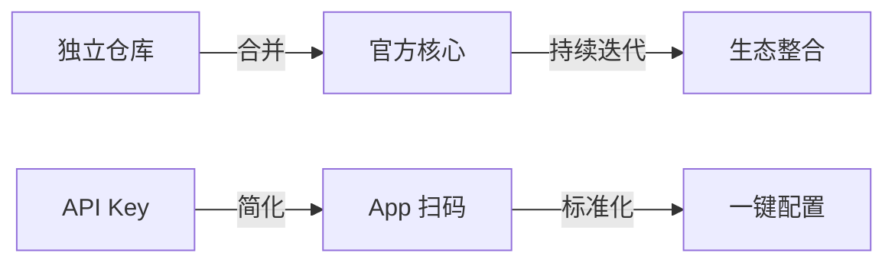

# Home Assistant 官方 Tuya 集成洞察萃取

> **洞察萃取核心产出**：从 HA 官方 Tuya 集成实践中提炼出 3 个核心模式和 8 个知识点，为 IoT 集成开发和 Home Assistant 生态研究提供参考。

---

## 第一章：核心模式萃取

### 模式 1：官方集成标准化模式

**模式名称**：官方集成标准化模式

**核心理念**：
> 通过将第三方集成合并到官方核心仓库，实现统一的版本管理、测试流程和用户支持。

**适用场景**：
- 成熟的第三方集成纳入官方体系
- 开源项目的社区维护转官方维护
- 降低用户选择成本

**实现要素**：
- 统一的代码审查流程
- 与核心版本同步发布
- 官方文档和论坛支持
- 标准化的问题反馈渠道

**效果验证**：
- 用户获得一致的体验
- 集成获得长期维护保障
- 安全性得到官方背书

---

### 模式 2：渐进式设备支持模式

**模式名称**：渐进式设备支持模式

**核心理念**：
> 通过设备处理程序（device handlers）和诊断功能，实现对新设备的渐进式支持，减少核心代码变更。

**适用场景**：
- 大量设备类型的 IoT 平台
- 快速迭代的设备功能
- 社区贡献新设备支持

**实现要素**：
- 核心 SDK 提供基础功能
- 外部 handlers 提供设备特定功能
- 诊断 JSON 暴露可用功能
- 社区驱动的设备支持扩展

**效果验证**：
- 核心代码稳定
- 新设备支持快速上线
- 用户可自助诊断问题

---

### 模式 3：简化用户体验模式

**模式名称**：简化用户体验模式

**核心理念**：
> 通过 App 扫码授权和自动设备同步，将复杂的技术配置转化为用户熟悉的操作流程。

**适用场景**：
- IoT 设备配网
- 第三方服务授权
- 非技术用户引导

**关键步骤**：
1. 用户码输入
2. 二维码生成
3. App 扫码授权
4. 自动设备同步

**效果验证**：
- 配置步骤从 5+ 步减少到 2 步
- 用户无需理解 API 概念
- 降低技术支持需求

---

## 第二章：知识点提炼

### 第一节：技术知识

#### 知识点 1：tuya-device-sharing-sdk

**核心思想**：设备共享 SDK 提供了一种简化的设备访问机制，允许第三方应用通过授权访问用户设备。

**关键组件**：
- `Device API`：设备控制接口
- `Scene API`：场景管理接口
- `Auth`：Token 管理

**适用场景**：Tuya 设备集成开发

---

#### 知识点 2：tuya-device-handlers

**核心思想**：设备处理程序提供设备特定的功能实现，通过 product_id 匹配设备。

**关键机制**：
```python
# 设备匹配流程
device.product_id → handler lookup → device-specific implementation
```

**适用场景**：宠物喂食器等特殊设备的支持

---

#### 知识点 3：诊断 JSON 结构

**核心思想**：通过标准化的诊断 JSON，暴露设备支持的完整功能信息，便于用户和开发者排查问题。

**JSON 关键字段**：
```json
{
  "status": {...},        // 当前状态
  "status_range": {...},  // 支持的状态范围
  "function": {...}       // 支持的功能
}
```

**适用场景**：设备功能查询、问题诊断

---

#### 知识点 4：My button 自动配置

**核心思想**：通过 My Home Assistant 按钮，实现一键跳转到配置页面，降低用户操作成本。

**实现方式**：
```markdown
[](https://my.home-assistant.io/redirect/config_flow_start?domain=tuya)
```

**适用场景**：简化用户配置入口

---

#### 知识点 5：DeviceWrapper 模式

**核心思想**：通过 DeviceWrapper 将 Tuya DP Code 抽象为统一的数据访问接口，实现类型安全的数据读写。

**实现机制**：
```python
# 读取状态
wrapper.read_device_status(device)

# 发送更新命令
wrapper.get_update_commands(device, value)
```

**常见 Wrapper 类型**：
| Wrapper 类型 | 用途 | 示例 |
|-------------|------|------|
| `BooleanWrapper` | 布尔值读写 | 开关状态 |
| `IntegerWrapper` | 整数值读写 | 亮度、温度 |
| `EnumWrapper` | 枚举值读写 | 工作模式 |
| `ElectricityCurrentWrapper` | 电流数据解析 | JSON 格式的电流数据 |
| `ColorDataWrapper` | 颜色数据处理 | HSV 颜色值 |

**适用场景**：设备状态读取和控制命令发送

**模式萃取**：[pattern-1-device-wrapper.md](patterns/pattern-1-device-wrapper.md)

---

#### 知识点 6：事件驱动状态更新

**核心思想**：采用事件驱动架构，通过 MQTT 推送实现设备状态的实时同步，避免轮询带来的性能问题。

**实现流程**：
```python
# coordinator.py
def update_device(self, device, updated_status_properties, dp_timestamps):
    dispatcher_send(self.hass, f"{TUYA_HA_SIGNAL_UPDATE_ENTITY}_{device.id}", 
                    updated_status_properties, dp_timestamps)

# entity.py
async def async_added_to_hass(self):
    self.async_on_remove(
        async_dispatcher_connect(
            self.hass,
            f"{TUYA_HA_SIGNAL_UPDATE_ENTITY}_{self.device.id}",
            self._handle_state_update,
        )
    )
```

**适用场景**：实时设备状态同步

**模式萃取**：[pattern-2-event-driven-state-update.md](patterns/pattern-2-event-driven-state-update.md)

---

#### 知识点 7：设备分类到平台的映射

**核心思想**：通过设备分类（DeviceCategory）映射到 Home Assistant 平台，实现设备的自动发现和实体创建。

**实现机制**：
```python
# light.py
LIGHTS: dict[DeviceCategory, tuple[TuyaLightEntityDescription, ...]] = {
    DeviceCategory.DJ: (
        TuyaLightEntityDescription(
            key=DPCode.SWITCH_LED,
            color_mode=DPCode.WORK_MODE,
            brightness=DPCode.BRIGHT_VALUE,
            # ...
        ),
    ),
    # ...
}

# 发现流程
if descriptions := LIGHTS.get(device.category):
    entities.extend(TuyaLightEntity(device, manager, description, definition) 
                   for description in descriptions)
```

**适用场景**：大规模设备类型支持

**模式萃取**：[pattern-3-device-category-mapping.md](patterns/pattern-3-device-category-mapping.md)

---

#### 知识点 8：Quirks 扩展机制

**核心思想**：通过 Quirks 机制允许用户或开发者为特定设备提供自定义处理逻辑，而无需修改核心代码。

**实现流程**：
```python
# 加载自定义 quirks
register_tuya_quirks(str(Path(hass.config.config_dir, "tuya_quirks")))

# 初始化设备 quirk
TUYA_QUIRKS_REGISTRY.initialise_device_quirk(device)

# 获取 quirk 信息
if quirk := TUYA_QUIRKS_REGISTRY.get_quirk_for_device(device):
    manufacturer = quirk.manufacturer
    model = quirk.model
```

**适用场景**：非标准设备支持、设备功能覆盖

**模式萃取**：[pattern-4-quirks-extension.md](patterns/pattern-4-quirks-extension.md)

---

## 第三章：演进链洞察

### 3.1 演进模式总结

**演进阶段**：



**演进规律**：
1. **配置简化**：从复杂 API Key 到 App 扫码
2. **维护集中**：从独立仓库到官方核心
3. **支持增强**：从社区论坛到官方支持

### 3.2 设计模式继承链

| 模式 | Tuya Integration | Smart Life | HA Core Tuya |
|------|-----------------|------------|---------------|
| 二维码授权 | ❌ | ✅ | ✅ |
| 设备处理程序 | ❌ | ❌ | ✅ |
| 诊断 JSON | ❌ | ❌ | ✅ |
| My Button | ❌ | ❌ | ✅ |

---

## 第四章：方法论总结

### 4.1 第三方集成演进方法论

**核心理念**：成熟的第三方集成应考虑合并到官方核心，以获得长期维护和用户信任。

**决策框架**：
1. 评估集成的用户规模和活跃度
2. 分析集成与官方生态的契合度
3. 制定合并后的维护策略
4. 确保平滑过渡用户体验

---

### 4.2 设备支持扩展方法论

**核心理念**：通过核心加外部处理程序的架构，实现设备支持的灵活扩展。

**步骤**：
1. 核心 SDK 提供通用功能
2. 外部 handlers 提供特定功能
3. 诊断功能暴露完整能力
4. 社区贡献扩展设备覆盖

---

### 4.3 用户体验优化方法论

**核心理念**：通过渐进式简化和自动化，降低用户操作成本。

**关键策略**：
1. 识别用户配置痛点
2. 设计简化流程
3. 提供可视化引导
4. 自动化后续操作
