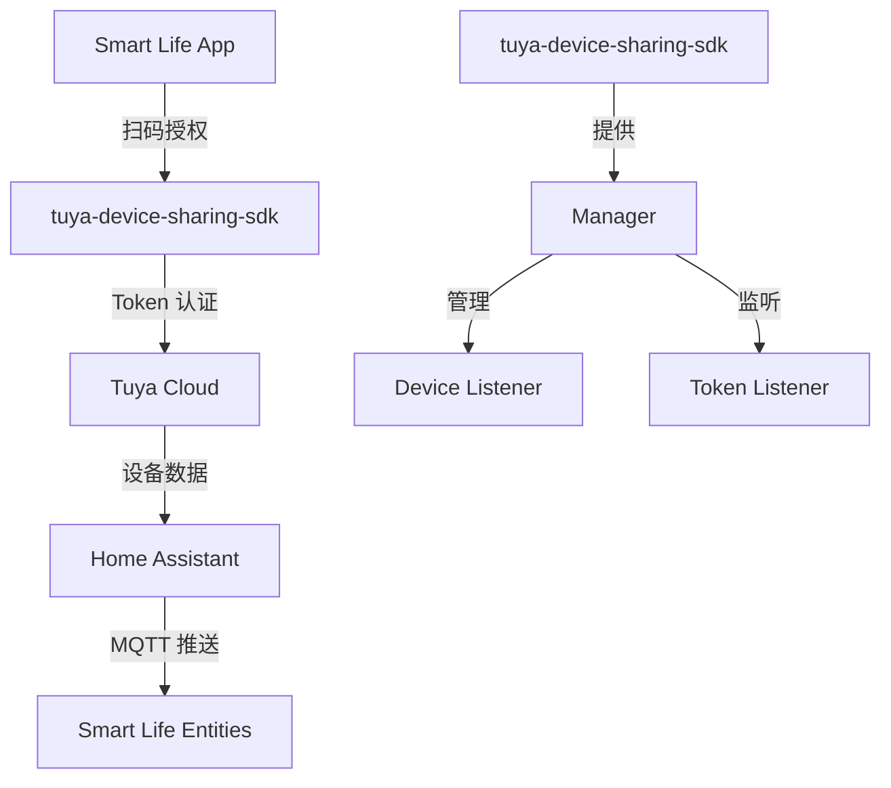
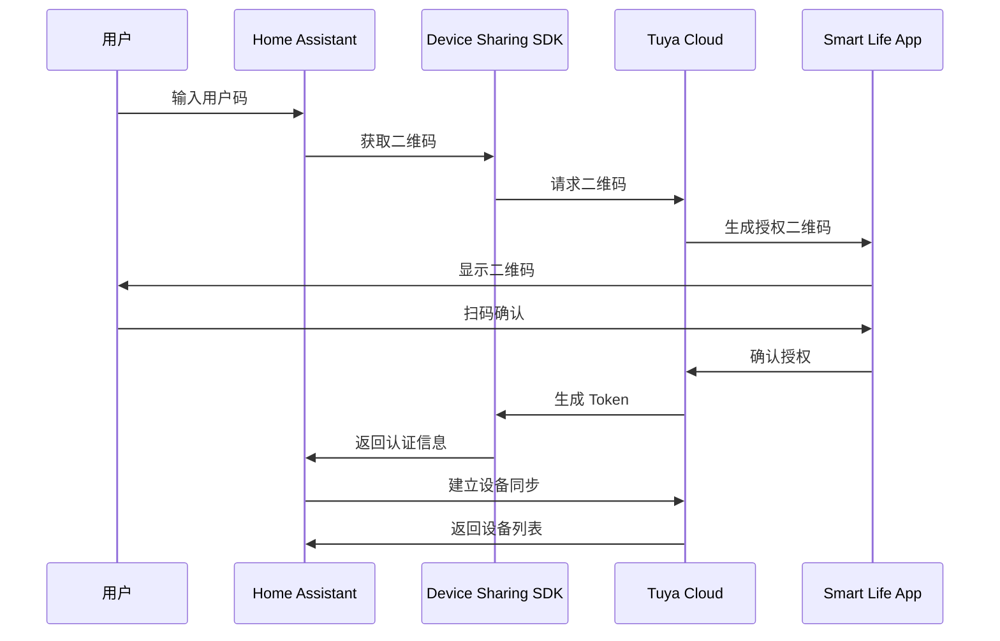
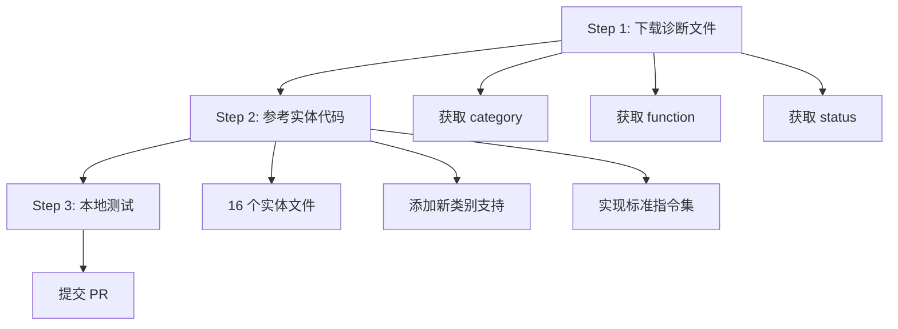

# Smart Life Home Assistant 集成项目学习

> **项目名称**：Smart Life (Beta) Home Assistant Integration
> **学习日期**：2026-06-30
> **项目仓库**：https://github.com/tuya/tuya-smart-life
> **项目状态**：⚠️ **已废弃**（已合并到 Home Assistant 官方核心仓库）

---

## 第一章：项目概述

### 1.1 项目定位

Smart Life (Beta) 是由 Tuya 官方团队开发的 Home Assistant 集成插件，用于控制 **Powered by Tuya (PBT)** 设备。与 Tuya Integration 不同，Smart Life 集成为用户提供了一种更简化的设备连接方式，无需在 Tuya IoT 平台注册云项目。

### 1.2 核心价值主张

| 特性 | Tuya Integration | Smart Life Integration |
|------|-----------------|----------------------|
| 云服务依赖 | 依赖 Tuya IoT Core Service 订阅 | 无需订阅 |
| 配置复杂度 | 需要创建云项目、获取密钥 | App 扫码登录即可 |
| 用户体验 | 需要手动续期订阅 | 无缝同步设备 |
| SDK | tuya-iot-python-sdk | tuya-device-sharing-sdk |

### 1.3 项目状态与演进

> **⚠️ 项目已废弃**：本项目已正式合并到 Home Assistant 官方核心仓库（对应版本 2024.2），不再继续迭代。后续的迭代和支持将在 Home Assistant 官方项目下进行。

**演进路径**：
1. **Smart Life (Beta)** → 合并到 **Home Assistant Core 2024.2+**
2. 新功能开发和 Bug 修复直接在 Home Assistant 核心仓库进行
3. 问题反馈请在 https://github.com/home-assistant/core/issues 提交

**当前推荐方案**：
- 使用 Home Assistant 官方集成：`homeassistant.components.tuya`（原 Smart Life 代码已合并）
- 官方文档：https://www.home-assistant.io/integrations/tuya/

---

## 第二章：技术架构

### 2.1 系统架构



### 2.2 核心组件

| 组件 | 文件 | 职责 |
|------|------|------|
| 入口 | `__init__.py` | 配置加载、设备管理、生命周期 |
| 配置流程 | `config_flow.py` | 二维码登录、Token 管理 |
| 常量定义 | `const.py` | DPCode、DPType、HA Platform |
| 基类 | `base.py` | 实体基类、类型数据抽象 |
| 工具函数 | `util.py` | 值映射、类型转换 |

### 2.3 平台支持

Smart Life 支持 **16 个 Home Assistant 平台**，覆盖各种设备类型：

| 平台 | 说明 | 设备类型示例 |
|------|------|-------------|
| `alarm_control_panel` | 报警控制面板 | 安防系统 |
| `binary_sensor` | 二进制传感器 | 门窗传感器、PIR |
| `button` | 按钮实体 | 智能按钮 |
| `camera` | 摄像头 | 智能摄像机 |
| `climate` | 暖通空调 | 空调、恒温器 |
| `cover` | 覆盖设备 | 窗帘、车库门 |
| `fan` | 风扇 | 风扇、空气净化器 |
| `humidifier` | 加湿器 | 除湿机、加湿器 |
| `light` | 灯光 | 灯具、灯带 |
| `number` | 数字输入 | 温度设置、亮度调节 |
| `scene` | 场景 | 智能场景 |
| `select` | 选择实体 | 模式选择 |
| `sensor` | 传感器 | 温湿度、功耗 |
| `siren` | 报警器 | 声光报警 |
| `switch` | 开关 | 插座、开关 |
| `vacuum` | 扫地机器人 | 扫地机 |

---

## 第三章：配置流程

### 3.1 二维码登录流程

Smart Life 采用简化的二维码授权方式：



### 3.2 关键配置项

```python
# config_flow.py
CONF_CLIENT_ID = "HA_3y9q4ak7g4ephrvke"  # Home Assistant 客户端ID
CONF_SCHEMA = "haauthorize"  # 授权 schema
```

```json
// manifest.json
{
  "domain": "smartlife",
  "name": "smartlife",
  "config_flow": true,
  "iot_class": "cloud_push",
  "requirements": ["tuya-device-sharing-sdk==0.2.0"]
}
```

---

## 第四章：设备支持

### 4.1 设备分类矩阵

Smart Life 支持 **7 大类、50+ 小类** 设备：

| 大类 | 小类数量 | 代表设备 |
|------|---------|---------|
| 大型家电 | 9 | 空调、取暖器、扫地机 |
| 电工类 | 9 | 开关、插座、排插 |
| 安防传感 | 17 | 温湿度、门窗、烟雾 |
| 照明 | 13 | 灯具、灯带、吸顶灯 |
| 厨房电器 | 2 | 智能电茶壶、咖啡机 |
| 小家电 | 5 | 风扇、除湿机 |

### 4.2 设备分类代码

每个设备类别有唯一的 category code：

- `kt` - 空调 (Climate, Switch, Light)
- `dj` - 灯具 (Light, Switch)
- `kg` - 开关 (Sensor, Switch, Light, Select)
- `cz` - 插座 (Sensor, Switch)
- `wsdcg` - 温湿度传感器 (Binary Sensor, Sensor)
- `sp` - 云台相机 (Camera, Siren, Switch, Light...)

---

## 第五章：驱动开发流程

### 5.1 三步开发流程

Smart Life 提供清晰的三步驱动开发流程：



### 5.2 开发示例

添加数字显示功能的示例：

```python
# sensor.py
# 在 SENSORS 字典中添加 dlq 类别
SENSORS: dict[str, SensorEntityDescription] = {
    "dlq": SensorEntityDescription(
        key="cur_current",
        name="Current",
        device_class=SensorDeviceClass.CURRENT,
        state_class=SensorStateClass.MEASUREMENT,
    ),
}
```

---

## 第六章：与 Tuya Integration 对比

### 6.1 架构差异

| 维度 | Tuya Integration | Smart Life Integration |
|------|-----------------|----------------------|
| SDK | tuya-iot-python-sdk | tuya-device-sharing-sdk |
| 认证方式 | API Key/Secret | App 扫码授权 |
| 云服务依赖 | IoT Core Service | 无 |
| 配置流程 | 5 步（创建项目→获取密钥→授权→绑定设备→HA配置） | 2 步（App扫码→HA确认） |
| 设备绑定 | 需要扫码关联 | 自动同步 App 设备 |

### 6.2 代码结构对比

**Tuya Integration** (`tuya-home-assistant`)：
```
custom_components/tuya/
├── __init__.py
├── config_flow.py
├── const.py
├── base.py
├── climate.py
├── cover.py
├── fan.py
├── light.py
├── sensor.py
├── switch.py
└── ...
```

**Smart Life Integration** (`tuya-smart-life`)：
```
custom_components/smartlife/
├── __init__.py
├── config_flow.py
├── const.py
├── base.py
├── alarm_control_panel.py
├── binary_sensor.py
├── button.py
├── camera.py
├── climate.py
├── cover.py
├── fan.py
├── humidifier.py
├── light.py
├── number.py
├── scene.py
├── select.py
├── sensor.py
├── siren.py
├── switch.py
├── vacuum.py
└── ...
```

### 6.3 实体类型扩展

Smart Life 比 Tuya Integration 多支持以下实体类型：

| 实体类型 | 说明 |
|---------|------|
| `alarm_control_panel` | 报警控制面板 |
| `button` | 按钮实体 |
| `camera` | 摄像头（增强） |
| `humidifier` | 加湿器 |
| `number` | 数字输入 |
| `scene` | 场景 |
| `select` | 选择实体 |
| `siren` | 报警器 |
| `vacuum` | 扫地机器人 |

---

## 第七章：交付物清单

### 7.1 文档

| 文档 | 说明 |
|------|------|
| `README.md` | 项目说明（中英双语） |
| `docs/supported_devices.md` | 支持的设备类别列表 |
| `docs/supported_devices_cn.md` | 支持的设备类别列表（中文） |

### 7.2 代码

| 文件 | 说明 |
|------|------|
| `custom_components/smartlife/` | 16 个实体类型实现 |
| `translations/` | 多语言翻译文件 |
| `.github/` | PR/Issue 模板 |

### 7.3 外部资源

| 资源 | 说明 |
|------|------|
| [tuya-device-sharing-sdk](https://github.com/tuya/tuya-device-sharing-sdk) | 设备共享 SDK |
| [Home Assistant 官方集成](https://www.home-assistant.io/integrations/smartlife) | HA 官方文档 |

---

## 第八章：总结

### 8.1 核心发现

1. **用户体验优先**：Smart Life 通过 App 扫码授权简化了配置流程，降低了用户门槛
2. **开源可控**：代码完全开源，社区可参与贡献
3. **官方认可**：已合并到 Home Assistant 官方核心仓库
4. **设备覆盖广**：支持 50+ 设备类别，16 种实体类型

### 8.2 可复用模式

1. **二维码授权模式**：简化用户配置流程
2. **实体基类设计**：统一的实体基类 `SmartLifeEntity`
3. **类型数据抽象**：`IntegerTypeData`、`EnumTypeData`、`ElectricityTypeData`
4. **DPCode 枚举管理**：集中管理设备功能码

### 8.3 技术亮点

1. **Cloud Push 模式**：实时设备状态更新
2. **值映射工具**：支持 Integer 类型的缩放、范围映射
3. **设备迁移支持**：支持从旧版 unique_id 迁移
4. **DHCP 发现**：支持设备自动发现

---

## 第九章：关联报告与演进链

### 9.1 演进链关系

**完整演进链**：
```
[Tuya Integration 报告](../retrospective-tuya-home-assistant-learning-20260630/)（第一阶段，已废弃）
    → 本报告（Smart Life，第二阶段，已废弃）
    → [HA 官方 Tuya 集成](../retrospective-home-assistant-tuya-official-20260630/)（当前官方方案）
```

### 9.2 关联报告

| 报告 | 分类 | 关联点 |
|------|------|--------|
| `retrospective-tuya-home-assistant-learning-20260630/` | insight-extraction | ⚠️ 演进链前一阶段（Tuya Integration 已废弃） |
| `retrospective-home-assistant-tuya-official-20260630/` | insight-extraction | ✅ 演进链下一阶段（当前官方方案） |
| `retrospective-tuyaopen-analysis-20260630/` | insight-extraction | Tuya 开源 SDK 分析方法论参考 |
