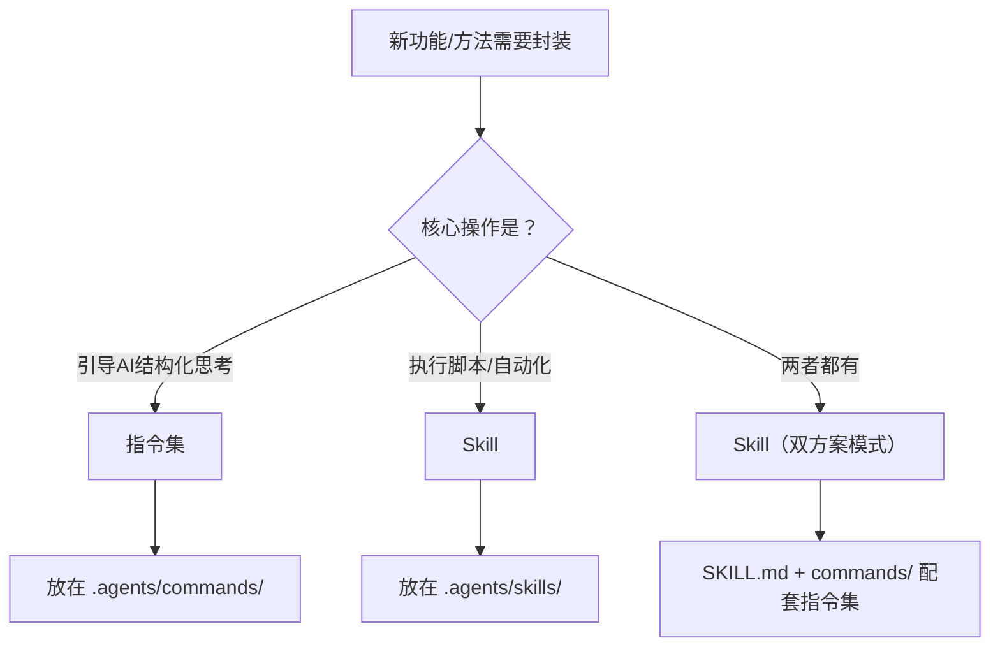

# 洞察4：指令集与Skill的边界判断存在通用模式

**发现**：本次任务中"指令集vs Skill"的选择是核心决策之一。判断标准可提炼为：认知方法（思维引导）→指令集；自动化工具（脚本驱动）→Skill。这一判断公式避免了"因为重要所以需要Skill"的常见误判。

## 核心命题

> **指令集与Skill的边界判断应基于"核心操作类型"而非"是否重要"。** 认知方法类场景（如对抗性审查、第一性原理分析）需要结构化引导而非脚本执行，指令集是更合适的抽象层次。

## 判断公式

```
如果核心操作是"引导AI进行结构化思考" → 指令集（.agents/commands/）
如果核心操作是"执行Python脚本/自动化流程" → Skill（.agents/skills/）
如果两者都有（如forum-posting既有脚本又有决策树）→ Skill（双方案模式）
```

## 边界判断矩阵

| 特征 | 指令集 | Skill |
|------|--------|-------|
| 核心操作 | 引导AI进行结构化思考 | 执行脚本/自动化流程 |
| 执行方式 | 纯文本指令，AI按步骤推理 | 调用Python/Shell脚本 |
| 典型场景 | 对抗性审查、第一性原理分析、复盘、洞察 | forum-posting、link-check、ci-check |
| 是否需要脚本 | 否 | 通常需要 |
| 抽象层次 | 认知方法层 | 工具执行层 |
| 可独立使用 | 是（AI可直接按指令执行） | 是（但通常需要脚本支撑） |

## 常见误判与纠正

| 误判 | 为什么错 | 正确判断 |
|------|---------|---------|
| "对抗性审查很重要，应该做成Skill" | 重要性≠需要脚本。认知方法不需要脚本执行 | 指令集（结构化引导即可） |
| "第一性原理分析很简单，不需要独立指令集" | 简单≠不需要结构化。认知方法需要防止直觉跳跃 | 指令集（防止跳过关键步骤） |
| "forum-posting有决策树，应该做成指令集" | 有决策树但核心操作是脚本驱动（浏览器自动化） | Skill（双方案模式：脚本+决策树） |

## 判断流程



## 已验证案例

| 案例 | 判断 | 验证结果 |
|------|------|---------|
| 对抗性审查 | 指令集 | 283行指令集，无需脚本，AI可直接按步骤执行 |
| 第一性原理分析 | 指令集 | 6步分析流程，纯推理，无需脚本 |
| forum-posting | Skill | 双方案模式：Playwright脚本 + 决策树 |
| link-check | Skill | Python脚本驱动，自动化检测 |
| insight-cmd | Skill | Skill门面 + 指令集L2文档 |

## 可迁移性

**高**。此判断公式适用于所有需要决定"指令集vs Skill"的场景。建议在 Skill 创建流程中增加"指令集vs Skill边界判断"检查项，防止分类错误导致的抽象层次不匹配。

## 模式沉淀状态

🔄 **原则内化**：此洞察的判断公式已作为"指令集vs Skill"边界判断的通用准则，可在 Skill 开发规范中引用。当前尚未独立沉淀为模式文件，但判断逻辑在本次复盘中已完整记录和验证。

---
*所属报告：[对抗性审查指令集创建任务复盘](../../../../task-reports/retrospective-adversarial-review-cmd-20260710/)*