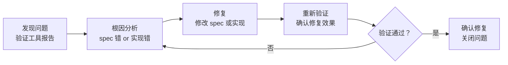
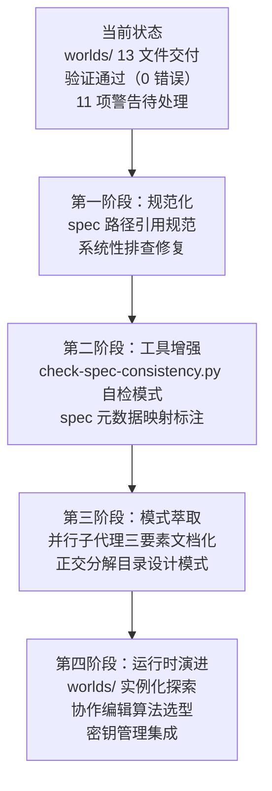

# 四、导出环节（萃取）

## 4.1 改进建议

### 4.1.1 针对存在问题的改进措施

| 问题 | 改进措施 | 优先级 | 预期效果 | 状态 |
|------|---------|--------|---------|------|
| Spec 路径引用层级陷阱 | 建立 spec 路径引用规范，要求使用项目根路径前缀 | 高 | 消除系统性路径错误 | 待规划 |
| 交叉引用前缀缺失 | 在 spec 编写规范中明确"引用 .agents/ 下文件必须带 .agents/ 前缀" | 高 | 消除前缀缺失错误 | 待规划 |
| spec 一致性警告 | 为 spec.md 的需求→任务、场景→检查点映射建立显式标注 | 中 | 消除 11 项警告 | 待规划 |
| 验证工具 spec 自检 | check-spec-consistency.py 增加 spec 自检模式 | 中 | 主动发现 spec 路径错误 | 待规划 |
| 并行子代理模式标准化 | 将"三要素"检查清单文档化 | 低 | 降低并行执行的风险评估成本 | 待规划 |

### 4.1.2 流程优化建议

1. **需求阶段引入"需求冻结"节点**：在进入规格设计前，明确需求冻结标准（如：用户签字确认、需求覆盖检查通过），避免实施阶段的需求变更。
2. **规格设计阶段引入 peer review 机制**：`spec.md`、`tasks.md`、`checklist.md` 在进入实施前应由架构师或审查者进行 peer review，确保三者之间的一致性。
3. **实施阶段记录操作日志**：对涉及文件系统操作的任务，应记录操作日志（命令、参数、结果），便于复盘与经验沉淀。

### 4.1.3 工具链完善建议

1. **开发** **`.agents/`** **脚手架工具**：支持一键初始化 `.agents/` 目录骨架，自动生成角色、提示词、协议、工作流、模板的默认文件。
2. **开发文档健康检查工具**：自动检查 `.agents/` 目录下的文件完整性、交叉引用有效性、Mermaid 流程图可渲染性。
3. **开发平台兼容性检测脚本**：在项目初始化时自动检测当前操作系统，提示可能遇到的平台差异问题及建议的解决方案。

## 4.2 可复用模式萃取

#### 模式 1：Spec 路径引用规范

**模式名称**：项目根路径前缀引用规范

**问题场景**：spec 文档位于深层嵌套目录（如 `.trae/specs/<change-id>/`），相对路径引用容易因层级计算错误而产生断链。

**解决方案**：spec 文档中的所有路径引用统一使用"项目根路径前缀"（如 `.agents/worlds/README.md`、`docs/retrospective/reports/`），由验证工具的 resolve_path 函数按项目根目录解析。

**适用条件**：
- 文档位于深层嵌套目录
- 需要引用项目根目录下的文件
- 已有验证工具支持项目根路径前缀解析

**收益**：消除相对路径的层级计算错误，路径引用更直观可读。

#### 模式 2：验证驱动的修复闭环

**模式名称**：发现-修复-重验-确认四步闭环

**问题场景**：文档交付后存在路径错误、引用断裂、一致性偏差等质量问题，难以通过人工检查发现。

**解决方案**：

**适用条件**：
- 有自动化验证工具（check-links.py、check-spec-consistency.py）
- 验证结果可量化（错误数、警告数）
- 修复后可重新验证

**收益**：确保每个问题都经过"修复-验证"闭环，避免"修复了但没验证"或"验证了但没修复彻底"。

#### 模式 3：正交分解目录设计

**模式名称**：职责正交的子模块拆分

**问题场景**：一个目录需要承载多类职责（如 worlds/ 同时承载"协作"与"环境"），若扁平排列会导致文件难以导航和并行开发困难。

**解决方案**：
1. 识别职责维度（如"协作行为治理" vs "运行时基础设施"）。
2. 按职责维度拆分子模块（collaboration/ + environments/）。
3. 确保子模块间职责正交——无相互引用，各自独立完整。
4. 每个子模块内部再按"一文件一主题"原则拆分。

**适用条件**：
- 目录承载多类职责
- 职责间可明确划分边界
- 需要支持并行开发

**收益**：降低模块间耦合，支持并行开发，提高可维护性。

## 4.3 行动计划

| 优先级 | 改进项 | 具体措施 | 建议时间 | 状态 |
|--------|--------|---------|---------|------|
| 高 | Spec 路径引用规范 | 编写 `docs/development-standards.md` 的 spec 编写规范章节，明确"使用项目根路径前缀" | 2026-06-30 | 待规划 |
| 高 | 系统性排查 spec 路径错误 | 对所有 `.trae/specs/` 下的 spec 文档运行路径检查，修复层级陷阱与前缀缺失 | 2026-06-30 | 待规划 |
| 中 | check-spec-consistency.py 增强 | 增加 `--self-check` 模式，专门验证 spec 文档自身的路径引用 | 2026-07-07 | 待规划 |
| 中 | spec 元数据映射标注 | 为 spec.md 的需求→任务、场景→检查点建立显式映射标注，消除 11 项警告 | 2026-07-07 | 待规划 |
| 低 | 并行子代理模式文档化 | 将"三要素"检查清单写入 `docs/retrospective/patterns/` | 2026-07-14 | 待规划 |

## 4.4 后续优化方向

**整合方向**：
1. **与 teams 模块的深度整合**：worlds/collaboration/permissions.md 已建立与 teams/permission-system.md 的 L1/L2/L3 衔接，未来可探索"权限策略中心"的统一管理。
2. **与 protocols 模块的运行时整合**：worlds/collaboration/change-tracking.md 的审计日志可与 protocols/handoff.md 的任务交接记录打通，形成"交接→变更→审计"的完整链路。
3. **与 workflows 模块的环境整合**：worlds/environments/multi-environment.md 的 dev/test/prod 切换可与 workflows/feature-development.md 的开发流程整合，实现"流程驱动环境切换"。

---
