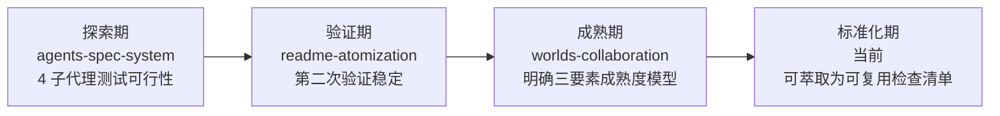
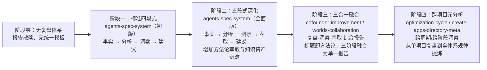

# 二、执行复盘

## 2.1 高频模式分析

### 2.1.1 模式一：Spec-driven 开发流程

**出现频率**：7/16 报告（44%）

**出现位置**：

| 报告 | 关键表述 | 角色定位 |
|------|---------|---------|
| agents-spec-system（初版） | "Spec-driven 开发流程的有效性" | 成功经验——3 轮迭代零返工 |
| agents-spec-system（全面版） | "Spec-driven 开发是零返工的关键" | 核心发现——规格文档充当"人机共识的锚点" |
| create-apps-directory | "Spec 先行，增量修正" | 成功经验——增量追加优于全量重写 |
| refactor-retrospective-docs | "Spec 先行显著降低返工风险" | 成功经验——40 检查点一次性通过 |
| cofounder-role-marker | "Spec 一次批准即执行无返工" | 成功经验——充分上下文加载是前提 |
| check-spec-consistency | 项目本身是复盘→spec→执行的产物 | 需求来源——从复盘洞察转化为可执行方案 |
| worlds-collaboration-environment | "Spec-driven 流程确保了交付完整性" | 成功经验——13 文件交付零遗漏 |

**核心规律**：Spec-driven 开发流程已经成为本项目的**默认执行范式**。它在 7 份报告中不是"可选经验"，而是"必要前提"——凡是跳过 spec 步骤的任务，都在复盘时暴露了遗漏问题。

---

### 2.1.2 模式二：多智能体并行执行

**出现频率**：10/16 报告（63%）——最高频模式

**出现位置**：

| 报告 | 子代理数 | 创建文件数 | 验证结论 |
|------|---------|-----------|---------|
| agents-spec-system（初版） | 4 | 35 | 首次验证——"上下文隔离是核心价值" |
| agents-spec-system（全面版） | 4 | 35 | 深化——"4 倍加速（估算）" |
| readme-atomization | 4 | 10 | 第二次验证——"再次验证有效" |
| create-apps-directory | 4 | 4 | 子代理并行——"零失败" |
| refactor-retrospective-docs | 7 | 18 | 最大并行度——"整体耗时接近单文件耗时" |
| insight-execution | 5 | 5 | "并行执行上限不是数量而是独立性" |
| cofounder-improvement-execution | 4 | 2+8 修改 | "零等待，全部一次通过" |
| teams-module | 批量并行 | 6 | "并行创建提升效率" |
| readme-subagent-extraction | 8 路并行 | 9 | "8 路并行 Write，单轮完成" |
| worlds-collaboration-environment | 2 | 10 | 第三次验证——"已达到成熟稳定" |

**核心规律**：并行子代理模式的发展经历了三个阶段：

模式的成功前提被提炼为"三要素"——**文件独立、风格统一、规格共享**。十次成功应用确认了该模式的可靠性，已具备标准化条件。

---

### 2.1.3 模式三：复盘→洞察→导出知识闭环

**出现频率**：6/16 报告（38%）

**出现位置**：

| 报告 | 闭环形态 | 关键进展 |
|------|---------|---------|
| agents-spec-system（全面版） | 报告内部四段式 | 建立"事实 → 分析 → 洞察 → 建议"结构 |
| optimization-cycle | 复盘→实施零延迟 | "复盘报告不是交付物，而是执行清单" |
| insight-execution | 洞察→执行闭环的自我验证 | "识别问题的人就是解决问题的人" |
| cofounder-improvement-execution | 复盘→执行零延迟第二次验证 | "不是偶然现象，而是 AI 协作固有特性" |
| create-apps-directory-meta | 闭环进化为四阶段执行流 | 复盘→萃取→跟进行动→洞察归档 跨会话执行 |
| worlds-collaboration-environment | 复盘·洞察·萃取综合报告 | 标题已体现三合一融合 |

**核心规律**：闭环从"报告内部结构"进化为"跨会话执行流"，最终进化为"报告标题即方法论"（标题直接使用"复盘·洞察·萃取"）。闭环本身在自我改进——cofounder-improvement-execution 报告正在改进"复盘报告模板"，而改进后的模板又提升了闭环的效率。

---

### 2.1.4 模式四：三层治理模型

**出现频率**：4/16 报告（25%）

**出现位置**：optimization-cycle（首次提出"原子化→自动化→验证"）、insight-execution（实施流程文档化）、fact-statement-correction（引用为未来整合方向）、refactor-retrospective-docs（提出了文档体系的"导航层→分类层→内容层"三层架构变体）。

**核心规律**：三层治理模型有两条并行的演进线——一条是工具的"原子化→自动化→验证"，另一条是文档的"导航层→分类层→内容层"。两条线共享相同的分层思想，但应用于不同领域。

---

### 2.1.5 模式五：约定驱动创建

**出现频率**：3/16 报告（19%）

**出现位置**：teams-module（"先读范例再创作，零决策成本"）、system-planning（"统一结构使增量扩展零成本"）、cofounder-role-marker（"可选字段+默认值，现有文件零修改"）。

**核心规律**：当规范体系成熟度足够高时，"范例即规格"——可以跳过显式 spec 阶段，直接以既有文件为模板创建新文件。这是 spec-driven 模式在体系成熟后的自然演进方向。

---

### 2.1.6 模式六：验证驱动修复闭环

**出现频率**：3/16 报告（19%）

**出现位置**：worlds-collaboration-environment（"发现-修复-重验-确认"四步闭环）、check-spec-consistency（"增量验证+回归验证"双层策略）、fact-statement-correction（"修正一处→搜索同类"模式）。

**核心规律**：验证工具的角色已经从"事后检查"转变为"修复闭环的起点"。验证不通过不再是终止信号，而是新一轮修复的触发信号。

## 2.2 顽固问题分析

### 2.2.1 问题一：关联系统影响被遗漏

**出现频次**：4 份报告

| 报告 | 具体表现 | 根因 | 是否已修复 |
|------|---------|------|:---------:|
| create-apps-directory | 初版 spec 未覆盖 .agents/ 管理需求 | 对需求理解过于字面化，未主动联想到关联系统 | 已修复 |
| fact-statement-correction | 初始修正 README.md:31 后未全局搜索同类表述 | 修正一处后未触发"搜索同类"意识 | 已修复 |
| check-spec-consistency | spec 路径引用层级陷阱，多份 spec 存在相同错误 | 深层嵌套目录的相对路径计算系统性偏差 | 部分修复 |
| worlds-collaboration-environment | 交叉引用前缀缺失，路径被误解析 | spec 编写时未遵循路径前缀规范 | 已修复 |

**深层规律**：关联系统影响遗漏的根因不是"不认真"，而是当前的 spec 设计流程中缺乏"关联系统影响分析"这一检查项。

---

### 2.2.2 问题二：行动项遗留

**出现频次**：5 份报告

在全部 16 份报告中，12 份包含"行动计划"表格。其中：

| 指标 | 数值 |
|------|------|
| 含行动计划的报告数 | 12 |
| 行动项总数（估算） | 约 70 项 |
| 已完成（含"已完成"和"已由后续任务完成"） | 约 45 项 |
| 待规划 | 约 25 项 |

**深层规律**：行动项遗留呈现明显的"优先级过滤"特征——高优先级行动项几乎全部在当期完成，中低优先级行动项则被持续后推。

---

### 2.2.3 问题三：路径引用错误

**出现频次**：3 份报告

| 报告 | 路径错误数 | 类型 |
|------|----------|------|
| readme-atomization | 6 | 拆分后路径层级变化未同步调整 |
| check-spec-consistency | 2 | 路径前缀白名单维护成本 |
| worlds-collaboration-environment | 2+3 | 层级陷阱（../../ → ../../../）+ 前缀缺失 |

**深层规律**：路径引用错误是文档体系扩展时的一种"系统性熵增"——每次文件移动或新增目录层级，都会产生路径不匹配的风险。

---

### 2.2.4 问题四：文档/模板不完善导致的迭代成本

**出现频次**：4 份报告

| 报告 | 表现 |
|------|------|
| agents-spec-system | spec→tasks→checklist 三者一致性维护需人工校验 |
| create-apps-directory | 初版 spec 需一轮反馈修订 |
| readme-atomization | 模板占位符被链接检查器误报（5 个误报） |
| refactor-retrospective-docs | README.md 在新增文件后需手动更新 |

**深层规律**：模板和规范的"不完善"是迭代成本的根源——每轮迭代都在修补上一轮的规范缺陷，而这些修补本身又可能引入新的不一致。

### 2.2.5 顽固问题汇总矩阵

| 问题 | 频次 | 严重度 | 已出现项目中是否有系统化解决 | 根因归类 |
|------|:----:|:-----:|:---------------------------:|---------|
| 关联系统影响遗漏 | 4 | 中 | 无（检查项已识别但未制度化） | 流程缺失 |
| 行动项遗留 | 5 | 低 | 无（依赖人工追踪） | 工具缺失 |
| 路径引用错误 | 3 | 低 | 部分（check-links 可检测但不可自动修复） | 工具不完善 |
| 文档/模板不完善 | 4 | 中 | 部分（每次复盘后更新模板） | 迭代收敛问题 |

## 2.3 演化趋势

### 2.3.1 复盘报告结构与方法论的演化

**关键趋势**：

1. **从"报告"到"行动"的转变**：早期复盘报告以"记录和总结"为主，后期报告以"驱动行动"为核心。
2. **从"单项目"到"跨项目"的视野跃迁**：分析视野的扩大是体系成熟的直接标志。
3. **从"四段式"到"三合一"的形式收敛**：报告不再仅仅是"被阅读的文档"，而是"被执行的工作流"。

### 2.3.2 知识体系的结构化程度演化

| 阶段 | 核心特征 | 典型产物 |
|------|---------|---------|
| 初期（2026-06-22） | 单一巨型文件 | knowledge-extraction.md（598 行，混合 7 维度内容） |
| 重构后（2026-06-23 早） | 原子化 + 模块化 | 6 子目录、18 原子模块、3 级分类 |
| 当前（2026-06-24） | 多层次知识网络 | 7 概念 + 4 框架 + 21 模式 + 6 模板 + 16 报告 |

### 2.3.3 子代理并行度的演化

| 项目（时间序） | 并行子代理数 | 趋势 |
|--------------|:----------:|------|
| agents-spec-system | 4 | 首次验证可行性 |
| readme-atomization | 4 | 稳定在 4 |
| refactor-retrospective-docs | 7 | 突破到 7（最大并行度） |
| insight-execution | 5 | 回落到 5 |
| worlds-collaboration | 2 | 按需降低至 2 |
| readme-subagent-extraction | 8 | 创新高（8 路并行 Write） |

**趋势解读**：并行度并非单向增长，而是呈现"按需调节"的特征——大文件拆分类任务并行度高（7-8），小范围修改类任务并行度低（2-4）。

---
