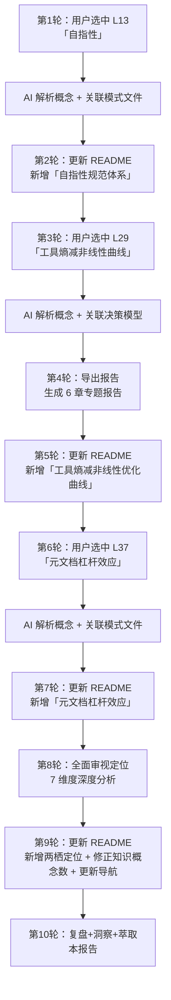

# 二、执行复盘

## 2.1 会话流程

## 2.2 关键产出

| 产出 | 类型 | 路径 |
|------|------|------|
| 工具熵减非线性优化曲线专题报告 | 新增报告 | `docs/retrospective/reports/retrospective-report-tool-entropy-nonlinear-optimization.md` |
| README 技术创新点新增 4 项 | README 更新 | `README.md#技术创新点` |
| README 量化成果修正 | README 更新 | 知识概念 6→10 |
| README 文档导航更新 | README 更新 | 复盘报告系列新增"工具熵减" |
| 项目定位全面审视 | 分析输出 | 本会话对话记录 |
| 本次会话复盘报告 | 复盘报告 | 本文件 |

## 2.3 数据统计

| 指标 | 数值 |
|------|------|
| 对话轮次 | 10 轮 |
| 概念深度解读 | 4 个（自指性/工具熵减/元文档杠杆/项目定位） |
| README 更新次数 | 4 次 |
| 新增文件 | 2 个（专题报告 + 本复盘报告） |
| README 技术创新点增长 | 6→10 项（+67%） |

---