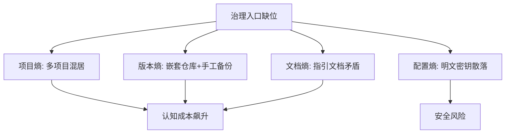

# 洞察萃取

## 一、关键发现与深层分析

### 洞察 1：混沌目录的"熵增四象限"

**事实**：xinet 目录同时存在四类熵增源：
- **项目熵**：9 个互不相关的一级项目（公众号工具、博客、道家哲学框架、CLI、Vue 应用等）混居。
- **版本熵**：37 个嵌套 `.git/`，且存在 tao-bak、tao-bak2、tao-bak3、tao_backup_20260407_174413 等手工备份副本。
- **文档熵**：CLAUDE.md 与 CODEBUDDY.md 对"本仓库是什么"给出完全冲突的答案。
- **配置熵**：openclaw-config.json 与 WeChat 凭证体系混杂明文密钥。

**深层含义**：混沌不是单点问题，而是治理缺位在多个维度的同步恶化。任何一个维度失控都会诱发其他维度劣化（例如缺统一入口 → 随意堆项目 → 随意备份）。

### 洞察 2：双 AI 指引文档冲突的根因

**事实**：
- `CLAUDE.md` 声称本仓库是 `taolib` Python 库（`libs/tao/`），描述 SSH 探测/文档构建/绘图三模块。
- `CODEBUDDY.md` 声称本仓库是"多项目集合"（WeChat / cli / AI / links）。
- `CODEBUDDY.md` 自己甚至备注："`libs/tao/` 在 CLAUDE.md 中提及但不存在"。

**根因分析（5-Whys）**：
1. 为什么文档矛盾？→ 两份文档由不同 AI 工具在不同时间生成。
2. 为什么没同步？→ 没有单一真实来源（SSOT）约束。
3. 为什么没 SSOT？→ 目录缺乏统一 AGENTS/README 治理入口。
4. 为什么缺入口？→ 这是一个临时堆放的测试沙箱，未当作正式项目治理。
5. 根因：**沙箱目录被当作"垃圾抽屉"使用，缺乏最低限度的元数据治理**。

### 洞察 3：安全反模式——明文凭证三连

**事实**：
- `openclaw-config.json` 内联 DeepSeek `apiKey`（明文）。
- `WeChat/config.yaml` 体系存放 app_id/app_secret/llm api_key。
- CODEBUDDY.md 自己也提示"openclaw-config.json 包含 API Key，请勿提交到版本库"，但文件仍在仓库内。

**深层含义**：即便文档已明确告警风险，缺乏自动化检测与 .gitignore 强约束时，告警形同虚设。安全治理必须"工具化"而非"文档化"。

### 洞察 4：与正面样本的对照价值

**事实**：同批分析的 ai-code-assistant 是结构清晰的单一 MVP（约 500 行、三模块、配置外置），而 xinet 是失控的多项目沙箱。

**对照规律**：

| 维度 | 正面样本 (ai-code-assistant) | 负面样本 (xinet) |
|------|------------------------------|-------------------|
| 项目边界 | 单一清晰 | 9 项目混居 |
| 文档一致性 | 单一 README | 双指引矛盾 |
| 配置管理 | 环境变量外置 | 明文密钥入库 |
| 版本管理 | 单一仓库 | 37 嵌套 + 手工备份 |
| 认知成本 | 6 分钟理解 | 需多轮勘察 |

## 二、规律认知

### 规律 1：治理熵增的"破窗效应"

第一个未治理的随意行为（如直接 `cp` 备份目录）会迅速诱发更多随意行为。混沌目录几乎总是从"就放这一次"开始。对应 AGENTS 的「禁止提交临时依赖」与「路径纪律」正是破窗的预防机制。

### 规律 2：文档治理的 SSOT 优先级

当存在多份描述同一对象的文档时，必须确立单一真实来源，其余文档只能引用而非复述。xinet 的双指引矛盾，正是缺乏 SSOT 的直接后果，印证了本项目 AGENTS 中「派生产物溯源」的必要性。

### 规律 3：安全治理必须工具化

文档级的"请勿提交密钥"告警无法阻止密钥入库。有效手段是 .gitignore 强约束 + 自动化扫描（如 check-gitignore.py），将治理从"自觉"升级为"强制"。

## 三、潜在机会识别

### 机会 1：混沌目录治理清单（模式候选）

基于本次分析可提炼"未治理多项目目录治理清单"：统一入口、SSOT 文档、密钥外置、子仓库 submodule 化、备份目录清理。

### 机会 2：嵌套仓库扫描脚本

可编写脚本自动扫描目录下所有 `.git`，识别嵌套仓库与手工备份副本，生成治理建议清单。

### 机会 3：作为 AGENTS 规范的负面教材

xinet 可作为本项目 AGENTS 治理规范（路径纪律、SSOT、no-hardcoding）的真实负面案例，用于规范宣讲与新成员培训。
