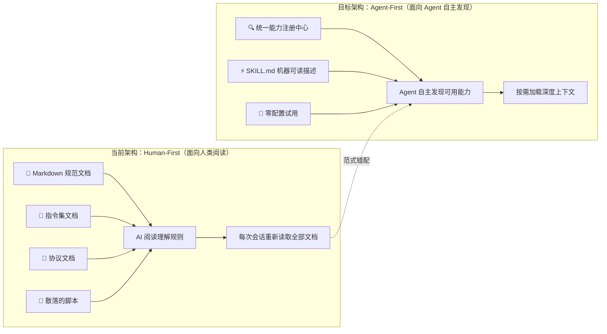
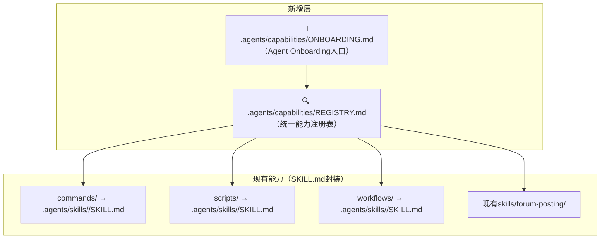
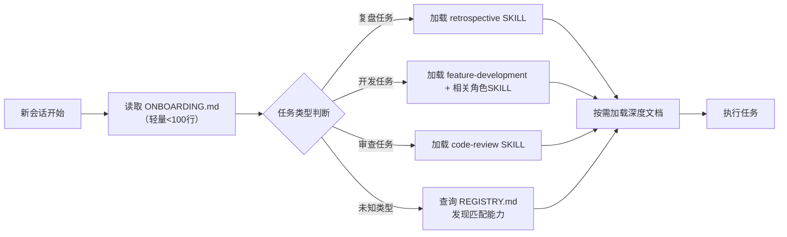
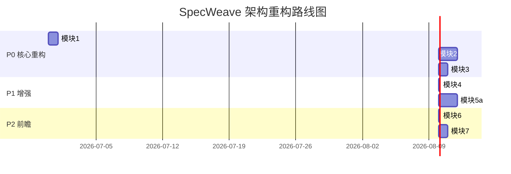

+++
id = "retrospective-architecture-priority-20260629"
date = "2026-06-29"
type = "report"
source = "Firecrawl 8 Insights → SpecWeave Architecture Assessment"
+++

# 架构优先级评估与重构路线图：基于 Firecrawl 8 洞察

> **分析基础**：Firecrawl 深度学习萃取的 8 个核心洞察
> **评估对象**：SpecWeave 当前架构（规范体系/角色协议/Skill体系/脚本工具/自我演进模块）
> **评估日期**：2026-06-29
> **报告类型**：架构优先级评估报告（洞察驱动）
> **关联报告**：[retrospective-firecrawl-learning-20260629](../retrospective-firecrawl-learning-20260629/)

## 📂 文件索引

| 文件 | 内容 |
|------|------|
| **README.md**（本文件） | 主报告：现状诊断、差距矩阵、重构模块方案、路线图、风险应对 |
| [execution-retrospective.md](execution-retrospective.md) | 执行过程复盘索引页 |
| [execution/](execution/) | 执行复盘原子化文件：事实、分析、元洞察、建议 |
| [insight-extraction.md](insight-extraction.md) | 深层架构洞察索引页：6个可复用架构模式导航 |
| [insights/](insights/) | 6个原子化洞察文件（每个文件单一主题） |
| [export-suggestions.md](export-suggestions.md) | 知识沉淀与行动建议索引页 |
| [export/](export/) | 建议原子化文件：6个模式详情、知识路径、行动项 |

## 📊 核心指标

- **范式诊断**：Human-First（文档驱动）→ Agent-First（自主发现），当前能力发现层为 L0 缺失
- **重构模块**：3个P0级（架构级）+ 2个P1级（高价值增强）+ 3个P2级（前瞻性）
- **不重构项**：6项（阶段守卫/角色/工作流/协议/硬编码规则/自我演进模块）
- **预计工期**：约 8 天（三波实施）
- **可复用模式**：6 个（渐进式披露、Markdown即接口、瓶颈优先等）

---

## 一、现状诊断：根本矛盾

### 范式错配

经过对核心模块的深入分析，当前 SpecWeave 架构存在一个根本性范式错配：

**核心矛盾**：SpecWeave 的规范体系（阶段守卫、PDR协议、工作流等）已非常成熟，但它们都是"写给 AI 读的文档"，而非"让 Agent 自主发现和调用的服务"。这直接对照 Firecrawl 洞察1（Keyless）和洞察4（Agent-Readable Service Description）——当前架构是 Human-First，需要向 Agent-First 演进。

### 当前架构成熟度评估

| 架构层 | 成熟度 | 说明 |
|--------|--------|------|
| 规范层（rules/protocols） | 🟢 L4 成熟 | 阶段守卫+SG-LOG/PDR-LOG+三路径工作流+硬编码治理，非常完善 |
| 角色层（roles/teams） | 🟢 L4 成熟 | 6+1扁平角色，职责边界清晰，协作场景完整 |
| 工作流层（workflows） | 🟢 L3 可用 | 新功能/扩展/重构三路径，需Skill化入口封装 |
| Skill层（skills/） | 🟡 L2 起步 | SKILL-TEMPLATE五要素模型很好，但仅1个forum-posting实例 |
| 指令集层（commands/） | 🟡 L2 文档态 | 5个指令集是Markdown文档，非可调用Skill |
| 脚本工具层（scripts/） | 🟡 L2 半封装 | 40+脚本无统一Skill封装，Agent不知道何时用哪个 |
| 能力发现层 | 🔴 L0 缺失 | 无统一注册中心、无Agent Onboarding入口 |
| 自我演进模块（modules/） | 🔴 L1 规划态 | 8模块仅有定义文件，无实际实现 |

---

## 二、8 洞察 × 当前架构差距矩阵

| 洞察 | 当前状态 | 差距等级 | 核心问题 |
|------|---------|---------|---------|
| **1. Keyless/Agent-First API** | 所有能力需先读文档才能使用；新会话必须手动重建上下文 | 🔴 P0-致命 | 没有零配置试用，没有自主发现，摩擦极高 |
| **2. Open Core + 托管差异化** | .agents/ 中核心规范和工具脚本混在一起，无分层 | 🟡 P2-中 | 不影响使用，但影响架构清晰度 |
| **3. Tiered Credit Economy** | self-management 是纸面规划，无资源调度 | 🔴 P2-延迟 | 单Agent场景不紧迫，多Agent并发时必做 |
| **4. Agent 可读服务描述** | SKILL-TEMPLATE很好，但只覆盖1/40+能力（仅forum-posting） | 🔴 P0-致命 | 5个指令集、40+脚本、3个工作流都没有SKILL封装 |
| **5. 全渠道对等接入** | 多入口存在（对话/指令/脚本/MCP）但不对等 | 🟡 P1-高 | 指令集是文档不是可执行Skill |
| **6. 运营型护城河** | 内部工具场景不适用 | ⚪ 不适用 | — |
| **7. 双模型成本弹性** | 无模型选择层，所有LLM调用同一模型 | 🟡 P2-中 | 受限于Trae平台，prompt层面可引导 |
| **8. 三角验证法** | PDR协议解决"读什么"，但未解决"怎么验证信息" | 🟡 P1-高 | 洞察质量可立即提升 |

---

## 三、需要重构的核心模块（按优先级排序）

### 🔴 P0 级：架构级重构（必须做，影响全局交互范式）

#### 重构模块 1：能力注册与发现中心（Capability Registry）

**对照洞察**：1（Keyless）+ 4（Agent-Readable Service Description）

**现状问题**：
- 当前 Agent 想知道系统"能做什么"，必须遍历 [.agents/README.md](../../../../../.agents/) → commands/ → protocols/ → workflows/ → scripts/ → skills/ 多个目录
- 没有统一的"系统能力清单"入口
- 新会话开始时，PDR协议要求重新读取所有前置文档，但Agent不知道"有哪些文档需要读"

**重构方案**：

**具体变更**：
1. 新建 `.agents/capabilities/` 目录（P0模块1实施时创建）
2. 创建 `ONBOARDING.md`——Agent 系统入口（类似 Firecrawl 的 `/agent-onboarding/SKILL.md`），包含：
   - 系统能力概览（我是谁、我能做什么）
   - 快速开始路径（零配置试用）
   - 注册表索引链接
3. 创建 `REGISTRY.md`——全量能力注册表，每个能力一行：ID、名称、触发词、SKILL.md路径、类型
4. 定义能力类型枚举：`command`（指令集）、`script`（脚本工具）、`workflow`（工作流）、`protocol`（协议）、`integration`（外部集成）

---

#### 重构模块 2：指令集 Skill 化改造（5 个指令集 → 标准 Skill）

**对照洞察**：1（Keyless）+ 4（Agent 可读描述）+ 5（全渠道对等）

**现状问题**：
- 5个指令集（[retrospective.md](../../../)、[insight.md](../../../../../.agents/commands/insight.md)、[atomization.md](../../../../../.agents/commands/atomization.md)、[export-report.md](../../../../../.agents/commands/export-report.md)、[atomic-commit.md](../../../../../.agents/commands/atomic-commit.md)）目前只是Markdown文档
- Agent需要"阅读并理解"文档才能执行指令集流程，而非通过标准SKILL接口调用
- 指令集缺少frontmatter元数据（触发词、参数、输出格式）

**重构方案**：

为每个指令集创建标准SKILL.md，遵循已有的 [SKILL-TEMPLATE.md](../../../../../.agents/skills/SKILL-TEMPLATE.md) 五要素模型：

| 指令集 | SKILL.md路径 | 核心封装内容 |
|-------|-------------|------------|
| retrospective | `.agents/skills/retrospective/SKILL.md` | 复盘4步流程、fact模板、时间线画法、输出格式 |
| insight | `.agents/skills/insight/SKILL.md` | 数据分析流程、根因分析、三源验证法、异常识别 |
| atomization | `.agents/skills/atomization/SKILL.md` | 原子化拆分规则、单一职责原则、拆分检查清单、导航更新流程 |
| export-report | `.agents/skills/export-report/SKILL.md` | 报告格式选择、元数据规范、归档路径、索引更新 |
| atomic-commit | `.agents/skills/atomic-commit/SKILL.md` | 提交分组、Conventional Commits格式、会话边界原则 |

**关键设计决策**：
- 原 commands/ 目录中的文档保留作为深度参考（Progressive Disclosure：常用内容内联在SKILL.md，低频内容引用原文档）
- SKILL.md 控制在500行以内
- 每个SKILL.md包含：触发词、决策树、执行步骤、安全检查清单、错误处理
- 参考样板：[forum-posting/SKILL.md](../../../../../.agents/skills/forum-posting/SKILL.md)

---

#### 重构模块 3：Agent Onboarding 协议（替代 PDR 的强制读取范式）

**对照洞察**：1（Keyless）+ 4（Agent可读描述）

**现状问题**：
- 当前 [pre-document-reading.md](../../../../../.agents/protocols/pre-document-reading.md) 要求新会话"重新读取所有前置文档"
- 这是 Human-First 思维：AI记忆清零→必须重新读所有文档
- 问题：读太多不必要文档浪费上下文窗口，读太少又缺失关键信息

**重构方案**：

将PDR从"强制全量读取"升级为"渐进式按需加载"：

**具体变更**：
1. 新协议文件：`.agents/protocols/agent-onboarding.md`
2. ONBOARDING.md 作为Agent系统入口，内容精简（<100行）：
   - 系统身份（SpecWeave 多Agent协作规范框架）
   - 核心能力速查（5个指令集+3个工作流+高频脚本）
   - 任务类型→加载哪个SKILL的路由表
   - 如何查询完整注册表
3. 修改PDR协议：将"全量必读"改为"ONBOARDING必读+按需加载"
4. 保留📋确认机制，但确认内容从"已读取所有文档"变为"已加载ONBOARDING+相关SKILL"

---

### 🟡 P1 级：高价值增强（应该做，显著提升质量）

#### 重构模块 4：三角验证法标准化（洞察8落地）

**对照洞察**：8（三源信息三角验证）

**现状问题**：
- [insight.md](../../../../../.agents/commands/insight.md) 指令集没有要求多源信息验证
- 做外部研究/竞品分析时，容易只依赖单一信息源

**重构方案**：
1. 在 insight SKILL.md（模块2创建）中增加"信息采集规范"章节：
   - 外部产品研究必须覆盖：技术源（官方文档/GitHub）+ 商业源（定价/案例）+ 第三方源（评测/社区）
   - 交叉验证检查清单：关键数据点至少2个源确认
   - 缺口标注规则：单一来源信息必须标注可信度
2. 本次 Firecrawl 学习已实践此方法，将其模式化

**工作量**：极小（在SKILL.md中增加一个章节），价值极高（提升所有洞察报告质量）。

---

#### 重构模块 5：高频脚本 Skill 化覆盖

**对照洞察**：4（Agent可读描述）+ 5（全渠道对等）

**现状问题**：
- `.agents/scripts/` 下有 40+ Python 脚本，但没有SKILL封装
- Agent不知道什么时候该用哪个脚本，需要阅读脚本源码或README
- 脚本参数、输出格式、使用约束没有机器可读描述

**重构方案**：
按使用频率分批封装高频脚本为Skill：

**第一批（最高频，优先封装）**：

| 脚本 | Skill名 | 触发词 |
|------|---------|--------|
| [check-links.py](../../../../../.agents/scripts/check-links.py) | link-checker | 检查链接、修复链接、断链 |
| [generate-dashboard.py](../../../../../.agents/scripts/generate-dashboard.py) | spec-dashboard | 生成看板、更新看板、执行进度 |
| [check-stage-guardrails.py](../../../../../.agents/scripts/check-stage-guardrails.py) | sg-log-analyzer | 分析SG-LOG、检查阶段守卫合规性 |
| [finalize-atomization.py](../../../../../.agents/scripts/finalize-atomization.py) | atomization-finalizer | 原子化收尾、断链修复、导航更新 |
| [check-vendor.py](../../../../../.agents/scripts/check-vendor.py) | vendor-checker | 检查vendor合规、submodule验证 |

**第二批（中频封装）**：
- check-spec-consistency.py、generate-nav.py、build-ref-index.py、check-source-traceability.py、ci-check.ps1

**第三批（低频按需封装）**：
- 其余脚本在使用时按需封装

每个脚本Skill的SKILL.md包含：功能描述、触发词、常用命令速查、参数表、输出说明、常见错误。

---

### 🟢 P2 级：前瞻性设计（择机实施）

#### 重构模块 6：规范分层治理（洞察2落地）

**对照洞察**：2（Open Core + Managed Differentiation）

**重构内容**：明确区分 `.agents/` 中两类内容：
- **Core（核心规范，必须遵守）**：roles/、protocols/、rules/、capabilities/（新）、skills/（指令集SKILL）
- **Tools（工具能力，可选使用）**：scripts/、templates/、skills/forum-posting等集成类Skill

当前结构已隐含此分层，只需在 [.agents/README.md](../../../../../.agents/) 中明确化。

---

#### 重构模块 7：模型路由层（洞察7落地）

**对照洞察**：7（Dual-Model Cost-Quality Switch）

**重构内容**：
- 在SKILL.md frontmatter中增加`model_hint`字段（`fast`/`balanced`/`precise`）
- Agent根据任务类型和SKILL提示选择合适的推理策略
- 注意：受限于Trae平台，可能只能在prompt层面引导，无法实际切换模型API

---

#### 重构模块 8：资源调度框架（洞察3落地）

**对照洞察**：3（Tiered Credit Economy）

**重构内容**：
- 对应 [self-management.md](../../../../../.agents/modules/self-management.md) 的资源分配能力
- 多Agent并发场景下的任务优先级调度
- 当前单Agent使用不紧迫，待多Agent协作场景落地时实施

---

## 四、不建议重构的项

| 当前模块 | 不重构原因 |
|---------|-----------|
| **阶段守卫（stage-guardrails）** | 设计极其成熟，SG-LOG/PDR-LOG结构化日志、8阶段边界、拦截机制都已完善，无需改动 |
| **角色体系（roles/）** | 6+1扁平角色定义清晰，职责边界明确，协作场景文档完善 |
| **工作流（workflows/）** | 三路径（新功能/扩展/重构）设计合理，只需Skill化封装入口，核心流程不变 |
| **协议层（handoff/messaging/conflict）** | 协议设计完整，不需要重构 |
| **硬编码治理规则（rules/）** | 规则体系完整，5个文档形成闭环 |
| **Self-evolution 8模块** | 是规划蓝图，当前无需重构——等Skill体系完善后，这些模块的实现可基于Skill架构 |

---

## 五、重构路线图

### 实施顺序说明

**第一波（P0，约4天）：范式转移**
1. **先做模块1**（注册表+Onboarding入口）——基础设施，所有后续Skill都注册到这里
2. **再做模块2**（5个指令集Skill化）——最高频使用的能力，改造后立即见效
3. **最后做模块3**（Onboarding协议替代PDR强制读取）——依赖模块1和2完成

**第二波（P1，约2.5天）：能力扩展**
4. **模块4**（三角验证法）——极小改动，嵌入insight SKILL.md
5. **模块5a**（第一批高频脚本Skill化）——5个最常用脚本的SKILL封装

**第三波（P2，约1.5天）：完善优化**
6. **模块6-8**——分层治理、模型路由、资源调度，择机实施

---

## 六、重构风险与应对

| 风险 | 应对策略 |
|------|---------|
| **向后兼容**：原commands/文档是否保留？ | 保留。SKILL.md是"入口和索引"，原文档作为深度参考（Progressive Disclosure） |
| **PDR协议变更影响阶段守卫**：修改PDR可能导致SG-LOG检查异常 | 模块3中保持📋确认机制格式不变，只改变"确认什么"；同步更新check-stage-guardrails.py |
| **Skill数量膨胀**：40+脚本全封装工作量大 | 分批封装，第一批只做5个最高频脚本，其余按需封装 |
| **SKILL.md质量不一致** | 严格遵循SKILL-TEMPLATE和skill-development.md五要素，以forum-posting为样板 |
| **ONBOARDING.md过时风险** | REGISTRY.md可考虑脚本自动生成（从skills/目录frontmatter聚合），初期手动维护 |

---

## 关联报告

- [retrospective-firecrawl-learning-20260629](../retrospective-firecrawl-learning-20260629/) — Firecrawl系统学习复盘（8个洞察来源）
- [retrospective-deer-flow-2-learning-20260625](../retrospective-deer-flow-2-learning-20260625/) — DeerFlow 2.0学习复盘
- [retrospective-comprehensive-extraction-20260626](../retrospective-comprehensive-extraction-20260626/) — 综合萃取复盘
