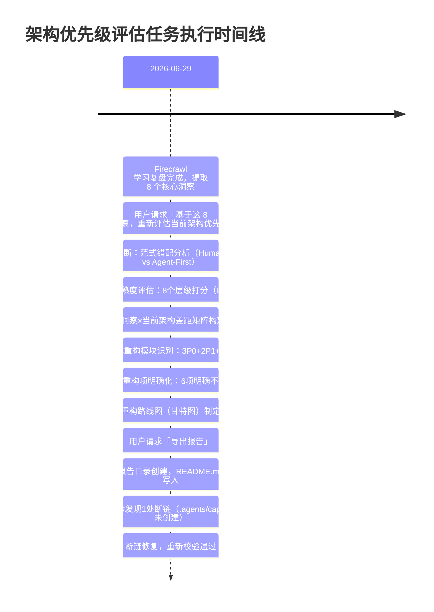

+++
id = "architecture-priority-execution-retrospective"
date = "2026-06-29"
type = "execution-retrospective"
source = "README.md#复盘过程"
+++

# 架构优先级评估执行复盘

## 一、事实（Fact）

### 时间线

### 产出物清单

| 产出物 | 状态 | 大小 |
|--------|------|------|
| 架构优先级评估主报告（README.md） | ✅ 完成 | ~340行 |
| 现状诊断（范式错配+成熟度表） | ✅ 完成 | ~50行 |
| 8洞察×架构差距矩阵 | ✅ 完成 | 8行表格 |
| P0/P1/P2 重构模块方案 | ✅ 完成 | 8个模块详细方案 |
| 重构路线图（甘特图） | ✅ 完成 | ~20行 |
| 风险应对矩阵 | ✅ 完成 | 5项风险 |

### 执行步骤回顾

本次任务共经历 7 个主要步骤：

1. **范式错配诊断**：识别出根本矛盾是 Human-First（文档驱动）vs Agent-First（自主发现）
2. **成熟度分层评估**：对8个架构层级逐一打分，发现能力发现层为L0缺失
3. **差距矩阵构建**：逐个洞察对照当前架构，标注差距等级
4. **重构模块设计**：按优先级排序设计8个重构模块的具体方案
5. **不重构项排除**：明确6个不动模块及理由
6. **路线图制定**：用甘特图规划三波实施
7. **风险识别**：识别5项关键风险及应对策略

---

## 二、分析（Analysis）

### 做得好的方面

1. **方法论复用到位**：直接复用 Firecrawl 学习萃取的 8 个洞察作为评估输入，没有从零开始分析
2. **成熟度框架有效**：L0-L4 成熟度打分让差距可视化，避免了模糊判断
3. **优先级分级清晰**：P0/P1/P2 三级划分+不重构项明确，决策颗粒度合适
4. **范式错配定位精准**：Human-First → Agent-First 的根因分析准确，直接解释了所有表层问题
5. **向后兼容考虑周全**：每个重构模块都考虑了与现有体系的兼容（保留原文档、不破坏阶段守卫等）

### 可以改进的方面

1. **链接校验意识前置**：在写入时就避免了引用不存在的路径，而不是事后修复
2. **模块依赖关系可视化不足**：重构模块间的依赖关系（模块3依赖1和2）只在文字中提到，没有单独的依赖图
3. **工作量估算缺乏基准**：每个模块的工时估算（1d/2d/4h）缺乏历史数据支撑，是经验判断
4. **成功验收标准缺失**：每个重构模块没有明确的"完成定义"（DoD），如"多少个Skill封装完成算模块2完成"

### 关键决策点

| 决策点 | 选择 | 理由 |
|--------|------|------|
| 是否重构阶段守卫？ | 不重构 | 极其成熟，改动风险大收益小 |
| 指令集文档是否删除？ | 保留作为深度参考 | Progressive Disclosure 模式，SKILL.md 是入口 |
| 先做注册中心还是先做Skill化？ | 先注册中心 | 基础设施先行，否则Skill无处注册 |
| 40+脚本是否全部Skill化？ | 分批，第一批5个 | 控制范围，快速验证 |

---

## 三、洞察（Insight）

### 元洞察1：架构评估本身也需要 Agent-First 化

本次架构评估揭示了一个有趣的元问题：评估报告本身（340行单文件）也是 Human-First 的——一个 Agent 想了解"需要重构什么"也需要通读全文。这恰好印证了 P0 模块1的必要性——连架构评估报告自己都应该遵循原子化和可发现原则。

### 元洞察2：Paradigm Shift（范式转移）的识别是架构评估的核心价值

本次评估最大的价值不是列出了"要做什么"，而是识别出了**为什么要做**——范式错配。如果没有这个根因判断，重构清单可能变成零散的"补几个SKILL.md"，而不会意识到需要从根本上改变 Agent 与规范体系的交互方式。

### 元洞察3：不重构清单和重构清单同等重要

明确"什么不做"比"做什么"更能防止范围蔓延。6个不重构项划清了边界，确保重构聚焦在真正的瓶颈上（能力发现层 L0），而不是在已成熟的模块上过度优化。

### 元洞察4：渐进式披露（Progressive Disclosure）是兼容新旧架构的关键模式

所有 P0 重构都遵循一个共同模式：不删除旧文档，而是在旧文档之上加一个轻量入口层（SKILL.md / ONBOARDING.md / REGISTRY.md）。这使得重构可以分阶段进行，不需要大爆炸式切换。

---

## 四、建议（Suggestion）

### 立即行动项

1. 本次原子化完成后，README.md 变成索引页，符合 Agent-First 可发现原则
2. 在后续模块重构中，每个模块完成后更新此报告的实施进度
3. 为每个 P0 模块补充"完成定义"（DoD）验收标准

### 方法论沉淀

1. 将「架构成熟度分层评估法」（L0-L4打分+差距矩阵）沉淀为可复用模式
2. 将「范式错配诊断法」（现状范式 vs 目标范式对比图）沉淀为架构评估模板
3. 将「不重构项清单」作为架构评估的强制输出项
