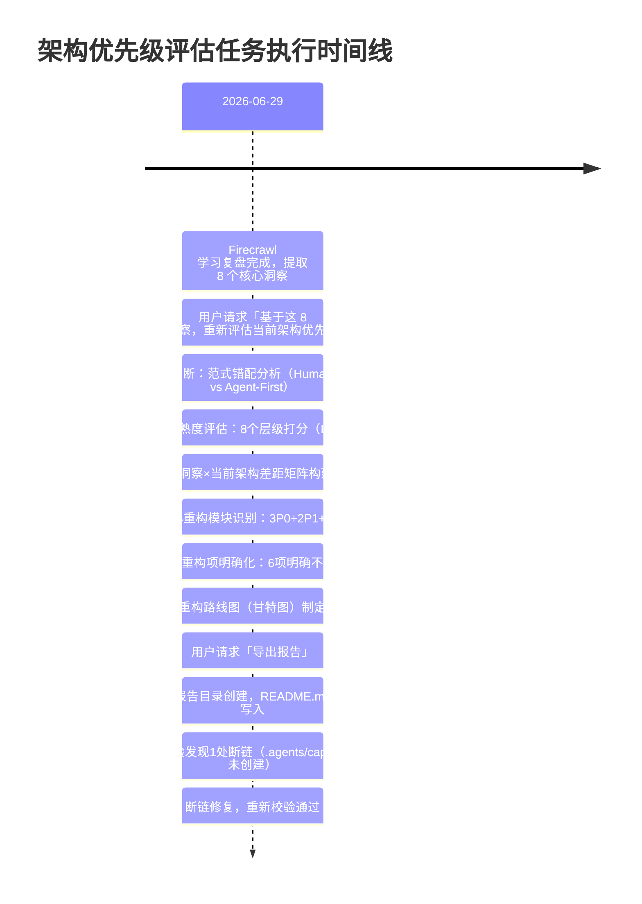

+++
id = "architecture-priority-execution-facts"
date = "2026-06-29"
type = "execution-facts"
source = "execution-retrospective.md#一事实"
+++

# 一、事实（Fact）

## 时间线

## 产出物清单

| 产出物 | 状态 | 大小 |
|--------|------|------|
| 架构优先级评估主报告（README.md） | ✅ 完成 | ~340行 |
| 现状诊断（范式错配+成熟度表） | ✅ 完成 | ~50行 |
| 8洞察×架构差距矩阵 | ✅ 完成 | 8行表格 |
| P0/P1/P2 重构模块方案 | ✅ 完成 | 8个模块详细方案 |
| 重构路线图（甘特图） | ✅ 完成 | ~20行 |
| 风险应对矩阵 | ✅ 完成 | 5项风险 |

## 执行步骤回顾

本次任务共经历 7 个主要步骤：

1. **范式错配诊断**：识别出根本矛盾是 Human-First（文档驱动）vs Agent-First（自主发现）
2. **成熟度分层评估**：对8个架构层级逐一打分，发现能力发现层为L0缺失
3. **差距矩阵构建**：逐个洞察对照当前架构，标注差距等级
4. **重构模块设计**：按优先级排序设计8个重构模块的具体方案
5. **不重构项排除**：明确6个不动模块及理由
6. **路线图制定**：用甘特图规划三波实施
7. **风险识别**：识别5项关键风险及应对策略
