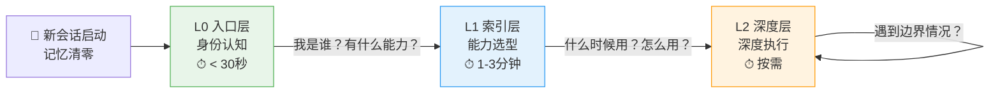

# P-ARCH-001 渐进式披露架构

**问题**：成熟的规范体系文档量巨大，新 Agent 入门需要读取大量文档，浪费上下文窗口。

**根因**：把"信息完整性"等同于"一次性加载全部信息"——人类线性阅读思维惯性，不是 Agent 信息架构最优解。

**解决方案**：三层入口架构：
- L0 入口层（<100行）：ONBOARDING.md——身份+能力速查+路由表
- L1 索引层（<500行/能力）：SKILL.md——触发词+决策树+核心步骤+安全清单
- L2 深度层（不限）：原规范文档——完整参考手册

---

## 架构图

---

## 各层内容边界

| 层 | 目标读者 | 核心内容 | 行数限制 | 回答的问题 |
|----|---------|---------|---------|-----------|
| **L0 入口** | 新会话首次接入的Agent | 身份声明+能力速查表+路由决策树 | <100行 | 我是谁？这里有什么？我该去哪？ |
| **L1 索引** | 已确定任务类型、准备执行的Agent | 触发词+决策树+核心步骤+安全清单 | <500行/能力 | 什么时候用？怎么用？要注意什么？ |
| **L2 深度** | 需要深入理解边界情况的Agent | 完整参考手册、原理阐述、边缘情况 | 不限 | 为什么这样设计？完整参数？异常处理？ |

---

## 跨层引用规则

1. **L0 只引用 L1**：不直接链接到深度文档
2. **L1 引用 L0 和 L2**：开头可返回入口，核心步骤内联，细节引用L2
3. **L2 可引用 L1**：深度文档链接回SKILL.md作为快速开始
4. **禁止跨层跳跃**：L0不直接链接到L2具体小节（高频参考除外）

---

## 正反例

### ✅ 正例

- **Firecrawl agent-onboarding 设计**：零配置入口，渐进式披露
- **SKILL-TEMPLATE 五要素模型**：L1层结构规范（触发词+决策树+步骤+Why+安全清单）
- **SpecWeave 全局能力体系（已落地）**：
  - L0: [ONBOARDING.md](../../../../../../../.agents/ONBOARDING.md) 88行 ✅
  - L1: [capability-registry.md](../../../../../../../.agents/capability-registry.md) 236行 + 5个命令Skill（117-131行）✅
  - L2: [onboarding-protocol.md](../../../../../../../.agents/protocols/onboarding-protocol.md)、[cmd-log-specification.md](../../../../../../../.agents/rules/cmd-log-specification.md) 等深度规范 ✅

### ❌ 反模式

| 反模式 | 表现 | 问题 |
|--------|------|------|
| 入口过重 | ONBOARDING.md >100行，包含详细步骤 | Agent浪费上下文窗口 |
| 分层断裂 | SKILL.md直接复制L2完整内容 | L1膨胀为另一个深度文档 |
| 路由缺失 | L0没有决策树，只罗列文件 | Agent仍需盲目遍历 |
| 信息孤岛 | 各层之间无相互链接 | 无法按需深入或返回 |
| 重复定义 | 同一内容在多层重复出现 | 修改时不一致 |

- **❌ 旧PDR协议**：要求新会话"重新读取所有前置文档"（反模式，已通过本架构解决）

---

## 落地效果（2026-06-30 验证）

| 指标 | 效果 |
|------|------|
| L0 ONBOARDING 精简 | 141行 → 88行（-38%） |
| 5个命令Skill平均精简 | -29% 行数 |
| 新Agent初始认知加载 | 从数千token降至 ~88行L0 |
| 分层断裂修复 | CMD-LOG规范从5个L1 Skill下沉至单一L2文档 |

---

## 与互补模式的关系

| 模式 | 关系 |
|------|------|
| **上下文渐进式披露** | 微观互补：本模式是L0-L1-L2宏观三层架构；该模式是L1单个Skill内部的文档组织策略 |
| **Skill五要素模型** | L1结构规范：定义L1 SKILL.md该写什么五要素 |
| **Skill发现协议SOP** | 运行时实现：本模式是静态信息架构，发现协议是Agent运行时如何利用该架构的流程 |

---

## 正式规范

完整规范文档（含质量检查清单、模板、反模式详解）：
[ARCHITECTURE.md](../../../../../../../.agents/capabilities/ARCHITECTURE.md) v1.1.0
