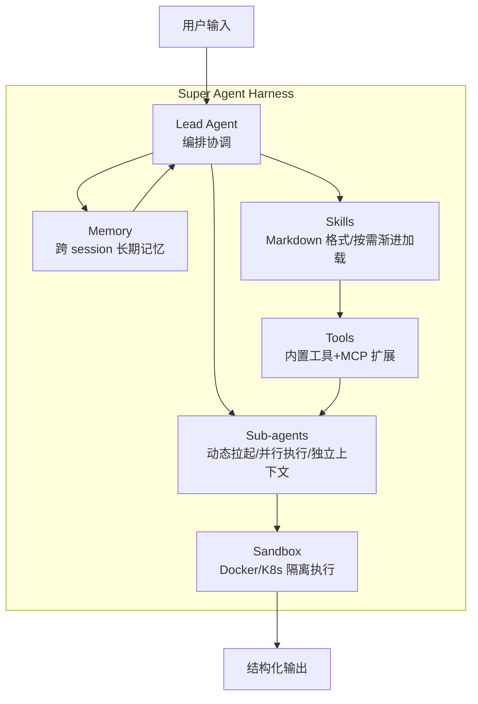
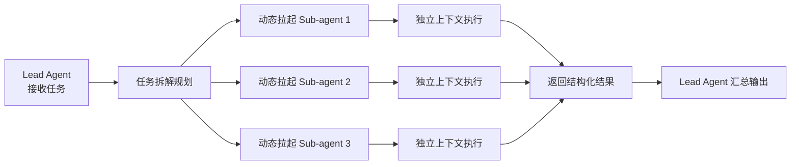

+++
id = "retrospective-deer-flow-2-learning-20260625-export"
date = "2026-06-25"
type = "export-suggestions"
source = ".temp/AI/deer-flow-notes.md"
+++

# 导出建议

## 一、改进建议

| 问题 | 改进措施 | 优先级 | 预期效果 | 状态 |
|------|---------|--------|---------|------|
| SpecWeave 规范一次性加载可能导致上下文过载 | 引入按需渐进加载机制，参考 DeerFlow Skills 按需加载设计 | 中 | 控制上下文窗口大小，保持 Agent 聚焦 | 待规划 |
| 当前角色协作是串行 handoff 模式，缺少并行能力 | 研究并引入并行 Sub-agent 执行模式 | 中 | 提高复杂任务处理效率 | 待规划 |
| user_profile.md 记忆维度不够结构化 | 增加"个人偏好、知识背景、工作习惯"三维度 | 低 | 记忆系统更结构化，个性化体验更好 | 待规划 |
| 缺少主动的上下文压缩机制 | 增加已完成任务自动摘要、中间结果转存功能 | 中 | 长会话上下文管理更有效 | 待规划 |
| 工具扩展依赖自定义脚本，缺少标准化接入 | 研究 MCP 协议接入方案 | 低 | 可复用 MCP 生态工具，减少重复开发 | 待规划 |
| 笔记中 10 个疑问未深入研究 | 后续深入研究 DeerFlow 源码和官方文档，回答这些疑问 | 中 | 获得更深入的架构理解 | 待规划 |

## 二、可萃取的模式与模板

### 模式候选 1：Super Agent Harness 架构模式

**模式名称**：super-agent-harness

**模式描述**：开箱即用的超级 Agent 运行时架构，默认包含 Sub-agents、Memory、Sandbox、Skills、Tools 五大核心组件。

**核心结构**：



**设计原则**：
1. 开箱即用：默认包含所有关键能力，用户无需自行组装
2. 可定制：内置模块可替换、可重组
3. 隔离性：Sandbox 确保任务安全执行，Sub-agent 上下文隔离
4. 上下文友好：按需加载 Skills，独立 Sub-agent 上下文，主动摘要压缩
5. 可扩展：通过 MCP Server 和自定义 Skills 扩展能力

**适用场景**：
- 通用 Agent 平台
- 研究助手
- 自动化任务处理系统
- 复杂长任务执行框架

**成熟度评估**：L2（DeerFlow 2.0 完整实现，SpecWeave 部分概念验证）

### 模式候选 2：Markdown 化能力扩展模式

**模式名称**：markdown-capability-extension

**模式描述**：使用 Markdown 文件作为 Agent 能力（Skills）的载体，定义工作流、最佳实践和参考资源的扩展模式。

**设计要点**：
1. 纯 Markdown 格式，人类可读、AI 友好、Git 可控
2. 按需渐进加载，不提前加载所有能力
3. 可替换：内置能力可被用户自定义版本覆盖
4. 结构化：Skills 内部有清晰的章节结构（工作流/最佳实践/参考资源）

**与 SpecWeave 的契合度**：极高——SpecWeave 的 .agents/ 规范体系已经采用了 Markdown 格式，可以进一步"技能化"。

**成熟度评估**：L2（DeerFlow、Claude Code、SpecWeave 均采用此模式）

### 模式候选 3：多智能体分-合执行模式

**模式名称**：multi-agent-divide-conquer

**模式描述**：Lead Agent 拆解任务 → 动态拉起多个 Sub-agents 并行执行（独立上下文） → 结构化结果汇总的多智能体协作模式。

**执行流程**：



**关键要求**：
1. 每个 Sub-agent 有独立的上下文窗口
2. Sub-agent 之间不直接通信，通过 Lead Agent 协调
3. Sub-agent 返回结构化结果（而非完整对话历史）
4. 支持并行执行（当任务之间无依赖时）

**成熟度评估**：L2（DeerFlow 实现，SpecWeave 当前为串行模式）

### 模式候选 4：三级 Sandbox 部署模式

**模式名称**：three-tier-sandbox

**模式描述**：从本地执行到 Docker 隔离再到 Kubernetes 弹性伸缩的三级沙箱部署模式，满足从开发到生产的不同需求。

**三级模式对比**：

| 模式 | 隔离级别 | 资源开销 | 弹性能力 | 适用场景 |
|------|---------|---------|---------|---------|
| 本地执行 | 无（宿主机直接运行） | 最低 | 无 | 开发调试、简单任务 |
| Docker 执行 | 容器级隔离 | 中等 | 单主机 | 生产环境、单用户 |
| Docker + K8s | Pod 级隔离 + 资源调度 | 较高 | 集群弹性 | 大规模部署、多租户 |

**文件系统布局**：
```
sandbox-root/
├── uploads/          # 用户上传文件（只读）
├── workspace/        # Agent 工作目录（可读写）
└── outputs/          # 最终交付物（持久化）
```

**成熟度评估**：L2（DeerFlow 实现）

## 三、行动计划

| 优先级 | 改进项 | 具体措施 | 建议时间 | 状态 |
|--------|--------|---------|---------|------|
| 高 | 研究 DeerFlow 源码深入理解架构 | 克隆 DeerFlow 仓库，阅读核心代码，回答笔记中的 10 个疑问 | 2026-06-27 | 待规划 |
| 高 | 评估引入按需规范加载机制 | 设计 .agents/ 规范的按需加载策略，避免一次性加载所有内容 | 2026-06-28 | 待规划 |
| 中 | 升级 user_profile.md 记忆结构 | 增加"个人偏好、知识背景、工作习惯"三个明确维度 | 2026-06-29 | 待规划 |
| 中 | 研究并行 Sub-agent 可行性 | 分析在 SpecWeave 现有角色体系上引入并行执行的方案 | 2026-06-30 | 待规划 |
| 低 | 调研 MCP 协议接入方案 | 了解 MCP 协议规范，评估 SpecWeave 接入成本和收益 | 2026-07-02 | 待规划 |
| 低 | 沉淀 Harness 架构模式到 patterns 目录 | 将 super-agent-harness 模式整理为正式的架构模式文档 | 2026-07-03 | 待规划 |

## 四、后续研究方向

基于 `deer-flow-notes.md`（`.temp/AI/` 临时学习笔记，已清理）中提出的 10 个疑问，延伸出以下后续研究方向：

1. **DeerFlow 部署架构深入研究**：分析其 Docker Compose/K8s 配置，理解各服务组件的职责和交互方式
2. **Skills 自定义与扩展实践**：实际编写一个自定义 Skill，理解 Skill 的完整格式和加载机制
3. **Sandbox 隔离机制源码分析**：阅读 Sandbox 相关代码，理解容器生命周期管理、文件系统挂载、安全策略
4. **长期记忆存储实现**：分析 Memory 的存储格式、检索机制、记忆更新策略
5. **运行状态监控与调试**：研究 DeerFlow 的日志系统、追踪机制、调试接口
6. **生产环境部署最佳实践**：收集生产部署经验，包括高可用、性能优化、安全配置
7. **Agent 性能优化策略**：研究上下文管理、缓存策略、并行调度的具体实现
8. **错误处理与异常恢复机制**：分析任务失败重试、超时处理、状态回滚等机制
9. **内容质量保证机制**：研究如何验证和提升 Agent 生成内容的质量和准确性
10. **Roadmap 与未来方向跟踪**：关注 DeerFlow 的社区动态和版本规划

## 五、短期可落地借鉴项

以下是不需要大规模架构调整即可快速借鉴的设计：

1. **user_profile.md 结构化升级**：在现有文件中增加三个维度的字段，工作量小但收益明确
2. **handoff 模板结构化结果要求**：在 handoff 模板中明确要求返回结构化结果而非完整对话历史
3. **规范文件按需读取强化**：在 AGENTS.md 中进一步强调"只读取与当前任务直接相关的规范"
4. **.temp/ 目录沙箱定位强化**：明确 .temp/ 作为"探索沙箱"的定位，apps/ 作为"稳定区"的定位
