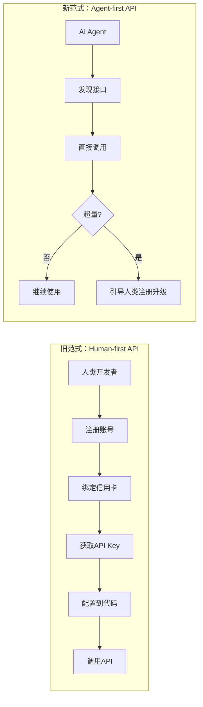
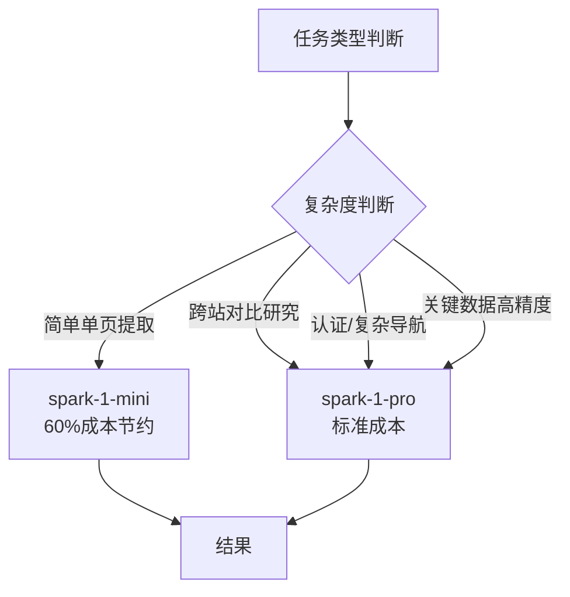
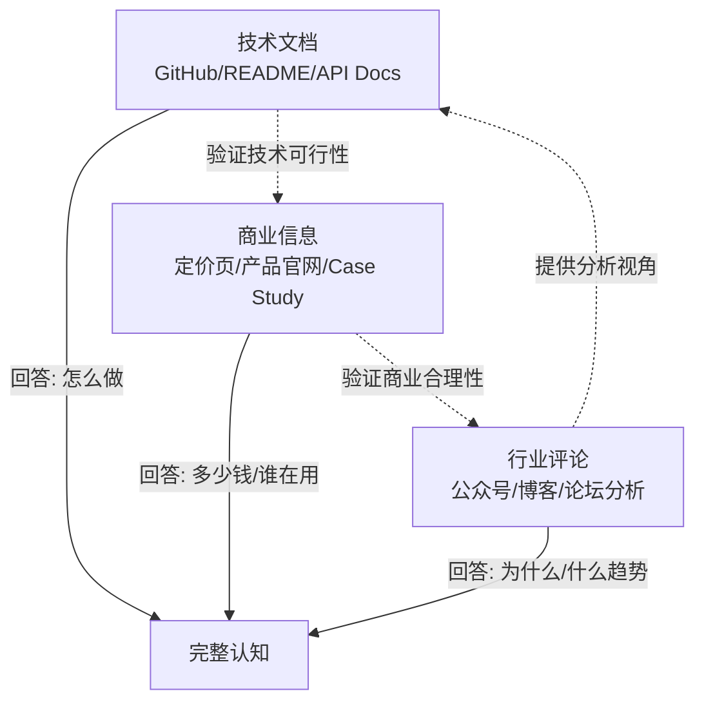
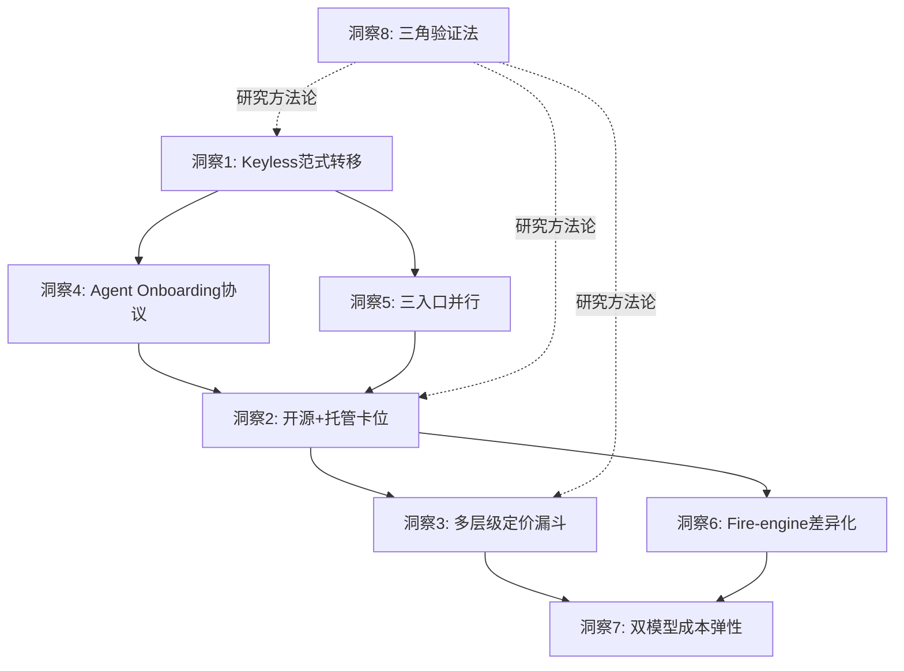

+++
id = "retrospective-firecrawl-learning-20260629-insight"
date = "2026-06-29"
type = "insight"
source = "https://github.com/firecrawl/firecrawl | https://www.firecrawl.dev/pricing | https://mp.weixin.qq.com/s/Kk_Z4d3Ft7SKejgQoLCHXg"
+++

# 洞察萃取：Firecrawl 的 8 个核心洞察与可复用模式

## 洞察总览

从 Firecrawl 的技术架构、产品设计、商业模式和战略布局中，萃取 8 个核心洞察，按性质分为三类：

| 类别 | 洞察编号 | 主题 |
|------|---------|------|
| 战略范式 | 洞察1 | Agent 时代 API 设计范式转移（Keyless） |
| 战略范式 | 洞察2 | 开源+托管双轨的基础设施卡位策略 |
| 产品设计 | 洞察3 | 多层级 PLG 定价漏斗与 Credit 经济学 |
| 产品设计 | 洞察4 | Agent Onboarding：AI 自主接入协议 |
| 产品设计 | 洞察5 | 三入口并行：MCP/CLI/REST 降低接入摩擦 |
| 技术架构 | 洞察6 | 托管版-自托管版差异化能力区隔（Fire-engine） |
| 技术架构 | 洞察7 | 双模型策略：成本-质量弹性切换（mini/pro） |
| 方法论 | 洞察8 | 三源信息三角验证法 |

---

## 洞察1：Agent 时代 API 设计范式转移——Keyless 模式

**来源**：微信公众号深度解读 + GitHub Agent Onboarding 章节 + 定价页 FAQ

### 事实

Firecrawl 推出 Keyless 模式：无需注册、无需 API Key、无需配置环境变量，直接通过 MCP/CLI/REST 三个入口调用 API，每月自动赠送 1000 次免费额度。

### 分析

传统 API Key 模式的设计前提是：**API 的消费者是人**（开发者）。人会注册账号、绑定支付、管理密钥轮换。但 AI Agent 不会做这些事——它只会调用接口。当 Agent 成为 API 的主要消费者时，"先注册再使用"成为最大的接入摩擦。

Keyless 模式的本质不是"免费送"，而是**重新定义 API 的默认消费者**：
- 旧范式：人 → 注册 → Key → 配置 → 调用
- 新范式：Agent → 发现 → 直接调用 → 超量后再引导注册

### 可复用模式萃取

**模式名称**：Agent-First API Design（Agent 优先 API 设计）

**核心原则**：
1. **零配置启动**：首次调用无需任何前置步骤（注册、Key、配置）
2. **免费额度内置**：自动赠送基础额度，不设前置门槛
3. **Agent 可自主发现**：提供标准化的服务发现机制（如 MCP、Skill 描述符）
4. **升级路径清晰**：超量时引导人类介入付费决策，而非阻断服务
5. **身份轻量认证**：初始调用可用设备指纹/IP 等轻量标识，Key 作为升级选项而非必需

**成熟度**：L3（已在 Firecrawl 产品中验证，具备可复制性）

**SpecWeave 相关性**：SpecWeave 的多智能体协作体系中，agent 间的服务调用也可借鉴此模式——新 skill/新能力首次被 agent 发现时，无需复杂的权限配置即可试用，通过用量阈值控制资源消耗。

---

## 洞察2：开源+托管双轨的基础设施卡位策略

**来源**：GitHub 开源仓库 + 定价页 Enterprise 特性对比

### 事实

Firecrawl 采用 MIT 协议完全开源，同时提供托管服务（firecrawl.dev）。自托管版缺少托管版独占的 Fire-engine（高级反爬、IP 轮换等能力）。

### 分析

这是典型的**开源基础设施卡位战**打法，分为三层：

| 层级 | 策略 | 目的 |
|------|------|------|
| 第一层：开源 | 核心功能完全开源（MIT） | 占领开发者心智，建立事实标准，社区贡献反哺产品 |
| 第二层：免费额度 | 托管版每月 1000 次免费 | 降低从开源到托管的迁移门槛，让开发者"用着用着就付费了" |
| 第三层：差异化能力 | Fire-engine 等高级能力仅托管版提供 | 创造付费理由，形成"开源引流→托管变现"的漏斗 |

关键洞察：**自托管版的功能"故意不完整"不是缺陷，而是产品策略**。如果自托管版和托管版功能完全一致，谁会付费？Fire-engine 作为托管版独占能力，精准击中了"96% 网页覆盖率"这个核心价值主张——自托管能跑，但遇到反爬强的网站就搞不定，而这正是用户愿意付费的场景。

### 可复用模式萃取

**模式名称**：Open Core + Managed Differentiation（开源核心 + 托管差异化）

**核心原则**：
1. **核心能力开源**：基础功能完整可用，不做"开源残废版"
2. **差异化能力托管独占**：高价值、高运维成本的能力（如反爬网络、全球代理池）仅托管版提供
3. **自托管文档完善**：降低自托管门槛，但明确列出与托管版的能力差距
4. **SOC2/合规认证托管独占**：企业级合规需求天然倾向托管
5. **数据主权选项保留**：对安全敏感客户提供 Enterprise 私有部署选项（高溢价）

**成熟度**：L4（行业成熟模式，GitLab/MongoDB/Confluent 等均验证过）

---

## 洞察3：多层级 PLG 定价漏斗与 Credit 经济学

**来源**：定价页六档方案 + Credit 消耗规则表

### 事实

Firecrawl 设计了六个定价层级（Free→Hobby→Standard→Growth→Scale→Enterprise），不同 API 端点消耗不同数量的 Credit。

### 分析

**定价层级设计**体现了精细的 PLG（Product-Led Growth）漏斗思维：

| 层级 | 月费(年付) | Credits | 并发 | 核心作用 |
|------|-----------|---------|------|---------|
| Free | $0 | 1k | 2 | 完全无门槛体验，获客入口 |
| Hobby | $16 | 5k | 5 | 个人开发者/副业项目，首次付费转化 |
| Standard | $83 | 100k | 50 | 小团队主力使用，"推荐"标签锚定 |
| Growth | $333 | 500k | 100 | 高体量场景，优先支持 |
| Scale | $599 | 1M | 150 | 规模化数据管道 |
| Enterprise | 定制 | 定制 | 定制 | 零数据保留、SSO、SLA，高溢价 |

**Credit 经济学**的精髓在于**不同端点差异化定价**：
- 基础操作（Scrape/Crawl/Map）：1 credit/页 — 锚定"1页=1信用"的基本心智
- 搜索（Search）：2 credits/10结果 — 因为搜索背后有搜索引擎成本
- 浏览器交互（Interact）：2 credits/分钟 — 因为长时间占用浏览器资源
- Agent：动态定价 — 因为 Agent 可能多次调用底层端点，成本不确定

这种设计让用户直观理解"什么操作更贵"，自然引导用户优化调用方式。

### 可复用模式萃取

**模式名称**：Tiered Credit Economy（层级化 Credit 经济体系）

**核心原则**：
1. **免费层足够做 demo**：1k credits 可以完成一个完整的小项目，让用户体验到价值
2. **首付费门槛极低**：$16/月是"不用审批"的价位，开发者可自掏腰包
3. **推荐档锚定**：Standard 标注"Recommended"，锚定团队购买决策
4. **端点差异化定价**：资源消耗高的端点收费更高，反映真实成本
5. **并发数随价格增长**：不仅给更多 credits，还给更高并发，满足规模化需求
6. **Enterprise 不标价**：定制价格意味着销售介入，适合高溢价谈判

**成熟度**：L3（在 SaaS 领域成熟，但可迁移到 AI Agent 资源调度领域）

---

## 洞察4：Agent Onboarding——AI 自主接入协议

**来源**：GitHub "Agent Onboarding" 章节

### 事实

Firecrawl 为 AI Agent 提供了专门的入职协议：`curl -s https://firecrawl.dev/agent-onboarding/SKILL.md`。Agent 可以通过获取这个 SKILL.md 文件，自主完成注册引导、API Key 获取和能力发现。

### 分析

这是一个**被大多数 AI 工具忽略的关键设计**：当产品的用户是 Agent 而非人时，产品的"注册流程"和"使用说明"也必须是 Agent 可读的。

传统 SaaS 的 onboarding 流程是给人看的（网页表单、引导弹窗、视频教程），Agent 看不懂。Firecrawl 的 SKILL.md 本质上是一个**Agent 可读的服务说明书**：
- 告诉 Agent 这个服务能做什么（能力描述）
- 告诉 Agent 如何接入（无 Key 模式/注册升级路径）
- 告诉 Agent API 如何调用（端点、参数、示例）
- 告诉 Agent 遇到问题怎么办（错误处理、帮助指引）

这与 SpecWeave 的 Skill 概念高度一致——Skill 本质上就是"Agent 能读的能力说明书"。

### 可复用模式萃取

**模式名称**：Agent-Readable Service Description（Agent 可读服务描述）

**核心原则**：
1. **提供标准化入口**：一个固定 URL/路径返回服务描述（如 SKILL.md）
2. **机器优先格式**：使用 Markdown + 结构化 frontmatter，Agent 可直接解析
3. **自包含能力说明**：包含能做什么、不能做什么、如何调用、错误处理
4. **自主升级路径**：告诉 Agent 何时/如何引导人类用户升级
5. **版本化**：描述文件本身版本化，Agent 可检测更新

**成熟度**：L2（Firecrawl 先行实践，尚未形成行业标准，但 MCP 协议正在推动此方向）

**SpecWeave 相关性**：高度相关。SpecWeave 的 .agents/skills/ 体系已经实践了这一模式，Firecrawl 的 SKILL.md 设计验证了"一个 URL 返回 Agent 可读指令"的有效性。

---

## 洞察5：三入口并行——MCP/CLI/REST 降低接入摩擦

**来源**：GitHub "Power Your Agent" 章节 + 微信公众号 Keyless 三大入口

### 事实

Firecrawl 同时提供三种接入方式：MCP Server（面向 AI 工具）、CLI（面向命令行/脚本）、REST API（面向任意 HTTP 客户端）。三种方式功能对等，共享同一后端。

### 分析

这体现了**无处不在的接入层**设计哲学——用户/Agent 在哪里，接入入口就在哪里：

| 入口 | 目标用户/场景 | 优势 |
|------|-------------|------|
| MCP | Claude Code、Codex 等 MCP 兼容 AI 工具 | 一行命令接入，AI 自动发现可用工具 |
| CLI | 开发者终端、Shell 脚本、CI/CD | 最通用的开发者界面，管道组合友好 |
| REST API | 任意编程语言、自定义集成 | 最灵活，任何能发 HTTP 请求的环境都能用 |

Keyless 模式同时支持这三个入口，意味着：
- AI Agent 可以通过 MCP 自主发现和接入
- 开发者可以在终端里一行命令试玩
- 任何系统都可以直接发 HTTP 请求集成

**没有"官方推荐方式"，所有方式都是一等公民**。

### 可复用模式萃取

**模式名称**：Omnichannel API Access（全渠道 API 接入）

**核心原则**：
1. **功能对等**：所有入口暴露相同能力，不存在"CLI 是阉割版"
2. **共享后端**：同一套 API 后端服务所有入口，不重复实现
3. **场景适配**：每个入口针对其使用场景优化交互方式
4. **一键安装**：CLI/MCP 支持一行命令安装和初始化
5. **文档统一**：所有入口共享同一套核心文档，仅增加入口特定 Quick Start

**成熟度**：L3（Stripe/Heroku/Vercel 等开发者工具普遍采用）

---

## 洞察6：托管-自托管差异化能力区隔（Fire-engine 模式）

**来源**：SELF_HOST.md "Considerations" 章节

### 事实

自托管版 Firecrawl 明确列出两项限制：
1. 无法访问 Fire-engine（高级反爬、IP 封锁处理、机器人检测绕过）
2. 高级抓取方式需手动配置
3. Supabase 认证暂不可用

### 分析

Fire-engine 是托管版的核心护城河，它处理的是分布式爬取中最难的问题：
- IP 轮换与代理池管理
- 机器人检测绕过（Cloudflare、Akamai 等 WAF）
- 请求频率智能控制
- User-Agent 轮换与指纹模拟
- CAPTCHA 处理

这些能力的共同特征是：**需要持续运营的基础设施**（代理池需要持续维护更新，反爬策略需要持续跟进目标网站变化）。它们不是"写一次代码就能开源"的功能，而是需要7x24小时运营的服务。

这使得"开源版功能不完整"变得合理——不是不想开源，而是这些能力本质上是运营服务而非软件功能。

### 可复用模式萃取

**模式名称**：Operational Moat Differentiation（运营型护城河差异化）

**核心原则**：
1. **开源可复现的功能**：纯代码逻辑、可本地运行的功能完全开源
2. **运营型能力托管独占**：需要持续运营的基础设施（网络、代理池、模型微调、数据更新）作为托管版护城河
3. **文档中明确标注差距**：不隐藏自托管限制，但也不因此降低自托管版的基础能力
4. **企业私有部署可协商**：高价值客户可通过 Enterprise 计划获得运营型能力的私有部署版本（高溢价）

**成熟度**：L4（开源商业成熟模式）

---

## 洞察7：双模型策略——成本-质量弹性切换

**来源**：GitHub Agent 章节 "Model Selection"

### 事实

Firecrawl Agent 模式提供两个模型选择：
- `spark-1-mini`（默认）：成本低 60%，适合大多数任务
- `spark-1-pro`：标准成本，适合复杂研究、跨站对比、高准确性场景

### 分析

这是一个聪明的**产品化思维**——不试图用一个模型满足所有场景，而是给用户选择权：

这种设计既控制了用户的成本（默认用便宜的），又不牺牲复杂场景的能力。它把"该用哪个模型"的决策权部分交给用户，同时给出明确的选择指引（什么时候用 Pro 的四个场景）。

### 可复用模式萃取

**模式名称**：Dual-Model Cost-Quality Switch（双模型成本-质量开关）

**核心原则**：
1. **默认经济档**：默认选择成本最低的选项，避免用户意外消耗
2. **明确升级条件**：列出何时需要升级到高质量模型的具体场景
3. **价格差异感知明显**：60% 的成本差异足够驱动用户有意识选择
4. **API 参数简单切换**：通过一个参数（`model: "spark-1-pro"`）即可切换
5. **结果格式一致**：不同模型输出相同格式，不增加集成复杂度

**成熟度**：L3（OpenAI API 首创，Firecrawl 将其应用于垂直 Agent 场景）

---

## 洞察8：三源信息三角验证法（方法论萃取）

**来源**：本次学习过程中总结的信息采集方法论

### 事实

本次学习过程中发现，单一信息源无法形成完整认知：
- 只读 GitHub：了解技术实现，但不知道商业模式和战略意图
- 只读定价页：知道价格，但不知道技术能力和产品定位
- 只读公众号：理解战略判断，但缺少技术细节和商业数据验证

三源结合才能形成完整认知三角。

### 分析

在研究外部产品/技术时，信息源可分为三类，形成互补三角：

**三层验证机制**：
1. **事实交叉验证**：同一数据点在多个源中出现时可信度更高（如 1000 免费额度在三个源中都有提及）
2. **缺口互补**：一个源未覆盖的信息由其他源补充（如公众号提供的战略解读是 GitHub 不涉及的）
3. **偏差校正**：官方文档可能夸大优势，第三方评论可能揭示问题，结合起来更客观

### 可复用模式萃取

**模式名称**：Triangular Source Verification（三源信息三角验证法）

**核心原则**：
1. **技术源**：官方文档、GitHub、API Reference — 回答"How"
2. **商业源**：定价页、产品主页、Customer Stories — 回答"How much/Who"
3. **第三方源**：行业评论、独立评测、社区讨论 — 回答"Why/So what"
4. **交叉验证**：关键数据点至少在两个源中得到确认
5. **缺口标注**：明确标注哪些信息仅来自单一来源，可信度较低

**成熟度**：L2（本次实践中总结，可在后续外部研究中反复验证）

**SpecWeave 相关性**：可作为 .agents/commands/insight.md 洞察指令集的标准信息采集方法论。

---

## 跨洞察关联分析

8 个洞察之间存在内在关联，共同构成 Firecrawl 的完整战略图景：

**核心逻辑链**：
- **洞察1（Keyless）**是战略起点：判断 Agent 时代 API 范式将转移
- **洞察4+5（Onboarding+三入口）**是实现手段：让 Agent 能零摩擦接入
- **洞察2（开源+托管）**是商业框架：开源占领心智，托管变现
- **洞察3+6（定价+Fire-engine）**是变现机制：多层漏斗+差异化能力驱动付费
- **洞察7（双模型）**是产品优化：在成本和质量间提供弹性
- **洞察8（三角验证）**是元方法论：支撑以上所有洞察的研究方法

## 对 SpecWeave 的借鉴价值矩阵

| 洞察 | 借鉴价值 | 借鉴方式 | 紧迫度 |
|------|---------|---------|--------|
| 洞察1：Keyless 模式 | 高 | Agent 间服务调用可设计零配置试用机制 | 🟡中 |
| 洞察2：开源+托管双轨 | 中 | SpecWeave 自身是内部工具，不直接适用，但"能力分层"思想可参考 | 🟢低 |
| 洞察3：层级化 Credit 经济 | 高 | 多 agent 协作中的资源配额和优先级调度可参考此模型 | 🟡中 |
| 洞察4：Agent Onboarding | 高 | .agents/skills/ 体系可增加标准化的 SKILL.md 发现协议 | 🔴高 |
| 洞察5：三入口并行 | 中 | 指令集/自然语言/MCP 多入口已实践，可进一步对等化 | 🟢低 |
| 洞察6：运营型护城河 | 低 | 内部工具场景不适用 | ⚪不适用 |
| 洞察7：双模型策略 | 中 | 可在 LLM 调用层提供成本-质量弹性选项 | 🟡中 |
| 洞察8：三角验证法 | 高 | 纳入洞察指令集标准方法论 | 🔴高 |
