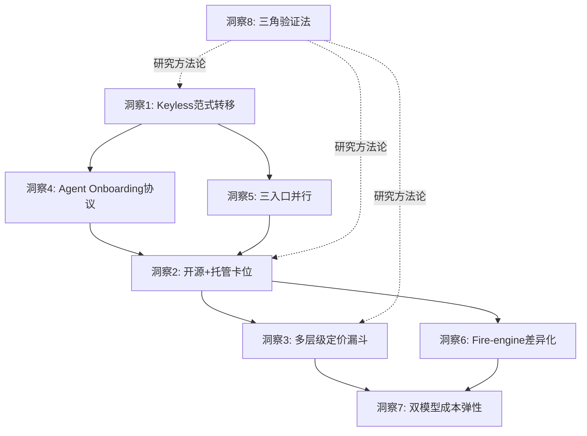

+++
id = "retrospective-firecrawl-learning-20260629-insight"
date = "2026-06-29"
type = "insight-index"
source = "https://github.com/firecrawl/firecrawl | https://www.firecrawl.dev/pricing | https://mp.weixin.qq.com/s/Kk_Z4d3Ft7SKejgQoLCHXg"
+++

# 洞察萃取：Firecrawl 的 8 个核心洞察与可复用模式

## 📂 文件索引

| 文件 | 洞察 | 类别 | 成熟度 |
|------|------|------|--------|
| [insight-1-keyless.md](insights/insight-1-keyless.md) | Agent 时代 API 设计范式转移（Keyless） | 战略范式 | L3 |
| [insight-2-open-core.md](insights/insight-2-open-core.md) | 开源+托管双轨的基础设施卡位策略 | 战略范式 | L4 |
| [insight-3-tiered-credit.md](insights/insight-3-tiered-credit.md) | 多层级 PLG 定价漏斗与 Credit 经济学 | 产品设计 | L3 |
| [insight-4-agent-onboarding.md](insights/insight-4-agent-onboarding.md) | Agent Onboarding：AI 自主接入协议 | 产品设计 | L2 |
| [insight-5-omnichannel-api.md](insights/insight-5-omnichannel-api.md) | 三入口并行：MCP/CLI/REST 降低接入摩擦 | 产品设计 | L3 |
| [insight-6-operational-moat.md](insights/insight-6-operational-moat.md) | 托管-自托管差异化能力区隔（Fire-engine） | 技术架构 | L4 |
| [insight-7-dual-model.md](insights/insight-7-dual-model.md) | 双模型策略：成本-质量弹性切换 | 技术架构 | L3 |
| [insight-8-triangular-verification.md](insights/insight-8-triangular-verification.md) | 三源信息三角验证法 | 方法论 | L2 |

## 洞察统计

- **总数**：8 个核心洞察
- **战略范式**：2 个（Keyless、开源+托管）
- **产品设计**：3 个（定价、Onboarding、三入口）
- **技术架构**：2 个（运营护城河、双模型）
- **方法论**：1 个（三角验证法）
- **平均成熟度**：L3（L2:2个 / L3:4个 / L4:2个）

---

## 跨洞察关联分析

8 个洞察之间存在内在关联，共同构成 Firecrawl 的完整战略图景：

**核心逻辑链**：
- **洞察1（Keyless）**是战略起点：判断 Agent 时代 API 范式将转移
- **洞察4+5（Onboarding+三入口）**是实现手段：让 Agent 能零摩擦接入
- **洞察2（开源+托管）**是商业框架：开源占领心智，托管变现
- **洞察3+6（定价+Fire-engine）**是变现机制：多层漏斗+差异化能力驱动付费
- **洞察7（双模型）**是产品优化：在成本和质量间提供弹性
- **洞察8（三角验证）**是元方法论：支撑以上所有洞察的研究方法

---

## 对 SpecWeave 的借鉴价值矩阵

| 洞察 | 借鉴价值 | 借鉴方式 | 紧迫度 | 对应行动项 |
|------|---------|---------|--------|-----------|
| 洞察1：Keyless 模式 | 高 | Agent 间服务调用可设计零配置试用机制 | 🟡中 | [行动2](actions/action-2-skill-discovery.md) |
| 洞察2：开源+托管双轨 | 中 | 内部工具不直接适用，但"能力分层"思想可参考 | 🟢低 | — |
| 洞察3：层级化 Credit 经济 | 高 | 多 agent 协作中的资源配额和优先级调度 | 🟡中 | [行动3](actions/action-3-credit-model.md)（暂缓） |
| 洞察4：Agent Onboarding | 高 | .agents/skills/ 体系可增加标准化的 SKILL.md 发现协议 | 🔴高 | [行动2](actions/action-2-skill-discovery.md) |
| 洞察5：三入口并行 | 中 | 指令集/自然语言/MCP 多入口已实践，可进一步对等化 | 🟢低 | — |
| 洞察6：运营型护城河 | 低 | 内部工具场景不适用 | ⚪不适用 | — |
| 洞察7：双模型策略 | 中 | 可在 LLM 调用层提供成本-质量弹性选项 | 🟡中 | [行动4](actions/action-4-dual-model.md) |
| 洞察8：三角验证法 | 高 | 纳入洞察指令集标准方法论 | 🔴高 | [行动1](actions/action-1-triangular-verification.md) |
