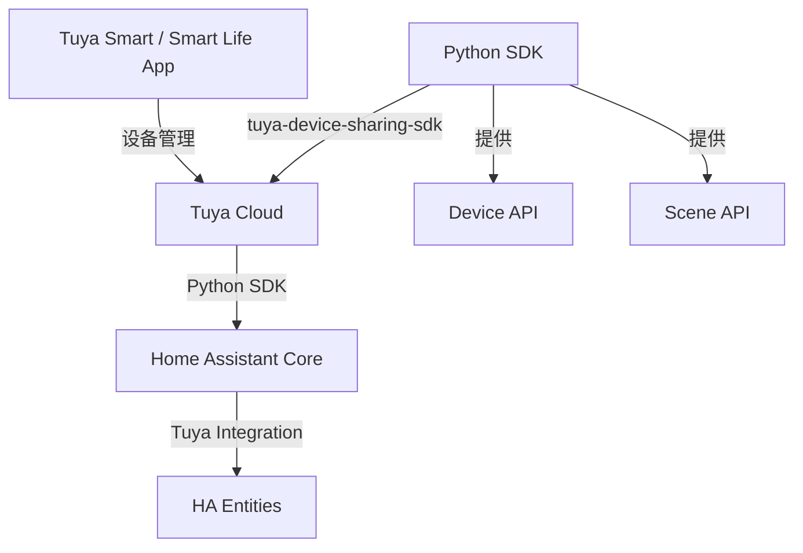
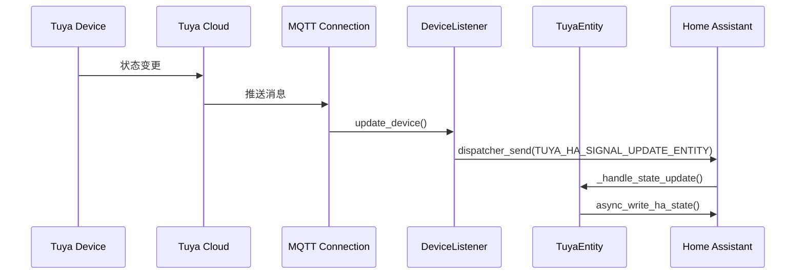
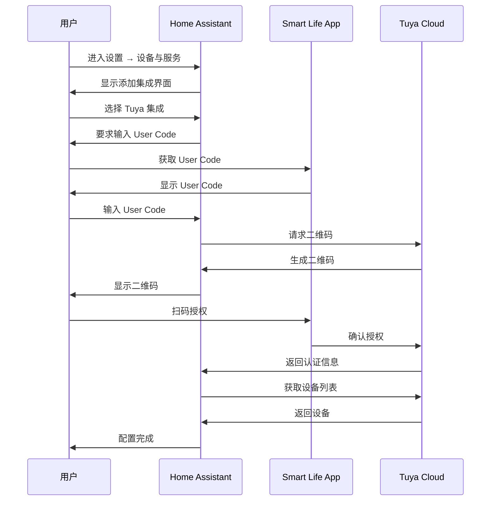
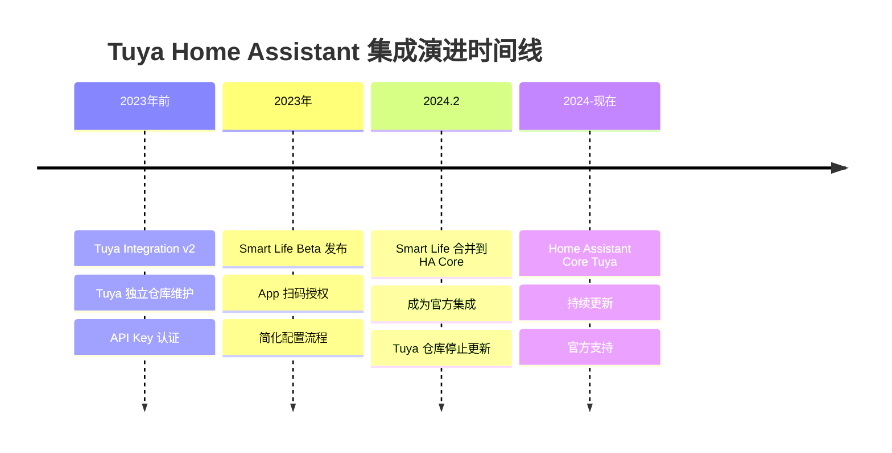

+++
id = "home-assistant-tuya-official-integration"
source = "https://www.home-assistant.io/integrations/tuya/"
created_at = "2026-06-30"
tags = ["Home Assistant", "Tuya", "Official Integration", "IoT", "Smart Home", "current"]
maturity = "L3"
validation_count = 1
reuse_count = 0
+++

# Home Assistant 官方 Tuya 集成分析报告

> **报告状态**：✅ **当前官方方案**
> **文档来源**：https://www.home-assistant.io/integrations/tuya/
> **代码仓库**：https://github.com/home-assistant/core（位于 `homeassistant.components.tuya`）
> **生成日期**：2026-06-30

---

## 第一章：项目概述

### 1.1 项目定位

Home Assistant 官方 Tuya 集成是 Home Assistant 核心仓库中的原生集成，用于连接和控制所有 **Powered by Tuya (PBT)** 设备。该集成整合了原 Tuya Integration 和 Smart Life Integration 的功能，为用户提供统一的设备控制体验。

### 1.2 核心特点

| 特性 | 说明 |
|------|------|
| **原生支持** | Home Assistant 核心集成，无需额外安装 |
| **设备来源** | Tuya Smart / Smart Life App 中的设备 |
| **配置方式** | App 扫码授权，无需 API Key |
| **云服务** | 依赖 Tuya Cloud |
| **本地控制** | 暂不支持 |

### 1.3 与演进链的关系

```
Tuya Integration (v2) → Smart Life (Beta) → Home Assistant Core Tuya Integration
     (废弃)                (废弃)                  (当前官方方案)
```

**演进路径说明**：
1. **Tuya Integration (v2)**：Tuya 官方仓库独立维护，代码已不再更新
2. **Smart Life (Beta)**：Tuya 开发的简化版集成，已合并到 HA Core 2024.2
3. **Home Assistant Core Tuya Integration**：当前官方方案，整合两者功能

---

## 第二章：技术架构

### 2.1 系统架构



### 2.2 依赖组件

| 组件 | 说明 |
|------|------|
| `tuya-device-sharing-sdk` | Python SDK，负责与 Tuya Cloud 通信 |
| `tuya-device-handlers` | 设备特定处理程序（如宠物喂食器） |
| HA Core | Home Assistant 核心框架 |

### 2.3 平台支持

**官方文档说明**：所有 Home Assistant 平台都被支持，但 **lock** 和 **remote** 平台除外。

支持的平台包括：

| 平台 | 说明 | 文件 |
|------|------|------|
| `alarm_control_panel` | 报警控制面板 | `alarm_control_panel.py` |
| `binary_sensor` | 二进制传感器 | `binary_sensor.py` |
| `button` | 按钮 | `button.py` |
| `camera` | 摄像头 | `camera.py` |
| `climate` | 空调/温控 | `climate.py` |
| `cover` | 窗帘/门 | `cover.py` |
| `event` | 事件 | `event.py` |
| `fan` | 风扇 | `fan.py` |
| `humidifier` | 加湿器 | `humidifier.py` |
| `light` | 灯光 | `light.py` |
| `number` | 数值控制 | `number.py` |
| `scene` | 场景 | `scene.py` |
| `select` | 选择器 | `select.py` |
| `sensor` | 传感器 | `sensor.py` |
| `siren` | 警报器 | `siren.py` |
| `switch` | 开关 | `switch.py` |
| `vacuum` | 扫地机器人 | `vacuum.py` |
| `valve` | 阀门 | `valve.py` |

### 2.4 核心代码架构

#### 2.4.1 文件结构

```
homeassistant/components/tuya/
├── __init__.py           # 集成入口，服务注册，设备初始化
├── const.py              # 常量定义（设备分类、DP Code、平台列表）
├── config_flow.py        # 配置流程（扫码授权）
├── coordinator.py        # 设备监听器和Token监听器
├── entity.py             # TuyaEntity基类
├── util.py               # 工具函数（设备信息、温度单位转换）
├── services.py           # 自定义服务（宠物喂食器计划）
├── diagnostics.py        # 诊断功能
├── manifest.json         # 集成元数据
├── services.yaml         # 服务定义
├── strings.json          # 翻译字符串
├── icons.json            # 图标定义
└── platform files/       # 各平台实现文件
```

#### 2.4.2 核心组件说明

**1. 集成入口 `__init__.py`**

负责集成的核心初始化流程：
- `async_setup()`：设置服务
- `async_setup_entry()`：配置条目初始化，创建DeviceListener，注册设备
- `cleanup_device_registry()`：清理设备注册表中不存在的设备
- `async_unload_entry()`：卸载集成，停止MQTT订阅
- `async_remove_entry()`：删除配置条目，撤销凭据

**2. 设备监听器 `coordinator.py`**

实现设备状态实时同步机制：

- **DeviceListener**：继承自 `SharingDeviceListener`
  - `initialize()`：初始化管理器和设备缓存
  - `update_device()`：设备状态更新时发送事件
  - `add_device()`：新设备添加
  - `remove_device()`：设备移除
  - `async_register_device()`：注册设备到设备注册表

- **_TokenListener**：继承自 `SharingTokenListener`
  - `update_token()`：Token更新时自动更新配置条目

**3. 实体基类 `entity.py`**

`TuyaEntity` 是所有 Tuya 设备实体的基类：

- 属性：`_attr_has_entity_name`、`_attr_should_poll`（禁用轮询）
- 初始化：设置设备信息、唯一ID、DP Code包装器
- `available`：设备在线状态
- `async_added_to_hass()`：注册状态更新监听器
- `_handle_state_update()`：处理设备状态更新
- `_async_send_commands()`：发送控制命令
- `_read_wrapper()`：读取包装器状态
- `_async_send_wrapper_updates()`：发送包装器更新

**4. 配置流程 `config_flow.py`**

实现 App 扫码授权的完整流程：

- `async_step_user()`：用户输入 User Code
- `async_step_scan()`：显示二维码，等待用户扫码
- `async_step_reauth()`：重新认证流程
- `__async_get_qr_code()`：获取二维码

**5. 工具函数 `util.py`**

- `get_temperature_unit()`：转换温度单位
- `get_device_temp_unit_convert()`：从设备状态获取温度单位
- `get_device_info()`：获取设备信息，支持 quirk 覆盖

**6. 服务 `services.py`**

提供宠物喂食器专用服务：

| 服务 | 说明 |
|------|------|
| `get_feeder_meal_plan` | 获取喂食计划 |
| `set_feeder_meal_plan` | 设置喂食计划 |

#### 2.4.3 设备分类体系

集成支持大量设备分类（DeviceCategory），涵盖以下类型：

| 分类 | 设备类型 | 示例 |
|------|---------|------|
| `dj` | 灯光 | 智能灯泡 |
| `cz/pc/kg` | 开关/插座 | 智能插座 |
| `sp` | 摄像头 | 智能摄像机 |
| `fs/fsd` | 风扇 | 智能风扇 |
| `kt/ktkzq` | 空调 | 智能空调 |
| `wk/wkf` | 温控器 | 智能温控 |
| `sd` | 扫地机器人 | 扫地机器人 |
| `jsq` | 加湿器 | 智能加湿器 |
| `kj` | 空气净化器 | 空气净化器 |
| `wsdcg` | 温湿度传感器 | 温湿度传感器 |
| `pir/mcs` | 人体传感器 | 人体感应传感器 |

#### 2.4.4 DP Code 体系

DP Code（Data Point Code）是 Tuya 设备功能的标识符：

- **开关类**：`switch`、`switch_1`-`switch_8`
- **温度类**：`temp`、`temp_current`、`temp_set`
- **亮度类**：`bright_value`、`bright_value_v2`
- **颜色类**：`colour_data`、`colour_data_v2`、`colour_data_hsv`
- **功率类**：`cur_power`、`cur_current`、`cur_voltage`
- **传感器类**：`humidity`、`pm25_value`、`co2_value`

#### 2.4.5 设备处理程序（Quirks）机制

通过 `tuya-device-handlers` 库支持设备特定功能：

```python
# coordinator.py 中的初始化流程
register_tuya_quirks(str(Path(hass.config.config_dir, "tuya_quirks")))
TUYA_QUIRKS_REGISTRY.initialise_device_quirk(device)
```

**工作原理**：
1. 启动时加载自定义 quirk 文件
2. 根据设备 `product_id` 匹配对应的处理程序
3. 处理程序可以覆盖设备的制造商、型号、功能映射

#### 2.4.6 状态更新机制

采用事件驱动的状态更新模式：



---

## 第三章：配置流程

### 3.1 前置要求

1. **Tuya Smart 或 Smart Life App** 已安装并创建账户
2. **至少添加一个设备** 到 App
3. **第二屏幕**：用于显示配置过程中的二维码（手机、平板或电脑）
4. **Smart Life / Tuya Smart App**：用于扫描二维码

### 3.2 获取用户码

配置过程中需要获取 **User Code**：

1. 打开 Smart Life / Tuya Smart App
2. 点击底部导航栏的 **Me**
3. 点击右上角 **⚙️ (齿轮)** 图标
4. 点击 **Account and Security**
5. 底部显示 **User Code**

### 3.3 配置步骤



### 3.4 设备同步

添加新设备后需要重新加载集成：

1. 进入 **Settings → Devices & services**
2. 找到 Tuya 集成
3. 点击三个点菜单
4. 选择 **Reload**

---

## 第四章：功能特性

### 4.1 场景支持

Tuya App 中创建的场景会自动出现在 Home Assistant 的场景列表中，下次集成更新时同步。

### 4.2 设备诊断

可以通过诊断文件查看设备支持的数据点：

1. 进入 **Settings → Devices & services**
2. 找到 Tuya 集成或具体设备
3. 点击三个点菜单
4. 选择 **Download diagnostics**
5. 查看 JSON 中的 `status`、`status_range`、`function` 键

### 4.3 专用动作

| 动作 | 说明 |
|------|------|
| `tuya.get_feeder_meal_plan` | 获取宠物喂食器喂食计划 |
| `tuya.set_feeder_meal_plan` | 设置宠物喂食器喂食计划 |

### 4.4 问题排查

#### 不支持的设备或功能

**原因**：集成依赖官方 Python SDK，不包含 SmartLife 所有功能。

**解决方案**：
- 下载设备诊断 JSON
- 检查 `status`、`status_range`、`function` 键
- 若全为空，仅场景可用

#### 每次重载后需要重新认证

**原因**：Tuya 更新服务条款时会导致认证失效。

**解决方案**：
1. 登录 iot.tuya.com 并接受条款
2. 重启 Home Assistant
3. 重新配置 Tuya 集成

#### 宠物喂食器不支持

**原因**：需要 tuya-device-handlers 支持。

**解决方案**：
1. 在 iot.tuya.com 获取 QueryThingsDataModel API 结果
2. 在 [tuya-device-handlers](https://github.com/home-assistant-libs/tuya-device-handlers) 提交 Issue

---

## 第五章：与其他方案的对比

### 5.1 演进链完整对比

| 维度 | Tuya Integration (v2) | Smart Life (Beta) | HA Core Tuya |
|------|----------------------|-------------------|--------------|
| **状态** | 废弃 | 废弃（已合并） | 当前官方方案 |
| **代码位置** | Tuya 独立仓库 | Tuya 独立仓库 | HA Core 核心 |
| **配置方式** | API Key + Secret | App 扫码 | App 扫码 |
| **云服务** | IoT Core Service 订阅 | 无需订阅 | 依赖云服务 |
| **维护方** | Tuya 官方 | Tuya 官方 | Home Assistant 官方 |
| **更新频率** | 停止 | 停止 | 与 HA 同步 |
| **设备支持** | 11 个平台 | 16 个平台 | 全部平台 |

### 5.2 技术差异分析

| 维度 | 差异说明 |
|------|---------|
| **SDK** | 均使用 `tuya-device-sharing-sdk` |
| **认证** | 均使用 App 扫码授权（Smart Life 引入） |
| **设备处理** | Smart Life 引入的设备handlers被保留 |
| **本地控制** | 三个方案均不支持 |

---

## 第六章：演进链总结

### 6.1 完整演进时间线



### 6.2 关键演进决策

| 决策 | 背景 | 影响 |
|------|------|------|
| 引入 App 扫码授权 | 降低用户配置门槛 | Smart Life 的核心创新 |
| 合并到 HA Core | 统一用户体验 | 成为官方支持的集成 |
| 废弃独立仓库 | 减少维护成本 | 集中在 HA 生态发展 |

### 6.3 设计模式继承

从演进链中继承的设计模式：

1. **二维码授权模式**：来自 Smart Life，已成标准
2. **实体基类设计**：统一的实体抽象
3. **类型数据抽象**：Integer/Enum/Electricity 类型
4. **设备监听器**：实时状态同步

---

## 第七章：使用建议

### 7.1 推荐场景

✅ **推荐使用**：
- 新用户首次配置 Tuya 设备
- Home Assistant 新版本用户
- 需要官方支持的用户

⚠️ **需注意**：
- 需要 Tuya Cloud 连接
- 不支持本地控制
- 部分设备功能可能不可用

❌ **不适用**：
- 需要本地控制的场景
- 需要 Tuya IoT 平台高级功能的场景

### 7.2 替代方案

如需本地控制，可考虑：
- **Local Tuya** 集成（社区维护）
- **Tuya Local** 自定义组件

### 7.3 故障排查资源

| 资源 | 链接 |
|------|------|
| 官方文档 | https://www.home-assistant.io/integrations/tuya/ |
| HA 论坛 | https://community.home-assistant.io/ |
| Tuya SDK | https://github.com/tuya/tuya-device-sharing-sdk |
| 设备处理 | https://github.com/home-assistant-libs/tuya-device-handlers |

---

## 第八章：模式萃取

### 8.1 可复用模式清单

从代码分析中萃取的 4 个可复用设计模式：

| 模式 | 描述 | 文件 |
|------|------|------|
| **DeviceWrapper 模式** | 将 DP Code 抽象为统一的类型安全数据访问接口 | [pattern-1-device-wrapper.md](patterns/pattern-1-device-wrapper.md) |
| **事件驱动状态更新** | 通过 MQTT 推送和 dispatcher 机制实现实时状态同步 | [pattern-2-event-driven-state-update.md](patterns/pattern-2-event-driven-state-update.md) |
| **设备分类到平台映射** | 通过 DeviceCategory 映射实现设备自动发现和实体创建 | [pattern-3-device-category-mapping.md](patterns/pattern-3-device-category-mapping.md) |
| **Quirks 扩展机制** | 允许用户为特定设备提供自定义处理逻辑，无需修改核心代码 | [pattern-4-quirks-extension.md](patterns/pattern-4-quirks-extension.md) |

### 8.2 模式应用场景

这些模式适用于：
- IoT 设备集成开发
- 大规模设备管理
- 实时状态同步系统
- 非标准设备定制化支持

---

## 第九章：关联报告

### 9.1 演进链历史

| 报告 | 状态 | 说明 |
|------|------|------|
| [Tuya Integration 报告](../retrospective-tuya-home-assistant-learning-20260630/) | ⚠️ 废弃 | 演进链第一阶段 |
| [Smart Life 报告](../retrospective-smart-life-learning-20260630/) | ⚠️ 废弃 | 演进链第二阶段 |

### 9.2 演进链关系图

```
[Tuya Integration] → [Smart Life] → [Home Assistant Core Tuya]
     (废弃)              (废弃)              (当前官方)
     ↓                   ↓                      ↓
  独立仓库           独立仓库            HA Core 原生
  API Key           App 扫码             App 扫码 + 官方支持
```

### 9.3 相关资源

| 资源 | 链接 |
|------|------|
| Home Assistant | https://www.home-assistant.io/ |
| Tuya 集成文档 | https://www.home-assistant.io/integrations/tuya/ |
| HA 核心代码 | https://github.com/home-assistant/core |
| Tuya SDK | https://github.com/tuya/tuya-device-sharing-sdk |
| 设备处理 | https://github.com/home-assistant-libs/tuya-device-handlers |
