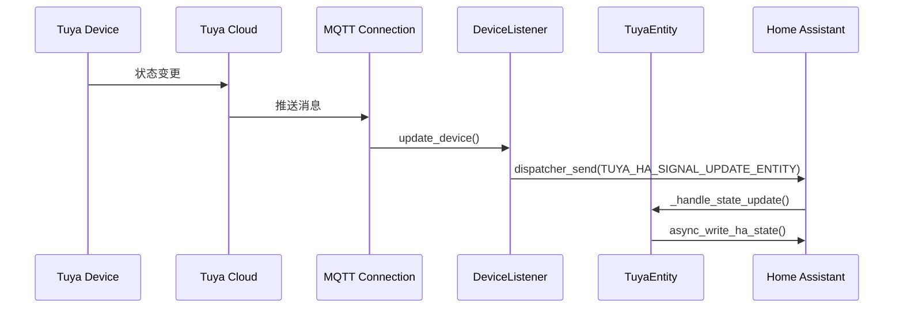

# 模式 2：事件驱动状态更新模式

**模式名称**：事件驱动状态更新模式

**核心理念**：
> 采用事件驱动架构，通过 MQTT 推送实现设备状态的实时同步，避免轮询带来的性能问题，实现低延迟的状态更新。

**适用场景**：
- 需要实时状态同步的 IoT 设备集成
- 大规模设备管理场景
- 性能敏感的状态更新场景

**实现步骤**：

```markdown
1. **定义事件监听器**
   - DeviceListener：监听设备状态变更、添加、移除事件
   - TokenListener：监听 Token 更新事件
   - 继承 SDK 提供的监听器接口

2. **实现事件回调**
   - update_device()：设备状态更新时发送 dispatcher 信号
   - add_device()：新设备添加时触发发现流程
   - remove_device()：设备移除时清理实体

3. **注册事件处理器**
   - 实体注册 dispatcher 连接
   - 监听特定设备的状态更新信号
   - 状态变化时触发 _handle_state_update()

4. **状态写入**
   - 处理状态更新后调用 async_write_ha_state()
   - 异步更新 Home Assistant 状态
```

**关键代码示例**：

```python
# coordinator.py - 发送事件
def update_device(self, device, updated_status_properties, dp_timestamps):
    dispatcher_send(self.hass, f"{TUYA_HA_SIGNAL_UPDATE_ENTITY}_{device.id}", 
                    updated_status_properties, dp_timestamps)

# entity.py - 监听事件
async def async_added_to_hass(self):
    self.async_on_remove(
        async_dispatcher_connect(
            self.hass,
            f"{TUYA_HA_SIGNAL_UPDATE_ENTITY}_{self.device.id}",
            self._handle_state_update,
        )
    )
```

**状态更新时序图**：



**效果验证**：
- 实时状态同步，延迟 < 1 秒
- 无需轮询，降低资源消耗
- 支持大规模设备管理

**局限性**：
- 依赖 MQTT 连接稳定性
- 需要处理断连重连场景
- 消息丢失可能导致状态不一致

**可复用场景**：
- IoT 设备状态同步
- 实时数据更新场景
- 事件驱动架构设计

---

**[返回洞察萃取索引](../insight-extraction.md)**
