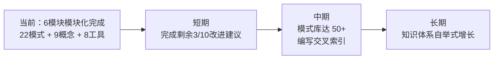

# 四、导出建议

## 4.1 关联报告

- [retrospective-report-agents-spec-system-comprehensive.md](../../spec-system/retrospective-report-agents-spec-system-comprehensive/) — 深度版复盘报告
- [retrospective-insight-optimization-cycle.md](../retrospective-insight-optimization-cycle/) — 优化周期洞察报告
- [retrospective-insight-extraction-worlds-collaboration-environment.md](../retrospective-insight-extraction-worlds-collaboration-environment/) — 协作环境洞察报告
- [retrospective-export-20260623.md](../../project-governance/archiving-and-migration/retrospective-export-20260623/) — 导出专项报告

## 4.2 后续方向

## 4.3 改进建议追踪

| # | 优先级 | 建议 | 状态 |
|---|--------|------|------|
| — | 高 | 完成剩余 3/10 改进建议 | 进行中 |
| — | 中 | 建立模式库快速检索指南 | 待规划 |
| — | 低 | 编写跨项目元分析报告 | 待规划 |

---