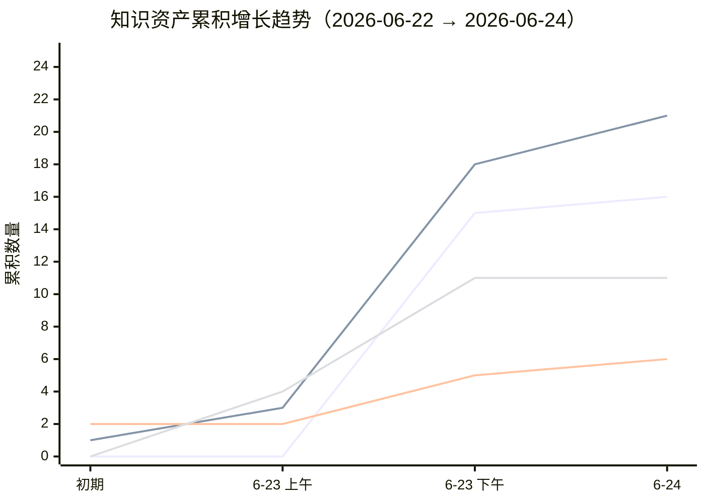

+++
id = "retrospective-meta-analysis-cross-project-insight"
date = "2026-06-24"
type = "insight-extraction"
source = "docs/retrospective/reports/insight-extraction/retrospective-meta-analysis-cross-project.md"
+++

# 三、洞察萃取

## 3.1 资产增长率分析

### 3.1.1 复盘报告累积增长

```
时间线（2026-06-22 → 2026-06-24）：

2026-06-22  0 份 ─┐
                   │ agents-spec-system（初版 + 全面版）
2026-06-23  2 份 ─┤ 
                   │ + 10 份项目复盘报告
2026-06-23  4 份 ─┤
                   │ + 2 份洞察报告
2026-06-23  6 份 ─┤
                   │ + 2 份综合报告
2026-06-23  8 份 ─┤
                   │
2026-06-23 10 份 ─┤
                   │
2026-06-23 12 份 ─┤
                   │
2026-06-23 14 份 ─┤
                   │
2026-06-23 15 份 ─┤
                   │
2026-06-24 16 份 ─┘ （本报告）
```

报告产出呈现**爆发式增长**特征：首日累积 15 份，次日新增 1 份。增长驱动因素为多项目并行推进 + 每个项目完成后立即复盘的制度化流程。

### 3.1.2 模式文件累积增长

| 类别 | 数量 | 来源项目 |
|------|:---:|---------|
| 架构模式 (architecture-patterns) | 5 | agents-spec-system, create-apps-directory, worlds-collaboration |
| 代码模式 (code-patterns) | 5 | refactor-retrospective-docs, check-spec-consistency, readme-subagent-extraction |
| 方法论模式 (methodology-patterns) | 10 | 几乎所有项目均有贡献 |
| **合计** | **21**（含 1 个 README） | |

方法论模式的数量（10）远超架构模式（5）和代码模式（5），说明项目当前阶段的核心产出是**可迁移的工作方法**，而非特定技术架构。

### 3.1.3 模板文件累积增长

| 模板 | 首次出现来源 |
|------|------------|
| retrospective-report-template.md | refactor-retrospective-docs |
| spec-template.md | agents-spec-system |
| tasks-template.md | agents-spec-system |
| checklist-template.md | agents-spec-system |
| directory-readme-template.md | readme-atomization |
| role-marker-design-template.md | cofounder-improvement |
| **合计：6** | |

### 3.1.4 框架与概念文件累积

- **决策框架**：4 个（目录命名、依赖管理、元文档处理、语义匹配阈值）
- **知识概念**：7 个（上下文感知、元文档、正交验证、模式成熟度、语义前缀、规范自举、零依赖原则）

### 3.1.5 综合增长率



**关键观察**：复盘报告在 6月23日出现爆发式增长（从 0 到 15），模式文件紧随其后（从 1 到 21），体现了"先复盘中萃取"的递进关系。模板、框架和概念的增长更为平缓，因为它们需要更长时间的验证和抽象。

## 3.2 跨周期洞察结论

### 结论一：Spec-driven 与并行执行是体系的两大核心支柱

在 16 份报告中，Spec-driven 出现 7 次，并行执行出现 10 次，二者的组合覆盖了近 70% 的项目。它们分别回答了 AI 辅助开发的"正确性"问题和"效率"问题——spec 确保做正确的事，并行确保正确地、快速地做事。这一组合已经在 13 个项目中反复验证，可视为本体系的核心方法论双支柱。

### 结论二：知识闭环的自我改进已形成复利效应

复盘→洞察→导出闭环的最重要特性不是"闭环本身"，而是"闭环在自我改进"。从 optimization-cycle 的 5 项行动建议全部执行（改进报告模板），到 cofounder-improvement 的 3 项改进全部执行（改进后模板被用于追踪改进进度），再到 insight-execution 的"改进的改进"自举循环——每一轮闭环都使下一轮闭环更高效。这是体系最健康的信号：**它不仅在做事，而且在把做事的方式变得更好**。

### 结论三：顽固问题的根因在流程缺失，而非个体疏忽

关联系统影响遗漏、行动项遗留、路径引用错误、模板不完善——这四类顽固问题的共同根因是"流程缺失"，而非"个体疏忽"。每个问题在被发现后都得到了修复，但由于缺乏制度化的检查机制，类似问题在后续项目中反复出现。**弥补流程缺失的优先级应高于修复个别问题的优先级**。

### 结论四：知识体系已进入"自持优化"阶段

项目已从"创建阶段"（0→1，建立基本规范体系）过渡到"优化阶段"（N→N+，持续改进已有体系），并正在进入"自持阶段"（Self-sustaining：体系通过自我复盘和自我改进维持运行）。进入自持阶段的三个标志均已出现：
- **工具治理工具**：check-links 发现断链催生 check-move，generate-nav 替代手动导航维护
- **方法论改进方法论**：复盘闭环在改进复盘报告模板本身
- **规范规定如何扩展规范**：role-auto-creation.md 定义了创建新角色规范的规范

### 结论五：短期最大杠杆点在"行动项治理"

在所有顽固问题中，行动项遗留是唯一尚未有系统化解决方案的问题。当前约 25 项"待规划"行动项散落在 12 份报告的"行动计划"表格中，缺乏统一追踪。建立"行动项自动扫描脚本"能以最低成本实现最高的治理收益——一次性识别全部悬置行动项，防止其长期沉没。

---
