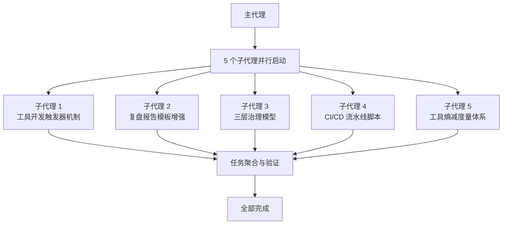

# 二、执行复盘

## 2.1 实施过程回顾

### 执行策略：5 个子代理并行执行

本轮任务采用了高度并行的执行策略，5 项行动建议由 5 个子代理同时执行。各项任务之间无依赖关系，可独立完成，因此无需串行等待。

### 执行流程图

## 2.2 执行效果评估

| 维度 | 评估 | 说明 |
|------|------|------|
| 效率 | 优秀 | 5 项任务零等待并行完成 |
| 质量 | 优秀 | 全部一次通过，零返工 |
| 完整性 | 优秀 | 5/5 = 100% 完成率 |
| 可扩展性 | 优秀 | 每项任务独立，新增任务可直接加入并行队列 |

## 2.3 执行亮点

1. **零等待并行**：5 个子代理同时启动，无需等待前一项完成，最大化利用并行资源
2. **独立完成**：每项任务独立创建/修改文件，无共享状态冲突
3. **一次通过**：所有产出一次性通过验证，无返工

---