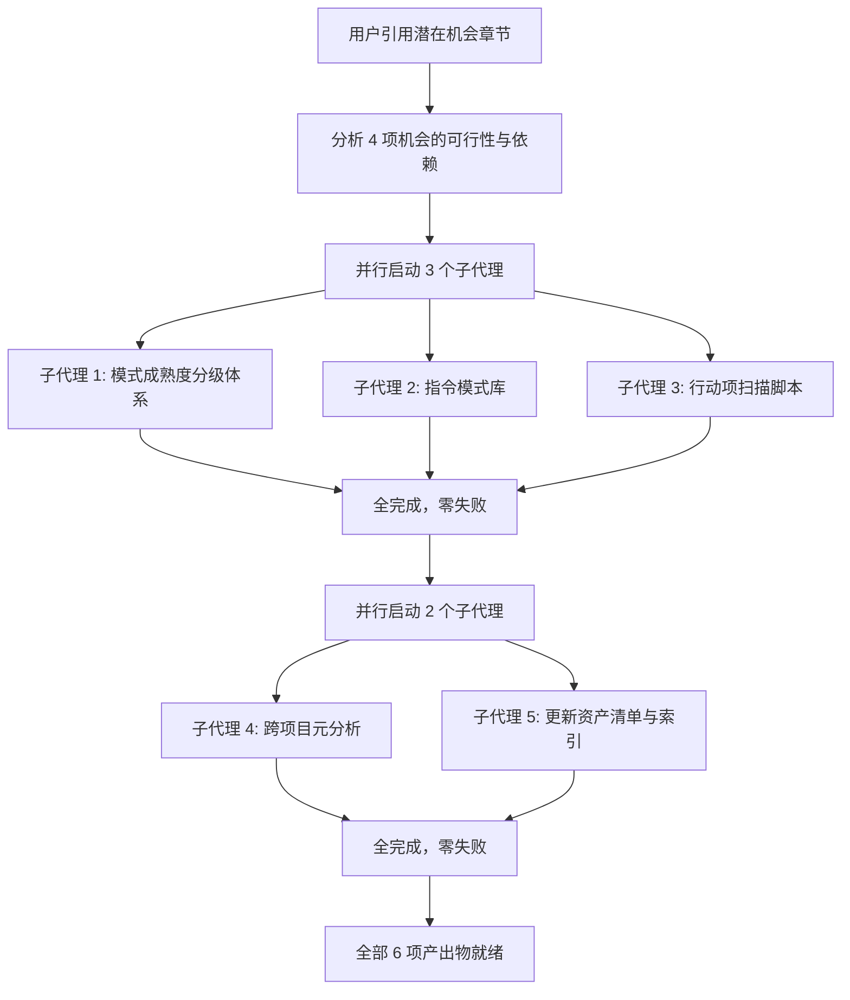

# 二、复盘环节

## 2.1 实施过程回顾

**时间线**：

| 阶段 | 动作 | 产出 |
|---|---|---|
| 触发 | 用户引用 insight 报告 L139，触发实施 | 识别出 4 项待实施机会 |
| 第一轮并行 | 3 个子代理同时执行：概率最高的机会（#1、#4）和数据驱动型（#2） | 3 个文件创建完成 |
| 第二轮并行 | 2 个子代理同时执行：深度分析型（#3）和索引同步型（#5） | 2 个文件变更完成 |
| 完成 | 全部 4 项机会落地 | 6 个文件变更，零遗留 |

## 2.2 关键节点分析

#### 关键决策 1：按"独立性 + 产出类型"分组并行

- **决策依据**：4 项机会之间完全无依赖关系，但产出类型不同（文档 vs 脚本 vs 分析）。
- **技术挑战**：如果 4 项全部塞给一个子代理，上下文会膨胀且串行阻塞。
- **解决方案**：第一轮并行 3 项独立创作型任务（概念文档 + 方法论模式 + Python 脚本），第二轮并行依赖数据就绪的任务（跨项目分析需先读取报告目录，索引更新需等新模式就绪——但实际上索引子代理不依赖其他子代理的产出，它们读取的是磁盘文件，而文件在第一轮已写完）。

#### 关键决策 2：check-action-items.py 的零依赖设计

- **决策依据**：遵循项目既有的零依赖原则（所有 `.agents/scripts/` 下的脚本仅使用 Python 标准库）。
- **技术挑战**：需要在无第三方库的情况下解析 Markdown 表格、匹配模糊状态字符串。
- **解决方案**：使用子串包含匹配表头（`| 优先级 | 改进项 | 具体措施 |`），对状态值使用 Python `in` 操作符做模糊匹配，天然支持全角/半角差异。

#### 关键决策 3：跨项目元分析的六维分析框架

- **决策依据**：需要从 16 篇报告中提取有意义的交叉规律，而非逐篇罗列摘要。
- **技术挑战**：16 篇报告约 20 万字，逐一精读不现实。
- **解决方案**：定义六个分析维度（数据全景、高频模式、顽固问题、演化趋势、资产增长率、跨周期洞察），让子代理按维度结构化提取信息，产出聚焦于交叉规律而非单篇内容。

## 2.3 执行情况与结果数据

| 指标 | 数值 | 说明 |
|---|---|---|
| 实施机会数 | 4/4 | 全部完成 |
| 新增文件数 | 4 | 概念文档 + 脚本 + 报告 + 方法论模式 |
| 修改文件数 | 2 | 资产清单 + 索引 |
| 子代理调用次数 | 5 | 第一轮 3 个并行，第二轮 2 个并行 |
| 子代理成功率 | 100% (5/5) | 零失败，零重试 |
| 脚本扫描报告数 | 16 | check-action-items.py 实测结果 |
| 发现待规划行动项 | 21 | 来自 5 篇不同报告 |
| 跨项目分析覆盖报告数 | 16 | 全部复盘/洞察报告 |

## 2.4 成功经验

1. **"引用即触发"：用户通过选中行号精准指定执行范围**。用户选中 `#L139`（潜在机会章节）而非给出文字描述，避免了歧义——智能体无需猜测"用户要我做什么"，直接定位到具体章节的全部 4 项机会并逐一实施。

2. **并行策略的"产出类型分层"**。第一轮并行创作型任务（写新文件），第二轮并行分析型和维护型任务（读已有文件后产出）。这种分层的收益在于：第一轮的文件写入在第二轮开始前已物理就绪，分析型任务可以直接读取。

3. **跨项目元分析的价值远超单项目复盘**。通过一次性扫描 16 篇报告，自动发现了单篇复盘无法揭示的规律——例如"多智能体并行执行"在 63% 的报告中出现、"关联系统影响遗漏"在 4 个不同项目中反复发生。这种跨项目视角是人工逐篇翻阅难以形成的。

4. **行动项扫描脚本填补了治理盲区**。在此之前，项目对"待规划"行动项无系统化追踪。脚本运行后一次发现 21 个待规划项（高:6 中:8 低:7），分布在 5 篇不同报告中——这个数字说明如果没有自动化扫描，大量行动项会长期沉没。

## 2.5 存在问题

| 问题 | 根因分析 | 影响评估 |
|---|---|---|
| 跨项目元分析的"演化趋势"维度依赖人工标注的报告日期 | 部分早期报告缺少复盘日期字段或格式不统一，导致趋势分析的时间精度受限 | 影响可控——趋势分析仍得出了有意义的结论，但时间粒度为"日"而非更精确的"会话" |

---