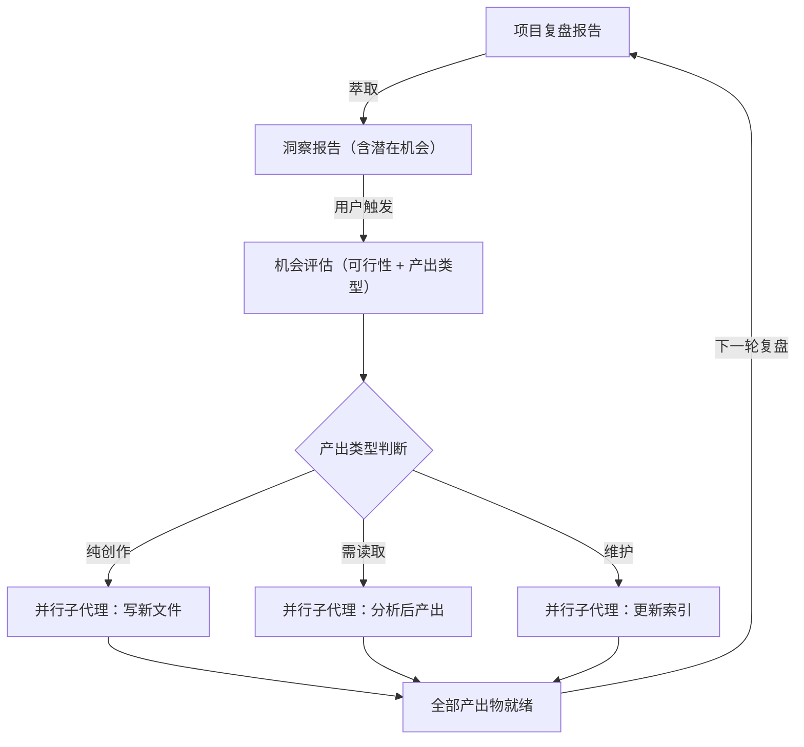

+++
id = "retrospective-report-insight-opportunities-implementation-insight"
date = "2026-06-23"
type = "insight-extraction"
source = "docs/retrospective/reports/retrospective-report-insight-opportunities-implementation.md#三"
+++

# 三、洞察环节

## 3.1 关键发现

#### 发现 1："潜在机会 → 实施"的周转时间为零

在本项目中，机会从识别（洞察报告的潜在机会章节）到全部落地（本次实施）仅间隔了 **同一会话中的 2 轮交互**（用户选中章节 + 智能体执行）。这在传统软件工程中需要经历"评审→排期→分配→开发→测试→发布"多个阶段，耗时数天到数周。

**深层含义**：AI 协作环境将"规划"和"执行"压缩到了同一时间窗口。复盘报告中的"潜在机会"不再是一种"远期愿景"，而是一种"即时待办清单"——只要用户触发，就能立刻落地。

#### 发现 2：多篇报告中的"待规划"行动项形成隐藏技术债务

`check-action-items.py` 运行结果揭示了一个此前不可见的事实：21 个待规划行动项散落在 5 篇不同报告中，最高优先级的 6 项迟迟未执行。这些行动项之所以被"遗忘"，并非因为它们不重要，而是因为**缺乏统一的可视化追踪机制**——每篇报告独立存在，没有上层工具汇总。

**深层含义**：知识资产的价值不仅在于"被创建"，更在于"被追踪"。一个复盘报告产出的行动项如果无法被系统化追踪，其价值仅停留在文档层面——直到有自动化脚本将其重新"激活"。

#### 发现 3："概念→模式→脚本→报告→索引"五类产出形成互补覆盖

本次 4 项机会的产出物覆盖了项目知识体系的全部 5 类资产：

| 机会 | 产出物 | 资产类别 |
|------|--------|---------|
| 模式成熟度分级 | pattern-maturity-levels.md | 概念（concept） |
| 指令模式库 | short-command-patterns.md | 方法论文档（pattern） |
| 行动项扫描 | check-action-items.py | 脚本（script） |
| 跨项目元分析 | retrospective-meta-analysis-cross-project.md | 报告（report） |
| 索引同步 | asset-inventory.md / README.md | 索引（index） |

**深层含义**：一次高质量的机会实施不应只产生单一类型的产出。最高效的实施方式是让每项机会**落位到最合适的知识形态**——成熟度体系天然是"概念"、指令库天然是"方法论模式"、扫描逻辑天然是"脚本"、综合分析天然是"报告"。

## 3.2 规律认知

#### 方法论：洞察报告驱动的"机会→实施"循环

此循环的核心特征：

1. **触发源单一**：用户只需引用洞察报告中的"潜在机会"章节，无需重复描述需求
2. **并行实施**：高可行性机会在一次会话中全部落地，不拆分为多次独立任务
3. **全类别覆盖**：一次实施通常产出 3-5 类不同知识形态的资产
4. **索引同步**：新产出立即注册到资产清单和 README，保证可发现性

## 3.3 潜在机会

| 机会 | 描述 | 可行性 |
|------|------|--------|
| 将 check-action-items.py 集成到 CI | 在 pre-commit 或 CI 流程中运行脚本，当存在待规划项时输出警告 | 高——脚本退出码已适配（有待规划项时退出码为 1） |
| 在资产清单中为每个模式标注成熟度级别 | 将 pattern-maturity-levels.md 中的 25 项资产快照同步到 asset-inventory.md 的"成熟度"列 | 高——数据已就绪，仅需表格修改 |
| "顽固问题"专项治理 | 针对跨项目元分析识别的四类顽固问题（关联系统影响遗漏、行动项遗留、路径引用错误、文档不完善），逐一制定系统性解决方案 | 中——需要跨报告协调 |
| 报告日期标准化 | 为所有复盘报告统一复盘日期格式，提升自动化分析的精度 | 低——纯维护性工作 |

---