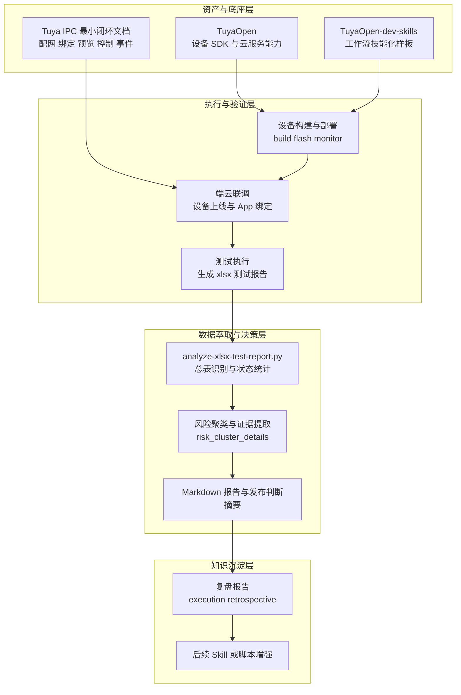

+++
id = "retrospective-tuya-projects-for-xlsx-agentization-20260701-execution"
date = "2026-07-01"
type = "execution-retrospective"
source = "docs/retrospective/assets/asset-inventory.md#资产清单与复用指南"
+++

# 执行过程复盘

## 一、任务背景

本次复盘不是重新发明一套新方案，而是基于已盘点资产，把涂鸦相关项目与 `xlsx` 自动分析能力放回同一条可执行链路中重新定位：

- 上游是 `TuyaOpen` 与 `Tuya IPC` 的设备侧、云侧、移动端最小闭环能力
- 中游是 `TuyaOpen-dev-skills` 这类“把工作流变成可执行技能”的平台化方法
- 下游是 `.agents/scripts/analyze-xlsx-test-report.py` 所代表的 `xlsx` 报告自动解析、风险聚类与发布判断摘要能力

这条链路的目标不是只做“学习报告”，而是回答一个更强的问题：

**当设备闭环跑通后，如何把测试结果持续收集、结构化分析，并沉淀为可复用的 agent 化能力。**

## 二、资产基线与子模块定位

### 2.1 已盘点资产

| 资产 | 角色定位 | 本次复盘中的作用 |
|------|----------|------------------|
| `docs/knowledge/learning/tuya-open-learning-report.md` | TuyaOpen 技术总览 | 提供端侧 SDK、云服务、AI 组件、构建工具链的分层认知 |
| `docs/knowledge/learning/tuyaopen-dev-skills-learning.md` | 工作流技能化样板 | 提供“最小 Skill + references + scripts”三分结构与可执行脚本化思路 |
| `docs/knowledge/operations/tuya-ipc-minimal-closed-loop.md` | Tuya IPC 最小闭环操作文档 | 定义配网、绑定、预览、控制、事件上报五个验收节点 |
| `.temp/libs/home-assistant/core/homeassistant/components/tuya/` | 官方云侧桥接实现 | 提供 `cloud_push` Hub 集成、`DeviceListener`/`TokenListener`、设备注册与诊断字段结构，为“云侧状态 -> 平台实体 -> 可诊断观察面”提供官方参照 |
| `.agents/scripts/analyze-xlsx-test-report.py` 相关 spec/plan | `xlsx` 报告 agent 化实现 | 负责测试报告解析、风险聚类、Markdown 导出与一页式发布判断摘要 |
| `docs/retrospective/reports/insight-extraction/retrospective-tuya-ipc-spec-and-xlsx-learning-20260701/` | 先前交付记录 | 提供“IPC 规格落地 + Excel 学习导出”已验证事实基础 |

### 2.2 子模块定位结论

从资产关系看，本次涉及的子模块不是同层竞争关系，而是分工清晰的上下游：

| 子模块 | 层级 | 核心职责 | 边界 |
|------|------|----------|------|
| `TuyaOpen` | 设备与平台底座层 | 提供 TKL/TAL/TDD/TDL 分层、云连接、AI 组件与构建工具链 | 不直接解决测试报告知识沉淀问题 |
| `Tuya IPC 最小闭环` | 场景落地层 | 将设备、云项目、App、事件上报收束成最小可验收链路 | 关注“如何跑通”，不负责规模化结果分析 |
| `homeassistant.components.tuya` | 官方平台桥接层 | 作为 HA Core 官方 Tuya 集成，把 Tuya Cloud 设备同步为标准实体、通过事件驱动保持状态新鲜，并暴露 `status/function/status_range` 等诊断观察面 | 不承担真实硬件联调，也不直接做测试报告解析或发版判断 |
| `TuyaOpen-dev-skills` | 平台执行层 | 把环境、编译、烧录、监控、调试变成可复用 Skill | 关注“如何让智能体可靠执行” |
| `xlsx agentization` | 数据萃取与决策层 | 把测试报告转成结构化 Markdown、风险证据和发版判断 | 关注“如何让测试结果可机器消费” |

结论是：

- `TuyaOpen` 解决“能力从哪里来”
- `Tuya IPC 闭环` 解决“能力是否真正跑通”
- `Home Assistant 官方 Tuya` 解决“云侧状态如何被标准化接入并保持可观测”
- `TuyaOpen-dev-skills` 解决“流程如何被智能体稳定执行”
- `xlsx agentization` 解决“执行结果如何被自动理解并进入决策链”

## 三、执行链路回顾

### 3.1 执行顺序

本轮执行逻辑可以概括为四段：

1. 先确定设备与平台侧的最小闭环边界，避免在抽象能力上空转
2. 再把 Tuya 的开发流程抽象为可执行 Skill/脚本模式，识别哪些步骤适合标准化
3. 然后将测试结果承载物从“人工阅读的 Excel 文件”转化为“机器可消费的结构化上下文”
4. 最后把三者连成一条“设备联调 → 测试沉淀 → 发布判断”的数据通路

### 3.2 关键决策

#### 决策 A：先用最小闭环收束问题，再讨论 agent 化

如果没有 `Tuya IPC 最小闭环` 作为场景约束，agent 化很容易退化成“只会调命令但不知道闭环出口是什么”。

因此先把目标固定为五个验收节点：

- 配网成功
- 云端绑定可见
- App 在线状态可判定
- 实时预览或媒体链路可验证
- 至少一种事件上报可观测

这样后续 `xlsx` 解析出来的风险项才有明确业务归属，不会变成脱离设备上下文的统计噪音。

#### 决策 B：把 `TuyaOpen-dev-skills` 视为方法论资产，而不是单个仓库说明

本次真正可复用的不是某个脚本本身，而是其工程化思路：

- 最小入口承载触发意图
- 长文档放在 `references/` 按需加载
- 可执行动作下沉到 `scripts/`
- 关键脚本提供稳定输出契约与路径边界保护

这为 `xlsx agentization` 提供了直接参考，即：

**不是把 Excel 解析写成一次性命令，而是写成可测试、可复用、可组合的能力单元。**

#### 决策 C：将 `xlsx` 看作“测试闭环证据层”，而不是普通附件

一旦把 `xlsx` 仅当作人工查看材料，测试结论只能停留在会话里；
一旦把它定义为“证据输入层”，就必须具备：

- 总表识别与状态统计
- 风险聚类
- 风险证据保留
- Markdown 统一导出
- 一页式发布判断摘要

这一步让测试报告从“文件”升级成“可编排数据源”。

## 四、平台对接与设备联动

### 4.1 平台对接结构

平台对接不是单一 API 对接，而是三侧协同：

| 侧别 | 关键对象 | 对接目标 |
|------|----------|----------|
| 设备侧 | IPC 固件、网络、音视频链路、事件上报 | 让设备具备可观测、可控、可回传能力 |
| 云平台侧 | Tuya IoT 平台、产品 PID、授权材料、在线状态 | 让设备身份、控制通道、事件通道成立 |
| 移动端侧 | Tuya Smart / Smart Life App | 让绑定、预览、控制、状态刷新变成用户可感知动作 |

### 4.2 设备联动实质

设备联动的核心不只是“设备在线”，而是端、云、App 三个观察面能互相验证：

- 设备日志能看到初始化、联网、媒体启动、事件上报
- 云平台能看到设备归属、在线状态和部分事件轨迹
- App 能看到绑定结果、预览结果和控制反馈

这意味着“联动成功”的定义必须来自多点交叉验证，而不是单点成功提示。

### 4.3 `homeassistant.components.tuya` 的定位与作用

对本次 `xlsx agentization` 而言，`d:\\AI\\.temp\\libs\\home-assistant\\core\\homeassistant\\components\\tuya` 的价值不在于替代设备闭环，而在于提供一个已经工程化、已被大规模用户验证的“云侧桥接层”参照：

- `manifest.json` 将该集成定义为 `integration_type = "hub"`、`iot_class = "cloud_push"`，说明它站在 Tuya Cloud 与家庭平台之间，负责持续接收设备状态而非离线批处理
- `__init__.py` 中的 `async_setup_entry()` 会初始化 `DeviceListener`、清理设备注册表、注册设备并转发各平台 setup，体现“设备同步 -> 实体装配”的标准流水线
- `coordinator.py` 中的 `DeviceListener.update_device()` 与 `_TokenListener.update_token()` 说明官方实现已经把“状态推送”和“授权续期”拆成可监听、可更新的稳定契约
- `diagnostics.py`、`status`、`status_range`、`function` 相关字段则提供了适合测试结论映射的中间语义层，不必直接把测试结果绑定在口语化现象描述上

因此它在本次能力栈中的作用，可以概括为：

- 为 Tuya 设备测试结果提供“平台落地后的标准观察面”
- 为 `xlsx` 风险聚类提供“设备能力 -> 平台实体/字段”映射参照
- 为后续把测试结论接到智能家居平台验证、诊断导出或能力核对提供统一接口语义

## 五、数据流与闭环结构

下面这张图把本次资产重组后的数据流关系收束到同一张执行图里：

### 5.1 数据流解读

这条数据流体现了三个关键转换：

- 从“设备能力”到“可验收行为”：由 `TuyaOpen` 和 `Tuya IPC 最小闭环` 完成
- 从“云侧设备状态”到“标准平台语义”：由 `homeassistant.components.tuya` 完成
- 从“人工操作”到“可重复执行流程”：由 `TuyaOpen-dev-skills` 的方法论样式支撑
- 从“Excel 附件”到“结构化决策输入”：由 `xlsx agentization` 完成

### 5.2 敏感信息处理边界

在这条数据流里，`.env`、Access ID、Access Secret、授权材料等都属于敏感配置，仅允许作为“配置存在性”或“需要注入的能力点”被描述，不应在复盘中复制明文。

因此本次报告坚持两条边界：

- 只描述密钥类型、使用位置与注入方式
- 对 `homeassistant.components.tuya` 只描述 `User Code`、`token_info` 等配置类别及其生命周期，不记录任何真实值
- 不记录任何实际 `.env` 内容、真实 key、secret、token 或授权文件明文

## 六、落地效果

### 6.1 已形成的实际效果

本轮资产整合后，至少形成了六个可复用结果：

| 效果 | 说明 |
|------|------|
| 子模块职责更清晰 | 明确了 SDK、闭环文档、Skill 样板、测试脚本各自的层级定位 |
| 平台对接路径更稳定 | 不再把“接平台”理解成单一 API 调通，而是端云App 三侧协同 |
| 官方桥接层参照更明确 | `homeassistant.components.tuya` 为“设备状态如何进入平台实体”提供了官方语义基线 |
| 设备联调更可验收 | 五个最小闭环节点为后续测试报告提供业务锚点 |
| 测试结果更可沉淀 | `xlsx` 不再只是附件，而是被解析为 Markdown 和发布摘要 |
| 风险判断更接近自动化 | 风险聚类、状态统计、一页式摘要让发版判断具备标准入口 |
| 方法论迁移更自然 | `TuyaOpen-dev-skills` 的三分结构为后续 Skill 化提供了模板 |

### 6.2 对 agent 化落地的直接意义

对 `xlsx agentization` 来说，最大的价值不是“多了一个脚本”，而是补上了从测试执行到决策输出之间的断层：

- 以前：测试报告存在，但解释成本高、依赖人工阅读
- 现在：测试报告可被脚本解析，能输出固定结构结论
- 下一步：可继续接到 Skill、日报、发布门禁、风险看板等更高层编排中

## 七、瓶颈与痛点

### 7.1 当前瓶颈

| 领域 | 瓶颈 | 影响 |
|------|------|------|
| 设备闭环 | 真实硬件、网络、媒体链路依赖重 | 很难像纯软件一样稳定复现 |
| 平台授权 | PID、授权材料、云项目权限链较长 | 配置错误会让排障成本迅速升高 |
| 联调观测 | 日志、云端、App 三侧证据常分散 | 问题定位容易跨层往返 |
| `xlsx` 输入质量 | 总表命名、专题页结构、描述口径不完全统一 | 自动解析需要回退和容错机制 |
| 自动判断可信度 | 统计结论与业务结论之间仍有语义鸿沟 | 需要风险证据层支撑，不宜只看数字 |

### 7.2 典型痛点

- 设备问题往往不是“代码错了”，而是网络、时间同步、授权、媒体链路任一环节失配
- `xlsx` 报告天然偏人工阅读格式，直接拿来做机器决策会遇到结构不稳定问题
- 如果没有闭环场景锚点，测试报告中的 Fail/Block 很难映射到真正的业务节点
- 如果没有敏感信息治理边界，复盘和脚本化过程很容易把 `.env` 内容意外扩散到文档中

## 八、结论与后续建议

### 8.1 结论

本次复盘最重要的结果，不是单独证明某个仓库写得好，而是把多个已盘点资产重新接成了一条完整链路：

- `TuyaOpen` 提供底座
- `Tuya IPC 最小闭环` 提供落地场景
- `homeassistant.components.tuya` 提供官方平台桥接与标准化观察面
- `TuyaOpen-dev-skills` 提供流程技能化方法
- `xlsx agentization` 提供测试证据自动萃取与决策出口

这说明“涂鸦项目 for xlsx agentization”不是拼盘式组合，而是一条已经具备实际落地面的能力栈。

### 8.2 后续建议

1. 为 `xlsx` 报告增加“闭环节点映射”字段，把 Fail/Block 直接映射到配网、预览、控制、事件等节点
2. 把一页式发布摘要继续接入更高层流程，例如日报、发布门禁或论坛同步产物
3. 为真实硬件联调建立更稳定的日志采集规范，减少设备侧、云侧、App 侧证据割裂
4. 对敏感配置继续执行“只记录变量类别、不记录明文”的文档纪律，避免 `.env` 泄露
5. 以 `TuyaOpen-dev-skills` 的三分结构为参考，逐步把 `xlsx agentization` 外露为正式 Skill，而非只停留在脚本层
