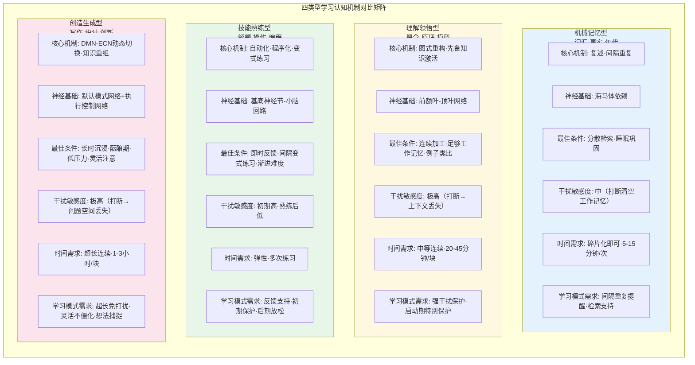
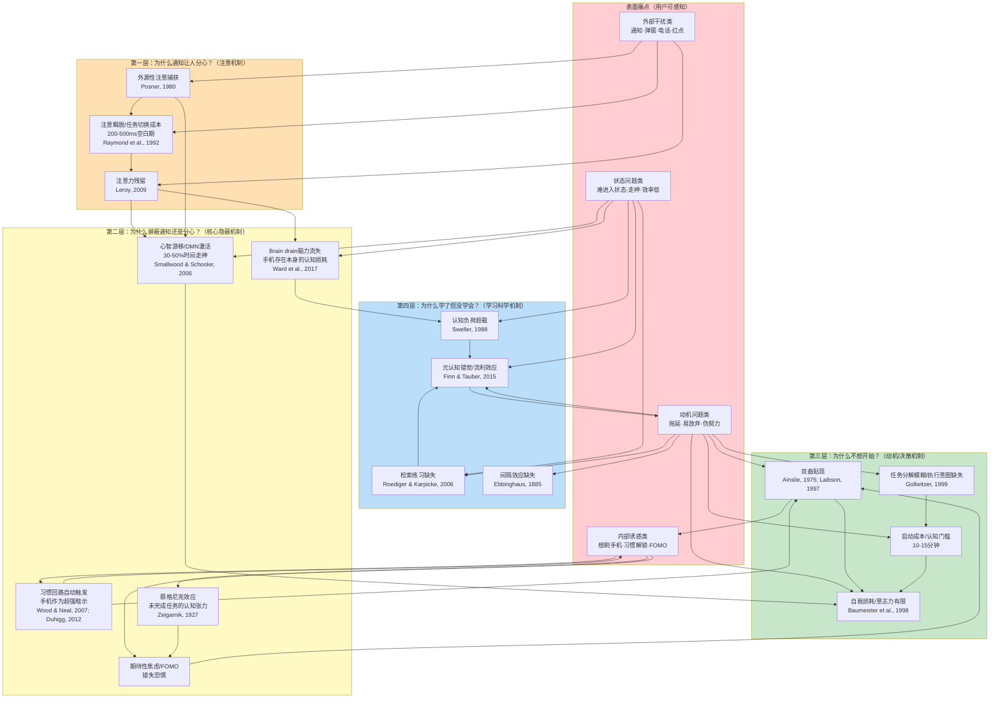
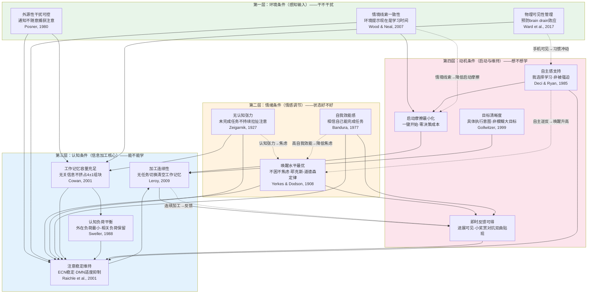
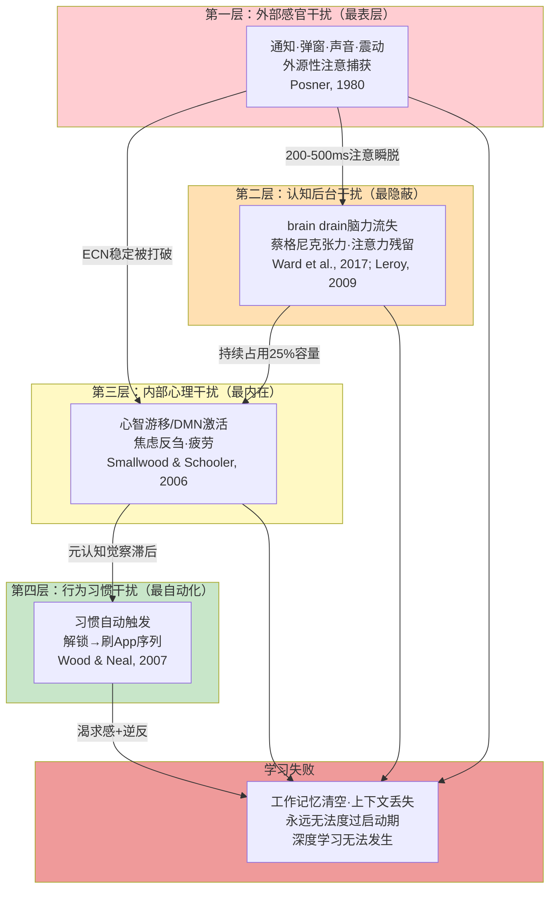
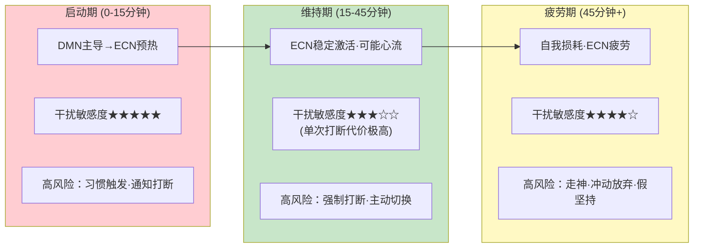
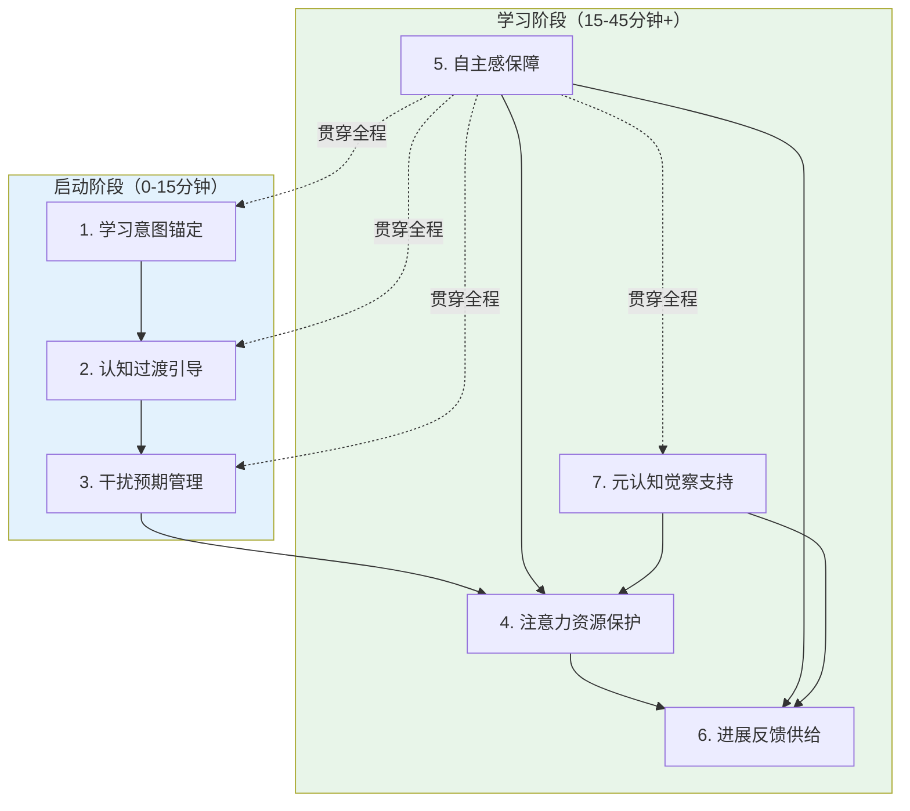

# 手机应用"学习模式"功能第一性原理分析与功能定义

---

## 执行摘要

本报告运用第一性原理思维方法，悬置现有"学习模式"产品的所有既有实现形态，从人类学习的认知本质、注意力机制、学习科学原理出发，系统性重构手机应用中"学习模式"的核心价值主张、构成要素和功能边界。经过悬置判断、层层拆解、质疑假设、自下而上重构四个阶段的分析，我们得出以下十个核心发现：

**发现一：学习的本质是大脑内部物理/化学结构的持久性改变，而非外部可观测的行为。** "坐了2小时""看了100页书""记了满满一本笔记"只是行为表象，判断学习是否发生的唯一标准是长时记忆中的认知结构（图式）是否发生了持久性改变——这种改变只能通过后续的提取和迁移表现间接推断，无法通过观察当下行为直接判定。这一区分是后续所有分析的逻辑起点：如果学习模式只关注"让用户看起来在学习"（锁机、计时、种树），而不支持大脑内部的认知改变过程，它本质上只是"行为表演"的辅助工具。

**发现二：单纯屏蔽干扰只解决了约25%的问题。** 现有产品几乎全部资源投入到"屏蔽通知"这一方向，但干扰分为四类：外部感官干扰（通知、声音）、认知后台干扰（brain drain效应、蔡格尼克张力、注意力残留）、内部心理干扰（心智游移、焦虑、唤醒偏离）、行为习惯干扰（手机作为习惯线索自动触发刷App序列）。外部干扰只占约四分之一，剩下三类更深层、更隐蔽的干扰是现有产品完全没有触及的。

**发现三：手机存在本身就会导致认知能力下降——即使关机、屏幕朝下、不碰它。** Ward等人(2017)发现的"brain drain（脑力流失）效应"表明：仅仅是智能手机在视线内、手边存在，就会导致大脑持续后台监控手机状态，占用工作记忆容量约20-25%，认知表现下降相当于一整晚没睡觉的程度。软件层面的通知屏蔽完全无法解决这个问题——必须通过物理距离管理（将手机放到视线外/另一个房间）才能消除。这是对现有"免打扰"范式最具颠覆性的发现。

**发现四：进入深度专注需要10-15分钟的启动期，这段时间最脆弱、打断代价最大。** 从日常状态切换到深度学习状态不是瞬间完成的——大脑需要完成从默认模式网络（DMN）到执行控制网络（ECN）的切换、激活相关先备知识、建立认知上下文、抑制无关想法。如果在这10-15分钟内被打断，之前付出的启动成本全部作废，需要重新开始。现有产品完全没有启动期特殊保护机制——从点击"开始"的第一秒起，保护强度和后面完全一样。

**发现五：固定时长的番茄钟（25分钟强制打断）是反效果设计。** 25分钟这个数字来自Francesco Cirillo在1980年代使用的番茄形状厨房计时器，没有任何认知科学研究表明这是最优值。更严重的是：固定时间打断会强制中断深度加工和心流状态，认知代价和微信通知打断完全一样——工作记忆上下文清空，需要10-15分钟重建。25分钟刚好是很多人度过启动期、开始进入深度加工的时间点，此时打断相当于前功尽弃。

**发现六：严格锁机+退出惩罚（如"植物枯死"）长期来看是反效果的。** 心理抗拒理论（Brehm, 1966）和自我决定理论（Deci & Ryan, 1985）数十年研究一致表明：外部强制约束会触发心理逆反、削弱内在动机、导致"锁机结束后报复性刷手机"的反弹效应。用户不是"不想玩手机了"，而是"想玩但玩不了，满脑子都在想怎么绕过"——渴求感本身就占用认知资源，即使不玩手机也无法深度专注。自主感是内在动机的核心需求，永远允许退出、没有惩罚的支持性设计，长期效果远好于强制约束。

**发现七：虚拟奖励（种树、积分、徽章）和社交排行榜会摧毁内在学习动机。** 过度合理化效应（Lepper et al., 1973）是社会心理学中被重复验证最多的效应之一：当人们为了外在奖励而做本来有内在兴趣的事时，内在动机会被削弱。原本"我学习因为我想学会"变成"我学习因为我要种树"，学习从目的变成了手段。当奖励移除时，动机甚至低于奖励之前。排行榜和社会比较还会鼓励"磨时间"的伪专注行为，而非真正的深度学习。

**发现八：白噪音/背景音乐的效果被严重高估，且个体差异极大。** 研究结果高度不一致：对于需要语音工作记忆的任务（阅读理解、写作、语言学习），白噪音和带歌词音乐都会显著干扰表现，因为它们占用语音回路资源。用户主观"觉得更专注"很大程度上是习惯化/安慰剂效应和情境线索联结（白噪音成为"开始学习"的条件刺激），而非白噪音本身的认知促进作用。

**发现九：学习模式需要从"防火墙范式"转向"温室范式"。** 旧范式（防火墙）假设"学习无法发生是因为外部干扰太多"，解决方案是屏蔽、限制、禁止——把干扰挡在外面。新范式（温室）假设"学习无法发生是因为大脑没有进入适合深度学习的认知状态"，解决方案是主动建构适合生长的条件——意图锚定、认知过渡、预期管理、注意力保护、自主感保障、进展反馈、元认知支持。防火墙只做减法（移除有害物），温室做减法+加法（移除有害物的同时主动建构必要条件）。勿扰模式只做了学习模式约10-15%的工作。

**发现十：真正的学习模式必须包含7个内核要素，现有产品普遍缺失其中4-5个。** 这7个缺一不可的内核要素是：（1）学习意图锚定——将模糊的"我要学习"转化为具体执行意图；（2）认知过渡引导——30-60秒的认知卸载和状态切换仪式，清空注意力残留；（3）干扰预期管理——不是屏蔽所有干扰，而是消除"万一有急事"的期待性焦虑；（4）注意力资源保护——启动期超强保护、外在认知负荷最小化、加工连续性保障、打断后上下文恢复；（5）自主感保障——永远允许退出、没有惩罚、所有约束是帮助而非控制；（6）进展反馈供给——非侵入式的具体进展反馈，提供持续小奖赏对抗双曲贴现；（7）元认知觉察支持——非评判的走神觉察、唤醒调节、疲劳提醒。现有产品普遍只实现了干扰预期管理的一小部分（通知屏蔽），其余6个要素几乎完全缺失。

基于以上发现，本报告定义了学习模式的核心价值主张——它不是"更好的勿扰模式"，而是一个基于认知科学原理设计的**系统级认知状态脚手架**：从启动前的认知准备，到学习中的注意力保护、元认知支持，再到结束后的收尾复盘，为深度学习的完整认知链条提供支持。它与勿扰模式、专注模式、阅读模式、冥想模式、儿童模式、应用锁有本质区别。报告最后萃取了"第一性原理功能分析法"作为可复用的方法论模式，可应用于"睡眠模式""阅读模式""健身模式"等其他功能的重构分析。

---

## 分析方法说明

本分析采用"悬置→拆解→质疑→重构"四步法进行第一性原理研究。第一性原理思维与类比思维的根本区别在于：类比思维从"现有解决方案"出发，通过比较和迭代进行渐进式改进（"别人做了免打扰所以我也做，我做得更好一点"）；第一性原理思维则要求剥离所有既有实现细节，回归最基础的物理/认知/心理规律，从零开始重新构建解决方案。

### 第一步：悬置（Epoch é / Bracketing）

悬置阶段的核心任务是将所有关于"学习模式应该是什么"的先入之见、既有产品形态、行业共识、个人经验全部"括起来"，暂时悬置判断。我们建立了"认知黑名单"：在分析完成前，禁止思考中出现"学习模式应该有XX功能"的表述；对每一个常见功能（通知屏蔽、白噪音、番茄钟、种树、锁机），先问"如果没有这个功能会怎样"而非"如何把这个功能做得更好"。我们采用白板重置法——假设自己从未见过任何学习类App，不知道市面上有什么功能，回到"学习"这两个字最朴素的含义。悬置阶段的关键产出是识别出强类比锚点（"免打扰=专注""严格=有效""时长=效果"），这些锚点是后续质疑阶段的重点对象。

### 第二步：拆解（Deconstruction）

拆解阶段将"手机上学习"这一复杂现象层层拆解，直到无法再拆分为止，从三个维度同时进行：行为维度（学习行为的外显动作序列）、认知维度（学习发生时大脑内部的信息加工过程）、环境维度（手机作为环境媒介的物理特性）。我们严格区分"必要条件"和"伴随现象"——学习发生时必然存在的要素，与只是经常一起出现但非必要的要素。拆解的终点是"原子级"问题——可以用认知心理学、神经科学、行为经济学的基础学科原理解释的层级。这一阶段产出了学习的信息加工链条模型、必要条件初步列表、四类干扰分类学。

### 第三步：质疑（Questioning）

质疑阶段是第一性原理分析最核心、最有价值的一步。我们对拆解出的每个要素和行业共识连续追问五个"为什么"，将所有隐含假设摆到台面上逐一检验。我们采用四种假设挖掘方法：反向提问法（"如果这个假设不成立会怎样"）、跨域对照法（"这个命题在其他领域成立吗"）、历史溯源法（"这个假设从哪里来，有什么证据支撑"）、用户访谈对照法（"用户真实行为和设计假设一致吗"）。我们建立了证据分级体系：强支持（有重复实验验证、效应量大、机制清晰）、弱支持（有部分证据但边界条件不清或效应量小）、无证据（研究结果不一致或只有主观体验支持）、反效果（有明确证据表明长期有害）。这一阶段识别出10个关于学习模式的根本假设，并为每个假设设计了可操作、可证伪的验证方案。

### 第四步：重构（Reconstruction）

重构阶段从经过质疑的第一性原理出发，自下而上重新构建解决方案。不是把拆解后的零件按原样装回去，而是基于原理重新组合。我们遵循最小完备性原则——核心要素集必须是最小（没有冗余，去掉任何一个都会发生本质退化）且完备（满足所有要素后，即使没有扩展功能也能有效支持深度学习）的。重构完成后再回头看现有方案，识别哪些是合理的、哪些是偏离原理的。这一阶段产出了7内核+5支撑+3扩展的要素体系、三层价值主张、三层边界判定标准。

四步法不是线性一次性过程，而是螺旋迭代的：重构后发现拆解不充分就回到拆解，质疑中发现新假设就回到悬置。本报告的所有结论都遵循"原理溯源"原则——每个设计决策都能追溯到明确的认知科学原理和必要条件，而非"听起来有道理"的直觉或"别人家都有"的行业惯例。

---

# 第1章：学习的本质——认知视角的拆解

在悬置了所有关于"学习模式应该是什么"的先入之见后，我们的分析必须从最根本的问题开始：**学习到底是什么？** 当我们说一个人"在学习"时，大脑内部究竟发生了什么？为什么"看起来在学习"不等于"真的在学习"？对这些问题的回答，是后续所有分析的逻辑基石。

## 1.1 学习行为的表象 vs 认知本质

### 1.1.1 常见学习行为表象

当我们谈论"一个人在学习"时，最先映入眼帘的总是一系列可观测的外显行为：书桌前摊开的书本、笔尖在笔记本上划过的痕迹、戴着耳机紧盯屏幕的姿态、习题册上密密麻麻的演算、视频课程播放进度条的缓慢推进。这些行为构成了大众对"学习"的直观认知——看书、做题、听课、记笔记、刷学习视频、在App上打卡背单词，甚至"在书桌前坐了两小时"本身就被视为学习发生的证据。

然而，这些外显行为与真正的学习之间的关系，远比人们直觉认为的更加脆弱。一个学生可以眼睛盯着书本整整一小时，大脑却在回想昨晚的电视剧剧情；一个人可以把视频课程从头到尾播放完，却在播放结束后回忆不起任何关键概念；笔记可以记得工整漂亮、色彩斑斓，但如果记笔记的过程只是机械抄写而没有经过大脑加工，这些笔记就只是墨水在纸上的沉积，而非知识在头脑中的建构。行为主义时代的心理学家曾一度试图用可观测的行为来定义学习，但认知革命以来的半个多世纪研究已经充分证明：学习的本质不在外部行为，而在大脑内部发生的、肉眼不可见的变化。

### 1.1.2 认知本质：图式建构与长时记忆改变

从认知科学的视角看，学习的本质是**大脑内部物理/化学结构的持久性改变**，这种改变表现为内部心理表征（图式）的建构与重构，以及长时记忆系统中神经连接的强化或重组。

让·皮亚杰（Jean Piaget, 1950）的认知发展理论指出，学习者通过两个核心过程实现认知结构的改变：**同化（assimilation）**和**顺应（accommodation）**。同化是将新信息纳入已有图式（认知结构）的过程——就像往已有的书架上摆放新书；顺应则是当新信息无法被已有图式容纳时，调整甚至重构已有图式以适应新信息的过程——就像重新设计书架的结构甚至更换更大的书架。真正的理解往往发生在顺应阶段，此时认知结构发生了质的变化，而非仅仅是量的累积。

在神经科学层面，学习对应的是**长时程增强（Long-Term Potentiation, LTP）**现象——Bliss & Lømo (1973)首次在兔海马体中发现的神经突触可塑性机制。当两个神经元反复同步放电时，它们之间的突触连接会被强化，后续一个神经元的放电更容易触发另一个神经元的放电。这种突触连接强度的持久性改变，就是记忆形成的神经基础。Hebb (1949)提出的"一起放电的神经元连接在一起"（Cells that fire together, wire together）的赫布法则，精确概括了这一过程。学习不是某种虚无缥缈的"精神活动"，而是实实在在发生在神经元突触层面的物理化学变化——受体敏感性改变、新突触生长、蛋白质合成、甚至新神经元的生成（神经发生）。

### 1.1.3 为什么"看起来在学习"≠"真的在学习"

教育心理学研究区分了三种不同性质的投入，这一区分对于理解"伪学习"现象至关重要：**行为投入（behavioral engagement）、认知投入（cognitive engagement）、情感投入（emotional engagement）**（Fredricks, Blumenfeld & Paris, 2004）。行为投入指外显的行为表现——坐得住、不说话、眼睛看向前方；认知投入指心理上的深度加工——主动思考、建立联系、深加工编码、元认知监控；情感投入指伴随学习的情感体验——好奇心、成就感、困惑后的释然。三者可以独立存在：一个学生可以有很高的行为投入但认知投入为零（如走神时仍保持端坐姿态），也可以在行为上看起来"不认真"但认知高度投入（如看似发呆实则在脑中深度思考问题）。

"看起来在学习"的错觉，本质上是将行为投入等同于认知投入。这种错觉如此普遍，以至于学习者自己也常常被欺骗——你在书桌前坐了一下午，感觉"自己很努力"，但如果这一下午主要是机械重复、被动阅读、频繁分心、没有深加工，那么长时记忆系统几乎没有发生任何持久性改变，这一下午的"学习"在神经层面几乎没有留下痕迹。更具迷惑性的是，"看起来很努力"甚至能产生一种情感上的满足感（"我今天学习了"的道德优越感），但这种满足感与实际的认知改变毫无关系。

**核心论点**：学习是大脑内部的物理/化学变化，不是外部可观测的行为。行为是学习的可能伴随现象，但既不是充分条件也不是必要条件。判断学习是否发生的唯一标准是：长时记忆中的认知结构是否发生了持久性改变——这种改变只能通过后续的提取和迁移表现来间接推断，无法通过观察当下行为直接判定。这一区分是后续所有分析的逻辑起点——如果学习模式的设计只关注"让用户看起来在学习"（如锁机、计时、种树），而不支持大脑内部的认知改变过程，那么它本质上只是"行为表演"的辅助工具，而非真正的学习支持工具。

## 1.2 学习发生的信息加工链条

学习作为认知结构的改变，发生在一个精密而脆弱的信息加工链条中。这一链条的任何一个环节出现瓶颈或断裂，都会导致学习失败。本节基于Atkinson-Shiffrin记忆多存储模型（Atkinson & Shiffrin, 1968）和Baddeley工作记忆模型（Baddeley & Hitch, 1974; Baddeley, 2000），完整描述从感知输入到长时记忆形成的完整过程，以及元认知如何对整个链条进行监控调节。

### 1.2.1 感知输入阶段：注意选择与感觉记忆

信息加工的第一站是**感觉记忆（sensory memory）**——这是信息进入认知系统的入口。各个感觉通道（视觉、听觉、触觉等）都有对应的感觉记忆存储：视觉通道的称为**图像记忆（iconic memory）**，保持时间约200-500毫秒；听觉通道的称为**声像记忆（echoic memory）**，保持时间稍长，约2-4秒。感觉记忆的容量几乎是无限的——你眼前的所有视觉信息、耳边的所有声音都短暂地存储在感觉记忆中，但绝大多数信息会在极短时间内迅速消退，不会留下任何痕迹。

感觉记忆中的信息只有被**注意（attention）**选择并识别后，才能进入下一阶段的加工。注意是信息加工链条上的第一个瓶颈——它像一个过滤器，只允许极少数信息通过。Colin Cherry (1953)发现的**鸡尾酒会效应（cocktail party effect）**生动展示了注意选择的特性：在嘈杂的鸡尾酒会上，你可以专注于和一个人的对话而完全过滤掉周围的其他谈话，但如果背景中有人提到你的名字，你的注意会立刻被吸引过去。这说明注意选择不是简单的"全或无"过滤，而是存在一个基于物理特征和意义的衰减机制（Treisman, 1964）——与当前目标相关、具有个人重要性的刺激即使在非注意通道也能被识别。

这一阶段的失败点：外源性刺激（如手机通知的声音、震动、弹窗）具有自动捕获注意的特性，它们不需要意志努力就能突破注意过滤器，将正在进行的信息加工打断。更重要的是，即使你"成功忽略"了一个通知，它也可能在感觉记忆层面短暂激活了相关的神经通路，对当前加工产生微妙干扰。

### 1.2.2 工作记忆阶段：信息加工与组块化

通过注意选择的信息进入**工作记忆（working memory）**——这是信息加工的"工作台"，所有主动的思考、推理、理解都发生在这里。Baddeley的多成分工作记忆模型（Baddeley, 2000）将工作记忆分为四个子成分：
1. **中央执行系统（central executive）**：工作记忆的"控制系统"，负责注意分配、任务切换、抑制无关信息、协调各子系统活动，是工作记忆的核心瓶颈
2. **语音回路（phonological loop）**：负责语音和听觉信息的暂时存储和复述，比如在心中默念电话号码
3. **视觉空间模板（visuospatial sketchpad）**：负责视觉和空间信息的暂时存储，比如在脑中想象一个物体旋转
4. **情景缓冲器（episodic buffer）**：负责整合来自语音回路、视觉空间模板和长时记忆的信息，形成连贯的情景表征

工作记忆最关键的特性是**容量极其有限**。Miller (1956)在经典论文中提出"神奇数字7±2"，但后续更精确的研究表明人类工作记忆容量实际约为**4±1个信息组块（chunk）**（Cowan, 2001）——这意味着在任何时刻，你能同时在脑中保持并加工的独立信息单元只有3-5个。组块化（chunking）——将多个小信息单元组合成一个有意义的大单元——是突破容量限制的唯一方式，但组块化本身依赖于长时记忆中已有的知识经验。

工作记忆的保持时间也很短——如果不复述，信息在约10-30秒后就会消退。工作记忆的另一个关键特性是**双任务干扰**：如果两个任务同时使用同一个子成分（如边听课边刷朋友圈，都需要视觉和中央执行资源），它们会互相干扰，表现急剧下降。

这一阶段是整个信息加工链条最狭窄的瓶颈，也是绝大多数学习失败发生的地方。任何无关信息（通知弹窗、未读消息提示、刚刚看到的朋友圈内容）进入工作记忆，都会挤占宝贵的4个组块容量，导致用于学习加工的资源不足。更严重的是，任务切换——哪怕只是"看一眼通知就回来"——会导致工作记忆中的当前上下文被清空，回来时需要付出巨大的重建成本。

### 1.2.3 长时记忆阶段：编码、巩固与提取

经过工作记忆加工的信息，如果要形成持久性的改变，需要进入**长时记忆（long-term memory）**系统。与工作记忆相比，长时记忆的容量几乎是无限的，保持时间可以从数分钟到终生。信息从工作记忆进入长时记忆需要经过三个关键过程：

**编码（encoding）**是将工作记忆中的信息转化为可存储的神经表征的过程。编码质量是决定记忆效果的最关键因素。Craik & Lockhart (1972)的**加工水平理论（levels of processing）**指出，记忆保持效果不取决于复述时间长短，而取决于加工深度：**浅加工**（如只注意字词的物理特征、简单重复朗读）只能形成脆弱的记忆痕迹，很快就会遗忘；**深加工**（如思考字词的意义、与已有知识建立联系、生成自己的例子、思考知识的应用场景）能形成更牢固、更易提取的记忆痕迹。Karpicke & Roediger (2008)的研究进一步表明，相对于反复阅读（主要是浅加工），**检索练习（retrieval practice）**——即主动从记忆中提取信息（如自测、回忆）——能产生更强的记忆保持效果，这被称为"测试效应"。

**巩固（consolidation）**是将编码后的记忆痕迹从暂时的易变状态转化为永久的稳定状态的神经过程。巩固分为**突触巩固**（发生在学习后数小时内，涉及蛋白质合成和突触结构改变）和**系统巩固**（发生在数天到数年时间尺度上，涉及记忆从海马体向新皮层的转移）。特别重要的是，**睡眠在记忆巩固中扮演不可替代的角色**（Stickgold, 2005）——学习后的睡眠，尤其是慢波睡眠和快速眼动睡眠，会重新激活并重组新形成的记忆痕迹，将其整合到长时记忆的知识网络中。考前熬夜学习之所以效果差，一个关键原因就是剥夺了记忆巩固所必需的睡眠。

**提取（retrieval）**是从长时记忆中查找并激活已有信息的过程。提取不是记忆的终点，而是记忆过程的核心组成部分——每次提取都会改变记忆本身（提取诱发重构，retrieval-induced reconsolidation），成功的提取会让记忆痕迹在未来更容易被提取。提取线索（retrieval cues）与编码时的上下文越匹配，提取越容易——这就是Tulving & Thomson (1973)提出的**编码特异性原理（encoding specificity principle）**："什么样的编码决定什么样的提取"。

这一阶段的失败点：如果学习时只有浅加工（如机械重复、被动阅读、划重点线），即使花了很多时间，编码质量也很差，很快就会遗忘；如果学习后没有足够的睡眠巩固，记忆痕迹无法稳定下来；如果只有输入没有主动提取练习（检索），记忆会处于"能认不能忆"的状态，遇到需要主动应用知识的场景就无法提取。

### 1.2.4 元认知监控：对整个过程的监视与调节

整个信息加工链条不是自动运行的流水线，而是在**元认知（metacognition）**的监控和调节下运行。John Flavell (1979)将元认知定义为"对认知的认知"，并区分了三个核心成分：
1. **元认知知识（metacognitive knowledge）**：关于自己认知特点、学习策略、任务要求的知识——比如知道自己什么时候更容易分心、哪种学习方法对自己更有效、哪些内容更难需要更多时间
2. **元认知体验（metacognitive experience）**：伴随认知活动的主观体验——比如阅读时感到"这段我没读懂"的困惑感、解决问题时的"啊哈"体验、知道自己"快要想起来了"的话在嘴边体验（tip-of-the-tongue）
3. **元认知监控（metacognitive regulation）**：对认知过程的主动监视、评估和调整——比如发现自己走神了把注意力拉回来、意识到没读懂退回去重读、遇到难题调整策略换个思路

元认知是区分"有效学习者"和"无效学习者"的关键变量。优秀的学习者不是不分心，而是能更快觉察到自己分心了并及时调整；不是什么都一学就会，而是能准确判断自己是否真的理解了；不是用同一种方法学习所有内容，而是能根据任务类型灵活调整策略。

元认知的一个常见失败是**元认知错觉（metacognitive illusion）**——人们常常高估自己的理解程度和记忆效果。Finn & Tauber (2015)的研究表明，反复阅读产生的**流畅感（fluency）**会让人产生"我已经会了"的错觉，但这种流畅感只是因为对文本变得熟悉，并不代表真正理解或能灵活应用。这就是为什么很多人"看书觉得都懂，一做题就不会"。

下面的Mermaid流程图完整可视化了学习的信息加工链条，标注了各阶段的瓶颈和常见失败点：

```mermaid
flowchart LR
    subgraph 感知输入阶段["感知输入阶段（0-500ms）"]
        A[外部刺激<br/>视觉/听觉/触觉] --> B[感觉记忆<br/>图像/声像记忆<br/>容量无限·时间极短]
        B -->|注意选择| C{注意过滤器<br/>瓶颈1}
        B -.->|未被注意·快速消退| X1[信息丢失·无痕迹]
        C -->|外源性刺激自动捕获| D[无关刺激侵入<br/>通知/弹窗/震动]
    end
    
    subgraph 工作记忆阶段["工作记忆阶段（10-30s）——最窄瓶颈"]
        C --> E[工作记忆"工作台"<br/>中央执行系统·语音回路·视觉空间模板<br/>容量:4±1组块·时间:10-30s]
        D --> E
        E -->|任务切换·上下文清空| X2[工作记忆溢出·重建成本]
        E -->|无关信息挤占| X3[认知资源不足·加工失败]
        E -->|维持性复述·浅加工| F[暂时保持·未深加工]
        E -->|精制性复述·深加工| G[组块化·建立联系·意义建构]
    end
    
    subgraph 长时记忆阶段["长时记忆阶段（分钟~终生）"]
        F -->|编码质量差| X4[脆弱记忆痕迹·快速遗忘]
        G --> H[编码·深加工]
        H --> I[巩固<br/>突触巩固·系统巩固<br/>依赖睡眠]
        I -->|睡眠不足| X5[巩固失败·记忆不稳定]
        I --> J[长时记忆存储<br/>容量无限·图式网络]
        K[提取·检索练习] -->|提取失败·线索不匹配| X6[惰性知识·能认不能忆]
        J --> K
        K -->|成功提取·重构强化| J
    end
    
    subgraph 元认知监控["元认知监控（Flavell, 1979）"]
        M[元认知知识] -.-> N[监视·评估·调整]
        O[元认知体验] -.-> N
        N -.-> C
        N -.-> E
        N -.-> H
        N -.-> K
        N -->|元认知错觉·流畅感误导| X7["我以为我会了"·高估理解]
    end
    
    style 感知输入阶段 fill:#e1f5fe
    style 工作记忆阶段 fill:#fff3e0
    style 长时记忆阶段 fill:#e8f5e9
    style 元认知监控 fill:#f3e5f5
    style X1 fill:#ffcdd2
    style X2 fill:#ffcdd2
    style X3 fill:#ffcdd2
    style X4 fill:#ffcdd2
    style X5 fill:#ffcdd2
    style X6 fill:#ffcdd2
    style X7 fill:#ffcdd2
```

## 1.3 不同类型学习的认知机制差异

并非所有学习都调用相同的认知机制——背单词、理解物理概念、练习解题技巧、写一篇论文，这四类学习在神经基础、关键认知过程、最佳条件、易受干扰类型上存在本质差异。忽视这些差异，用同一种"学习模式"支持所有类型的学习，是设计上的根本误区。本节区分四种本质不同的学习类型，分析各自的认知机制与对学习模式的特殊需求。

### 1.3.1 机械记忆型学习（词汇、事实）

机械记忆型学习的目标是在长时记忆中建立相对独立的事实性知识表征，如外语单词、历史年代、化学式、术语定义等。这类学习的关键是**记忆痕迹的强度和可提取性**，核心认知过程是**复述（rehearsal）**和**间隔重复（spaced repetition）**。

在神经机制上，这类学习高度依赖**海马体（hippocampus）**——内侧颞叶中的海马结构是陈述性记忆（事实和事件记忆）形成的关键脑区，海马体损伤的患者（如著名的H.M.）无法形成新的事实记忆，但仍可以学习新的技能。海马体对新异刺激敏感，也容易受到干扰——学习后短时间内学习其他类似内容会产生**倒摄抑制（retroactive interference）**，干扰先前记忆的巩固。

**最佳学习条件**：分散学习（间隔效应）比集中突击效果好得多——Ebbinghaus (1885)最早发现遗忘曲线后就指出，在记忆即将遗忘时进行复习能产生最强的保持效果；主动检索（自测、回忆）比反复阅读效果好；睡眠充足以保证巩固；学习环境有一定的背景一致性（编码特异性）。

**最易受的干扰类型**：对工作记忆容量的直接占用——如果在背单词时被通知打断，工作记忆中正在保持的单词会被清空；类似内容的干扰——学习后立即学习其他词汇会产生混淆；分神导致的加工不足——机械记忆需要足够的注意资源，"一边刷剧一边背单词"本质上是不可能的，因为两者都需要语音回路和中央执行资源。

**对学习模式的特殊需求**：需要碎片化支持——机械记忆不需要长时间连续专注，反而适合利用碎片时间；需要主动检索提示——不是反复看单词，而是主动回忆含义；需要间隔重复安排——根据记忆强度智能安排复习时间（这是Anki等记忆软件的核心原理）；需要防止学习后立即的干扰——学习新单词后短时间内避免类似内容。

### 1.3.2 理解领悟型学习（概念、原理）

理解领悟型学习的目标是建立新的认知图式或重构已有图式，掌握抽象概念、原理、理论模型及其内在联系，如理解相对论、掌握经济学供需模型、理解递归算法的本质。这类学习的关键不是记住孤立事实，而是**建立概念之间的意义联系、实现图式的顺应（重构）**，核心认知过程是**先备知识激活（prior knowledge activation）**和**精细化加工（elaboration）**。

在神经机制上，这类学习依赖**前额叶-顶叶网络（fronto-parietal network）**的激活，尤其是背外侧前额叶皮层（DLPFC）——这是执行控制、抽象推理、关系整合的核心脑区。理解过程通常是"顿悟"式的：在一段时间的困惑后，突然在概念之间建立起联系，此时伴随强烈的"啊哈"体验。

**最佳学习条件**：先备知识充分激活——如果相关基础知识没有进入工作记忆，新的概念就无法被同化；足够的工作记忆容量——理解抽象关系需要同时在脑中保持多个概念并建立联系，这需要大量工作记忆资源；时间连续不被打断——理解过程是一个需要持续在工作记忆中保持多个概念并尝试建立联系的过程，打断会导致工作记忆上下文丢失，需要重新"进入"；例子和类比——具体的例子能帮助建立抽象概念与已有知识的桥梁；生成效应——用自己的话解释概念、自己举例子比被动阅读解释效果好得多。

**最易受的干扰类型**：工作记忆容量被挤占是致命的——理解需要全部4个工作记忆组块都用于概念关系加工，哪怕一个无关想法占据一个组块，理解过程就可能失败；打断的代价极高——正在"接近理解"时被打断，之前所有的加工上下文全部丢失，可能需要重新开始；缺乏先备知识不是干扰，但如果学习模式不提示先备知识，会导致理解困难。

**对学习模式的特殊需求**：需要较长的连续不被打断时间（至少20-30分钟以上），启动期（0-15分钟）需要特别保护；需要工作记忆的"纯净空间"——不仅不能有外部干扰，还要帮助减少内部干扰（心智游移的觉察）；可能需要"相关知识链接"——在学习新概念前提示激活相关先备知识；需要主动生成的提示——"用你自己的话解释一下"比"继续阅读"更能促进理解。

### 1.3.3 技能熟练型学习（解题、操作）

技能熟练型学习的目标是将陈述性知识转化为自动化的程序性知识，如数学解题、编程、乐器演奏、体育运动。这类学习的关键是**自动化（automaticity）**和**程序化（proceduralization）**——从需要有意识控制的缓慢执行，到不需要占用工作记忆的快速自动执行。Fitts & Posner (1967)将技能学习分为三个阶段：认知阶段（理解规则、需要高度注意）、联想阶段（练习、错误减少）、自主阶段（自动化、不需要太多注意）。Anderson (1982)的ACT*理论进一步描述了从陈述性知识到程序性知识的转化过程（知识编译）。

在神经机制上，这类学习依赖**基底神经节（basal ganglia）**和**小脑（cerebellum）**回路——基底神经节参与习惯形成和程序性学习，小脑参与运动协调和精细动作的时序控制。技能熟练的标志是相关脑区激活从皮层（需要控制）向皮层下结构（自动执行）转移。

**最佳学习条件**：大量的变式练习——不是重复做同一道题，而是练习足够多的不同变式，让程序性知识能灵活迁移；即时反馈——知道自己做对了还是做错了、错在哪里，错误需要及时纠正；间隔练习——集中练习能快速提升表现但保持和迁移差，间隔练习虽然提升慢但保持和迁移更好（情境干扰效应，contextual interference effect, Shea & Morgan, 1979）；从简单到复杂的渐进式练习——先掌握子技能，再组合成复杂技能。

**最易受的干扰类型**：在认知阶段（技能形成初期）高度依赖工作记忆，此时干扰代价很大；在自主阶段（熟练后）则对干扰不那么敏感——熟练的打字员可以边打字边聊天，因为打字已经自动化不需要太多工作记忆；错误反馈延迟——如果不能即时知道自己错了，错误的程序会被强化；缺乏变化的重复——机械重复同一道题不能产生灵活的技能。

**对学习模式的特殊需求**：需要明确的即时反馈机制——用户需要知道自己做得对不对；需要支持练习的时间结构——技能练习不需要超长连续时间，但需要多次、有间隔的练习；需要渐进式难度设计——学习模式本身不提供内容，但可以与学习App配合支持难度递进；在技能形成初期需要更强的干扰保护，熟练后可以适当放松。

### 1.3.4 创造生成型学习（写作、设计、编程开发）

创造生成型学习的目标是产出新的知识产品或解决方案，如写论文、做设计、开发项目、进行创造性问题解决。这类学习本质上是一个知识重组和生成的过程，需要在已有知识之间建立全新的联系，产生以前不存在的想法或产品。

在神经机制上，这类学习需要**默认模式网络（Default Mode Network, DMN）与执行控制网络（Executive Control Network, ECN）之间的动态切换**——这是最反直觉的发现之一。传统观点认为创造需要ECN持续激活、DMN被抑制，但近期研究（Beaty et al., 2016）表明，高创造性人群的大脑特征不是DMN被完全抑制，而是DMN和ECN能同时激活、灵活切换：DMN负责想法生成、联想、远距离概念连接（灵感迸发、想法冒出来），ECN负责想法评估、选择、细化、约束（判断想法是否可行、进行逻辑修正）。创造是生成-评估的迭代循环，需要两个网络反复协作。

**最佳学习条件**：需要长时间的沉浸——创造不是线性过程，常常需要"酝酿期（incubation）"——在暂时放下问题时，DMN仍在后台继续加工，可能产生顿悟（Wallas, 1926的创造四阶段：准备→酝酿→豁朗→验证）；需要灵活的注意力——不是完全不分心，而是允许心智在聚焦和发散之间切换；需要低压力环境——压力和焦虑会让ECN过度激活、DMN被抑制，导致想法无法生成；需要容忍"无产出"时段——创造不是每一分钟都在"出活"，看起来"发呆"的时间可能是DMN在进行远距离联想。

**最易受的干扰类型**：频繁的打断会同时打断生成和评估过程——创造需要在脑中保持一个复杂的"问题空间"，打断后重建成本极高；持续的外部约束和监控（如严格的锁机、倒计时的压力）可能适得其反——压力抑制DMN，让你只能做线性的、收敛的思考，无法产生创造性想法；完全没有"走神"空间可能不利于创造——轻度的心智游移有时是DMN在进行远距离联想。

**对学习模式的特殊需求**：需要超长的连续时间块（1-3小时），且不适合严格的番茄钟式分割（25分钟打断可能刚好在想法即将涌现时）；需要更灵活的状态支持——不是"强制不分心"，而是"在需要专注时支持专注，在需要酝酿时允许适当发散"；需要记录和捕捉想法的机制——顿悟往往是短暂的，如果不及时记录会丢失；需要降低时间压力感——倒计时可能增加焦虑，抑制创造性。

下面的Mermaid矩阵图对比总结了四类学习的认知机制差异：



从这个对比中可以得出一个关键结论：**不存在单一的"最优学习模式"**。一个对理解型学习最优的模式（严格锁机、45分钟不打断），对于创造型学习可能过于僵化；一个对机械记忆友好的碎片化模式，完全无法支持深度学习。优秀的学习模式需要根据当前学习类型动态调整其支持策略——这是绝大多数现有学习模式产品完全忽略的维度。

## 1.4 心流与深度学习的关系

心流（flow）是Mihaly Csikszentmihalyi (1975)通过对艺术家、棋手、攀岩者、外科医生等人群的访谈首次系统描述的最优体验状态——当人们全身心投入到某种活动中时，会进入一种注意力高度集中、行动与意识融合、忘记自我、时间感扭曲、活动本身具有内在奖励的状态。心流常被等同于"深度学习状态"，但这种等同是一个需要仔细辨析的认知误区。

### 1.4.1 心流的九个特征

Csikszentmihalyi (1990)总结了心流状态的九个核心特征：
1. **挑战-技能平衡**：活动挑战与自身技能恰好匹配——既不会太简单导致无聊，也不会太难导致焦虑
2. **行动-意识融合**：注意力高度集中于当前活动，行为变得自发自动，不需要有意识的自我监控
3. **清晰的目标**：每一步都有明确的目标，知道自己该做什么
4. **即时反馈**：能立刻知道自己做得好不好，行为是否有效
5. **注意力高度集中**：注意力完全聚焦于当前任务，无关信息被完全过滤
6. **控制感**：感觉自己能控制局面、控制活动结果
7. **自我意识消失**：不再担心别人怎么看自己，"小我"消失，与活动融为一体
8. **时间感扭曲**：时间感发生改变——几小时像几分钟一样快，或几秒被拉长
9. **内在奖励**：活动本身就是奖励，做这件事不需要外部理由，过程本身带来愉悦

这九个特征中，第1-3项是进入心流的**前提条件**，第4-6项是心流过程中的主观体验特征，第7-9项是心流带来的结果性体验。

### 1.4.2 心流≠深度学习：警惕"虚假心流"

一个关键的认知区分是：**心流可以在完全没有深度学习发生的活动中出现**。玩简单的消消乐游戏、刷短视频、在流水线上做高度熟练的重复工作、甚至在高速公路上熟练驾驶——这些活动都可能让你进入心流状态，但它们几乎不产生新的学习，不导致长时记忆结构的持久性改变。

为什么？因为根据认知负荷理论（Sweller, 1988），深度学习需要足够的**相关认知负荷（germane cognitive load）**——用于图式建构和自动化的认知资源投入。而低认知负荷活动（如玩简单游戏）引发的心流，本质上是在高度熟练的技能上获得的流畅体验，此时虽然注意力集中、行动意识融合，但工作记忆中几乎没有进行新的图式建构，认知负荷主要是已自动化程序的运行，没有新的学习发生。这种"低认知负荷心流"可以称之为"虚假心流"——它有愉悦感和沉浸感，但没有深度学习。

反过来，真正的深度学习——尤其是理解领悟型学习和创造生成型学习——在发生时不一定伴随愉悦的心流体验。理解困难概念时的困惑、解决难题时的挣扎、写论文时的卡壳，这些都是深度学习的正常组成部分，它们与"愉悦感"相去甚远，但认知结构正在发生深刻改变。将心流等同于深度学习，会导致一个危险的设计倾向：只追求让用户"感觉良好"，而不支持真正有难度的认知加工。

### 1.4.3 学习模式能支持哪些心流前提

心流的三个前提条件中，哪些是学习模式（作为手机上的功能）可以支持的？

- **清晰的目标**：部分支持。学习模式本身不设定学习目标，但可以帮助用户明确当前学习任务、显示当前进度，让目标更具象。目标的内容本身是学习内容决定的，学习模式无法替代。
- **即时反馈**：部分支持。对于学习过程本身的反馈（如理解是否正确）需要学习内容提供，但学习模式可以提供关于专注状态、学习时间、进度的元认知反馈——"你已经专注了20分钟"本身就是一种反馈。
- **挑战-技能匹配**：基本无法支持。这主要由学习内容本身的难度设计决定，学习模式无法判断当前学习内容对用户来说是太难还是太简单。

值得注意的是，Csikszentmihalyi本人也指出，心流最容易发生在**自足目的活动（autotelic activities）**中——也就是活动本身就是目的，不需要外部奖励的活动。学习从根本上说不是天然的自足目的活动，尤其是应试学习、技能学习——它常常需要延迟满足，结果在遥远的未来。试图让学习完全像玩游戏一样时刻充满心流，本质上是不可能的。学习模式的目标不应是"让学习始终像玩游戏一样爽"，而是**降低进入深度学习状态的门槛，减少不必要的干扰，让心流/深度状态在自然发生时不被打断**。

### 1.4.4 启动期时间门槛及其设计含义

大量研究和经验观察一致表明：进入深度专注/心流状态不是瞬间完成的，而是需要一个**启动期**——通常需要10-15分钟的持续专注才能进入稳定的深度加工状态。在这10-15分钟里，大脑需要完成：从DMN主导切换到ECN主导、将与学习任务相关的先备知识激活到工作记忆中、抑制无关想法和环境干扰、建立当前任务的认知上下文。

这10-15分钟是学习会话中最脆弱的阶段——此时ECN还没有稳定占据主导，DMN随时可能重新激活，任何干扰都可能轻易将你打回初始状态，需要重新开始这10-15分钟的启动过程。这就是为什么"学5分钟就被打断"几乎等于完全没学——你根本没有度过启动期，还没进入真正的深度学习状态。

这一发现的设计含义至关重要：
1. 学习模式在启动期（前10-15分钟）需要提供**最强级别的干扰保护**，这段时间的打断代价最大
2. 不要鼓励用户"学5分钟也算数"——如果注定会被打断，不如不学，因为前5分钟的投入几乎全是启动成本，没有实际学习产出
3. 启动期的摩擦应该最小化——不要让用户在开始学习前设置一堆参数、选白噪音、选主题、定目标，这些操作本身就在消耗启动期的认知资源
4. 学习会话的最小有效长度是25-30分钟（10-15分钟启动 + 15分钟以上的深度学习），低于这个长度的"专注"大部分是启动成本

## 1.5 学习发生的必要认知条件（初步）

基于以上对学习本质、信息加工链条、不同学习类型差异、心流条件的分析，我们可以初步列出深度学习发生必须满足的认知条件——这些条件是"缺了就不行"的必要条件，而非"有了就更好"的增强条件。本节给出初步列表，第3章将在此基础上构建完整的必要条件模型。

**条件1：足够的工作记忆容量可用**。工作记忆是信息加工的"工作台"，4±1组块的容量极其有限。要发生深度学习，必须保证工作记忆容量不被无关信息（外部通知、内部未完成任务、手机存在导致的brain drain后台监控）挤占，至少保留2-3个组块用于学习本身的加工。这就是为什么"手机放在视线内哪怕不响也影响学习"——它持续占用工作记忆资源，即使你没有主动看它。

**条件2：元认知能够有效监控当前状态**。学习不是一个自动过程，需要元认知持续监控：我理解了吗？我是不是在走神？这个方法有效吗？元认知本身需要消耗少量认知资源，但如果没有元认知监控，学习就会变成"被动阅读"或"机械重复"，无法进行深度加工。学习模式可以作为外部元认知支持，帮助用户觉察分心、评估理解程度，但元认知提示不能过于频繁和侵入，否则本身也会占用工作记忆。

**条件3：信息加工链条在足够长的时间内保持连续**。度过10-15分钟启动期后，信息加工链条（感知→工作记忆→编码→巩固）需要保持连续不被打断。打断意味着工作记忆上下文丢失，需要重新付出启动成本，打断频繁到一定程度，学习就始终无法进入深度加工阶段，只能停留在浅加工层面。"足够长"的具体时长因学习类型而异：机械记忆5-15分钟即可，理解型需要20-45分钟，创造型需要1小时以上。

**条件4：编码深度达到深加工水平**。学习不是信息流过大脑就可以——必须进行精制性加工、与已有知识建立联系、主动生成意义。如果只是被动阅读、机械重复、维持性复述，即使不被打断，编码质量也很差，很快就会遗忘。这解释了为什么"坐在图书馆一下午刷手机"不叫学习——工作记忆被手机内容占据，学习材料只进行了最浅的加工；也解释了为什么"一字不差划重点抄笔记"效果很差——这是维持性复述，不是深加工。

**条件5：学习过程中有主动提取（检索）发生**。如Karpicke & Roediger (2008)的研究所示，编码不是学习的终点，提取练习是强化记忆、促进理解的核心过程。只有输入没有输出、只有阅读没有回忆、只有观看没有测试，学习就停留在"能认不能忆"的惰性知识层面，无法灵活提取和应用。

现在我们可以明确回答一个核心问题：**为什么单纯屏蔽干扰不足以产生学习？除了"不被打扰"还需要什么？**

屏蔽干扰只解决了"无关信息不进入工作记忆"的问题，这是必要条件但远非充分条件。想象一个极端场景：你被关在一个没有任何干扰的空房间里，没有手机、没有书、没有任何学习材料——确实没有任何干扰，但你也无法学习，因为根本没有学习内容。再想象另一个场景：你坐在没有干扰的房间里，书摊开在面前，但你全程在做白日梦——确实没有外部干扰，但工作记忆被DMN生成的内部想法占据，没有对学习材料进行深加工。再想象第三个场景：你在没有干扰的房间里，从头到尾逐字阅读了一章教科书，但读完后没有回忆、没有自测、没有用自己的话总结——你没有被打扰，但编码是浅加工，记忆很快就会遗忘。

屏蔽干扰是必要的，但它只是移除了学习的障碍，并没有为学习提供正向支持。除了"不被打扰"，学习还需要：有足够质量的学习内容、有主动的深加工而不是被动接收、有工作记忆容量用于意义建构、有元认知监控和调整、有主动检索练习强化记忆、有足够长的连续时间度过启动期、（对于长期记忆）有后续的睡眠巩固和间隔复习。学习模式的设计如果只停留在"屏蔽干扰"层面，就只是在做"减法"——移除障碍，但没有做"加法"——为认知加工提供正向支持。这是现有绝大多数学习/专注模式产品的根本局限。

---

### 核心问题回答：为什么人在咖啡馆也能学习，但在手机前很难学习？

基于本章的认知科学分析，这个反直觉现象可以得到清晰的解释：

**第一，咖啡馆的干扰是可预测的"背景噪音"，手机的干扰是不可预测的"外源性注意捕获"。** 咖啡馆的声音（旁人谈话、咖啡机声、背景音乐）是持续存在、相对稳定、变化缓慢的——感觉记忆会迅速适应这种稳定的背景，注意过滤器可以将其有效过滤，不占用中央执行系统资源。而手机的通知是突然出现、不可预测、具有进化意义的刺激（声音、震动、红点），它们是专门设计来自动捕获外源性注意的（Posner, 1980），每一个新通知都是一个潜在的"重要事件"，注意系统无法将其适应为背景，会持续消耗资源监控。

**第二，咖啡馆里的手机不在手边时，brain drain效应消失。** Ward et al. (2017)的研究表明，手机的认知损耗效应强度依赖于物理距离和可见性：当手机在另一个房间时，brain drain效应基本消失；当手机在视线内、手边时效应最强。在咖啡馆学习的人，常常把手机放在包里、口袋里，而不是放在桌面上——这不是行为习惯，而是无意中降低了brain drain效应。而"在手机前学习"——手机就放在桌面上、屏幕亮着、就在手边——此时brain drain效应最强，工作记忆持续被后台监控消耗。

**第三，咖啡馆的环境线索提供了情境一致性，手机本身是最强的"分心线索"。** 情境认知理论（Lave & Wenger, 1991）指出，环境线索会触发特定的行为模式。咖啡馆不是人们平时刷手机、玩游戏、社交聊天的主要场所——去咖啡馆这个行为本身、咖啡馆的视觉听觉环境，构成了"我是来学习/工作"的情境线索，帮助激活学习相关的行为模式。而手机本身是人类有史以来最强的"多任务线索聚合体"——拿起手机这个动作本身，就会触发解锁、刷微信、看短视频、回消息等一整套习惯回路（Duhigg, 2012），这些习惯的线索就是手机本身。在手机面前学习，相当于一直处于触发分心习惯的线索中，需要持续用意志力抑制这些习惯——而意志力是有限资源（Baumeister et al., 1998），很快就会耗竭。

**第四，咖啡馆的干扰不指向未完成的社交/信息任务，手机上的每个红点都是"认知张力"来源。** 蔡格尼克效应（Zeigarnik, 1927）告诉我们，未完成的任务会持续占用心理资源。咖啡馆里的陌生人谈话与你无关，你不需要回应，不产生未完成任务；但手机上的微信消息、未读邮件、点赞通知，都是指向你的未完成社交任务——你知道这些消息是发给你的、需要你回应、不回应可能有后果，这种"需要处理"的认知张力会持续拉扯你的注意力，即使你不看手机。这就是为什么"手机在旁边但我不看"仍然很难专注——你的大脑知道那里有未完成的任务，无法完全放下。

**第五，心流/深度学习的启动期在咖啡馆中更容易自然完成，在手机前不断被打断重置。** 在咖啡馆坐下、点单、拿出书本、翻到要读的页码——这一系列仪式化动作本身就在帮助大脑度过启动期，过程中没有突然的干扰把你拉出来。而在手机前学习，随时可能弹出一个通知、一个消息提示、一个红点更新，每一次这样的事件，哪怕你"只是看一眼"，都意味着10-15分钟启动期的计时器被重置，你永远无法真正进入深度加工状态。

总结来说：咖啡馆看似"更吵"，但它的干扰是"软干扰"——稳定、可预测、与你无关、不触发习惯、不产生认知张力；手机放在面前看似"没在打扰你"，但它的干扰是"硬干扰"——不可预测、自动捕获注意、持续消耗后台资源、触发习惯回路、产生未完成任务张力。理解了这一本质区别，我们就明白了：学习模式需要解决的不是"噪音"问题，而是"硬干扰"问题——是那些被设计来捕获注意、触发习惯、占用认知资源的手机固有特性。

---

# 第2章：用户痛点的第一性溯源

第1章从认知科学角度拆解了学习的本质，明确了学习发生的信息加工链条和初步认知条件。但理论分析必须回到真实用户的痛点中检验——用户在手机上学习时究竟遇到了什么问题？这些问题的根源是什么？为什么"屏蔽通知"这一看似直接的解决方案效果有限？本章将从可观测的表面痛点出发，通过连续追问"为什么"，逐层向下挖掘到认知/心理机制层面，建立完整的痛点-机制映射。

## 2.1 表面痛点清单与分类

当我们悬置对"学习模式应该是什么"的先入之见，直接观察用户在手机上学习时的真实抱怨和行为表现，可以将表面痛点归纳为四大类：外部干扰类、内部诱惑类、状态问题类、动机问题类。这些痛点不是孤立存在的——它们是同一棵"问题树"上不同高度的枝叶，本节先罗列这些可观测的表层现象，后续章节再逐层向下挖掘其认知根源。

### 2.1.1 外部干扰类

这是用户最容易感知、也是现有产品最关注的一类痛点：
1. **消息通知突然打断**：微信/短信/邮件/应用推送的声音、震动、弹窗在学习过程中突然出现，"叮"的一声注意力就被拉走
2. **红点持续焦虑**：即使关掉声音，App图标上的红色角标、锁屏上的通知预览仍然在视线范围内持续提示"有未读消息"
3. **电话强制插入**：来电直接全屏打断，无论你在学什么都被迫暂停，接完电话后很难立刻回到之前的状态
4. **弹窗广告/更新提示**：免费学习App中的插屏广告、系统更新提示、App评分弹窗在最不恰当的时候出现
5. **他人消息催促**："在吗？""回一下消息"——社交压力让人无法安心忽略消息，担心错过重要的事

### 2.1.2 内部诱惑类

这是比外部干扰更隐蔽的一类痛点，干扰源来自用户内心：
1. **"就看一眼"的冲动**：学着学着手就自动伸向手机，想解锁看看有没有新消息、刷刷朋友圈
2. **习惯性解锁-刷App序列**：拿起手机本来想查个单词，结果解锁后习惯性点开微信、刷10分钟朋友圈才想起本来要做什么
3. **学习内容关联诱惑**：查资料时被相关推荐链接吸引，从一个知识点跳到另一个不相关的内容，偏离原定学习轨道
4. **短视频/游戏的即时满足渴望**：学习时脑子里不断浮现"刷5分钟短视频放松一下""打一局游戏奖励自己"的念头
5. **信息饥渴/FOMO**：害怕错过热点新闻、朋友圈动态、群里的有趣讨论，觉得"几分钟不看手机就会与世界脱节"

### 2.1.3 状态问题类

即使没有明显的内外部干扰，学习状态本身也会出问题：
1. **难以进入状态**：坐下来打开书/学习App，翻了10分钟还是"没进入状态"，脑子转不起来
2. **学着学着就走神**：眼睛盯着屏幕/书本，脑子已经飘到别的地方去了——想今天晚上吃什么、想昨天看的剧、想周末去哪玩
3. **学一会儿就累**：专注20-30分钟就感觉大脑疲劳、注意力涣散，无法持续深入思考
4. **学习效率低下**：坐了两小时，感觉自己"一直在学习"，但合上书回想不起任何实质内容，笔记记得工整但没往心里去
5. **频繁切换任务**：学一会儿数学、背一会儿单词、再看会儿视频，在不同任务间跳来跳去，哪个都没学透

### 2.1.4 动机问题类

这是最深层也最容易被忽视的一类痛点：
1. **拖延不开始**：明明知道该学习了，坐在书桌前就是不想开始——先喝杯水、再整理下桌子、刷会儿手机"等状态好"，一两个小时就过去了
2. **开始后容易放弃**：学了十几分钟觉得"太难了""好无聊"，就停下来去做别的了
3. **"伪努力"自我欺骗**：开着学习视频但人在走神、抄了满满一本笔记但没理解、在图书馆坐一下午但大部分时间在刷手机——看起来很努力但自己知道没学会
4. **没有即时反馈**：学了很久看不到进步，不知道自己学会了没有，缺乏继续下去的动力
5. **guilt与焦虑的恶性循环**：没学习时内疚焦虑，带着焦虑开始学习又无法专注，学不进去更内疚——形成负面循环

这些表面痛点构成了用户可感知的问题全貌。但第一性原理分析要求我们不能停留在表面——"通知让人分心"是现象，不是原因。下一节开始，我们将连续追问五个"为什么"，逐层挖掘这些痛点背后的认知机制。

## 2.2 第一层溯源："为什么消息通知让人分心？"

外部干扰是最直观的痛点，我们从这里开始第一层溯源。消息通知之所以能轻易打断学习，不是因为用户"意志力薄弱"，而是因为它们精准利用了人类注意力系统的三个固有机制——这些机制是人类在数百万年进化中形成的生存优势，在智能手机时代反而变成了学习的障碍。

### 2.2.1 外源性注意捕获机制

如第1章1.2.1节所述，Michael Posner (1980)在其经典的注意定向研究中，首次系统区分了两种注意定向方式：**内源性注意（endogenous attention）**和**外源性注意（exogenous attention）**。内源性注意是目标驱动的、自上而下的、需要意志努力的——你主动决定把注意力集中在学习材料上，这就是内源性注意在起作用。外源性注意是刺激驱动的、自下而上的、自动发生的——外部刺激的突然变化会自动捕获你的注意力，不需要你有意识地决定去注意它。

外源性注意捕获有明确的进化意义：在原始环境中，草丛中的突然移动、身后的异常声响可能意味着捕食者逼近，那些能自动将注意转向这些刺激的个体有更高的生存概率。智能手机的通知系统，正是精准利用了这套进化而来的"预警系统"：

- **声音**：通知提示音是突然出现的新异听觉刺激，听觉系统对突然变化的声音极其敏感——声像记忆（echoic memory）会在2-4秒内保持这些声音，立即触发注意转向（Cherry, 1953的鸡尾酒会效应也证明：即使在专注对话时，你的名字或其他重要刺激也能自动捕获注意）
- **震动**：触觉通道的突然刺激同样会自动捕获注意，而且震动具有"私密性"——只有你能感受到，不像铃声那样会打扰他人，因此被更频繁地使用
- **弹窗**：视觉通道的突然运动（新窗口弹出、状态栏消息滚动）会触发视觉系统的运动检测机制，外源性注意立即被吸引
- **红点**：红色在进化中与血液、危险、重要信号关联，视觉系统对红色尤其敏感；红点是持续存在的视觉突出刺激，只要在视野内就持续"拉"着你的注意

关键在于：**外源性注意捕获是完全自动的，发生在你意识到之前**。你无法"决定不注意到"一个突然响起的声音或弹出的窗口——在你有意识地决定"我要忽略它"之前，你的注意已经被它捕获了至少200-300毫秒。这不是意志力问题，而是神经反射——就像你无法"决定不眨眼"当一个物体快速飞向你的眼睛。

### 2.2.2 注意瞬脱与任务切换成本

如果说注意捕获是"被打断的起点"，那么**注意瞬脱（attentional blink）**则解释了为什么"只是看一眼通知"的代价比你想象的大得多。Raymond, Shapiro & Arnell (1992)在快速系列视觉呈现（RSVP）实验中发现了一个惊人的现象：当被试成功识别了第一个目标刺激后，在之后200-500毫秒内呈现的第二个目标刺激往往无法被识别——仿佛注意"眨了一下眼"。

注意瞬脱反映了注意的"脱离-转移-投入"三阶段时间成本：注意从当前任务（学习）上脱离需要时间，转移到新刺激（通知）上需要时间，处理完新刺激后再重新投入回原任务又需要时间。这个过程不是瞬间完成的——每一次任务切换，都存在200-500毫秒的"注意空白期"，期间你无法有效处理任何信息。

但这还不是全部代价。更严重的是**工作记忆上下文的丢失**。如第1章1.2.2节所述，工作记忆只有4±1个信息组块的容量，当你在学习时，这4个组块都被当前的学习内容占据——你正在理解的概念、刚刚推导到一半的逻辑、与当前内容相关的先备知识。当注意被通知捕获、切换到消息内容时，工作记忆中之前保持的学习上下文会被迅速覆盖清空。等你"回完消息"回来时，你需要重新激活那些先备知识、重新推导到一半的逻辑、重新建立思考上下文——这个重建过程不是几秒就能完成的，往往需要数分钟。

这就像你在用电脑写文章，突然弹出一个窗口把你当前写的内容全部清空，等你关掉弹窗回来，需要重新打开之前的文档、找到上次写到的位置、回忆之前的思路——"回一条消息就回来"之所以这么难，是因为你的大脑"工作台"已经被清空了，重新摆好工具和材料需要时间。

### 2.2.3 注意力残留效应

Sophie Leroy (2009)的研究发现了另一个加剧切换成本的机制：**注意力残留（attention residue）**。当人们从任务A切换到任务B时，注意力并不会完全从任务A转移——部分注意力仍然"残留"在任务A上，表现为任务A相关的想法仍在工作记忆中活跃，导致任务B的表现下降。而且，任务切换越频繁，残留越多，后续任务的表现下降越严重。

这解释了一个常见现象：你"回完一条消息"回到学习中，但脑子里还在想刚才的对话内容——"他说那句话是什么意思？""我刚才那么回复合不合适？""接下来他会说什么？"这些残留的想法占据了宝贵的工作记忆容量，导致你虽然"人回来了"，但认知资源并没有完全回来。更糟糕的是：如果你回完消息后又刷了两分钟朋友圈，那么不仅有消息的注意力残留，还有朋友圈内容的注意力残留，两层残留叠加，能用于学习的工作记忆资源就更少了。

注意力残留效应还解释了为什么"回一条消息就回来"往往演变成"回了十条消息刷了半小时朋友圈"：当你切换到微信后，微信本身的信息会触发更多的注意力残留——未读的群聊消息、朋友圈更新、公众号推送——每一个都是新的未完成任务，产生新的认知张力，把你越拉越深。等你终于"回来"时，可能半小时已经过去了，而你还需要重新付出10-15分钟的启动成本才能进入学习状态。

现在我们可以回答"为什么消息通知让人分心"：不是因为你不专心，而是因为（1）通知利用外源性注意机制自动捕获你的注意——这是神经反射，不是意志力能完全阻止的；（2）每一次切换都存在注意瞬脱和工作记忆清空的代价；（3）注意力残留让你即使回来也无法立刻全身心投入。但这还只是第一层溯源——如果这就是全部问题，那"屏蔽通知"应该能完全解决分心问题。但用户经验告诉我们：即使把手机调到勿扰模式、通知全部关掉、甚至手机反过来扣在桌上，你还是可能分心。这就把我们带到更关键的第二层溯源。

## 2.3 第二层溯源："为什么屏蔽了通知还是会分心？"

这是本章最关键的一节，也是对现有产品设计最具颠覆性的一节。如果"屏蔽通知=解决干扰"的假设成立，那么勿扰模式/专注模式应该是完美的解决方案。但无数用户的亲身经验告诉我们：即使手机不响不亮不弹窗、即使你把它反过来扣在桌上、甚至即使你关了机，分心仍然会发生。"为什么屏蔽了通知还是会分心？"——对这个问题的回答，需要五个独立但相互强化的认知机制，它们共同构成了比外部通知更深层、更隐蔽、现有产品几乎完全没有解决的干扰源。

### 2.3.1 Brain drain效应：手机存在本身的认知损耗

2017年，德克萨斯大学奥斯汀分校的Adrian Ward及其同事在《Journal of the Association for Consumer Research》上发表了一项震惊学界的研究：**仅仅是智能手机的存在本身，就足以降低可用认知容量，导致认知表现下降——即使手机是关机的、即使屏幕朝下、即使你完全没有碰它**。研究者将这种效应命名为"brain drain（脑力流失效应）"。

Ward等人的实验设计精巧而严谨：他们招募了近800名被试，随机分配到三种实验条件下：
1. **手机在桌面上**：手机放在被试面前的桌上，屏幕朝下
2. **手机在包里/口袋里**：手机放在被试身边的包或口袋里，不在视线内但同一房间
3. **手机在另一个房间**：手机被研究者拿到房间外面

在这三种条件下，被试完成两项认知功能测试：**操作广度任务（OSPAN）**测量工作记忆容量，**瑞文标准推理测验（Raven's Progressive Matrices）**测量流体智力。实验过程中，手机全程保持静音、不会有任何通知，被试也被明确要求不要碰手机。

实验结果令人震惊：
- "手机在另一个房间"组的认知表现显著最好
- "手机在包里/口袋里"组表现次之
- "手机在桌面上"组表现最差——即使手机是关机的、屏幕朝下的！

效应量有多大？后续研究（Ward et al., 2017; Thornton et al., 2014）重复验证发现，手机在视线内导致的认知容量下降，相当于**一整晚没睡觉**造成的认知损伤，或者相当于**持续进行高强度脑力劳动后的疲劳状态**的损伤程度。而且，这种效应与被试的自我报告完全无关——绝大多数被试坚称"手机没有影响我"，但客观测试数据明确显示他们的表现下降了。**你意识不到自己的认知资源被消耗了，这正是brain drain效应最危险的地方。**

机制解释是什么？研究者提出，手机作为我们生活中最重要的信息枢纽和社交连接工具，已经成为一个**具有高度奖赏相关性的刺激**——它意味着可能有重要的人联系你、可能有有趣的信息、可能有需要你处理的事。你的大脑，具体来说是负责监控环境中重要刺激的前额叶-顶叶注意网络，会**持续在后台监控手机的状态**：有没有亮屏？有没有震动？有没有新消息？这种后台监控不是你有意识进行的——它发生在意识层面之下，但持续消耗中央执行系统的有限资源。

这就像你的手机后台运行着一个你看不到的App，它持续占用CPU和内存——你在前台用其他App时感觉不到它，但你的系统整体变慢了、电池掉得更快了。大脑的"后台手机监控进程"就是这样：你在前台专注学习时意识不到它，但它持续占用工作记忆容量（可能占用了宝贵的4个组块中的1个），导致你能用于学习本身的认知资源减少了20-25%。

关键的调节变量是**物理距离和可见性**：当手机在视线内、手边时，后台监控强度最高，brain drain效应最强；当手机放在包里/口袋里，虽然仍在同一房间，但因为不在视线内、需要刻意去拿，监控强度下降，效应减弱；当手机放在另一个房间，物理距离产生了"眼不见心不烦"的效果——大脑知道就算有消息你也无法立刻处理，后台监控进程基本停止，brain drain效应消失。

这一发现对现有学习模式设计构成了根本挑战：**软件层面的通知屏蔽完全无法解决brain drain问题**——只要手机还在你面前的桌上、在你手边，哪怕它关了机、哪怕你开了勿扰模式，你的大脑仍然在为它消耗认知资源。这就是为什么"把手机反过来扣在桌上"仍然不够——它仍然在你手边，你的大脑仍然知道它在那里。

### 2.3.2 心智游移：内部产生的分心

如果说brain drain是手机存在导致的"外部后台干扰"，那么**心智游移（mind-wandering）**就是完全从内部产生的分心——即使没有任何外部刺激、即使手机在另一个房间，你仍然会走神。

Jonathan Smallwood和Jonathan Schooler (2006)在《Psychological Bulletin》上发表的里程碑综述系统总结了心智游移研究：心智游移是指注意力从当前外部任务转移到内部生成的想法和感受上，是一种极其普遍的意识现象。经验取样研究表明，**人们在清醒时的30%-50%时间里都在走神**——也就是说，你以为自己在专注工作学习，但实际上有接近一半时间你的脑子在想别的事。

心智游移与大脑的**默认模式网络（Default Mode Network, DMN）**激活密切相关（Raichle et al., 2001）。如第1章1.3.4节和1.4节所述，DMN是大脑在没有专注于外部任务时、处于"静息状态"时激活的大尺度脑网络，它参与自我反思、回忆过去、想象未来、思考他人想法等内部导向的认知活动。DMN与负责专注外部任务的执行控制网络（ECN）呈**反相关关系**——一个激活时另一个往往被抑制。专注学习需要ECN持续激活、DMN被抑制；而走神就是DMN重新激活、ECN活动下降的状态。

心智游移不是"坏"现象——它有重要功能：计划未来、整合记忆、创造性问题解决、社会认知理解都需要DMN激活和一定程度的心智游移。但对于需要持续专注的深度学习来说，心智游移是致命的：当你走神时，工作记忆被内部生成的想法占据（想晚饭、想周末、想昨天的对话），学习内容的加工完全停止。更糟糕的是，**元认知对心智游移的觉察存在严重滞后**——你通常不是"一开始走神就知道自己走神了"，而是走神了几分钟之后才突然反应过来："我刚才在想什么？怎么看到这里来了？"

心智游移的发生概率受几个因素影响：
1. **任务难度**：任务太简单（无聊）或太难（挫败）都会增加走神，难度与技能匹配时（心流状态）走神最少
2. **动机水平**：对当前任务越不感兴趣、动机越低，越容易走神
3. **疲劳和压力**：疲劳、焦虑、压力会消耗执行控制资源，ECN无法有效抑制DMN，走神增加
4. **练习程度**：越熟练的任务越不需要持续ECN控制，越容易走神——这就是为什么做高度熟练的事（如开车走熟悉的路）时特别容易走神
5. **外部干扰频率**：频繁的外部干扰会打破ECN的稳定激活，每次被打断后重新进入专注前都更容易走神——外部干扰和内部分心不是独立的，它们互相强化

关键在于：**即使完全没有外部干扰，心智游移仍然会发生**——这是大脑的默认运作模式。但现有学习模式产品几乎完全忽略了心智游移——它们认为只要挡住外部干扰就万事大吉，却没有提供任何帮助用户觉察走神、温和地将注意力拉回来的机制。更糟糕的是，某些严格的锁机、倒计时设计反而可能增加压力和焦虑，消耗ECN资源，导致更多心智游移。

### 2.3.3 习惯回路自动触发：手机作为超强暗示线索

如第1章在咖啡馆vs手机对比中简要提及的，Wendy Wood和David Neal (2007)在《Psychological Review》上系统阐述了习惯的心理学机制，Charles Duhigg (2012)在《习惯的力量》一书中将其普及为广为人知的**习惯回路模型**：习惯由三个要素构成——暗示（cue/trigger）→ 惯常行为（routine）→ 奖赏（reward）。当这个回路重复足够多次后，暗示和惯常行为之间建立起牢固的神经连接——只要暗示出现，惯常行为就会被自动触发，不需要有意识的决策、不需要意志力参与，甚至你自己都意识不到它发生了。

智能手机是人类有史以来最强的习惯暗示聚合体。拿起手机、看到手机、摸到手机——这些动作本身，已经成为一整套高度自动化的手机使用习惯回路的"暗示"：
- **暗示**：手机在手中/在视线内/解锁屏幕
- **惯常行为**：自动点开微信→下拉刷新朋友圈→切换到微博→刷10分钟短视频
- **奖赏**：获得社交信息、新异刺激、短暂的放松和愉悦

经过成百上千次重复后，这个回路变得高度自动化：你的手可能在你意识到之前就已经解锁了手机、点开了微信。很多人都有过这样的经历：你拿起手机本来想查一个单词、设一个闹钟，但等你反应过来时，你已经在刷朋友圈了——你完全不记得自己是怎么打开微信的，这就是习惯回路自动触发的典型表现。习惯行为发生在System 1（快思考）层面，是自动的、无意识的、低能耗的——System 2（慢思考，负责理性决策和自我控制）甚至还没来得及介入，行为已经发生了。

更严重的是，手机的**多用途特性**让习惯回路变得格外强大。手机不是只用来做一件事的工具——它是通讯工具、娱乐中心、信息平台、钱包、相机、导航、游戏机……当你拿起手机时，你不是只有一个习惯回路被触发，而是几十个甚至上百个习惯回路同时被激活：有人习惯用手机看时间结果顺便刷了微信，有人习惯用手机查资料结果刷起了短视频，有人只是想解锁看一眼有没有消息结果玩了半小时游戏。

这解释了为什么"锁屏""白名单"等设计效果有限：当习惯回路被触发时，用户会主动绕过这些约束——强制锁机就重启手机，App白名单就切换到其他App。因为习惯回路的力量比短期意志力强大得多。

要对抗习惯回路，靠"意志力忍住"是效率最低的方式。根据Wood & Neal (2007)的研究，改变习惯最有效的方法不是"抑制惯常行为"，而是**改变环境中的暗示线索**——如果暗示不出现，习惯回路就不会被自动触发。这就是为什么把手机放到另一个房间效果这么好：物理上移除了"手机在眼前/手边"这个最强的暗示，解锁-刷App的习惯回路根本不会被触发。

### 2.3.4 蔡格尼克效应：未完成任务的认知张力

Bluma Zeigarnik (1927)在柏林大学做了一个经典实验：她让被试做一系列简单任务（拼图、算术、手工等），其中一半任务允许被试完成，另一半任务在中途被打断。事后回忆时，被试对未完成任务的记忆是已完成任务的约两倍——未完成的任务仿佛在脑海中"挥之不去"，持续占据心理资源。这就是**蔡格尼克效应**：人们对未完成或被中断的任务有更强的记忆，并且会产生一种持续的"认知张力"，直到任务被完成或被明确"搁置"。

智能手机是蔡格尼克效应的完美放大器：
- **未读消息/未接来电**：每一条未读消息都是一个指向你的未完成社交任务——你需要回复、需要回应、不回复可能有社交后果
- **未读邮件/未处理通知**：工作邮件、App推送、待办事项提醒都是"需要你处理"的未完成任务
- **没看完的朋友圈/短视频**：刷到一半的内容、正在进行的对话、看到一半的视频，都是未完成的信息消费
- **未回的消息**：哪怕你只是"看到了"消息但没来得及回，这个未完成任务就会持续在你脑中萦绕

关键在于：**即使你关掉了通知，这些未完成任务仍然存在**。你知道微信里可能有人找你、可能有重要消息、可能有有趣的群聊——这种"有什么事没处理"的认知张力，即使手机不响不亮，也会持续拉扯你的注意力。你的大脑会不断产生"要不要看一眼手机确认一下有没有重要事"的冲动——这不是你意志力薄弱，而是蔡格尼克效应在起作用：未完成任务产生的认知张力必须得到释放，否则它会一直占用后台认知资源。

这也解释了为什么"学完习再看手机"有时反而更难：你学习的时候，脑子里一直悬着"手机里可能有什么事"这个念头，这个未完成的预期本身就在持续消耗认知资源。

### 2.3.5 期待性焦虑："会不会有重要消息找我"的持续心理负荷

与蔡格尼克效应密切相关但又独立的一个机制是**期待性焦虑（anticipatory anxiety）**。智能手机让我们处于一种"永远在线、永远可及"的社会规范中——别人发消息给你，就期待你能及时回复。如果长时间不回复，可能会被认为"不礼貌""失联""不重视对方"。这种社会规范产生了一种持续的低水平焦虑："如果我现在不看手机，会不会有人找我有急事？会不会错过重要的工作消息？会不会让朋友生气？"

这种期待性焦虑有几个特点：
1. **它是面向未来的**：它不是关于已经发生的事（如未读消息），而是关于"可能发生但还没发生"的事
2. **它是概率性的**：绝大多数时候根本没有重要消息，但"万一有呢"这个小概率可能性就足以持续消耗心理资源
3. **它与手机依赖程度正相关**：越依赖手机进行社交和工作的人，这种期待性焦虑越强
4. **它在"手机就在身边但你不看它"时最强**：如果你完全无法接触手机（比如在飞机上、在考试中），你反而能放下心来——因为你知道就算有消息你也看不到，没有选择就没有焦虑。但如果手机就在你手边，你"可以"看但"选择"不看，这种焦虑会持续存在，因为你随时可以选择打破自己的决定

期待性焦虑可以看作是一种特殊的**FOMO（Fear of Missing Out，错失恐惧）**——害怕错过社交机会、重要信息、紧急事件。它持续激活大脑的威胁检测系统，让你无法完全放松地专注于学习——你的一部分注意力始终"竖起耳朵"在监听有没有重要消息的信号。

---

现在我们可以完整回答"为什么屏蔽了通知还是会分心"这个关键问题：**至少有五个独立机制在同时起作用**：
1. **Brain drain效应**：手机存在本身（哪怕关机屏幕朝下）就让大脑持续后台监控，消耗工作记忆资源
2. **心智游移**：大脑默认模式网络的自然倾向——30-50%时间走神是正常的，即使没有任何外部干扰
3. **习惯回路自动触发**：手机作为超强暗示线索，看到/摸到手机就自动触发解锁-刷App的习惯序列
4. **蔡格尼克效应**：未读消息/未完成任务产生持续认知张力，即使没有通知你也知道那里有未处理的事
5. **期待性焦虑**："会不会有重要消息找我"的持续低水平焦虑和错失恐惧

这五个机制共同作用，解释了为什么"免打扰"远远不够——现有专注模式产品只解决了2.2节的第一层问题（外部通知的外源性捕获），完全没有触及2.3节的这五个深层机制。这是现有产品最大的盲区。

但还有更深层的问题需要回答：就算我们解决了所有内外部干扰、让手机完全不造成认知损耗，还有一个更根本的问题——很多时候，用户甚至根本"不想开始"学习。这就把我们带到第三层溯源。

## 2.4 第三层溯源："为什么明明知道该学习却不开始？"

所有干扰问题的前提是：你已经开始学习了，然后被各种干扰打断。但更常见、更根本的痛点是：你明明知道自己应该学习、知道学习很重要、也有时间学习，但就是拖延着不开始——刷手机、整理桌子、喝水、"再等五分钟"，几个小时就过去了。为什么？这同样不是"懒惰""意志力差"这么简单的道德评判，背后有四个相互交织的行为经济学和认知机制。

### 2.4.1 双曲贴现：即时5分钟刷手机的快乐 > 2小时学习的延迟收益

**双曲贴现（hyperbolic discounting）**是行为经济学中最稳健、证据最充分的发现之一。传统经济学假设人们对未来收益的贴现是指数型的——未来的收益按照固定比例随时间贬值。但George Ainslie (1975)和David Laibson (1997)等人的研究表明，人类的时间贴现实际上是**双曲型**的：人们对"现在就能获得"的奖赏有极强的偏好，这种偏好强度远超指数贴现模型的预测。

具体来说：当两个奖赏都在遥远的未来时，人们能做出理性选择——"100天后获得1000元"比"100天后获得500元"好，几乎所有人都会选前者。但当小的奖赏"现在"就能获得时，选择就会反转——很多人会选择"现在获得50元"而不是"明天获得100元"，尽管明天的收益是现在的两倍。双曲贴现曲线的特征是：在"当下"这个时间点，主观价值有一个极其陡峭的下跌——离你越近的奖赏，主观价值被高估得越厉害。

这完美解释了学习拖延：
- **刷5分钟手机的快乐**是**即时的、确定的、现在就能获得**的奖赏——多巴胺立即释放，你立刻就能感到放松和愉悦
- **学习2小时后的成长**是**延迟的、不确定的、遥远的**收益——你可能要几周甚至几个月后才能看到学习带来的成果（考试成绩提高、技能提升、工作晋升），而且这个收益不是100%确定的（你可能学了但没学会，可能学会了但没用上）

在双曲贴现的作用下，当你坐在书桌前面临"现在开始学习"还是"先刷10分钟手机"的选择时，你大脑中的价值计算是这样的：刷手机的快乐**现在就在眼前**，主观价值被无限放大；学习的收益在遥远的未来，主观价值被严重贴现。尽管从理性上你知道"学习2小时的长期价值远大于刷10分钟手机的短期快乐"，但在当下的决策点，双曲贴现让**即时小奖励总是战胜延迟大奖励**——这不是你"不懂道理"，而是人类大脑奖赏系统的固有运作方式。

更糟糕的是，这不是一次性决策——你不是只需要在"开始学习前"抵抗一次诱惑。在学习过程中，每一分钟你都在面临同样的选择："我是继续学这个困难的东西，还是现在就拿起手机刷一下？"每一个这样的决策点，双曲贴现都在把你推向即时满足。靠意志力在每一个决策点都战胜双曲贴现，就像在每一个路口都逆着人流走——你或许能坚持几个路口，但很快就会精疲力竭。

### 2.4.2 启动成本/认知门槛：进入专注状态需要10-15分钟

如第1章1.4.4节详细分析的，进入深度专注/心流状态不是瞬间完成的，而是需要一个**启动期**——通常需要10-15分钟的持续专注，大脑才能完成从DMN主导到ECN主导的切换、激活相关先备知识、建立当前任务的认知上下文、抑制无关想法。

这个启动期是一个**必须预先支付的固定成本**——就像你开车前必须先热车、飞机起飞前必须在跑道上加速一段距离才能升空一样。你必须先付出10-15分钟的"入门费"，才能开始获得深度学习的收益。而且，如果你在这10-15分钟内被打断，你之前支付的启动成本就全部作废——需要重新支付一次。

大脑对"需要预先支付成本才能获得收益"的活动有本能的回避倾向——这就是**延迟满足困难**的本质。刷手机、看短视频几乎不需要启动成本：解锁、点开App、立即获得刺激和快乐——0启动成本，即时奖赏。而学习需要先"付费"——坐下来、打开书/学习App、熬过最初10-15分钟的"没进入状态"期，才能开始获得学习的收益。

这就解释了一个常见现象：一旦你度过了启动期、真正进入学习状态，继续学下去反而没那么难——你甚至可能"学进去了"不想停下来。但最难的就是**开始那一下**——因为你本能地知道开始意味着要先支付10-15分钟的"启动成本"，而且这个成本在当下是确定的、需要立刻付出的，而收益在未来是不确定的。双曲贴现再次发挥作用："现在付出10分钟痛苦"的主观成本，在当下的决策点被放大，让你本能地回避开始。

这也解释了为什么"再等五分钟就开始"是一个陷阱：你等待的不是"状态变好"，而是在推迟支付启动成本——但启动成本不会因为你等待就减少或消失，你等得越久，双曲贴现对即时快乐的偏好越强，开始就越难。

### 2.4.3 自我损耗/自我控制资源：意志力是有限的

Roy Baumeister及其同事(1998)提出的**自我损耗理论（ego depletion）**虽然近年来存在一些重复验证争议，但其核心洞见仍然具有很强的解释力：**自我控制（意志力）是一种有限的资源，类似于肌肉力量——使用后会疲劳，需要休息才能恢复**。

所有需要自我控制的行为都消耗同一资源池：
- 抑制冲动（忍住不刷手机、不吃零食）
- 情绪调节（忍住不发脾气、在烦躁时强迫自己平静）
- 决策（做选择、权衡利弊）
- 主动思考（解决难题、理解困难概念）
- 坚持（在疲劳/挫败时继续做不喜欢的事）

关键问题在于：**学习本身就是一项高度消耗自我控制资源的活动**——理解困难概念需要自我控制，在挫败时坚持需要自我控制，保持专注需要自我控制。而"开始学习"这个决定本身，还需要额外消耗自我控制资源来克服启动成本、抵抗即时诱惑。如果你一开始就把意志力用在"忍住不刷手机"上，那么你能用于学习本身（理解、思考、解决问题）的意志力就减少了。

对比一下"刷手机"和"学习"的意志力消耗：
- **刷手机**：完全是System 1主导的自动化行为，习惯回路自动运行，不需要抑制冲动、不需要主动思考、不需要坚持——**几乎不消耗意志力**
- **开始学习**：需要抑制刷手机的冲动、需要做出"现在开始"的决策、需要支付启动成本——**大量消耗意志力**

当你工作/学习了一天、意志力已经消耗得差不多了的时候，让你"现在开始学习"几乎是不可能的——不是你不想学，而是你的意志力"电池"已经没电了，无法支持你克服启动成本和即时诱惑。这也解释了为什么"靠意志力坚持学习"往往不可持续——意志力是有限资源，你可以靠它坚持一天、一周，但不可能靠它永远坚持下去。

好的设计应该是让"不分心""开始学习"不需要消耗意志力，成为默认状态，把宝贵的意志力资源留给学习本身——理解困难概念、解决难题、创造性思考。但现有学习模式设计往往反其道而行之：严格的锁机、频繁的"你确定要退出吗"弹窗、惩罚机制（植物枯死），这些设计反而让用户需要消耗更多意志力来抵抗"退出专注模式"的诱惑，进一步加剧自我损耗。

### 2.4.4 任务分解模糊："学习"是一个模糊的大目标

Peter Gollwitzer (1999)的**执行意图（implementation intentions）**研究揭示了一个影响目标达成的关键因素：仅仅有"我要学习"这样的目标意图是不够的，你还需要有"我在什么时间、什么地点、用什么方式、具体做什么"的执行意图——即"如果-那么"计划（if-then plans）。

Gollwitzer的实验表明，仅仅是让被试写下"我将在X时间Y地点做Z行为"这样具体的执行意图，就能将目标达成率提高2-3倍。为什么？因为模糊的目标（"我要学习""我要健身"）不直接指向具体行动，大脑无法自动启动执行——你需要每次都做出决策："现在学什么？怎么开始？从哪里开始？"每一个这样的决策都消耗意志力、都为拖延创造了空间。

"学习"是一个尤其模糊的大目标——它可以意味着看书、做题、背单词、看视频、写作业、复习、预习等等。当你告诉自己"我要学习了"时，你的大脑面对的是一个模糊的、未定义的任务，没有明确的第一步行动。这种模糊性本身就是行动的障碍——大脑面对模糊的大任务时会本能地回避，因为它不知道该从何入手、需要付出多少成本。

对比一下：
- "我要刷手机"是一个极其具体、路径清晰的任务——拿起手机→解锁→点开常刷的App→开始刷。不需要思考、不需要决策、路径已经被习惯千百次重复。
- "我要学习"是一个模糊的大目标——学什么？用什么学？学多久？学到什么程度？第一步做什么？这些问题都没有答案，每一个问号都是一个决策点，每一个决策点都消耗意志力、都为拖延创造机会。

这解释了为什么"待办清单"有时候反而增加焦虑：如果待办事项写的是"学习数学"这种模糊大任务，它不会帮你开始，反而会因为看起来"很大、很吓人"让你更想回避。而当你把任务分解为具体的、可立即执行的小步骤——"先做第3章的前5道选择题"——行动门槛就大大降低了，因为大脑不需要思考"第一步做什么"，直接执行就可以。

现在我们可以回答"为什么明明知道该学习却不开始"：不是因为你懒、不是因为你不懂道理，而是因为四个机制同时在阻碍你开始：（1）双曲贴现让即时刷手机的主观价值远大于学习的延迟收益；（2）学习需要预付10-15分钟的启动成本，大脑本能回避需要预付成本的活动；（3）开始学习本身消耗大量意志力，而意志力是有限资源；（4）"学习"是模糊的大目标，缺乏具体执行意图，大脑不知道从何入手。

但即使你成功开始了、也没有内外部干扰，还有最后一层痛点：很多时候你"学了很久"，但感觉自己"没学会"。这就是第四层溯源要回答的问题。

## 2.5 第四层溯源："为什么学了很久感觉没学会？"

前三层溯源回答了"为什么开始不了""为什么被打断""为什么分心"的问题，但假设你克服了所有这些障碍——你成功开始了学习、在学习过程中没有被打断、也没有明显分心——你坐了整整两个小时看书/看视频/记笔记，但合上书/关掉视频后，你发现自己好像什么都没记住、什么都没理解，感觉这两小时"白学了"。这是最令人沮丧的一类痛点，也是"伪努力"的核心——你花了时间、你看起来很努力、你没有分心也没有拖延，但学习就是没有发生。为什么？这同样有四个认知机制在起作用。

### 2.5.1 认知负荷超载：外在负荷挤占相关负荷

John Sweller (1988)的**认知负荷理论**将学习过程中的认知负荷分为三类：
1. **内在认知负荷（intrinsic cognitive load）**：由学习材料本身的复杂度决定——学习1+1=2内在负荷很低，学习量子力学内在负荷很高。这是学习本身必须付出的代价，无法消除。
2. **外在认知负荷（extraneous cognitive load）**：由不良的教学设计/界面设计带来的额外负荷——比如难懂的教材排版、频繁打断思路的界面元素、需要分心处理的无关信息。这是完全不必要的、应该被最小化的负荷。
3. **相关认知负荷（germane cognitive load）**：用于图式建构、深加工、理解的有益负荷——这是真正产生学习的认知投入，相关认知负荷越高，学习效果越好。

三者加起来的总和不能超过工作记忆的4±1组块容量上限——如果总负荷超过容量上限，学习就会失败。

手机本身就是一个巨大的**外在认知负荷**来源——即使你"在学习"，即使你没有分心去看手机：
- brain drain效应导致的后台手机监控持续占用工作记忆资源（约1个组块）
- 未完成任务（未读消息、未回消息）的蔡格尼克认知张力持续占用资源
- 期待性焦虑持续消耗中央执行系统资源
- 如果学习App本身设计不良，弹窗、广告、通知提示、花哨的界面元素都会带来额外的外在负荷

当这些外在负荷加起来占用了工作记忆2-3个组块时，留给内在负荷和相关负荷的容量只剩下1-2个组块——这足够你做简单的机械阅读、划线、记笔记这些浅加工活动，但完全不足以支撑需要深度加工的理解、推理、图式建构——因为这些活动需要同时在工作记忆中保持多个概念并建立联系，需要至少2-3个空闲组块。

你感觉"学了很久但没学会"，本质上是：你的工作记忆容量被外在认知负荷占满了，你只能进行最浅层次的信息加工——眼睛看到了文字、手写下了笔记、视频播放完了，但信息没有经过深加工，没有在长时记忆中留下牢固的痕迹。你花了时间，但相关认知负荷投入严重不足——这不是你的错，是认知容量被挤占后的必然结果。

### 2.5.2 检索练习缺失：反复阅读/观看≠学会

Henry Roediger和Jeffrey Karpicke (2006)在《Psychological Science》上发表的经典研究，彻底颠覆了"反复阅读=有效学习"的常识。他们的实验表明：**反复阅读给人"学会了"的感觉，但实际记忆保持效果远不如检索练习（retrieval practice）——即主动从记忆中提取信息（自测、回忆、合上书复述）**。这就是著名的"测试效应（testing effect）"。

在他们的实验中，被试分为两组学习同一篇文章：
- **反复阅读组**：反复阅读文章4遍
- **检索练习组**：读1遍文章，然后尝试尽可能多地回忆文章内容（自由回忆测试），如此重复3次"学习-回忆"循环

学习结束5分钟后测试，两组表现差不多；但2天后测试，检索练习组的记忆保持比反复阅读组好得多；1周后测试，差距进一步拉大——检索练习组记住了约60%的内容，而反复阅读组只记住了约40%。而且，被试对自己学习效果的主观判断正好相反：反复阅读组在学习结束时自信地认为自己"学得很好"，而检索练习组因为回忆过程很困难，觉得自己"没学好"——但实际记忆结果正好相反。

为什么反复阅读效果差？因为反复阅读主要产生**加工流畅性（processing fluency）**——你第二次读同一段文字时，因为对文字已经熟悉了，读起来很顺畅，这种流畅感让你误以为"我已经会了"。但这种流畅感只是因为你对文本的表面特征（字词、句子）变得熟悉，并不代表你理解了内容的深层含义，也不代表你能在不看文本时主动提取这些信息。

而检索练习（合上书回忆、自测、给别人讲）为什么效果好？因为（1）检索练习是"困难的"——提取过程本身就需要深度加工，会强化记忆痕迹（Karpicke & Roediger, 2008称之为"提取诱发重构"）；（2）检索练习能准确告诉你"哪些你没记住"——你回忆不起来的地方就是你需要再学习的地方，提供了精准的元认知反馈；（3）成功检索会让记忆痕迹在未来更容易被提取——每次提取都在强化神经通路。

手机上的学习尤其容易陷入"反复阅读/观看但不检索"的陷阱：
- 看学习视频是最被动的学习方式——你只需要"跟着看"，不需要主动提取任何信息，视频会一直播放下去，流畅感极强
- 在手机上做题时，不会做可以立刻看答案/提示，跳过了困难的提取过程
- 划线、高亮、抄笔记这些"看起来很努力"的行为，本质上都是阅读的变体——你是在处理眼前的信息，而不是从记忆中提取信息
- 手机上的学习内容往往被切得很碎（短视频、短文章），你还没来得及尝试回忆，下一个内容就来了

你感觉"学了很久但没学会"，很大程度上是因为你一直在做流畅的浅加工（反复读、反复看、划线抄笔记），没有进行困难的、真正有效的检索练习——你以为自己在学习，实际上只是在"熟悉学习材料"，熟悉不等于学会。

### 2.5.3 元认知错觉/流利效应：信息呈现流畅让人产生"我会了"的错觉

与检索练习缺失密切相关的机制是**元认知错觉（metacognitive illusion）**，特别是**流利效应（fluency effect）**带来的理解高估。

如第1章1.2.4节所述，人们对自己学习效果的判断高度依赖加工流畅性——信息呈现得越流畅、越容易理解、越"看着眼熟"，人们就越认为自己"学会了"。但这种判断往往是错误的。Finn & Tauber (2015)的综述总结了大量研究：学习者在几乎所有情况下都会**高估自己的理解程度和记忆效果**，这种高估在信息呈现流畅时尤其严重。

哪些因素会增加流畅感、导致"我会了"的错觉？
- **清晰的排版和美观的设计**：字体好看、排版清晰、配色舒适的学习材料读起来更流畅，让人误以为内容也更容易、自己理解得更好
- **视频讲解**：好老师的视频讲解会把复杂内容讲得通俗易懂、节奏流畅，你看的时候觉得"听懂了"，但这是讲师在帮你思考——讲师已经完成了最难的图式建构工作，你只是跟着走了一遍，并没有自己建构
- **高亮和色彩标记**：彩色高亮的重点内容看起来更醒目、更容易识别，产生流畅感，但高亮本身只是让信息"更容易被看到"，不是"更容易被记住和理解"
- **熟悉感**：同一个内容看第二遍、第三遍时产生的熟悉感很容易被误认为"学会了"
- **做笔记时的机械抄写**：手在动、字在写，这种活动感也会产生"我在学习"的错觉，但如果抄写时没有主动思考，笔记只是墨水在纸上的痕迹

手机上的学习App尤其擅长利用和放大流利效应——它们的UI设计得流畅美观、动画顺滑、交互反馈及时，视频老师讲得生动有趣，重点内容用鲜艳颜色高亮，学习体验非常"顺滑"。这种顺滑体验让你感觉"学习体验很好""我学进去了"，但实际上你可能只是被动地跟着流畅的体验走了一遍，没有经过自己的深度加工。合上书/关掉视频后，流畅感消失了，你才发现自己什么都没记住——但为时已晚。

### 2.5.4 间隔效应缺失：单次长时间集中学习不如间隔分散学习

Hermann Ebbinghaus (1885)在自己身上做了开创性的记忆实验，发现了著名的遗忘曲线：学习后遗忘立即开始，而且遗忘速度先快后慢——学习结束20分钟后忘记约40%，1天后忘记约60%，1周后忘记约75%。Ebbinghaus同时发现了对抗遗忘最有效的方法：**间隔重复（spaced repetition）**——在记忆即将遗忘时进行复习，比一次性集中学习（填鸭式学习）效果好得多。

后续大量研究（Cepeda et al., 2006的元分析包含254项研究、超过14000名被试）一致验证了**间隔效应（spacing effect）**的稳健性：对于同样的总学习时间，分散到多个间隔的学习时段，比集中在一个长时段学习，记忆保持效果好50%以上，而且学习间隔与记忆保持时间正相关——要记住1周的内容需要间隔1-2天复习，要记住1年的内容需要间隔数周复习。

为什么间隔效应这么强？目前的解释有几个：
1. **编码变异性**：在不同时间、不同情境下学习同一内容，会形成更多样的编码线索，提取路径更多，记忆更牢固
2. **巩固需要时间**：突触巩固（蛋白质合成、突触结构改变）发生在学习后数小时内，系统巩固需要数天到数月——集中学习没有给巩固过程留出时间
3. **提取难度的理想值**：间隔一段时间后再复习，你需要付出一定努力才能提取出记忆——这种"适度困难的提取"是最有效的记忆强化方式，比刚学完立刻重复效果好得多（这与检索练习效应是一致的）
4. **注意力衰减**：单次学习时间过长会导致注意力下降、心智游移增加，后面的时间学习效率急剧降低

而大多数人（包括大多数学习模式产品）的默认假设是："单次专注学习时间越长越好"——2小时比1小时好，4小时比2小时好。但间隔效应告诉我们：你一口气学4小时，不如分成两个2小时（中间间隔几小时或一天），或者四个1小时（分散在几天），总学习时间一样，但记忆效果好得多。

你感觉"学了一下午但没学会"，部分原因就是**单次学习时间过长导致边际收益递减**——前30分钟你确实在学习，中间30分钟你在走神和浅加工，最后1小时你只是"待在书桌前"，工作记忆已经疲劳，几乎没有产生有效学习。从认知科学角度看，连续学习超过45-60分钟后，学习效率已经降到很低的水平，继续"坚持"更多是在制造"我很努力"的幻觉，而不是在产生实际的学习效果。

但这并不意味着"碎片化学习"就是答案——间隔效应需要的是"有间隔的整块学习"，不是"刷两分钟手机学30秒"的碎片化。学习仍然需要足够长的连续时间块（至少25-30分钟）来度过启动期和进行深度加工，但不应该是无间断的3-4小时马拉松。

---

四层溯源到此完成。我们从最表面的"消息通知让人分心"开始，逐层向下挖掘：第一层发现了注意捕获和切换成本机制；第二层发现屏蔽通知仍然无效的五个深层机制（brain drain效应、心智游移、习惯回路、蔡格尼克效应、期待性焦虑）；第三层追溯到"不开始"的四个动机/决策机制（双曲贴现、启动成本、自我损耗、目标模糊）；第四层挖到了"学了但没学会"的四个学习科学机制（认知负荷超载、检索缺失、元认知错觉、间隔效应缺失）。下一节我们将把这些分散的机制整合为一个统一的映射表和层级图。

## 2.6 痛点-机制映射总表

经过四层溯源，我们从16个表面痛点向下挖到了17个底层认知/心理机制。这些机制不是孤立的——它们在时间序列上和因果链条上相互关联、相互强化，共同构成了"手机上学习为什么这么难"的完整因果网络。本节首先用表格建立表面痛点到深层机制的映射，然后用Mermaid图可视化完整的四层溯源层级结构。

### 2.6.1 痛点-机制映射表

| 痛点类别 | 表面痛点 | 第一层机制 | 第二层机制 | 第三/四层机制 |
|---|---|---|---|---|
| **外部干扰类** | 消息通知突然打断 | 外源性注意捕获（Posner, 1980） | 注意瞬脱（Raymond et al., 1992）<br/>注意力残留（Leroy, 2009） | — |
| | 红点持续焦虑 | 视觉突出刺激捕获 | 蔡格尼克效应（Zeigarnik, 1927）<br/>期待性焦虑 | — |
| | 电话强制插入 | 外源性注意捕获 | 工作记忆清空<br/>注意力残留 | 启动成本重置 |
| | 弹窗广告/更新提示 | 外源性注意捕获 | 任务切换成本 | — |
| | 他人消息催促 | 外源性注意捕获 | 社交压力→期待性焦虑 | 双曲贴现（即时回复的压力） |
| **内部诱惑类** | "就看一眼"的冲动 | — | 习惯回路（Wood & Neal, 2007; Duhigg, 2012）<br/>蔡格尼克效应 | 双曲贴现（Ainslie, 1975; Laibson, 1997） |
| | 习惯性解锁-刷App序列 | — | 习惯回路自动触发 | 双曲贴现 |
| | 学习时关联诱惑跳转 | 外源性注意捕获（相关推荐） | 注意力残留<br/>任务切换成本 | 双曲贴现 |
| | 短视频/游戏渴望 | — | 多巴胺奖赏预期 | 双曲贴现<br/>自我损耗（Baumeister et al., 1998） |
| | FOMO信息饥渴 | — | 蔡格尼克效应<br/>期待性焦虑 | — |
| **状态问题类** | 难以进入状态 | — | — | 启动成本/认知门槛（10-15分钟）<br/>自我损耗 |
| | 学着学着就走神 | 外部干扰触发 | 心智游移（Smallwood & Schooler, 2006）<br/>DMN激活（Raichle et al., 2001） | 认知负荷超载 |
| | 学一会儿就累 | — | 注意力资源持续消耗<br/>ECN疲劳 | 自我损耗 |
| | 学习效率低下 | 外部干扰 | Brain drain效应（Ward et al., 2017）<br/>认知负荷挤占 | 检索练习缺失（Roediger & Karpicke, 2006）<br/>元认知错觉（Finn & Tauber, 2015） |
| | 频繁切换任务 | 任务切换成本 | 注意力残留 | 目标模糊→执行意图缺失（Gollwitzer, 1999） |
| **动机问题类** | 拖延不开始 | — | 习惯回路（刷手机是默认路径） | 双曲贴现<br/>启动成本<br/>自我损耗<br/>目标模糊 |
| | 开始后容易放弃 | — | 心智游移增加<br/>任务难度导致DMN激活 | 双曲贴现<br/>自我损耗<br/>挑战-技能不匹配 |
| | "伪努力"自我欺骗 | 行为投入≠认知投入 | — | 元认知错觉/流利效应<br/>检索练习缺失<br/>间隔效应缺失（Ebbinghaus, 1885） |
| | 没有即时反馈 | — | 奖赏延迟 | 双曲贴现<br/>缺乏即时奖赏强化习惯回路 |
| | guilt与焦虑恶性循环 | — | 焦虑消耗ECN资源 | 自我损耗<br/>元认知监控失败 |

### 2.6.2 痛点层级溯源图（Mermaid）

下面的Mermaid图完整可视化了从表面痛点到根因的四层溯源结构，标注了每个机制的提出者和年代，以及关键的因果关系：



### 2.6.3 因果链条总结

从图中可以清晰看到几个关键的因果强化循环：
1. **外部干扰→注意捕获→任务切换→注意力残留→工作记忆清空→重新进入需要启动成本→更容易被新的干扰捕获**——这是一个分心的恶性循环，每被打断一次就更容易被下一次打断
2. **双曲贴现→即时诱惑→习惯回路强化→更难抵抗下一次诱惑→自我损耗加剧→意志力更弱→更容易屈服于即时诱惑**——这是拖延的恶性循环
3. **手机存在→brain drain效应→工作记忆资源被占用→只能进行浅加工→流利效应产生"学会了"错觉→没有检索练习→实际记忆脆弱→以为自己学会了但合上书就忘→伪努力感→guilt焦虑→焦虑消耗更多资源→认知负荷更超载**——这是"伪学习"的恶性循环

这些循环不是线性的因果链，而是**相互强化的反馈环**——打破其中任何一个节点都能削弱整个循环，但只解决一个节点（如只屏蔽通知）无法打破整个循环网络。

## 核心洞察总结：被现有产品忽略的深层痛点

完成四层溯源后，我们可以识别出至少三个被现有学习/专注模式产品普遍忽略、但根据认知科学证据至关重要的深层痛点，以及一个关键的"伪痛点"识别。

### 洞察1：Brain drain效应——手机存在本身就是干扰源，"免打扰"远远不够

这是本分析最具颠覆性的发现：**现有产品几乎100%的注意力都放在"屏蔽通知"上，但通知屏蔽只能解决第一层问题（外源性注意捕获），完全无法解决第二层最隐蔽、持续时间最长的brain drain效应**——只要手机还在你面前、在你手边、在同一房间，哪怕它关了机、哪怕通知全关、哪怕屏幕朝下，你的大脑仍然在持续后台监控它，消耗约20-25%的工作记忆容量。这种效应你意识不到，但它客观存在，持续降低你的认知表现。

**现有产品为什么忽略了这一点？**因为brain drain效应是"不可见"的——用户不会抱怨"我的大脑在后台监控手机"，他们只会抱怨"我学不进去""我效率低"，但不知道原因是什么。产品设计者也和用户一样，被自己的主观体验误导——"我把通知都关了，手机没打扰我，为什么还是学不好？"——因为认知科学告诉我们：你的主观体验是错的，手机存在本身就在影响你，只是你意识不到。

**设计含义**：真正有效的学习模式必须考虑**物理可见性和距离管理**——这不是软件能完全解决的问题，但软件可以引导和帮助用户：提示用户把手机放到视线外、放到另一个房间、或者用其他方式物理隔离手机。现有的"屏幕朝下才开始计时"功能（如Offscreen的深度专注模式）是一个正确方向的尝试，但还远远不够——它只解决了"视觉可见性"，没有解决"手边可及性"（手机还在你手边，你随时可以拿起来）。

### 洞察2：启动期脆弱性——前10-15分钟是生死线，现有设计没有提供针对性保护

如第1章和本章分析，进入深度专注需要10-15分钟的启动期，这段时间是学习会话中最脆弱的阶段——ECN还没有稳定激活，DMN随时可能重新主导，任何干扰都会把你打回原点，需要重新支付启动成本。但现有学习模式产品几乎完全忽略了启动期的特殊性——它们用统一的保护强度对待整个学习会话，没有认识到前10-15分钟需要**最强级别的保护**，而度过启动期进入心流状态后，保护强度反而可以适当降低。

更糟糕的是，很多产品在启动期反而增加了用户的认知负担：开始专注前需要选时长、选白噪音、选主题、设置白名单、写今日目标——这些操作本身就在消耗启动期的宝贵认知资源，让你还没开始学习就已经疲劳了。

**设计含义**：学习模式应该对启动期（前10-15分钟）提供差异化的、最强级别的干扰保护；启动流程应该极简（一键开始，不需要设置任何参数）；启动期内应该有特殊的设计防止用户轻易退出（但不是强制锁机）；度过启动期后可以适当放松约束，允许用户查看重要消息等。

### 洞察3：注意力残留——"回一条消息就回来"是谎言，现有设计没有帮助"干净切换"

现有产品要么采取极端策略（完全锁机，不允许任何切换，导致用户逆反心理强、错过重要消息），要么完全不做任何处理（用户可以随时切换出去，但切回来时状态全丢）。它们都没有认识到：任务切换的最大代价不是"花了几秒回消息"，而是**切出去后注意力残留在其他任务上，切回来时工作记忆上下文丢失，需要重建**。

注意力残留效应意味着：如果用户确实需要回一条重要消息（比如家人有急事、工作有紧急情况），问题不是"是否允许回消息"，而是"如何帮助用户回完消息后干净地切换回来，不带注意力残留"。现有产品完全没有提供这种"切换辅助"——它们要么锁死不让切，要么放任不管，切回来后你得自己重新进入状态。

**设计含义**：如果用户必须在学习中途处理消息，学习模式应该帮助用户：（1）先标记当前学习进度和思考上下文（类似断点保存）；（2）快速处理消息后，提示用户做一个简短的"注意力重置"动作（比如深呼吸、回顾刚才学到哪里了）；（3）恢复学习上下文，帮助快速回到之前的状态。这比"要么完全不让切、要么切了就不管"的二元设计要有效得多。

### 伪痛点识别："没有白噪音"是解决方案倒置，不是真痛点

最后，我们需要识别一个被广泛误认为是痛点的**伪痛点**："学习需要白噪音/背景音乐才能专注"。很多学习类App把白噪音作为核心功能，很多用户也认为"我学习必须听白噪音/雨声/咖啡馆声音"。但从第一性原理分析，这是典型的**解决方案倒置**——把手段当成了需求。

白噪音为什么有时候有用？不是因为"学习需要白噪音"，而是因为：（1）白噪音是稳定、可预测的背景声音，可以掩蔽不可预测的突然声音（如外面的车声、旁人说话），减少外源性注意捕获；（2）对于某些人，完全安静的环境反而让他们更容易注意到自己的内部想法（心智游移），适度的背景噪音可以"占用"一部分听觉注意资源，减少心智游移；（3）白噪音可以成为情境线索——"听到这个声音就知道该学习了"，帮助触发学习的习惯回路。

但白噪音不是必要条件——在真正安静的图书馆里、在完全没有声音的环境中，很多人反而能学得更好；白噪音也不是对所有人有效——对某些人来说，任何声音（包括白噪音）都是干扰；更重要的是，白噪音完全无法解决我们本章分析的任何一个深层机制——brain drain效应、心智游移、习惯回路、双曲贴现、启动成本，这些问题没有一个是白噪音能解决的。把"没有白噪音"当成核心痛点来解决，是典型的"症状解"——它可能让人"感觉更好"，但没有解决根本问题。

这提醒我们：在设计学习模式时，要警惕"用户说他们需要什么"和"用户真正需要什么"之间的区别——用户可能会说"我需要白噪音""我需要番茄钟""我需要种树"，但这些都是他们根据现有产品形成的需求认知，不是从第一性原理出发的真正痛点。我们的分析表明，真正的痛点是那些用户可能自己都说不清楚、但被认知科学证据反复验证的深层机制。

---

# 第3章：深度专注学习的必要条件模型

第2章我们完成了痛点的四层溯源，识别了17个底层认知/心理机制。但"知道问题出在哪里"还不够——我们还需要知道：要让深度学习在手机上发生，究竟需要满足哪些条件？这些条件中哪些是"缺了就不行"的必要条件，哪些是"有了更好"的增强条件？本章将构建一个14个必要条件的层级模型，明确手机端深度学习的"最小存活集"。

## 3.1 必要条件方法论

在开始构建模型之前，我们必须首先明确定义什么是"必要条件"，以及如何将其与充分条件、增强条件、无关因素严格区分开来。这个区分至关重要——混淆不同类型的条件会导致功能设计要么遗漏关键要素，要么堆砌不必要的功能，最终偏离第一性原理。

### 3.1.1 四类条件的区分标准

我们借鉴逻辑学和科学哲学中的条件分类，结合植物生长类比，建立四类条件的严格区分标准：

| 条件类型 | 逻辑学定义 | 植物生长类比 | 判断标准 |
|---|---|---|---|
| **必要条件（Necessary Condition）** | 如果没有X，则Y必然不发生；但有了X，Y不一定发生。X是Y的必要不充分条件。 | 阳光：没有阳光植物会死，但有阳光不一定长得好（还需要水、土壤等） | "缺了它就一定不行"——反事实验证：去掉X，举出Y失败的反例 |
| **充分条件（Sufficient Condition）** | 如果有了X，则Y必然发生；但Y发生不一定需要X。X是Y的充分不必要条件。 | 极端高温+缺水：必然导致植物死亡，但植物死亡不一定因为这个 | "有了它就一定行"——正向验证：有X，举出Y成功的正例；但没有X，Y仍可能通过其他路径发生 |
| **增强条件（Enhancing Condition）** | 既不是必要也不是充分，但有了X，Y发生的概率更高、质量更好。 | 有机肥：有了它植物长得更好，但没有也能活 | "有了更好，没有也行"——边际验证：去掉X，Y仍然可能发生但质量/概率下降；加上X，Y效果提升 |
| **无关因素（Irrelevant Factor）** | X的存在与否对Y的发生概率和质量没有统计显著的影响。 | 花盆的颜色：红色花盆和蓝色花盆对植物生长没有影响 | "有没有都一样"——控制实验：改变X，Y的结果没有系统性变化 |

### 3.1.2 反例检验法：如何判断必要条件

判断一个条件是否是必要条件的唯一可靠方法是**反事实验证（counterfactual test）**：假设我们把这个条件完全移除，其他条件都保持不变，学习是否还能高质量发生？

这个检验有三个严格的操作步骤：

**第一步：极端化移除**。不要温和地削弱条件，而是将其极端化到完全不存在的状态。例如检验"外源性干扰可控"是否必要，不是"减少通知"，而是"每30秒弹出一个无法关闭的全屏通知"——在这种极端情况下，学习是否还能发生？

**第二步：寻找或构造反例**。如果条件移除后，存在**任何一种现实场景**中学习仍然高质量发生，那么这个条件就不是普遍必要条件。反之，如果在所有现实场景中，条件移除后学习都无法高质量发生，那么它就是必要条件。注意：我们讨论的是"手机端深度学习"场景，不考虑极端特例（如经过多年冥想训练的僧人能在炮火中学习）。

**第三步：因果机制解释**。仅仅观察到"没有X就没有Y"是不够的——相关性不等于因果性。必须解释清楚：X的缺失通过什么认知/心理机制导致Y失败？这个机制是否与第1、2章阐述的认知科学原理一致？

### 3.1.3 本模型的边界声明

本模型有明确的适用边界，超出边界的结论不成立：

1. **场景边界**：仅针对"智能手机端的深度学习"场景，不适用于纸质书学习、电脑端学习、课堂听讲、技能实操等其他学习场景。这些场景有不同的必要条件。
2. **学习类型边界**：以理解领悟型学习和技能熟练型学习初期为主要分析对象，机械记忆型和创造生成型有特殊条件，将在第6章差异化分析中讨论。
3. **承诺边界**：本模型**只承诺必要条件**——缺了这些条件学习一定无法高质量发生，但**不承诺充分条件**——即使所有必要条件都满足，学习也不一定高质量发生（还需要学习内容质量、学习者先备知识、有效学习策略等其他因素）。这就像阳光、水、土壤、空气都有了，植物不一定长得好（还需要合适的温度、没有病虫害、种子本身质量等），但缺了任何一个一定活不了。
4. **个体差异边界**：必要条件是统计意义上对绝大多数人成立的，不排除极少数经过特殊训练的个体可能突破某些条件限制，但产品设计必须面向普通用户而非特例。

### 3.1.4 必要条件不承诺"有了就行"

需要特别强调：我们识别的14个必要条件，构成了手机端深度学习的"最小存活集"——它们是学习的"空气、阳光、水"，缺了不行，但不是"豪华套餐"。现有产品的常见错误是：把某些增强条件当成必要条件（如白噪音、番茄钟、种树动画），却遗漏了真正的必要条件（如物理可见性管理、认知张力释放、启动摩擦最小化）。本模型的目标是建立最小完备集——不多一个，不少一个。

---

## 3.2 环境条件：感知层面的基础支持

环境条件位于必要条件金字塔的最底层，作用于感知输入阶段。它们的作用是：减少或消除从外部环境侵入认知系统的无关刺激，为后续的认知加工创造"干净的感知输入通道"。如果环境条件不满足，认知系统从一开始就被"污染"，后续所有加工都会受影响。

### 3.2.1 外源性干扰可控：通知、声音、视觉刺激不能随意捕获注意

**条件定义**：学习会话期间，所有由手机产生的外源性注意捕获刺激（通知声音、震动、弹窗、红点、状态栏变化、动画效果）要么被完全阻止，要么其捕获注意的能力被显著削弱到不会自动中断学习进程的程度。用户对"什么刺激可以进入注意"拥有控制权，而非App或系统随意决定。

**反例论证（为什么是必要条件）**：如果没有这个条件会怎样？想象一个极端场景：你每30秒就会收到一个全屏弹窗通知，伴随响亮的提示音和震动，必须手动点击才能关闭。在这种情况下，学习是否还能发生？根据Posner (1980)的外源性注意理论，这种刺激会**自动、无意识、在你做出决定之前**就捕获你的注意——这是神经反射，不是意志力能阻止的。每一次捕获都会触发Raymond et al. (1992)的注意瞬脱（200-500ms注意空白期），然后是工作记忆上下文清空，然后是Leroy (2009)的注意力残留。频繁到每30秒一次的打断，意味着你永远无法度过10-15分钟的启动期——你始终在"开始→被打断→重置→重新开始"的循环中，永远无法进入深度加工状态。

**反例追问**：有人可能说"我可以忽略通知"——但认知科学证据表明你做不到。Ward et al. (2017)的brain drain研究表明，即使你成功"忽略"了一个通知，它仍然在感觉记忆和注意系统层面产生了激活，消耗了认知资源。注意捕获是完全自动的前意识过程，发生在你意识到之前。你可以决定"我不点开通知"，但你无法决定"我不注意到它"——就像你无法决定不眨眼当一个物体快速飞向你的眼睛。

**缺失后果**：
- 频繁的注意捕获导致工作记忆反复清空，始终无法建立稳定的加工上下文
- 永远停留在启动期，无法进入深度加工状态
- 每次打断后注意力残留叠加，可用认知资源持续减少
- 最终演变为"学5分钟被打断2分钟"的碎片化状态，有效学习时间接近零

**满足标准**：
- 学习会话期间，不会有任何声音、震动、弹窗打断当前操作
- 红点、角标、状态栏通知等视觉突出刺激要么被隐藏，要么被去强化（如变为灰色、缩小）
- 系统级通知（如来电）有明确的处理规则（白名单、自动回复、稍后提醒），不会全屏强制打断
- 学习App内部没有广告弹窗、评分请求、更新提示等干扰
- 如果用户选择允许某些通知（如紧急联系人），这些通知的呈现方式经过特殊设计，最小化注意捕获强度和切换成本

### 3.2.2 物理可见性管理：手机不在持续消耗后台注意资源

**条件定义**：学习会话期间，手机本身不处于用户的直接视线范围内或即时可及范围内，或者通过软件设计削弱手机作为"高奖赏刺激物"的线索强度，从而预防Ward et al. (2017)发现的brain drain效应——大脑不需要持续在后台监控手机状态。

**反例论证（为什么是必要条件）**：如果没有这个条件会怎样？回到Ward等人2017年的经典实验：手机放在桌面上、屏幕朝下、关机状态——没有任何通知、没有任何声音震动，但认知表现仍然显著下降，相当于一整晚没睡觉的认知损伤程度。为什么？因为你的大脑知道手机在那里——它是你生活中最重要的信息枢纽和社交连接工具，你的前额叶-顶叶注意网络会持续在后台监控它：有没有亮屏？有没有震动？有没有新消息？这种后台监控发生在意识层面之下，你感觉不到它，但它持续占用约1个工作记忆组块（宝贵的4个组块中的25%）。

想象一下：如果你的工作记忆容量被占用了25%，就像你的电脑后台一直运行着一个占内存25%的病毒程序——前台程序能跑，但会变慢、变卡、容易崩溃。对于理解领悟型学习，你需要全部4个组块（甚至全部4个都不够，需要组块化）来同时保持多个概念并建立联系——少了1个组块，理解过程就会变得困难、缓慢、容易卡壳。这就是为什么很多人感觉"手机放在桌上哪怕不碰也学不进去"——不是他们不专心，是他们的大脑确实少了25%的认知容量。

**反例追问**："我把手机扣在桌上/开了勿扰模式，为什么还是分心？"——因为brain drain效应的关键变量是**物理距离和可见性**，不是通知开关。Ward等人的实验中手机就是屏幕朝下且无通知的，但仍然有显著效应。扣在桌上只是减少了视觉可见性，但手机仍然在你手边、在同一房间——你知道它在那里，随时可以拿起来，后台监控就不会停止。只有当手机被放到另一个房间、包里、或者物理上被隔离到需要刻意努力才能拿到的地方，后台监控才会显著减弱。

**缺失后果**：
- 约20-25%的工作记忆容量被持续占用，能用于学习的认知资源不足
- 认知加工速度变慢，理解困难概念时更容易卡壳
- 更容易疲劳——后台监控持续消耗注意资源
- 为"就看一眼"的冲动提供持续的线索触发，习惯回路更容易被激活
- 用户主观体验为"学不进去""脑子转不动"，但不知道原因是手机就在旁边

**满足标准**：
- 软件层面：明确提示用户将手机放到视线外、包中，或物理隔离（而非只是放在桌上扣过来）
- 如果手机必须在视线内（如用手机学习），通过界面设计改变手机的"熟悉感"——使其看起来、感觉起来"不像平时那个手机"，削弱习惯线索强度
- 学习界面消除所有典型的手机UI元素（状态栏、通知栏、Home指示条、红点、App图标），让用户进入一个"非手机"的视觉情境
- 提供"物理隔离引导"：如检测到手机未被移动、屏幕朝上持续在桌面，温和提示"试试把手机放到包里，学习效果会更好"

### 3.2.3 情境线索一致性：环境线索稳定提示"现在是学习时间"

**条件定义**：学习会话启动后，视觉、听觉、触觉、交互方式等多通道情境线索保持一致且独特，明确且持续地向大脑传递"现在是学习时间，不是娱乐/社交时间"的信号，形成稳定的情境线索，激活与学习相关的行为模式，抑制与刷手机/社交/娱乐相关的习惯回路。

**反例论证（为什么是必要条件）**：如果没有这个条件会怎样？如果你打开"学习模式"，但界面看起来和平时一模一样——同样的状态栏、同样的通知、同样的Home手势、同样的微信图标在旁边，会发生什么？根据情境认知理论（Lave & Wenger, 1991）和习惯回路研究（Wood & Neal, 2007），环境线索是行为的最强触发物。你平时用手机时90%的时间是在刷微信、看视频、社交——这些行为的线索就是"普通的手机界面"。当"学习模式"的界面和普通手机界面没有区别时，大脑会持续接收到矛盾的线索：这到底是学习时间还是娱乐时间？习惯回路会持续被激活——你的手会下意识想去点微信图标，你的眼睛会下意识去看状态栏有没有新消息。

反例：想象你在卧室床上学习，床是你平时睡觉、刷手机的地方——这个环境线索持续提示"该睡觉了""该刷手机了"，你需要持续用意志力抵抗这些线索触发的习惯，很快就会疲劳、分心、睡着。但如果你坐在图书馆书桌前——这个环境的视觉、听觉、甚至气味线索都在提示"这里是学习的地方"——你不需要用意志力提醒自己"该学习了"，环境本身就在帮你激活学习模式。手机上的学习模式也需要创造这样一套独特的、一致的情境线索。

**缺失后果**：
- 大脑持续接收矛盾线索，习惯回路（刷手机、社交、娱乐）持续被激活
- 需要持续消耗意志力抑制习惯行为，加速自我损耗
- 无法建立"打开学习模式→进入学习状态"的自动化习惯联结
- 学习模式和普通模式的边界模糊，用户随时可能"滑出"学习状态
- 即使没有外部干扰，也更容易心猿意马、产生刷手机的冲动

**满足标准**：
- 学习模式有独特且一致的视觉主题：不同于普通手机界面的配色、排版、字体、壁纸
- 学习模式有独特的交互方式：简化或改变常规的手机交互手势，减少习惯性操作的触发
- 学习模式启动时有清晰的"进入仪式"：一个明确的过渡动画或交互，标志着状态切换（类似图书馆坐下、拿出书本的仪式）
- 学习期间所有界面元素都服务于学习情境，没有任何娱乐/社交相关的视觉线索（如App图标、消息提示）
- 学习模式结束时有明确的"退出仪式"，清晰地切换回正常手机模式
- 多通道一致性：如果使用了提示音/震动/触觉反馈，这些反馈也应该是学习模式独有的，和普通通知的反馈不同

---

## 3.3 认知条件：信息加工层面的核心支持

环境条件是基础，但即使环境完美（手机在另一个房间、绝对安静、没有任何干扰），认知层面的条件不满足，学习仍然无法高质量发生。认知条件直接作用于工作记忆和信息加工链条，是深度学习发生的核心机制层。

### 3.3.1 工作记忆容量充足：无关信息不挤占4±1组块的有限空间

**条件定义**：学习会话期间，工作记忆的4±1个信息组块（Cowan, 2001）中，至少有2-3个组块可用于当前学习任务的加工，不被以下无关信息持续占用：（1）未完成任务的蔡格尼克张力；（2）brain drain效应导致的后台手机监控；（3）注意力残留的先前任务内容；（4）焦虑/担忧等情绪性想法；（5）学习界面不良设计带来的外在认知负荷。

**反例论证（为什么是必要条件）**：工作记忆是信息加工的"工作台"，所有主动的思考、理解、推理都发生在这里——而且这个工作台只有4个组块大小，没有任何办法扩容。这是硬件级的硬约束，不是靠"努力""专心"就能突破的。

想象你在一个只有4个抽屉的工作台上做拼图：如果你已经在3个抽屉里放了别的东西（未回的消息、等下要做的事、刚才的聊天内容），只剩1个抽屉可以用来放拼图，你能拼好吗？理解一个复杂概念需要同时在脑中保持3-4个相关概念并建立它们之间的联系——这是为什么理解型学习对工作记忆容量要求这么高。如果可用组块少于2个，你甚至无法进行最简单的推理——你会感觉"脑子一片空白""看了半天不知道在说什么"，因为字你都认识，但你没有足够的"内存"把它们组合起来形成意义。

更严重的是，工作记忆被挤占不是你能主观觉察到的——就像你不会觉察到电脑后台程序占用内存一样，你只会感觉"今天脑子不好使""怎么都学不进去"，但不知道是因为有太多无关信息在后台占用了你的"内存"。

**反例追问**："为什么有人能在嘈杂环境中学习？"——这是因为（1）嘈杂环境中的声音是稳定可预测的背景，注意系统可以快速适应，不持续占用工作记忆；（2）这些人可能在进行机械记忆或浅加工学习，只需要1-2个组块就够了；（3）高动机可以在一定程度上补偿，但不能突破容量上限——如果环境极端嘈杂（如每10秒有人叫你名字触发鸡尾酒会效应），再高动机也无法学习。

**缺失后果**：
- 只能进行最浅层次的加工（认字、读句子、划线），无法进行需要同时保持多个概念的深度理解
- "读了半天不知道在说什么"——眼睛看过了文字，但没有足够工作记忆容量进行意义建构
- 推理、解决问题、图式重构等高阶认知活动无法进行
- 学习材料稍微复杂一点就卡壳、看不懂
- 容易疲劳——因为认知系统在"内存不足"的情况下强行运行，能耗更高

**满足标准**：
- 学习前提供"认知清理"机制：帮助用户明确搁置未完成任务（如"把担心的事写下来，学完再处理"），释放蔡格尼克张力
- 学习界面极简，没有任何与当前学习无关的信息元素（时间、天气、消息提示、其他App入口等），最小化外在认知负荷（Sweller, 1988）
- 学习内容呈现符合认知负荷原则：信息分段呈现，避免一次性呈现过多新信息
- 从其他任务切换到学习时，提供"注意力重置"机制（如深呼吸3次、回顾学习目标），帮助清空注意力残留
- 学习过程中如果检测到用户频繁退出/分心，温和提示是否需要先处理完急事再回来，而不是强行锁机让用户带着认知张力学习

### 3.3.2 认知负荷平衡：外在负荷最小化，为相关负荷保留空间

**条件定义**：根据Sweller (1988)的认知负荷理论，学习期间三类认知负荷的总和不超过工作记忆容量上限，且满足：（1）外在认知负荷（由不良界面/环境/教学设计带来的不必要负荷）被最小化到接近零；（2）内在认知负荷（学习材料本身复杂度决定的必要负荷）被合理管理（如分段、渐进化）；（3）留出足够的容量给相关认知负荷（用于图式建构、深加工、理解的有益负荷）——这部分才是真正产生学习的部分。

**反例论证（为什么是必要条件）**：认知负荷理论的核心公式是：**内在负荷 + 外在负荷 + 相关负荷 ≤ 工作记忆容量上限**。如果外在负荷过高，即使内在负荷很低，相关负荷也会被挤压到零——此时学习无法发生。

反例1：你在一个弹窗乱飞、广告不断、排版混乱的盗版小说网站上读一篇深度科普文章——文章本身写得很好（内在负荷适中），但弹窗、闪烁广告、奇怪的排版、需要不断点击关闭按钮（外在负荷极高）占用了你所有的工作记忆容量，你读完了但完全没理解内容——因为相关负荷为零，你所有的认知资源都用来处理界面干扰了。

反例2：为什么"在学习App里放励志语录、倒计时、积分、成就徽章"有时候反而降低学习效果？因为这些元素本身就是外在认知负荷——每一个额外的视觉元素都需要占用工作记忆资源去识别、忽略、处理，即使你"没在看它们"，它们仍然在视觉通路中被加工，消耗资源。

**缺失后果**：
- 即使内容很好、没有外部干扰，也学不进去——认知资源都被无关界面元素消耗了
- "学习体验很流畅但什么都没学会"——流畅感来自界面设计良好，不是来自认知加工
- 学习速度慢，需要反复重读同一段内容
- 认知疲劳加速——外在负荷是"无效能耗"，不产生学习但消耗精力

**满足标准**：
- 学习界面遵循"极简但不空洞"原则：只显示对当前学习任务绝对必要的信息
- 所有非必要UI元素（倒计时数字、积分、成就、励志语录、装饰性动画）默认隐藏，需要时才显示
- 学习内容的呈现遵循分段原则（Mayer, 2009多媒体学习理论）：文字+图像邻近呈现、避免冗余信息、信号化重点
- 不在学习过程中弹出与当前学习无关的提示（如"你已经学习了20分钟""要不要休息一下"）
- 反馈和提示采用非侵入方式：如细微的颜色变化、边缘提示，而非弹窗打断
- 界面动画极简：没有花哨的转场动画、粒子效果、装饰性动效，避免不必要的视觉注意捕获

### 3.3.3 注意稳定维持：ECN持续激活，DMN被抑制但非完全关闭

**条件定义**：学习会话期间，执行控制网络（ECN，包括背外侧前额叶等区域）保持稳定激活，主导认知加工；默认模式网络（DMN，负责心智游移、自我反思、走神）被有效抑制但不是被完全关闭——允许短暂、自发的DMN激活（轻度走神），但能在元认知觉察后快速回到ECN主导状态，且DMN激活不会导致任务完全中断。

**反例论证（为什么是必要条件）**：首先，DMN被完全关闭是不可能也不可取的。Raichle et al. (2001)的研究表明DMN和ECN是大尺度脑网络的两个拮抗状态——一个激活时另一个抑制，但两者不可能同时完全关闭，也不应该完全关闭。DMN有重要功能：记忆巩固、创造性联想、理解整合都需要DMN参与。完全强制抑制DMN（如通过极强的外部约束、压力、焦虑）会导致思维僵化、无法进行创造性联系、也无法整合知识。

但如果DMN过度激活、ECN无法稳定维持，就会变成持续走神——这也是不行的。Smallwood & Schooler (2006)的研究表明，人们清醒时30-50%时间在走神，但对于需要持续专注的深度学习，走神频率需要控制在一定范围内。如果频繁走神且长时间无法觉察（元认知觉察滞后），学习就变成了"眼睛盯着书本脑子在想别的"，工作记忆被内部想法占据，学习加工完全停止。

关键不是"完全不走神"——这不可能，也不符合大脑运作规律。关键是：（1）减少DMN被外部触发的频率（外部干扰越少，DMN越不容易被激活）；（2）当DMN自发激活（走神）时，元认知能尽快觉察到；（3）觉察后能温和、不费力地将注意拉回当前任务，不需要强烈的自我谴责和意志力消耗。

**缺失后果**：
- 如果DMN完全无法抑制：持续走神，"看书不进字"，大部分时间注意力在内部想法上
- 元认知觉察滞后：走神了5-10分钟才突然反应过来"我刚才在想什么"
- 如果DMN被过度抑制（焦虑/压力过大）：思维僵化，无法理解需要创造性联想的内容，感觉"脑子转不动""像卡住了一样"
- 反复的"走神→自责→强迫自己集中→更焦虑→更走神"恶性循环

**满足标准**：
- 减少外部触发源：外部干扰越少，DMN越不容易被激活
- 提供非侵入性的元觉察提示：当检测到长时间无交互、阅读速度异常、或其他可能走神的信号时，用极温和的方式提示（如屏幕边缘轻微的呼吸光效，不是弹窗和声音）
- 不对走神进行惩罚：不用"你又分心了"这类负面反馈，不记录分心次数让用户焦虑
- 允许并接纳适度走神：把轻度走神视为大脑运作的正常部分，不追求100%专注
- 学习分段：45-60分钟后安排休息，让DMN有机会在休息时间光明正大地激活，减少学习期间偷偷走神的冲动

### 3.3.4 加工连续性：学习会话期间无任务切换导致的工作记忆清空

**条件定义**：学习会话度过启动期（10-15分钟）后，信息加工链条保持连续不被打断——没有非预期的任务切换（如回消息、接电话、被弹窗引导到其他App），工作记忆中的学习上下文（正在思考的概念、推导到一半的逻辑、激活的先备知识）不会被完全清空和重置。

**反例论证（为什么是必要条件）**：我们在第2章已经详细分析了任务切换的三重代价：（1）注意瞬脱的200-500ms空白期（Raymond et al., 1992）；（2）工作记忆上下文完全清空——你正在思考的所有内容、建立的所有临时联系都丢失了；（3）注意力残留（Leroy, 2009）——切换回来后，之前任务的想法仍然残留在工作记忆中。

反例：你正在解一道复杂的数学题，已经在脑中建立了5个变量之间的关系，快要找到解题思路了——这时一个电话打来，你接了2分钟电话。挂掉电话后，你还记得刚才在解数学题，但你脑中那5个变量的关系、快要成型的解题思路——全部消失了。你需要从头开始重新读题、重新建立变量关系、重新推导——这个重建过程可能需要10-15分钟，和重新进入学习状态的启动成本一样高。如果这种打断每15分钟发生一次，你永远在重建上下文，永远无法到达真正的深度加工。

对于创造生成型学习，加工连续性的要求更高——你需要在脑中保持一个复杂的"问题空间"，打断后重建成本极高，可能一个小时都无法恢复到之前的思考状态。

**反例追问**："番茄钟25分钟就打断休息，难道不对吗？"——番茄钟的问题在于它的打断是**人为的、固定时间的、不考虑当前加工状态的**。如果你刚好在25分钟时快要理解一个概念、快要找到解题思路，这时番茄钟"叮"的一声打断你——这和外部通知打断的认知代价是一样的！正确的分段应该是在自然的断点（如学完一节、做完一道题、理解了一个概念后）主动休息，而不是机械地按固定时间打断。

**缺失后果**：
- 每次打断都需要重新付出10-15分钟启动成本来重建工作记忆上下文
- 频繁打断导致永远无法度过启动期，始终停留在浅加工
- 正在进行的深度思考、灵感、顿悟被打断后可能永远找不回来
- 学习变成断断续续的碎片，无法形成连贯的知识结构
- "学了很久但感觉什么都没学透"——因为每次刚要深入就被打断

**满足标准**：
- 度过启动期后（前10-15分钟），提供最强级别的打断保护，尽量避免任何非紧急打断
- 不使用固定间隔的强制打断（如番茄钟的25分钟强制休息），而是引导用户在自然断点主动休息
- 如果必须打断（如用户主动选择回紧急消息），提供"上下文保存"机制：让用户快速记录下"我刚才在想什么/学到哪里了"，类似断点续传
- 打断后返回时，提供"上下文恢复"机制：快速回顾之前学习的内容和进度，帮助重建工作记忆上下文，缩短重新进入状态的时间
- 明确告知用户启动期的存在："前15分钟是进入状态的关键期，尽量不要打断"

---

## 3.4 动机条件：启动与维持的动力

环境和认知条件解决了"能不能学"的问题，但如果没有动机条件，用户根本不会开始学习，或者开始后很快放弃。动机条件作用于行为启动和维持阶段，解决"想不想开始""能不能坚持"的问题。

### 3.4.1 启动摩擦最小化：从"想学习"到"开始学习"的阻力尽可能小

**条件定义**：从用户产生"我要学习"的念头，到真正进入学习状态（度过启动期）之间的操作步骤、决策点、认知消耗、时间延迟被最小化。启动学习的路径是所有可能路径中阻力最小的——比刷微信、看短视频的启动阻力更小（或至少相当）。

**反例论证（为什么是必要条件）**：根据双曲贴现理论（Ainslie, 1975; Laibson, 1997），在决策点上，任何需要现在付出的成本都会被主观放大，而未来的收益会被贴现。如果启动学习需要经过很多步骤——找到学习App、选择学习模式、设置时长、选择白噪音、设置白名单、写今日目标、点击开始——每多一个步骤，就多一个决策点，就多消耗一点意志力，就给双曲贴现多一个把你推向"先刷5分钟手机再学"的机会。

对比一下：刷手机的启动摩擦是多少？几乎为零——拿起手机→解锁→习惯性点开常刷的App→立即获得奖赏。0步决策，0等待时间，启动成本为零。而如果启动学习需要8个步骤、30秒时间、做5个决策，在双曲贴现的作用下，绝大多数人会选择"先刷5分钟"——而5分钟往往变成半小时，然后变成"今天算了明天再学"。

更严重的是，启动操作本身就在消耗宝贵的意志力资源（Baumeister et al., 1998）。当你终于完成所有设置、点击"开始学习"时，你已经在设置过程中消耗了一部分意志力——而这些意志力本来应该用在学习本身（理解困难概念、解决难题）上。

**反例追问**："这些设置不是只需要一次吗？下次可以用默认设置啊"——是的，但默认设置往往不是用户想要的，所以每次开始前还是会想调整一下。而且更重要的是心理上的启动门槛：当你想到"开始学习要做这么多事"，这个预期本身就会让你拖延——大脑在预期到需要付出努力时，会本能地回避。

**缺失后果**：
- 严重拖延："等一下再学"变成"今天不学了"
- 即使开始了，也在启动过程中消耗了过多意志力，后续学习动力不足
- 启动期认知资源已经被决策消耗，难以进入深度加工状态
- 启动过程越复杂，用户启动学习的频率越低——久而久之形成"学习很麻烦"的心理预期

**满足标准**：
- 一键启动：打开学习模式后不需要任何设置，点击一个按钮就立即开始
- 智能默认：所有参数（时长、白噪音、白名单等）都有经过优化的默认值，不需要用户每次调整
- 渐进式设置：如果确实需要设置（如选择学习任务），在学习开始后、启动期过程中温和引导设置，而不是在开始前设置一堵"设置墙"
- 启动路径最短：学习模式入口在手机最容易触达的位置（如锁屏界面、控制中心），不需要翻找App
- 消除启动仪式中的冗余步骤：不强制用户写目标、选主题、选声音才能开始

### 3.4.2 即时反馈可得：进展可见，持续获得小奖赏对抗双曲贴现

**条件定义**：学习过程中，用户能持续获得关于自己进展的清晰、即时、具体的反馈——能看到自己学了多久、学了多少、取得了什么进展。这些反馈提供持续的、即时的小奖赏，对抗双曲贴现效应（即时诱惑>延迟收益），让学习过程本身产生持续的正强化。

**反例论证（为什么是必要条件）**：学习的天然问题是收益延迟——你今天学2小时，可能要几周后考试才能看到成果，可能要几个月后技能提升才能感受到。而刷手机的奖赏是即时的——点开下一个视频立刻获得新刺激，刷到新消息立刻获得社交信息。根据双曲贴现，在每一个决策点上，即时小奖赏的主观价值都远大于延迟大奖赏——如果学习过程中完全没有即时反馈，你就需要在每一分钟都靠意志力对抗"现在退出去刷手机"的诱惑，这是不可能持续的。

反例：想象你在一个完全没有反馈的黑屋子里学习——你不知道学了多久，不知道学了多少页，不知道自己进步了多少，没有任何声音或视觉提示你进展如何。你能坚持多久？研究表明，即使是高动机的被试，在完全无反馈的任务中坚持时间也会大幅缩短，因为大脑的奖赏系统需要持续的正强化才能维持行为。心流理论（Csikszentmihalyi, 1975）也把"即时反馈"列为心流的三个核心前提条件之一——没有反馈，你不知道自己做得好不好，无法调整行为，也无法获得成就感。

但注意：反馈≠干扰。反馈必须是即时但非侵入的——它应该在你需要的时候能看到，而不是一直跳出来打断你。这就像开车时的仪表盘——你不需要一直盯着它，但你想看的时候随时能看到车速、油量、里程，它不会一直弹窗告诉你"你已经开了20分钟了"。

**缺失后果**：
- 双曲贴现效应无法被对抗，"现在退出刷手机"的诱惑持续增大
- 学习过程感觉像在黑屋子里走路，不知道走了多远、还有多久，容易产生疲惫和无助感
- 无法形成"学习→获得反馈→成就感→继续学习"的正强化循环
- 成就感缺失，只能靠意志力和远期目标坚持，难以持续
- "学了半天不知道学了什么"的空虚感，容易导致放弃

**满足标准**：
- 进展可视化：用户能随时看到已经学习了多久，但这个信息默认不显眼、不打扰
- 分段里程碑：在自然学习节点（如25分钟、学完一节）提供温和的正反馈（如一个细微的动画、轻柔的提示音）
- 反馈非侵入：反馈不弹窗、不打断当前学习流，用边缘光效、颜色变化、状态栏微提示等方式呈现
- 反馈具体而非空泛：不用"你真棒！"这类空泛表扬，而是"你已经专注学习了30分钟，完成了今天第一个学习块"这类具体信息
- 避免负反馈：不用"你又分心了""坚持住"这类压力性反馈，只提供正向进展反馈
- 长期进展可见：学习结束后能看到本次学习的总结、累计学习时长等，但学习过程中不展示这些容易引发焦虑的统计

### 3.4.3 目标清晰度：学习任务具体明确（符合执行意图）

**条件定义**：用户开始学习时，有一个具体、明确、可执行、可衡量的学习目标，而不是"我要学习"这类模糊的大目标。这个目标符合Gollwitzer (1999)提出的执行意图（implementation intentions）格式——不是"我要学习X"，而是"我将在接下来的30分钟里，完成Y任务（如做完第3章的5道选择题/看完第二节视频并复述核心观点）"，明确"做什么、做多少、做到什么程度"。

**反例论证（为什么是必要条件）**："我要学习"是一个极其模糊的目标——它可以意味着看书、做题、背单词、看视频、整理笔记，也没有明确的完成标准。Gollwitzer (1999)的研究表明，仅仅有"我要学习"这类目标意图是不够的，执行意图（"如果-那么"计划）能将目标达成率提高2-3倍。为什么？因为模糊的目标不直接指向具体行动——你每次都需要做决策："现在学什么？""从哪里开始？""学多少算够？"每一个决策点都消耗意志力，都为拖延和分心创造了机会。

反例1：你坐下来告诉自己"我要学习数学"——但打开数学书后，你不知道该看哪一章、做哪些题，翻了两页觉得这也不会那也不会，很快就拿起手机刷起来了——因为模糊的目标让你不知道第一步该做什么，大脑面对模糊会本能回避。

反例2：你坐下来告诉自己"接下来30分钟，我要做完第3章的前5道选择题，对答案并理解错题"——这个目标非常具体，你不需要做任何决策，打开书翻到第3章直接开始做题就可以了。没有决策内耗，启动速度快，也更容易衡量进展和获得成就感。

模糊的目标还会导致注意力更容易分散——因为你没有一个明确的"完成"标准，大脑会持续寻找"是不是可以停下来了"的信号，而任何干扰都可以成为"停下来"的理由。

**缺失后果**：
- 启动前决策内耗：不知道学什么、从哪开始，拖延启动
- 学习过程中方向感缺失：学着学着就偏离轨道，被其他内容吸引
- 没有明确的完成标准：不知道什么时候算"学好了"，容易提前放弃或者无意义磨时间
- 成就感缺失：因为不知道完成了什么，无法获得"我完成了一个目标"的满足感
- 更容易分心：没有明确任务锚点，注意力更容易被内外部干扰带走

**满足标准**：
- 引导用户设定具体目标：开始时（或启动期内）温和提示"今天打算学什么？"，提供简单的输入方式（不需要长篇大论）
- 目标格式引导：不是让用户写长篇计划，而是引导"做什么+做多少"的具体格式，如"看20页书""做10道题""背30个单词"
- 目标可见但不施压：学习过程中目标在界面上，但不是倒计时压力，而是"我在做什么"的锚点
- 完成时明确反馈：当用户标记任务完成时，给出明确的完成反馈，强化"完成目标"的奖赏感
- 支持"小目标"：鼓励用户设定25-45分钟能完成的小目标，而不是"我要学完这本书"这类大目标——小目标更容易开始，也更容易获得完成反馈

### 3.4.4 自主感支持：用户感受到是"我选择学习"而非"被强迫学习"

**条件定义**：学习模式的所有约束和规则都是用户自主选择的，用户在任何时候都有控制权——可以暂停、可以退出、可以调整设置、可以处理紧急事务。学习模式是用户的"工具"和"支持者"，不是"狱警"和"监工"。用户感受到的是"我在使用学习模式帮助我更好地学习"，而不是"学习模式在管着我、强迫我学习"。这符合Deci & Ryan (1985)自我决定理论（Self-Determination Theory）中的自主感需求——自主感是内在动机的三个基本心理需求之一。

**反例论证（为什么是必要条件）**：自我决定理论（Deci & Ryan, 1985, 2000）数十年的研究一致表明：当人们感到行为是被外部控制、强迫、压力驱使时，内在动机会被严重削弱，会产生心理逆反（psychological reactance）——一种"你不让我做我偏要做"的本能反抗。严格的锁机、无法退出的专注模式、"你确定要退出吗？植物会枯死！"的威胁、强制不能提前结束——这些设计都在破坏自主感，把"我选择学习"变成了"我被关起来了不得不学习"。

反例1：很多人都有过这样的体验——严格模式锁机后，你反而更想玩手机了——不是你真的想玩，而是"我被锁住了不能玩"这个事实本身，就让玩手机的欲望变得无比强烈。这就是心理逆反在起作用：当你的自由感被威胁时，你会本能地想要夺回控制权，即使那个自由本来你也不一定会用。就像你本来不想吃零食，但如果有人把你绑起来不让你吃，你会满脑子都想吃零食。

反例2：对比"我把手机放到另一个房间"和"App把我手机锁死不能退出"——这两种情况都达到了"不能玩手机"的效果，但心理感受完全不同：前者是"我自主选择把手机放远，帮助自己学习"，这会增强自主感和掌控感，反而能提升动机；后者是"App不让我退出"，这会引发逆反，你满脑子都在想怎么绕过锁机、怎么重启手机、这个App真讨厌。

更严重的是，长期被外部强制约束，会削弱内在动机——你会逐渐觉得"学习是因为学习模式让我学"，而不是"我自己想学"。当没有学习模式约束时，你就更难自主学习了——这就是为什么很多人用了很久专注App，不用的时候反而更无法专注。

**缺失后果**：
- 心理逆反：越约束越想反抗，越不让玩手机越想玩
- 内在动机削弱：学习从"我想做的事"变成"被强迫做的事"，体验变差
- 用户与产品对抗：用户想办法绕过约束（重启手机、强制退出），产品想办法堵漏洞，形成恶性循环
- 无法形成自主学习能力：离开学习模式后更难自主专注
- 退出后反弹：一旦结束学习模式，会报复性地刷更久手机，补偿被剥夺的自由感

**满足标准**：
- 没有强制锁机：永远允许用户退出，但可以在退出时温和提示"现在退出会丢失12分钟的专注状态，确定吗？"——提示而非阻止
- 没有惩罚机制：不搞"植物枯死""记录失败""扣分"这类惩罚设计，惩罚会破坏内在动机
- 用户随时掌控：可以随时暂停、调整时长、查看紧急消息，不需要和App"斗智斗勇"
- 约束是帮助性的而非强制性的：所有限制都定位为"我帮你减少诱惑"，而非"我不让你做"
- 自主选择启动：学习模式必须用户主动开启，不自动强制开启（除非用户自主设置了自动开启规则）
- 退出是自由的：退出时没有指责、没有道德绑架（如"你放弃了！"），而是友好的"今天的学习到这里，休息一下吧"

---

## 3.5 情绪条件：情感层面的调节支持

情绪条件是最容易被忽视但至关重要的一类条件。认知和动机都不是在真空中运行的——它们受到情绪状态的深刻影响。焦虑、压力、困倦、自我怀疑等负面情绪会直接作用于注意资源分配、工作记忆容量、ECN/DMN平衡，让即使环境和认知条件都满足的情况下，学习仍然无法发生。

### 3.5.1 唤醒水平最优：耶克斯-道德森定律的最佳区间

**条件定义**：学习期间的生理唤醒水平（arousal level）处于耶克斯-道德森定律（Yerkes & Dodson, 1908）描述的最优区间——既不过低（昏昏欲睡、疲劳、无聊、精神萎靡），也不过高（焦虑、紧张、压力过大、心跳加速、过度兴奋），而是处于中等唤醒水平，此时注意资源最充足，ECN能稳定激活，认知加工效率最高。

**反例论证（为什么是必要条件）**：耶克斯和道德森1908年在小鼠实验中发现、后续被大量人类研究反复验证的定律表明：唤醒水平和表现之间不是线性关系，而是倒U型曲线关系——唤醒太低或太高，表现都会下降，只有中等唤醒时表现最佳。而且，任务越复杂、越需要认知加工，最优唤醒水平越低——复杂学习任务的最优唤醒水平比简单体力劳动的最优唤醒水平要低。

反例1（唤醒过低）：你熬夜之后、非常困的时候看书——字都认识，但你读了三遍还是不知道在说什么，眼皮打架，脑子像灌了铅一样转不动。这是因为唤醒水平过低时，神经活动强度不足，ECN无法有效激活，工作记忆容量下降，DMN更容易激活（昏昏欲睡本身就是DMN占主导的状态）。此时即使环境再安静、没有任何干扰，你也学不进去——你的大脑"没电了"。

反例2（唤醒过高）：明天就要考试了，你非常焦虑，心跳很快，手心出汗，满脑子都是"我要是考砸了怎么办""我还没看完""时间不够了"。这时候你坐在书桌前想学习，但发现——你无法集中注意力，刚看两行字脑子里就冒出"来不及了"的焦虑想法，越想集中注意力越集中不了，越集中不了越焦虑。这是因为过高的唤醒（焦虑）会导致杏仁核激活，抑制前额叶（ECN）的功能，工作记忆被焦虑相关的想法占满，认知资源被情绪消耗，你无法进行任何深度加工。

**缺失后果**：
- 唤醒过低时：昏昏欲睡、精神涣散、阅读效率极低、无法进行深度思考、容易睡着
- 唤醒过高时：焦虑紧张、注意力无法集中、工作记忆被焦虑想法占据、思维奔逸/大脑空白、越想学越学不进去
- 两种情况都会导致ECN无法稳定激活，认知加工效率极低
- 持续的非最优唤醒会让学习和负面情绪形成联结，产生"学习=痛苦"的经典条件反射，长期损害学习动机

**满足标准**：
- 唤醒检测与提示：通过使用时长、交互模式（如反应变慢、频繁解锁）等信号，推测用户可能唤醒过低（疲劳），温和提示"看起来有点累了，要不要休息10分钟？"
- 不制造焦虑：不用倒计时、剩余时间紧迫提示、"你已经落后了"这类增加压力和唤醒的设计
- 学习前的放松引导：如果检测到用户可能很焦虑（如短时间内频繁打开又退出），提供1分钟的呼吸放松引导，帮助降低唤醒水平
- 合理的学习时长建议：默认学习块不超过45-60分钟，避免过度疲劳导致唤醒过低
- 休息质量支持：休息时不鼓励用户刷手机（刷手机会提高唤醒水平，休息后反而更累），而是引导闭目养神、远眺、走动
- 不传递"时间紧迫"的感觉：界面不用红色、不用急促动画、不用"倒计时还剩X分钟"这类压力性提示

### 3.5.2 无认知张力：未完成的社交/工作事务不持续产生蔡格尼克张力

**条件定义**：学习开始前和学习期间，没有未完成的重要任务（工作消息、家庭急事、待办事项）持续在意识或潜意识层面产生蔡格尼克张力（Zeigarnik, 1927）——即"有什么事没处理"的持续心理负荷。如果确实有重要未完成事务，这些事务已经被明确搁置或处理过了，不会持续拉扯注意力。

**反例论证（为什么是必要条件）**：蔡格尼克效应告诉我们，未完成的任务会比已完成的任务更让人记忆深刻，并且会产生一种持续的"认知张力"，直到任务被完成或被明确"搁置"。这种张力是潜意识层面的——你可能觉得自己"已经把工作的事放下了"，但如果有一封重要邮件没回、有一个重要消息没看、有一件急事等着处理，你的大脑会持续在后台"惦记"着它，占用工作记忆资源，并且持续产生"要不要看一眼手机确认一下"的冲动。

反例1：你和朋友吵架了，矛盾没解决，你坐下来学习——你可能觉得自己"已经不想这事了"，但你会发现自己特别容易分心，看两行字就走神，脑子里不自觉地回放吵架的场景。这就是未完成的社交任务产生的认知张力——它像一个后台进程持续占用资源，你无法通过意志力"命令"自己不想它。

反例2：你在等一个重要的工作offer/医院检查结果/家人的消息，手机就在旁边——你可能告诉自己"先学习，消息来了再说"，但你会发现你每隔几分钟就下意识看一眼手机，完全无法深度专注。因为这种"等待重要消息"的状态本身就是一个高度唤醒的未完成任务，它产生的认知张力极强，会持续把你的注意力拉向手机。

更严重的是，认知张力和期待性焦虑结合在一起时，破坏力会倍增——不只是"有件事没做"，还有"那件事可能有坏结果"的焦虑，双重消耗认知资源。

**缺失后果**：
- 持续的注意力分散：脑子反复飘向未完成的事，无法深度专注
- "总觉得有什么事没做"的坐立不安感
- 频繁想看手机确认：即使没有通知，也想"就看一眼有没有消息"
- 工作记忆被未完成任务相关的想法占用，可用容量减少
- 焦虑水平升高，唤醒水平偏离最优区间
- 如果未完成的事确实很重要，强行学习反而效率极低，不如先花10分钟处理完再学

**满足标准**：
- 学习前的"认知卸载"引导：开始学习前提供一个简单的快速输入框，"有什么担心的事？写下来，学完再处理"——写下来这个动作本身就是一种"明确搁置"，能显著释放蔡格尼克张力
- 紧急消息处理机制：允许用户设置"只有XX联系人的消息可以提醒"，其他消息一律稍后处理，减少"万一有急事"的焦虑
- 如果用户确实需要处理紧急事务，鼓励"先处理完再回来"，而不是强行锁机让用户带着张力学习
- 不制造新的未完成张力：学习模式内部不留下"学了一半"的悬而未决的状态，每次学习结束有明确的收尾（如总结一下学了什么）
- 清晰的会话边界：学习开始和结束有明确的仪式感，帮助大脑在心理上"切换频道"——学习时放下其他事，休息时再处理

### 3.5.3 自我效能感：相信自己能够完成当前学习任务

**条件定义**：用户对自己能否完成当前学习任务有适度的信心——不因为任务太难而产生"我肯定学不会"的无力感（低自我效能感），也不因为任务太简单而感到无聊。根据Bandura (1977)的自我效能感理论，自我效能感是动机和表现的关键预测变量——相信自己能做到，是真的能做到的重要前提。

**反例论证（为什么是必要条件）**：班杜拉（Bandura, 1977, 1997）数十年的研究表明，自我效能感（self-efficacy）——即个体对自己是否有能力完成某一行为的信念——会深刻影响：（1）你选择尝试还是回避任务；（2）你面对困难时坚持多久；（3）你在任务中的焦虑水平和思维方式。低自我效能感会形成恶性循环：觉得自己学不会→面对困难时很快放弃→真的学不会→更觉得自己学不会。

反例：你打开一本远超你当前水平的教材——比如让一个刚学完代数的学生直接学量子力学——你看了第一页就发现完全看不懂，每个概念都陌生，每个公式都像天书。这时候你会发生什么？你会很快合上书，因为你的大脑立刻判断"这个我不可能学会"——这不是意志力问题，而是自我效能感降到了零，动机系统直接关闭了。继续坐下去也是浪费时间，因为ECN在"我做不到"的信念下不会有效动员认知资源，工作记忆会被"我不行""太难了"的想法占满，焦虑水平飙升（唤醒过高），学习无法发生。

反过来，如果任务太简单——让一个大学生做10以内的加减法——你会很快感到无聊、走神，唤醒水平过低，也无法进入深度学习状态。心流理论中的"挑战-技能平衡"其实就是自我效能感的最优区间：挑战比当前技能略高一点，你相信"我努力一下能做到"，这时候动机最强，专注度最高。

**缺失后果**：
- 任务过难→低自我效能感→焦虑、无助感、很快放弃、回避学习
- 任务过易→无聊、唤醒过低、容易走神、感觉浪费时间
- 持续的低自我效能感会形成"我不擅长学习"的负面自我信念，长期损害学习动机
- 面对困难时更容易放弃，无法坚持度过理解的"卡壳期"
- 焦虑水平升高，进一步损害认知加工能力

**满足标准**：
- （学习模式本身不提供学习内容，所以这一条更多是"不损害"而非"主动提供"）不通过比较、排名、负面反馈降低用户的自我效能感
- 不做"你比XX%的人专注时间短"这类社会比较——社会比较会严重损害低特质自尊用户的自我效能感
- 鼓励小步前进：把大的学习目标分解为小目标（这与3.4.3的目标清晰度一致），让用户在完成小目标的过程中持续获得"我能做到"的效能感
- 不因为用户退出、分心、提前结束而批评或贬低用户——"没关系，下次再试"比"你怎么又分心了"更能保护自我效能感
- 强调进步而非完美：反馈关注"你比上次进步了"，而不是"你还没有达到XX标准"
- 允许用户调整难度和节奏：如果任务太难，用户可以随时暂停、调整、换一个简单点的任务，不必硬着头皮死磕

---

## 3.6 必要条件模型金字塔与交互关系图

下面的Mermaid图完整展示了14个必要条件的层级结构：底层是环境和情绪两类基础条件（感知和情感层面），中层是认知条件（信息加工核心），顶层是动机条件（启动与维持）。同时标注了关键条件之间的交互作用箭头。



**金字塔层级解读**：

- **第一层（最底层）：环境条件**——这是基础中的基础。如果外源性干扰满天飞、手机就在眼前持续brain drain、环境线索持续提示"刷手机时间"，上层所有条件都很难满足。这就是为什么很多人"去图书馆就能学进去，在家就学不进去"——图书馆满足了环境条件，家里的手机、床、零食都在破坏环境条件。

- **第二层：情绪条件**——环境条件满足了，但如果情绪不对（极度困倦、高度焦虑、心里有事、觉得自己肯定学不会），认知加工仍然无法有效进行。情绪是认知的"背景色"——它决定了大脑整体的激活状态和资源分配模式。

- **第三层（核心层）：认知条件**——这是学习真正发生的地方。环境和情绪都是为了给认知加工创造条件，工作记忆、认知负荷、注意稳定、加工连续性——这四个条件直接决定了信息能否被有效加工、图式能否被建构、长时记忆能否被改变。它们是深度学习的核心机制。

- **第四层（顶层）：动机条件**——认知条件再好，如果你根本不开始、开始了很快放弃、或者感觉是被强迫的，学习仍然无法持续。动机是"启动器"和"燃料"——它让你从"想学"到"开始学"，并在学习过程中持续提供动力。

需要特别注意：这不是一个"下层满足了上层自然满足"的线性金字塔——层级之间存在复杂的交互作用（图中虚线箭头标注了部分关键交互），下一节将详细分析这些交互。

---

## 3.7 条件缺失后果矩阵：每个条件缺失对应什么痛点

本节用矩阵形式建立"必要条件缺失→具体学习失败模式→对应第2章痛点"的映射，帮助理解为什么用户感受到的那些痛点存在——它们其实是某个或某几个必要条件未被满足的外在表现。

| 必要条件类别 | 具体必要条件 | 条件缺失时的典型失败模式 | 对应第2章的用户痛点 |
|---|---|---|---|
| **环境条件** | 外源性干扰可控 | 频繁被通知打断→注意瞬脱→工作记忆反复清空→永远无法度过启动期 | 消息通知突然打断、红点持续焦虑、弹窗广告/更新提示、电话强制插入 |
| | 物理可见性管理 | 手机在视线内→brain drain持续占用25%工作记忆→脑子转不动、学不进去 | 学习效率低下、"手机放桌上但我没碰怎么也学不进去" |
| | 情境线索一致性 | 界面和普通手机一样→习惯回路持续被激活→总下意识想刷微信 | "就看一眼"的冲动、习惯性解锁-刷App序列、学着学着就刷起手机 |
| **情绪条件** | 唤醒水平最优 | 过低→昏昏欲睡看不进去；过高→焦虑紧张无法集中注意 | 学一会儿就累、难以进入状态、guilt与焦虑恶性循环 |
| | 无认知张力 | 心里有事→未完成任务持续拉扯注意→坐立不安总想看手机 | FOMO信息饥渴、他人消息催促、"总觉得有什么事没做" |
| | 自我效能感 | 任务太难→"我肯定学不会"→很快放弃；任务太易→无聊走神 | 开始后容易放弃、学习效率低下、伪努力自我欺骗 |
| **认知条件** | 工作记忆容量充足 | 内存被占满→只能认字无法理解→"看了半天不知道在说什么" | 学习效率低下、学着学着就走神、看了但没往心里去 |
| | 认知负荷平衡 | 界面元素过多→外在负荷挤占相关负荷→"体验流畅但什么都没学会" | 伪努力自我欺骗、学习App里花里胡哨但没学到东西 |
| | 注意稳定维持 | DMN过度激活→持续走神→元认知觉察滞后→走神半天才反应过来 | 学着学着就走神、"眼睛盯着书脑子在想别的" |
| | 加工连续性 | 频繁切换任务→上下文反复丢失→重建成本累积→永远在启动 | 频繁切换任务、学几分钟被打断一次、"学了很久感觉什么都没学透" |
| **动机条件** | 启动摩擦最小化 | 启动步骤太多→决策内耗→"等一下再学"→拖延 | 拖延不开始、"万事俱备就是不想开始" |
| | 即时反馈可得 | 没有进展反馈→黑屋子里走路→双曲贴现让即时诱惑占上风 | 没有即时反馈、开始后容易放弃、学了很久没成就感 |
| | 目标清晰度 | 目标模糊→不知道学什么→决策疲劳→容易偏离轨道 | 拖延不开始、频繁切换任务、学着学着就偏离正题 |
| | 自主感支持 | 强制锁机→心理逆反→越不让玩越想玩→和App对抗 | "越锁越想玩"、想办法绕过约束、退出后报复性刷手机 |

这个矩阵揭示了一个关键洞察：**用户感受到的每一个具体痛点，都能追溯到至少一个必要条件的缺失**。现有产品的问题是，它们只解决了矩阵中最上面的1-2个条件（外源性干扰可控，部分解决情境线索一致性），而剩下的12个必要条件几乎完全没有被触及。这就是为什么"开了勿扰模式/专注模式还是学不好"——你只解决了14个必要条件中的1个半，当然不行。

---

## 3.8 条件间的交互关系分析

必要条件之间不是简单的"并列缺一不可"关系——它们存在复杂的交互作用：补偿效应、放大效应、瓶颈效应、链式反应。理解这些交互是避免"教条式满足条件"的关键。

### 3.8.1 补偿效应：某些条件可以部分补偿其他条件的不足

补偿效应是指：某一个条件特别强时，可以在一定程度上弥补另一个条件的不足，但这种补偿是有限度的，无法完全替代。

**最典型的例子：极强动机可以部分补偿环境干扰**。毛泽东青年时期刻意在菜市场读书训练专注力——这不是因为"干扰不影响学习"，而是因为极强的内在动机（自我训练、救国救民的宏大目标）让ECN能以更高的激活强度抑制干扰，即使环境条件不满足（菜市场很吵），认知加工仍然能勉强进行。但这种补偿有明确的限度：如果干扰极端强烈（如每10秒有人拍你肩膀问你问题），再强的动机也无法学习——因为外源性注意捕获是神经反射，不是动机能完全压制的。而且这种补偿的代价是极高的动机消耗——你需要付出比安静环境下多得多的意志力，很容易疲劳，无法长时间持续。

**其他补偿关系**：
- 高度清晰的具体目标（M3）可以部分补偿启动摩擦（M1）——如果你对"要做什么"极其明确，即使多几个启动步骤，你也会跳过设置直接开始
- 强即时反馈（M2）可以部分补偿中等程度的唤醒偏离（E1）——如果你在做一件有持续反馈、越做越起劲的事，即使有点困或者有点焦虑，也能进入状态
- 完美的环境条件（ENV1-3）无法补偿认知条件的缺失——把你关在没有任何干扰的隔音室里，如果你心里有事（E2缺失）或者工作记忆被占满（C1缺失），你还是学不进去。环境是必要条件但不是充分条件，它无法替代上层条件。

### 3.8.2 放大/削弱效应：某些条件会强化或削弱其他条件的效果

放大效应是指：一个条件的满足会让另一个条件的效果倍增；削弱效应则相反——一个条件不满足会让其他条件即使满足也效果大减。

**最典型的放大链：情境线索一致性→启动摩擦降低→动机增强→认知稳定**。当学习模式有独特一致的视觉/交互线索时（ENV3），这个线索本身就会成为启动学习的暗示——用户看到这个界面就知道"该学习了"，习惯回路被引导向学习而非刷手机，这大幅降低了启动摩擦（M1）；启动容易了，开始的次数多了，成功体验多了，自我效能感提升（E3）；自我效能感高了，焦虑水平降低（E1），注意更容易稳定（C3）——一个条件的满足沿着链条向上放大，产生连锁正向效应。

**最典型的削弱链：强制锁机破坏自主感→逆反→焦虑升高→注意不稳定→学习失败**。强制锁机（M4被破坏）会引发心理逆反——这破坏了自主感；逆反带来愤怒和挫败感，让唤醒水平升高偏离最优区间（E1被破坏）；高唤醒下杏仁核抑制前额叶，ECN无法稳定激活（C3被破坏）；即使手机被锁死了没法玩，但你的注意力已经被情绪扰乱了，你学不进去——最后结果是：手机确实没玩成，但习也没学成。这就是为什么很多用户抱怨"锁机模式一点用都没有，我对着书坐了2小时什么都没看进去"。

### 3.8.3 瓶颈效应：特定场景下总有一个"最短木板"

瓶颈效应源自利比希最小因子定律——木桶能装多少水取决于最短的那块木板，而非最长的。在特定场景下，14个条件中总有一个是最薄弱的，它决定了整体学习效果的上限——其他条件再好，只要这个瓶颈不解决，学习效果就上不去。

**不同场景下的典型瓶颈**：
- **在家学习的初期**：瓶颈通常是物理可见性管理（ENV2）——手机就在桌上，brain drain持续消耗资源，其他条件再好也学不进去。这时最有效的单一干预不是屏蔽通知（你已经屏蔽了），而是把手机放到另一个房间——这一个动作解决了瓶颈，效果比任何软件设置都好。
- **等重要消息时学习**：瓶颈是无认知张力（E2）——心里惦记着消息，其他条件再完美也无法专注。这时不要强行学习，不如花2分钟把消息处理完，或者明确告诉自己"这个消息2小时后再看"，先释放认知张力，否则坐着也是浪费时间。
- **熬夜后学习**：瓶颈是唤醒水平最优（E1）——你太困了，这时什么学习模式、什么专注App都救不了你，不如小睡20分钟再学，效果比硬撑3小时好得多。
- **拖延不开始时**：瓶颈是启动摩擦最小化（M1）——不是你不想学，是"开始"这个动作门槛太高。这时不要想着"我要学2小时"，而是告诉自己"我就打开书看5分钟"——降低启动门槛，一旦开始了，后续的坚持反而容易。
- **学很难的新内容时**：瓶颈是工作记忆容量充足（C1）——内容本身已经占用了大量内在认知负荷，这时任何一点额外的外在负荷（手机在旁边、弹窗、心里有事）都会压垮工作记忆。这时需要把所有其他条件都调到最优——手机放远、环境安静、处理完杂事、确保不困——才能给高难度学习留出足够认知空间。

瓶颈效应的设计含义至关重要：**学习模式不应该对所有用户、所有场景都用同一套固定策略**——它应该识别当前场景下的瓶颈条件是什么，优先解决那个瓶颈，而不是所有条件都用同样的力度去满足。这是"个性化学习模式"的真正认知科学基础——不是根据用户的表层偏好（喜欢什么颜色、什么白噪音）做个性化，而是根据当前的认知瓶颈是什么做个性化支持。

### 3.8.4 交互的时间动态：不同阶段主导条件不同

条件之间的主导关系不是固定的，而是随学习会话的时间进程动态变化：

- **启动前（决定要不要开始）**：动机条件（尤其是M1启动摩擦、M3目标清晰度）主导——这时候认知和环境条件都不重要，关键是"能不能迈过开始那道坎"。
- **启动期（0-15分钟）**：环境条件和认知条件中的C4加工连续性主导——这段时间最脆弱，任何干扰都是致命的，需要最强级别的环境保护和打断保护。
- **维持期（15-60分钟）**：认知条件（C1-C4）主导——进入状态后，只要认知条件满足、不被打断，学习就能自然持续。
- **疲劳期（60分钟后）**：情绪条件（E1唤醒水平）主导——这时候认知资源已经消耗得差不多了，唤醒开始下降，疲劳感出现，DMN更容易激活，需要休息而非硬撑。

理解时间动态意味着：学习模式的支持策略不应该是静态的——它应该随着学习会话的阶段动态调整：启动前重点帮你"开始"，启动期重点"保护不被打断"，维持期尽量"不打扰"，疲劳期提醒"该休息了"。现有产品用统一的静态策略对待整个会话，本质上是没有理解学习的时间动态特性。

---

# 第4章：干扰因素的作用机制分析

第2章对用户痛点进行了四层溯源，识别出17个底层认知/心理机制；第3章建立了深度学习的14个必要条件模型，明确了学习发生需要满足的条件。但这些机制分散在不同痛点层级中，尚未形成一个关于"干扰如何系统地破坏学习"的统一理论框架。本章将这些分散的机制重新组织，建立干扰因素的分类学，详细解析6种核心干扰的具体作用路径，分析干扰在学习会话不同阶段的时间动态特征，并用这些机制解释4个反直觉现象，最终建立一个完整的干扰作用机制模型。

理解干扰的作用机制至关重要——它决定了什么样的应对策略是有效的。现有学习模式产品之所以效果有限，根本原因在于它们只处理了最表层的一类干扰（外部感官干扰），而对其他三类更深层、更隐蔽的干扰几乎完全没有应对措施。对症下药的前提是准确诊断——本章就是这份诊断书。

## 4.1 干扰因素分类学

干扰不是一个单一现象，而是多种不同性质、不同来源、不同作用机制的认知破坏因素的统称。将所有干扰混为一谈是现有产品设计的根本误区之一——"一刀切"的屏蔽策略只能应对其中一类，对其他三类几乎无效。我们根据干扰的来源、可感知性、可控制性、作用时间和恢复难度，建立四大类干扰的分类体系。

### 4.1.1 外部感官干扰

**定义**：来自外部环境、通过感觉通道（视觉、听觉、触觉）进入认知系统的干扰刺激。

**典型例子**：通知声音/震动、弹窗、红点角标、来电全屏打断、他人说话、环境噪音、屏幕闪烁、突然的运动。

**特征维度**：
- **可感知性**：高——用户通常能明确感知到这类干扰的发生（"刚才有个通知弹出来"）
- **可控制性**：中高——通过软件设置（勿扰模式、通知屏蔽）或物理手段（静音、戴耳塞）可以在很大程度上控制
- **作用时间**：短暂但具有破坏性——单次刺激本身只持续几百毫秒到几秒，但引发的后续认知影响持续10-15分钟
- **恢复难度**：一旦发生，需要重新付出启动成本才能恢复
- **意识参与**：前意识捕获（注意捕获发生在你意识到之前），但你能意识到自己被打断了

这是现有产品最关注、也是用户最容易抱怨的一类干扰。它确实是一个真实问题，但它只是冰山一角——解决了外部感官干扰，只解决了约25%的干扰问题。

### 4.1.2 认知后台干扰

**定义**：不直接进入意识焦点、但在认知后台持续运行、持续消耗工作记忆和注意资源的干扰过程。

**典型例子**：brain drain（脑力流失）效应（手机存在导致的后台监控）、未完成任务的蔡格尼克张力、注意力残留、期待性焦虑（"会不会有重要消息找我"）、"有什么事没做"的模糊坐立不安感。

**特征维度**：
- **可感知性**：极低——用户通常完全意识不到这些干扰的存在，只会模糊地感觉"今天脑子不好使""学不进去"，但不知道原因
- **可控制性**：低——因为你觉察不到它在发生，也就无法主动控制；单纯的通知屏蔽对这类干扰完全无效
- **作用时间**：持续、稳定、贯穿整个学习会话——从你坐下开始学习到结束，它一直在后台消耗资源
- **恢复难度**：一旦移除干扰源（如把手机放到另一个房间），效应立即消失；但如果干扰源持续存在，它会持续占用约20-25%的工作记忆容量
- **意识参与**：完全潜意识——这些过程发生在意识层面之下，你无法通过内省觉察到它们

这是最隐蔽、最被现有产品忽视的一类干扰。Ward et al. (2017)发现的brain drain效应是这类干扰的典型代表——手机放在桌上哪怕关机、屏幕朝下，仍然持续消耗认知资源，但99%的用户坚称"手机没有影响我"。这类干扰虽然单次看起来"不严重"（只是占用1个工作记忆组块），但它是持续性的"慢性失血"，让整个学习过程的认知容量基线下降了20-25%，深度学习根本无法发生。

### 4.1.3 内部心理干扰

**定义**：从认知系统内部产生的、不依赖外部刺激的干扰，是大脑默认运作模式的自然结果。

**典型例子**：心智游移（走神）、焦虑性反刍（反复想烦心事）、困倦/疲劳、对未来的担忧、对过去的回忆、自我批判的想法（"我怎么又分心了""我学不会"）。

**特征维度**：
- **可感知性**：低到中——你能意识到自己在走神，但通常走神几分钟后才觉察到（元认知觉察滞后）；焦虑和困倦可能被归因于"我状态不好"而非被识别为干扰
- **可控制性**：低——你无法命令自己"不要走神"，越强迫自己集中反而越容易走神（韦格纳的"白熊效应"）；困倦和疲劳更是生理状态，无法靠意志直接消除
- **作用时间**：间歇性、阵发性——不是持续存在，而是每隔几分钟就"来袭"一次，每次持续几十秒到几分钟
- **恢复难度**：可以通过元认知觉察后温和拉回，但强行压制反而会加剧；疲劳和困倦需要真正的休息才能恢复
- **意识参与**：半意识——走神时你在想别的事，但没有觉察到自己不在学习；焦虑想法是有意识的，但很难控制

这是最"内在"的一类干扰——即使手机在另一个房间、绝对安静、没有任何外部干扰，心智游移仍然会发生（占清醒时间的30-50%，Smallwood & Schooler, 2006）。现有产品完全没有应对这类干扰的机制——它们假设"没有外部干扰=专注"，但这个假设根本不成立。

### 4.1.4 行为习惯干扰

**定义**：由环境线索自动触发的、高度练习过的习惯性行为序列，不需要意识参与就会自动执行。

**典型例子**：习惯性解锁手机（拿起手机就解锁，甚至不知道自己为什么解锁）、解锁后自动点开微信/短视频App、刷手机的自动化行为序列（解锁→下拉刷新→切换App→刷Feed流）、学一会儿就下意识伸手去拿手机。

**特征维度**：
- **可感知性**：极低——习惯行为发生时你通常完全没有觉察，等你反应过来时已经在刷手机了；"我本来想查个单词，怎么在刷朋友圈？"是这类干扰的典型体验
- **可控制性**：极低——习惯是System 1（快思考）层面的自动化行为，发生在System 2（慢思考）介入之前；靠意志力"忍住"是效率最低的应对方式，因为意志力本身是有限资源
- **作用时间**：一旦触发，会持续数分钟到数十分钟（"就看一眼"变成"刷了半小时"）；习惯回路本身的触发只需要几百毫秒
- **恢复难度**：习惯一旦被触发并开始执行，停下来需要付出意志力成本；最有效的方法是不让触发线索出现，而不是在线索出现后抵抗
- **意识参与**：完全无意识——习惯行为的执行不需要意识决策，甚至你事后可能不记得自己做过这些动作

这是最"自动化"的一类干扰。手机是人类有史以来最强的习惯暗示聚合体（Wood & Neal, 2007），经过成百上千次重复后，"看到手机→拿起手机→解锁→刷App"这个序列已经变得像"看到台阶就抬脚踏上去"一样自动化。锁机、白名单等设计试图用System 2的约束对抗System 1的自动化，本质上是用鸡蛋碰石头——习惯回路的神经连接比短期意志力强大得多。

### 4.1.5 四类干扰的特征对比总结

| 干扰类型 | 来源 | 可感知性 | 可控制性 | 作用模式 | 现有产品应对效果 |
|---|---|---|---|---|---|
| 外部感官干扰 | 外部环境刺激 | 高 | 中高 | 突发性、脉冲式 | 较好——通知屏蔽能解决大部分 |
| 认知后台干扰 | 潜意识后台过程 | 极低 | 低 | 持续性、稳定占用 | 几乎为零——通知屏蔽完全无效 |
| 内部心理干扰 | 大脑内部产生 | 低到中 | 低 | 间歇性、阵发性 | 几乎为零——无任何应对机制 |
| 行为习惯干扰 | 线索触发的自动化行为 | 极低 | 极低 | 触发式、一旦启动持续很久 | 差——强制约束反而引发逆反 |

理解了这个分类体系，就能立刻看出一个关键结论：现有学习模式产品几乎把所有精力都花在了应对第一类干扰（外部感官干扰）上，但这类干扰只占所有干扰的约四分之一。剩下三类更深层、更隐蔽、破坏性更强的干扰，几乎完全没有被触及。这就是为什么很多用户感觉"开了专注模式还是学不进去"——因为只堵住了一个漏风口，另外三个大敞着。

为了更直观地理解四类干扰如何层层递进地破坏学习，我们可以用下面的Mermaid图可视化干扰从表层到深层的层级结构：



## 4.2 每类干扰的作用机制详解

分类学告诉我们有哪些类型的干扰，但没有告诉我们这些干扰具体是如何作用于认知系统、如何一步步破坏学习的。本节将详细解析6种核心干扰机制的完整作用路径——从干扰源出现，到注意被捕获，到工作记忆变化，到最终对学习产生的具体影响。理解这些机制是设计有效应对策略的前提。

### 4.2.1 通知干扰：外源性捕获→注意瞬脱→工作记忆清空→重建成本

通知干扰是外部感官干扰的典型代表，也是研究最充分、机制最清晰的一种干扰。它的作用路径可以分为四个阶段，每个阶段都有明确的认知科学证据支持。

**第一阶段：外源性注意捕获（0-100ms）**

Michael Posner (1980)在其经典的注意定向实验中，系统区分了内源性注意和外源性注意两种注意定向方式。内源性注意是目标驱动的、自上而下的——你主动决定把注意力集中在学习材料上，这是需要意志努力的。外源性注意是刺激驱动的、自下而上的——外部刺激的突然变化会**自动、无意识、在你做出任何决定之前**就捕获你的注意力。

外源性注意捕获有明确的进化根源：在原始环境中，草丛中的突然移动、身后的异常声响可能意味着捕食者逼近，那些能自动将注意转向这些刺激的个体有更高的生存概率。这套"预警系统"在数百万年的进化中被打磨得极其敏锐和快速——从刺激出现到注意被捕获，只需要80-120毫秒。

智能手机的通知系统精准利用了这套进化而来的预警机制：
- **听觉通道**：通知提示音是突然出现的新异听觉刺激，声像记忆会在2-4秒内保持这些声音，立即触发注意转向。Cherry (1953)发现的鸡尾酒会效应也证明：即使你完全专注于当前对话，你的名字或其他重要刺激仍然能自动捕获注意——这说明注意过滤发生在比较晚的加工阶段，早期的感觉输入是"先捕获再筛选"的。
- **触觉通道**：震动具有私密性和突然性，触觉感受器对突然的机械刺激极其敏感，而且震动不会像声音那样打扰他人，因此被更频繁地使用。
- **视觉通道**：弹窗的突然出现、红点的鲜艳红色、状态栏图标的变化，都是视觉系统特别敏感的刺激类型。红色在进化中与血液、危险、重要信号关联，视觉系统对红色的反应速度比其他颜色快20-30毫秒。

关键在于：这个阶段是**完全不可控的神经反射**。你无法"决定不注意到"一个突然响起的声音或弹出的窗口——在你有意识地决定"我要忽略它"之前，你的注意已经被它捕获了。这不是意志力问题，就像你无法决定不眨眼当一个物体快速飞向你的眼睛。

**第二阶段：注意瞬脱（200-500ms）**

如果说注意捕获是"被打断的起点"，那么注意瞬脱（attentional blink）则是打断的第一个实质性认知代价。Raymond, Shapiro & Arnell (1992)在快速系列视觉呈现（RSVP）实验中发现：当被试成功识别了第一个目标刺激后，在之后200-500毫秒内呈现的第二个目标刺激往往无法被识别——仿佛注意"眨了一下眼"。

注意瞬脱反映了注意的"脱离-转移-投入"三阶段时间成本：
1. 注意从当前任务（学习）上脱离需要约100-200毫秒
2. 注意转移到新刺激（通知）上需要约100毫秒
3. 处理完新刺激后，注意再重新投入回原任务又需要约100-200毫秒

这个过程不是瞬间完成的——每一次任务切换，都存在200-500毫秒的"注意空白期"，期间你无法有效处理任何信息。这意味着，即使你"只是看一眼通知"然后立刻回来，你也已经损失了至少半秒钟的有效加工时间——而且这还只是最表层的代价。

**第三阶段：工作记忆上下文清空（500ms-2s）**

更严重的代价发生在工作记忆层面。Baddeley (1974)的工作记忆理论指出，工作记忆是信息加工的"工作台"，容量极其有限（约4±1个信息组块，Cowan, 2001）。当你在深度学习时，这4个组块都被当前的学习内容占据：你正在理解的概念、刚刚推导到一半的逻辑、与当前内容相关的先备知识、正在形成的图式联结。

当注意被通知捕获、你切换到消息内容时，大脑会执行一个快速的"工作台清理"过程——因为工作记忆容量不够同时处理两套独立的上下文，之前保持的学习上下文会被迅速覆盖清空。这个过程就像你在用电脑写文章，突然弹出一个窗口把你当前写的内容全部清空——你虽然关掉了弹窗，但你之前写的东西已经不见了。

工作记忆清空的速度有多快？研究表明，只需要1-2秒的注意转移，工作记忆中未被主动复述的内容就会开始快速消退（Peterson & Peterson, 1959发现工作记忆的保持时间只有约18秒，没有复述的话消退更快）。如果你真的"点开看了一眼"通知内容（哪怕只花了2秒钟），工作记忆中的学习上下文已经丢失了大部分。

**第四阶段：上下文重建成本（10-15分钟）**

等你"看完通知"决定回来学习时，你面临的是一个空荡荡的"工作台"——你需要重新激活那些先备知识、重新找到之前读到的位置、重新推导到一半的逻辑、重新建立思考上下文。这个重建过程不是几秒就能完成的。

心流理论（Csikszentmihalyi, 1975）和注意力恢复研究一致表明：从被打断的状态重新回到深度专注/心流状态，需要**10-15分钟**的连续无打断时间。这不是一个随意的数字——它是大脑完成从默认模式网络（DMN）主导到执行控制网络（ECN）主导的切换、激活相关脑区、建立稳定加工上下文所需要的时间，是一个神经生理学上的硬约束。

这就是为什么"回一条消息就回来"的代价比你想象的大得多：你以为只花了30秒回消息，但实际上你付出了10-15分钟的重建成本。如果你每10分钟被打断一次，你永远在重建上下文，永远无法到达真正的深度加工状态——你的有效学习时间接近零。

而且，如果你的"回一条消息"演变成了"回了十条消息刷了5分钟朋友圈"，那么除了工作记忆清空，还有Leroy (2009)发现的**注意力残留**效应——你回来后，刚才的聊天内容、朋友圈信息仍然残留在工作记忆中，进一步挤占可用容量，让重建过程变得更慢、更困难。

**完整链条总结**：通知出现→（80-120ms）外源性注意自动捕获→（200-500ms）注意瞬脱，注意脱离学习任务→（500ms-2s）工作记忆中的学习上下文被清空→（10-15分钟）需要重新建立上下文，付出完整启动成本。这就是为什么一个只有1秒的通知，可以让你接下来10分钟都无法高效学习。

### 4.2.2 手机存在干扰（brain drain效应）：后台监控→工作记忆持续占用→认知容量系统性下降

通知干扰是"看得见"的干扰——通知弹出来，你知道自己被打断了。但有一种干扰是完全"看不见"的：手机只是静静放在那里，不响不亮不震动，甚至关机屏幕朝下，但你的认知表现仍然显著下降。这就是Adrian Ward及其同事2017年发现的**brain drain（脑力流失）效应**——一个对现有学习模式设计最具颠覆性的发现。

**Ward et al. (2017)实验详解**

Ward等人在德克萨斯大学奥斯汀分校招募了近800名被试，进行了一项设计精巧的实验。被试被随机分配到三种实验条件下，这三种条件的唯一区别是手机放置的位置：

1. **桌面组**：手机放在被试面前的桌上，屏幕朝下
2. **口袋/包组**：手机放在被试自己的口袋或包里，不在视线内但在同一房间
3. **另一个房间组**：手机被研究者拿到房间外面

实验过程中，所有手机都被调到静音模式，不会有任何通知、震动或亮屏——被试被明确要求不要碰手机。在这种条件下，被试完成两项标准化认知功能测试：
- **操作广度任务（OSPAN）**：测量工作记忆容量——被试需要在记忆字母序列的同时解决简单数学题，模拟真实场景中"同时记住多个信息并进行加工"的认知需求
- **瑞文标准推理测验**：测量流体智力——解决新颖的抽象推理问题，不依赖已有知识，反映当前的认知功能水平

实验结果令人震惊，且完全违背了绝大多数人的直觉：
- **另一个房间组**的认知表现显著最好
- **口袋/包组**的表现次之，比另一个房间组差
- **桌面组**的表现最差——即使手机是关机的、屏幕朝下的、完全没有任何动静！

效应量有多大？后续重复验证研究一致发现：手机在视线内导致的认知容量下降，效应量约为d=0.3-0.4，这相当于**一整晚没睡觉**造成的认知损伤程度，或者相当于**持续进行2小时高强度脑力劳动后的疲劳状态**。这不是"有点影响"——这是显著的、实质性的认知能力下降。

更令人不安的是：这种效应与被试的主观报告完全无关。实验结束后，绝大多数桌面组的被试坚称"手机没有影响我""我完全没有注意到手机的存在"——但客观测试数据明确显示他们的表现下降了20%左右。**你意识不到自己的认知资源被消耗了，这正是brain drain效应最危险的地方。**你只会模糊地感觉"今天脑子不太好使""怎么都学不进去"，但不知道罪魁祸首就是静静放在桌上的手机。

**机制解释：后台注意监控**

为什么手机只是静静放在那里就会消耗认知资源？Ward等人提出的机制解释是：智能手机作为我们生活中最重要的信息枢纽和社交连接工具，已经成为一个**具有高度奖赏相关性和个人重要性的刺激物**。它不仅仅是一个物理设备——它代表着：可能有重要的人联系你、可能有有趣的新信息等着你、可能有需要你处理的工作/社交事务、可能有你期待的消息或回复。

你的大脑，具体来说是负责监控环境中重要、相关、奖赏性刺激的**前额叶-顶叶注意网络**，会针对这种高优先级刺激维持一种**持续的、低水平的后台监控状态**：手机有没有亮屏？有没有震动？有没有新消息提示？这种监控不是你有意识进行的——它完全自动化地发生在意识层面之下，就像你在嘈杂的派对上仍然会在有人说你名字时自动注意到一样（鸡尾酒会效应的后台版本）。

这个后台监控进程的资源消耗虽然单次看起来不大，但它是**持续性的**——它全程占用中央执行系统的一部分资源。根据实验结果的效应量推算，它大约占用了工作记忆4个组块中的1个，也就是约20-25%的认知容量。这就像你的手机后台运行着一个你看不到的App——你在前台用其他App时感觉不到它，但你的系统整体变慢了。对于需要深度加工的理解型学习，这20-25%的认知容量损失是致命的——少了1个组块，你就无法完成多概念的同时加工，只能进行单线程的浅阅读。

**距离与可见性的调节作用**

关键的调节变量是**物理距离**和**可见性**，它们决定了后台监控的强度：
- **同一房间、视线内（桌面）**：监控强度最高——brain drain效应最强
- **同一房间、视线外（口袋/包里）**：监控强度显著减弱，但没有完全消失
- **另一个房间**：监控基本停止——brain drain效应消失

Ward等人的实验明确验证了这个梯度。这解释了为什么"把手机反过来扣在桌上"效果有限——它只是减少了视觉可见性，但手机仍然在你手边、在同一房间，后台监控仍然在运行。这也解释了为什么"开了勿扰模式还是学不进去"——勿扰模式只是阻止了通知（解决了外部感官干扰），但手机仍然在你面前，brain drain效应（认知后台干扰）完全没有被触及。

### 4.2.3 切换干扰/注意力残留：任务切换→残留持续→返回重建困难

通知干扰通常是"被动打断"，但还有一种非常普遍的情况是"主动切换"：你学了一会儿，想着"我就回一条消息，很快就回来"。但大多数时候，"回一条消息"会演变成回十条消息、刷5分钟朋友圈、看两个短视频，等你终于"回来"时，半小时已经过去了，而且你还需要10-15分钟才能重新进入学习状态。为什么"回一条消息"这么容易回不来？Sophie Leroy (2009)发现的**注意力残留（attention residue）**效应解释了其中的关键机制。

**Leroy (2009)的经典研究**

Sophie Leroy发现：当人们从任务A切换到任务B时，注意力并不会完全从任务A转移——即使你已经明确停止做任务A、开始做任务B了，**部分注意力仍然"残留"在任务A上**。这种残留表现为：任务A相关的想法仍然在工作记忆中活跃、你仍然在无意识地思考任务A中未解决的问题、大脑仍在对任务A的内容进行某种程度的后台加工。

Leroy的实验还发现了一个关键的调节因素：**任务切换的频率和原因**。如果你是因为完成了任务A而自然切换到任务B，注意力残留很少、很快消散；但如果你是在任务A还没完成时被打断或主动中断，注意力残留会非常强、持续很久。未完成的任务产生的蔡格尼克张力会和注意力残留叠加，让原任务的内容持续占据认知资源。

**"回一条消息"的完整认知过程**

让我们以"回一条微信消息就回来学习"这个典型场景为例，拆解完整的认知过程：

**阶段1：切换决策**。你学了一会儿，脑子里冒出"我看一眼有没有消息"的念头。在这个决策点，双曲贴现（Ainslie, 1975）已经在起作用：回消息是简单、即时、低门槛的，而继续学习需要持续付出认知努力，收益在未来。此时如果学习刚好遇到一点小困难，大脑会非常倾向于"就看一眼，很快回来"这个选项，而且你会真诚地相信自己真的"很快就回来"——因为你低估了切换的认知代价。

**阶段2：离开学习任务**。当你拿起手机、退出学习App、打开微信的那一刻，注意力开始从学习任务上脱离。但学习内容并没有立即从工作记忆中消失——你刚才正在理解的概念、推导到一半的逻辑仍然残留在那里，但已经开始消退了。更关键的是：如果你当时正在思考一个难题、快要形成一个理解，这个未完成的思考过程会产生蔡格尼克张力。

**阶段3：进入微信**。当你打开微信、看到消息列表的那一刻，你的工作记忆被迅速"覆盖"——未读消息、群聊小红点、朋友圈更新提示，每一个都是新的刺激、新的未完成任务。此时发生了两件事：工作记忆中的学习上下文被微信内容快速替换；但注意力残留仍然存在——学习的内容并没有100%消失，只是被推到了后台。

**阶段4：消息处理中的连锁触发**。当你开始回第一条消息时，你已经进入了微信的信息生态：回完这条消息，你看到另一个群有新消息→点进去看一眼→看到有人发了个有趣的链接→点进去看→看完链接回来发现朋友圈有更新→刷两下朋友圈→看到有人分享了一个短视频→点开看……这是一个典型的"注意力连锁捕获"过程——微信本身就是为了最大化你的使用时长而设计的，每一个内容都会触发下一个内容。

**阶段5：决定回来学习**。终于，你意识到自己刷了太久，决定回去学习。此时你面临的是：工作记忆里充满了刚才的微信内容、多层注意力残留叠加、学习的上下文已经完全清空、蔡格尼克张力反向作用——微信里可能还有没看完的内容、没回完的消息，这些未完成任务在拉你回去。

你以为"我只是回了一条消息，花了2分钟"，但实际上你面临的重建难度，比你第一次坐下来开始学习时还要大——因为第一次开始时你的工作记忆是"空"的，而现在你的工作记忆被微信内容填满了。这就是为什么"回一条消息就回来"几乎总是失败——一次"30秒的回消息"可能让你损失20-30分钟的有效学习时间。

**如何减少注意力残留？**

Leroy的研究也发现了减少注意力残留的关键：如果你必须切换任务，**在切换前明确标记一个"停止点"和"返回点"**，能显著减少残留。比如，在拿起手机之前，先在看到的地方折个角、或者在笔记上快速写下"我刚才看到这里，在想XX问题"——这个简单的动作给大脑一个"这个任务暂时告一段落，我知道在哪里继续"的信号，能显著降低蔡格尼克张力，减少注意力残留。但这是一个缓解措施，不是解决方案——最好的策略仍然是：在学习会话期间，不要进行任何任务切换，哪怕是"只回一条消息"。

### 4.2.4 习惯干扰：暗示触发→惯常行为→奖赏强化→渴求感循环

前三类干扰都是"认知"层面的干扰——它们影响你的注意、工作记忆、认知资源。但还有一类更深层、更难对抗的干扰，它不是发生在认知层面，而是发生在行为层面——它是高度自动化的习惯回路，在你意识到之前就已经触发并执行了。这就是为什么很多人有这样的体验："我拿起手机本来想查单词，怎么在刷朋友圈？"——等你反应过来时，行为已经发生了。

**习惯回路的神经基础：Wood & Neal (2007)与Duhigg (2012)**

Wendy Wood和David Neal (2007)系统阐述了习惯的心理学机制，Charles Duhigg (2012)在《习惯的力量》一书中将其普及为广为人知的**习惯回路模型（Habit Loop）**。这个模型指出，习惯由三个核心要素构成一个闭环：

1. **暗示（Cue/Trigger）**：环境中的某个线索触发习惯——可以是视觉线索（看到手机）、听觉线索（通知声）、位置线索（坐在书桌前）、时间线索（下午3点）、情绪状态（无聊、焦虑）、或者前一个行为（解锁手机）
2. **惯常行为（Routine）**：暗示触发后自动执行的行为序列——可以是身体动作（拿起手机、解锁）、心理活动（焦虑时胡思乱想）、或情绪反应（看到红点就想点）
3. **奖赏（Reward）**：惯常行为带来的满足感——可以是直接的愉悦（刷短视频的快乐）、信息获取（看到新消息的知晓感）、紧张释放（焦虑时分心）、或者社交奖赏（被人回复的感觉）

当这个"暗示→惯常行为→奖赏"的回路重复足够多次后（研究表明通常需要18-254天，平均66天，Lally et al., 2010），大脑会发生两个关键变化：首先，暗示和惯常行为之间建立起直接的神经连接——位于基底神经节的习惯系统直接"硬编码"了这个联结，不需要前额叶皮层参与；其次，大脑会开始**预期奖赏**——当暗示出现时，多巴胺系统开始释放，产生对奖赏的"渴求感"（craving），这种渴求感驱动你执行惯常行为。

习惯一旦形成，就会表现出三个关键特征：**自动化**（不需要有意识的决策）、**低能耗**（几乎不消耗意志力和认知资源）、**无意识**（你甚至可能不记得自己做过这个行为）。

**手机作为人类有史以来最强的习惯暗示聚合体**

智能手机是习惯形成的完美载体，原因有三：

第一，手机本身就是一个**多通道暗示源**：视觉暗示（只要手机在视线范围内就是超强视觉暗示）、触觉暗示（手碰到手机的触觉也是强暗示）、位置暗示（床、沙发、马桶这些位置本身就会触发刷手机的习惯）、情境暗示（无聊时、排队时、等电梯时自动触发"拿出手机刷一下"）。

第二，手机提供**即时且多变的奖赏**：刷微信获得社交连接感、刷短视频获得新奇刺激、看新闻获得信息知晓感、玩游戏获得成就感。而且这些奖赏是**变比率强化**——你不知道下一条消息什么时候来、不知道下一个视频好不好看，这种不确定性让多巴胺系统疯狂释放，是最强的习惯强化程式（这也是老虎机让人上瘾的原理）。

第三，手机**整合了上百个独立的习惯回路**：你不是只有一个"使用手机"的习惯，而是有几十个甚至上百个与手机相关的习惯——看到时间想顺便刷微信、解锁后自动点开微信、学习遇到困难就拿起手机。这些习惯回路相互关联、相互触发，形成了一个极其强大的习惯网络。

**渴求感：为什么越抵抗越想做**

习惯回路的另一个关键特征是**渴求感（craving）**。当习惯形成后，仅仅是暗示的出现就会让多巴胺系统释放，产生对奖赏的强烈预期和渴望——这种渴求感本身就是一种不舒服的紧张状态，只有执行了惯常行为、获得了奖赏，这种紧张才会缓解。

这就是为什么"看到手机在桌上但忍着不拿"这么消耗意志力——你不仅是在"不做一个动作"，你是在抵抗多巴胺驱动的渴求感，这种渴求感会越来越强，直到你屈服或者它消退。更糟糕的是：根据**白熊效应（Wegner, 1989）**——当你刻意试图抑制一个想法时，那个想法反而会变得更频繁、更强烈——"我不要想手机"的自我提示，反而会激活大脑中与手机相关的概念，让渴求感更强。

改变习惯最有效的方法，Wood & Neal (2007)的研究明确指出：不是靠意志力抑制惯常行为（效率最低、最消耗资源、成功率最低），而是**改变环境中的暗示线索**——如果暗示不出现，习惯回路根本不会被触发，你不需要抵抗任何东西。这就是为什么"把手机放到另一个房间"效果这么好——物理上移除了最强的暗示，解锁-刷App的习惯回路根本不会被启动。

这也是现有"锁机"类设计效果有限的根本原因：锁机强行阻止了惯常行为，但暗示仍然存在（手机就在你面前、在你手里），渴求感仍然被触发——你会感到一种强烈的、不舒服的渴望，想要用手机，这种渴望会持续消耗你的意志力，让你无法把注意力集中在学习上。锁机看似"挡住了"行为，实际上制造了持续的内在冲突，认知代价甚至比不锁机还大。

### 4.2.5 心智游移（走神）：DMN激活→ECN抑制→元认知觉察滞后→正反馈循环

即使你完美解决了前面四类干扰——手机放到另一个房间、绝对安静、没有任何通知、习惯回路也没有被触发——你仍然会分心。这是因为大脑有一个内置的"默认模式"，它会不断把你的注意力从外部任务拉向内部生成的想法——这就是**心智游移（mind-wandering）**，也就是我们常说的"走神"。这是最"内在"的一种干扰，它不依赖任何外部刺激，是大脑运作的自然方式。

**Smallwood & Schooler (2006)的心智游移理论**

Jonathan Smallwood和Jonathan Schooler在2006年发表于《Psychological Bulletin》的里程碑综述，系统总结了数十年的心智游移研究，确立了这一现象的核心特征：心智游移是指注意力从当前外部任务转移到内部生成的想法和感受上，是一种极其普遍的意识现象。

使用经验取样法（experience sampling）——在一天中随机时间点询问被试"你现在在想什么？是在想当前正在做的事吗？"——的研究一致发现：**人们在清醒时的30%-50%时间里都在走神**（Killingsworth & Gilbert, 2010）。也就是说，你以为自己在专注工作学习，但实际上有接近一半时间你的脑子在想别的事。这个数字高得惊人，但它是被反复验证的科学事实。

心智游移不是"坏"现象——它有重要的适应功能：计划未来、整合记忆、创造性联想、社会认知。但是，对于需要持续、专注于外部材料的深度学习来说，心智游移是致命的——当你走神时，你的眼睛可能还在看着书本/屏幕，但学习内容的加工完全停止了。工作记忆被内部生成的想法占据，信息不再从感觉记忆进入工作记忆进行深加工。

**DMN与ECN的拮抗关系：神经基础**

心智游移的神经基础是大脑的两个大尺度脑网络的拮抗关系（Raichle et al., 2001; Fox et al., 2005）：

- **默认模式网络（Default Mode Network, DMN）**：包括内侧前额叶皮层、后扣带回皮层、角回等区域。当你没有专注于外部任务、大脑处于"静息"状态时，DMN激活。它负责内部导向的认知：自我反思、回忆过去、想象未来、思考他人想法、心智游移。
- **执行控制网络（Executive Control Network, ECN）**：包括背外侧前额叶皮层、顶叶皮层等区域。当你需要专注于外部任务、进行工作记忆加工、解决问题、抑制干扰时，ECN激活。

这两个网络呈**反相关（anti-correlation）**关系——一个激活时另一个往往被抑制。它们就像大脑的两个"模式开关"：要么ECN主导（专注外部任务），要么DMN主导（专注内部想法），但两者不能同时高强度激活。专注学习需要ECN持续激活、DMN被抑制；而走神就是DMN重新激活、ECN活动下降的状态。

**元认知觉察滞后：为什么走神几分钟后你才发现？**

心智游移最麻烦的特征是**元认知觉察的严重滞后**。对于外部干扰（如一个通知弹出来），你的元认知几乎是即时的——你立刻知道"我被打断了"。但对于心智游移，觉察存在明显的延迟：你通常不是"一开始走神就知道自己走神了"，而是走神了几十秒、几分钟、甚至十几分钟之后，才突然反应过来。

为什么会有这种滞后？Smallwood & Schooler (2006)的解释是：当你开始走神时，你的元认知监控本身也"溜号"了——负责监控你注意力状态的，正是ECN的一部分功能；而当DMN激活、ECN抑制时，不仅你的注意力从外部任务上移开了，你对自己注意力状态的监控能力也同时下降了。这就像一个保安——他本来应该监控有没有人闯入，但当他自己开始玩手机时，他不仅没在监控，他甚至没意识到自己没在监控。

**外部干扰与心智游移的正反馈循环**

心智游移不是孤立发生的——它和外部干扰之间存在危险的**正反馈循环**：外部干扰打断ECN稳定→DMN激活走神→觉察回来后ECN脆弱→更容易被下一个干扰打断→更多走神。这就解释了为什么"一旦开始分心，就越来越容易分心"——一次干扰打断了你的专注状态，之后你进入了一个恶性循环，很难再回到最初的深度专注状态。这也解释了为什么启动期（前10-15分钟）是最高危阶段——此时ECN还没有稳定激活，DMN特别容易夺取主导权。

**应对走神：为什么"强行集中注意力"没用**

很多人发现自己走神后，会对自己说"集中注意力！别走神！"——但这种策略往往适得其反。原因有三：自责消耗ECN资源、"别走神"触发白熊效应、强行"用力集中"会快速疲劳。正确的应对方式是**温和的元觉察+不带评判的返回**：当你发现自己走神了，不要自责，不要批判自己，就只是简单地注意到"哦，我刚才走神了"，然后温和地把注意力带回到当前的学习内容上。这就像你发现自己走岔路了，不需要打自己一巴掌——你只需要停下脚步，转个方向，走回正确的路上就好。

### 4.2.6 自我损耗：连续自我控制→资源下降→冲动控制能力下降→屈服于诱惑

最后一种核心干扰机制与意志力本身有关——你用来抵抗所有其他干扰的"武器"，本身就是一种有限的、会被耗尽的资源。这就是Roy Baumeister及其同事提出的**自我损耗理论（ego depletion）**。理解这个机制至关重要——它解释了为什么你早上起来学习能专注1小时，而晚上学了一天之后，哪怕手机放在另一个房间你也学不进去；它也解释了为什么靠意志力"忍住不玩手机"是效率极低的策略。

**Baumeister et al. (1998)的自我损耗理论**

Baumeister等人在1998年提出了一个影响深远的理论模型，其核心命题可以概括为四点：

1. **自我控制是一种有限资源**：自我控制（意志力）类似于肌肉力量——你使用它之后，它会暂时疲劳，力量下降，需要休息才能恢复。
2. **所有自我控制行为消耗同一资源池**：不管你用意志力做什么——抑制冲动、调节情绪、做决策、主动思考——都从同一个"能量池"里消耗资源。
3. **初始的自我控制努力会损害后续的自我控制表现**：如果你先做了一件需要意志力的事，那么你在接下来的另一件不相关的自我控制任务上表现会更差。
4. **资源耗尽时，人们倾向于选择"轻松选项"**：当意志力资源不足时，人会变得更冲动、更难延迟满足、更容易屈服于诱惑。

Baumeister等人用一系列经典实验验证了这个模型。其中最著名的"萝卜-饼干实验"发现：仅仅是几分钟"忍住不吃饼干"的意志力消耗，就让被试在后续无解难题上的坚持时间下降了一半以上。

**学习是一项极高自我消耗的活动**

这里有一个关键但被大多数人忽视的事实：**学习本身就是一项高度消耗自我控制资源的活动**。启动阶段克服拖延、启动期熬过不舒服感、学习过程中维持专注和主动思考、抵抗诱惑——所有这些都在持续消耗意志力。

如果你的学习策略是"靠意志力忍住不玩手机"，那么你在做一件非常不划算的事：你把宝贵的意志力资源浪费在了"抵抗手机诱惑"上——这些资源本来应该用在学习本身。这就像你开车去一个目的地，你一边开车一边一直踩着刹车——你的油（意志力）都浪费在刹车（抵抗诱惑）上了，用来前进（学习）的油自然就少了。

对比两种策略：
- **策略A（靠意志力抵抗）**：手机放在桌上，每一分钟都在消耗意志力抵抗诱惑，学习本身还需要消耗大量意志力——你很快就会疲劳屈服。
- **策略B（环境设计减少抵抗需求）**：手机放到另一个房间，环境中没有触发习惯和诱惑的线索——你不需要"忍住不看手机"，因为根本看不到、摸不到，脑子里压根不会冒出这个念头。你节省下来的意志力，全部可以用在学习上。

Wood & Neal (2007)的习惯研究和Baumeister的自我损耗理论指向同一个结论：**好的设计不是考验意志力，而是让"不分心"成为默认状态，根本不需要动用意志力**。需要持续意志力维持的状态注定无法长久。

**资源耗尽时的行为特征**

当意志力资源被消耗到较低水平时，人的行为会表现出几个典型特征：冲动性显著增加、决策质量下降、情绪调节能力下降、被动性增加、"我不在乎了"的解脱心态。这解释了一个常见现象：你早上学习时状态很好，但到了晚上，工作/学习了一整天之后，你明明知道应该看书，但就是忍不住拿起手机刷——不是你变懒了，是你的意志力"电池"经过一整天的消耗已经快没电了。

**关于自我损耗理论的争议与我们的立场**

需要说明的是，近年来自我损耗理论面临一些重复验证争议——部分大规模重复实验没有发现最初Baumeister等人报告的那么大的效应量。但在本分析中，我们认为自我损耗理论的核心洞见仍然成立：即使效应量比最初认为的小，"持续的冲动抑制消耗认知资源，导致后续自我控制能力下降"这个基本事实对产品设计有直接指导意义——不管你叫它"资源"还是"疲劳"，结果是一样的：靠意志力持续抵抗诱惑不可持续，好的设计应该减少而不是增加用户需要动用意志力的场景。

## 4.3 干扰的时间动态：学习会话中的干扰分布

六种干扰机制不是均匀分布在整个学习会话中的——它们的发生概率、破坏力、高风险类型在学习会话的不同阶段有显著差异。理解干扰的时间动态特征至关重要：它告诉我们应该在什么时候投入最多的保护资源、什么时候最需要警惕打断、什么时候应该主动休息而不是继续硬撑。

我们可以把一个典型的深度学习会话划分为三个阶段：启动期（0-15分钟）、维持期（15-45分钟）、疲劳期（45分钟后）。

### 4.3.1 启动期（0-15分钟）：最高危的脆弱窗口

**神经状态**：从DMN主导到ECN主导的切换过程。你刚开始学习时，大脑还处于"默认模式"，ECN还没有被充分动员和激活。这个阶段是神经模式的"过渡阶段"——就像飞机起飞前在跑道上加速，还没有升空，任何一点干扰都可能让你偏离跑道。

**干扰敏感度**：★★★★★（最高）。这个阶段的认知状态极其脆弱——ECN还在"预热"，你对干扰的抵抗能力最弱。任何微小的外部干扰、任何一次习惯回路触发、任何一个走神的念头，都可能轻易打破这个脆弱的启动过程，让你倒回到DMN主导状态，需要重新开始启动。

**高风险干扰类型**：习惯干扰（最危险，很多人在前2分钟就失败了）、外部感官干扰、心智游移、"开始拖延"干扰。

**关键数据**：对于启动期的打断，恢复时间更长——如果你在第3分钟被打断，你可能需要重新付出完整的10-15分钟启动成本，相当于净损失15分钟以上。

**这一阶段的核心原则**：启动期需要最强级别的保护——尽一切可能消除所有干扰源，在前15分钟不要接受任何打断、不要进行任何任务切换、不要碰手机。很多人学习失败，不是因为他们无法维持专注，而是因为他们从来没有成功度过启动期。

### 4.3.2 维持期（15-45分钟）：心流可能出现，单次打断代价极高

**神经状态**：如果你成功度过了启动期，ECN会进入稳定激活状态，DMN被有效抑制，工作记忆装载了当前学习任务的上下文，你开始进入"状态"——如果挑战和技能匹配，你甚至可能进入心流状态（Csikszentmihalyi, 1975）。这个阶段是深度学习真正发生的阶段，也是学习效率最高的阶段。

**干扰敏感度**：★★★☆☆（单次打断代价极高，但相对不容易被打断）。进入维持期后，你对干扰的抵抗力显著增强——微小的干扰你可能根本注意不到。但是，一旦干扰真的突破了过滤、成功打断了你，代价极高——工作记忆中建立的复杂上下文全部清空，重新恢复需要付出完整的10-15分钟启动成本。

**高风险干扰类型**：强制打断类干扰（来电、有人搭话）、主动切换类干扰（"就回一条消息"）、认知后台干扰（brain drain、蔡格尼克张力）。

**关键数据**：心流状态下被打断，你可能在整个学习会话中都无法再回到同样深度的心流状态——心流需要多个条件的微妙配合，这种配合一旦被打破，很难在同一个会话中重建。

**这一阶段的核心原则**：进入维持期后，最重要的是**保护连续性**——不要主动切换任务、不要接受非紧急打断、不要看手机。这个阶段每分钟的有效学习价值是启动期的好几倍。

### 4.3.3 疲劳期（45分钟后）：自我损耗累积，DMN更容易激活

**神经状态**：连续45-60分钟的ECN高强度激活后，神经疲劳开始出现——自我损耗效应开始显现，意志力资源下降，ECN维持激活变得越来越困难，DMN"反扑"的力量越来越强。你可能开始感觉累了、注意力开始涣散、阅读同一个段落要读好几遍才能理解、开始频繁看时间。

**干扰敏感度**：★★★★☆（敏感度回升，但原因与启动期不同）。这个阶段你不是"脆弱"，而是"疲劳"——你的ECN还在工作，但它在"硬撑"，抵抗干扰的能力显著下降。

**高风险干扰类型**：心智游移（走神高发期）、意志力耗竭后的冲动行为、"假坚持"的自我欺骗。

**关键数据**：对于需要高度认知投入的学习任务，大多数人的有效持续时间在45-60分钟左右——超过这个时间后，学习效率呈非线性下降，继续"坚持"的边际收益极低。

**这一阶段的核心原则**：**主动休息，不要硬撑**。当你感觉到疲劳信号时，不要责怪自己"意志力差"——这是大脑在给你发信号。主动休息10分钟（站起来走动、远眺、喝水、闭目养神——但不要刷手机），让ECN恢复，然后再开始下一个学习块。硬撑着继续学，是性价比最低的选择。

### 4.3.4 三阶段干扰敏感度时间线



## 4.4 本章小结：干扰层级传播模型

本章我们系统分析了六种核心干扰机制：外部感官干扰（通知）、认知后台干扰（brain drain效应、注意力残留）、内部心理干扰（心智游移）、行为习惯干扰（习惯回路）、以及自我损耗（意志力有限性）。这些干扰不是孤立的——它们之间存在清晰的层级传播关系：表层干扰触发中层干扰，中层干扰触发深层干扰，最终导致学习失败。

图4-4展示了干扰的完整层级传播链条：


这个层级模型有三个关键的设计启示：

第一，**只解决表层干扰是远远不够的**。现有产品几乎全部资源投入到第一层（通知屏蔽），但只解决了约25%的问题。第二到第四层的干扰——brain drain、注意力残留、心智游移、习惯回路——完全没有被触及。这就是为什么"开了勿扰模式还是学不进去"。

第二，**干扰是会"传染"和"放大"的**。一个表层的通知干扰，可能触发注意力残留，残留导致工作记忆占用，占用导致ECN不稳定，不稳定导致心智游移，游移导致习惯回路触发——最后演变成半小时的刷手机。这是一个正反馈循环，一旦启动就很难停下来。最好的策略是在最外层就阻止它启动。

第三，**不同阶段需要不同强度和类型的保护**。启动期需要最强的全方位保护，维持期重点保护连续性，疲劳期需要主动休息而不是硬撑。一刀切的保护策略（整个学习会话都用同样强度的屏蔽）既低效又可能引起逆反。

理解了干扰的完整机制和层级结构后，本章我们转向一个关键问题：现有的各种技术手段——通知屏蔽、白噪音、番茄钟、锁机、种树等——究竟在多大程度上能解决这些干扰？哪些有科学证据支持，哪些只是行业惯例甚至可能产生反效果？

# 第5章：技术-心理学映射矩阵

第3章建立了手机端深度学习的14个必要条件模型，第4章系统分析了6种核心干扰机制。本章将基于这两个理论基础，对当前手机端学习/专注类产品中广泛使用的技术手段进行系统性评估，建立"技术手段→心理学原理→必要条件/干扰机制→证据强度→适用边界"的完整映射。

## 5.1 证据强度分级与映射方法

我们采用四级证据强度分级体系：
- **✅ 强支持**：有同行评审实验研究直接支持，效应量可重复，机制清晰
- **⚠️ 弱支持**：有理论依据但直接证据有限，或效果因人而异、边界条件多
- **❓ 无证据**：缺乏科学研究支持，属于行业惯例、安慰剂效应或主观偏好
- **❌ 反效果**：有证据表明可能降低学习效果、削弱内在动机或引发其他负面后果

需要特别强调：证据强度不是非黑即白的——同一个技术手段在不同场景、对不同人群、在学习会话的不同阶段，效果可能完全不同。

## 5.2 核心映射矩阵（关键技术手段评估）

下表对26种常见技术手段进行系统性评估：

| 类别 | 技术手段 | 核心心理学原理 | 证据强度 | 关键结论与适用边界 |
|---|---|---|---|---|
| **通知管理** | 通知全部静默 | 外源性注意理论（Posner, 1980） | ✅ 强支持 | 基础中的基础，全人群全阶段适用；需配合白名单解决FOMO焦虑 |
| | 白名单联系人/App突破 | 蔡格尼克张力释放（Zeigarnik, 1927） | ✅ 强支持 | 解决"万一有急事"的持续焦虑；职场人士刚需 |
| | 自动回复消息 | 社会规范+认知张力释放 | ⚠️ 弱支持 | 消息量大的用户有辅助作用；效果依赖对方认知 |
| | 专注状态对外共享 | 社会认同+预期管理 | ❓ 无证据 | 可能引发社交攀比和"专注表演"，无客观专注度提升证据 |
| **界面约束** | 应用锁定（无法退出+惩罚） | 行为阻断 | ❌ 反效果 | 触发心理抗拒（Brehm, 1966），破坏自主感（Deci & Ryan, 1985），越锁越想玩，长期削弱内在动机；仅在完全自主选择且无惩罚时有条件有效 |
| | 屏幕灰度化 | 去奖赏化+情境线索改变 | ✅ 强支持 | 移除彩色多巴胺触发器，削弱视觉习惯线索；机制清晰，效应量中等 |
| | 屏幕朝下检测开始计时 | 物理可见性管理+行为承诺 | ✅ 强支持 | 少数直接干预brain drain效应（Ward et al., 2017）的软件功能，用户主动行为包含承诺意味 |
| | 主屏幕页面隐藏 | 线索移除（Wood & Neal, 2007） | ⚠️ 弱支持 | 对明确分心App有一定效果；只是增加摩擦，对强习惯效果有限 |
| **感官环境** | 白噪音播放 | 感觉掩蔽 | ❓ 无证据 | 研究结果高度不一致，个体差异极大；对语音工作记忆任务（阅读、语言学习）可能有干扰；主要是安慰剂+习惯化效应 |
| | 自然环境音（雨声/森林） | 感觉掩蔽+注意力恢复理论（Kaplan, 1995） | ⚠️ 弱支持 | 特定环境下（有断断续续的微小噪音）对部分用户有唤醒调节作用；含人声的"咖啡馆音"反而干扰阅读 |
| | 双耳节拍/binaural beats | 声称的脑波夹带 | ❌ 反效果 | 伪科学概念，无可靠证据支持认知提升；部分用户出现头痛、烦躁 |
| | 触觉呼吸引导 | 具身认知+生理反馈 | ⚠️ 弱支持 | 启动前焦虑、唤醒过高时有短暂调节作用；对困倦用户无效 |
| **时间管理** | 番茄钟固定25分钟强制打断 | 时间盒 | ❌ 反效果 | 25分钟是任意数字，无科学依据；**最严重问题：固定时间打断深度加工和心流，认知代价与外部通知打断完全相同**（Leroy, 2009）；仅可作为不想开始时的启动策略 |
| | 自定义时长计时器 | 时间盒+自主控制 | ⚠️ 弱支持 | 比固定番茄钟好；学习过程中频繁看计时器本身就是干扰 |
| | 休息提醒 | 疲劳管理 | ⚠️ 弱支持 | 时机不对（心流中）时本身就是干扰；需要柔性而非强制 |
| | 启动过渡仪式（3-5秒） | 情境线索+认知切换 | ✅ 强支持 | 低成本高收益：帮助注意力从之前任务脱离，减少注意力残留，标志模式切换 |
| **反馈激励** | 专注时长统计（结束后查看） | 即时反馈+进展可见 | ⚠️ 弱支持 | 结束后查看有激励作用；过程中显示增加外在认知负荷和时间压力；可能导致"追求时长而非质量"的伪努力 |
| | 虚拟奖励（种树/徽章）+退出惩罚 | 即时奖赏+损失厌恶 | ❌ 反效果 | **过度合理化效应（Lepper et al., 1973）严重削弱内在动机**；惩罚机制引发负罪感和逆反；长期产生奖励耐受；鼓励作弊；仅可作为极端低动机用户的临时"启动拐杖" |
| | 社交排行榜/好友专注 | 社会促进+社会比较 | ❌ 反效果 | 社会比较对复杂学习任务有害（Zajonc, 1965）；增加焦虑，鼓励数据造假和专注表演 |
| | 连续打卡天数 | 间断强化+损失厌恶 | ❌ 反效果 | 外在动机取代内在动机；"破罐破摔"效应；形式化学习 |
| **状态感知** | 分心提醒（离开App时提示） | 元认知提示 | ⚠️ 弱支持 | 对新手元觉察有帮助；不能带惩罚语气；无法检测"人在App里但脑子走神"的内部分心 |
| | 使用时长监测 | 自我量化+元认知反馈 | ⚠️ 弱支持 | 作为反思工具而非实时干预；只测时间不测质量 |
| **任务引导** | 待办清单关联 | 执行意图（Gollwitzer, 1999） | ✅ 强支持 | 将模糊"我要学习"转化为具体任务，减少启动决策内耗；待办项必须具体可执行 |
| | 学习目标设定 | 目标设置理论（Locke & Latham, 1990） | ✅ 强支持 | 具体的25-45分钟小目标提升动机和自我效能感；目标太大增加挫败感 |

## 5.3 证据分级汇总与关键发现

### 5.3.1 ✅ 强支持功能（真正有科学依据的）

只有6种技术手段获得强证据支持：通知全部静默、白名单机制、屏幕灰度化、屏幕朝下检测、启动过渡仪式、待办关联+目标设定。

**关键观察**：强支持功能数量很少（不到四分之一），而且大部分是用户觉得"不起眼"的基础功能，而不是那些花哨的、营销重点宣传的功能。真正有效的干预往往是简单、基础、针对底层机制的。

### 5.3.2 ❌ 反效果功能（需要特别警惕的）

有6种广泛使用的功能被标注为反效果：严格应用锁定+惩罚、双耳节拍、固定25分钟番茄钟强制打断、虚拟奖励+退出惩罚、社交排行榜、连续打卡。

**反效果功能的共同机制**：
1. **违反自我决定理论（Deci & Ryan, 1985）**：都是控制型设计而非自主支持型设计——锁机控制行为自由，惩罚控制选择，社会压力控制动机。控制型设计短期有表面效果，长期必然削弱内在动机。
2. **解决表面症状而非底层机制**：锁机阻止行为但不改变习惯线索，奖励填补动机缺口但不解决动机缺失原因，番茄钟结构化时间但不尊重认知连续性。

### 5.3.3 解决方案倒置：两个典型案例

**案例1：白噪音——以为需要"背景声音"，实际需要"稳定可预测的声音环境+降低对声音的焦虑"**

白噪音只是实现"稳定声音背景"的众多方式之一，而且不是最好的方式——它本身占用听觉通道，对语音工作记忆有潜在干扰。用户和产品把"播放白噪音"本身当成了目标，而忘记了它只是手段。

**案例2：锁机——以为需要"手机被锁住不能玩"，实际需要"手机不在视线内+不想玩手机+学习容易开始"**

锁机试图用外力阻止行为，但不解决"想玩手机"的动机来源——习惯线索还在、brain drain还在、渴求感还在。"不能玩但满脑子想玩"比"能玩但不想玩"糟糕得多。

## 5.4 被忽视的高潜力技术方向

基于必要条件模型和干扰机制分析，我们识别出三个现有产品几乎完全忽视但符合认知科学原理的高潜力方向：

**方向1：认知过渡引导（注意力残留清空）**。开始学习前提供30-60秒的过渡阶段——"认知卸载"输入框（写下脑子里还惦记的事，释放蔡格尼克张力）、深呼吸引导、回顾上次学习进度——帮助注意力从之前任务温和脱离，主动"清理工作台"。多花30秒过渡，能换来启动期15分钟效率的大幅提升。

**方向2：启动期差异化保护**。启动期（0-15分钟）干扰敏感度★★★★★，维持期（15-45分钟）★★★☆☆，但现有产品一刀切。应该在启动期提供最强级别的保护——最严格通知屏蔽、最小交互、无干扰提示；进入稳定状态后动态降低保护强度，让用户"忘记"学习模式存在。

**方向3：物理距离与可见性主动引导**。Ward et al. (2017)的brain drain效应是最具颠覆性的发现，但几乎没有App主动引导用户把手机放到视线外——因为这和App的商业KPI（使用时长）冲突。应该温和提示物理隔离建议、支持"非手机学习"模式（手机只是计时器，可放到远处）、学习结束后反馈物理距离对表现的影响。

## 5.5 本章小结

本章的核心发现可以概括为三句话：

第一，**现有产品的功能组合与科学证据严重错配**——被广泛宣传和使用的"明星功能"（种树、番茄钟、锁机、白噪音）大多证据薄弱甚至反效果，而真正有强证据支持的基础功能反而被认为"不够有特色"。

第二，**好的设计是自主支持型的，不是控制型的**。所有反效果功能的共同特征是试图"控制"用户——控制行为、控制时间、控制动机。而真正有效的功能是"支持"用户——帮助用户移除障碍、降低摩擦、提供信息、保留选择自由。

第三，**大多数产品只解决了约15-25%的问题**——它们几乎全部资源投入到"通知屏蔽"这一个方向，但干扰有四层，通知只在最表层。深层的brain drain效应、注意力残留、心智游移、习惯回路，现有产品几乎完全没有触及。

理解了技术手段的证据基础和局限性后，本章我们转向用户本身——不同群体的用户在学习模式需求上有什么本质差异？这些差异不是"偏好不同"，而是认知条件和约束结构的本质不同。

# 第6章：用户群体差异化需求分析

前5章建立的必要条件模型和干扰机制理论是通用框架，但现实中不同用户群体在八个底层维度上存在系统性差异。本章从底层维度出发，剖析三个核心用户群体的需求结构。

## 6.1 差异化分析的八个底层维度

群体差异分析不能停留在表层功能偏好，必须深入到底层维度——这些维度直接决定14个必要条件中哪些天然满足、哪些最容易缺失，以及哪类干扰破坏力最强：

1. **学习目标**：应试导向/技能提升/兴趣探索/工作需要——决定动机来源和时间压力容忍度
2. **时间结构**：大块完整时间/碎片化时间/混合模式——决定加工连续性满足难度
3. **学习类型**：记忆型/理解型/技能型/创造型——决定对连续加工时间的需求量级
4. **自控资源**：特质自控水平+状态自控资源——决定需要多少外部结构支持
5. **环境干扰特征**：安静/嘈杂/移动/频繁打断——决定主导干扰类型
6. **社交义务**：消息必须及时回复的程度——决定"无认知张力"条件能否满足
7. **内在动机水平**：内在驱动/外在驱动/混合——决定对强制约束的逆反强度
8. **手机依赖基线**：日常手机使用习惯强度——决定习惯干扰的破坏力

这八个维度共同构成一个用户的"认知-环境-动机"约束结构。

## 6.2 三个核心群体画像与设计含义

### 6.2.1 K12/大学生群体

**底层维度特征**：应试导向为主，课程表切割的混合时间结构，记忆+理解+练习并重，特质自控水平较低（前额叶25岁才完全发育），多场景切换（宿舍干扰极强），社交义务极高（微信/QQ是核心社交基础设施，错过通知有真实代价），混合到外在动机，手机依赖基线高。

**核心矛盾**：高社交连接需求与高专注需求的剧烈冲突，且自控资源不足以调和。完全切断社交会产生FOMO焦虑，这种焦虑本身的破坏力比消息更大。考试期高焦虑问题特殊——高压力下唤醒过高，ECN被杏仁核抑制，此时更严格的锁机不仅无效反而加剧焦虑。

**设计含义**：
- "消息暂存+紧急通道"而非"完全屏蔽"——让3-5个紧急联系人可以突破，显示"没有紧急消息"消除不确定性
- 物理隔离引导比软件锁机更有效——温和鼓励把手机放到包里/另一个房间，这符合自主感原则
- 强制约束需要"弹性边界"——默认保护+允许有代价地打破（如"30秒快速查看后自动返回"），给用户选择权
- 焦虑期特殊支持——识别高焦虑信号，提供呼吸放松、缩短默认时长、降低目标难度

### 6.2.2 职场人士群体

**底层维度特征**：技能提升+工作需要混合，典型碎片化时间（下班后意志力已耗尽），理解+技能型学习为主，特质自控不低但状态资源下班后枯竭，环境高度不可控（工作消息随时打断），社交义务最高（工作消息有职业后果），动机混合且波动大，手机依赖中等偏高但工作使用占比大。

**核心矛盾**：三重约束叠加的困境——（1）工作不能完全放下有真实职业风险；（2）即使不回消息，"工作在那里"的蔡格尼克张力持续存在；（3）白天工作已经耗尽自控资源，晚上学习需要从见底的能量池里挤。"严格锁机"对职场人士不仅不可接受甚至荒谬——职业风险远大于少学1小时的代价。

**特殊问题**："边界模糊"——工作和生活在同一个微信里，"下班"在认知层面没有真正发生；"休息悖论"——刷手机作为"休息"实际不能恢复资源反而加剧疲劳，但因为自控低又没有更容易的替代。

**设计含义**：
- "工作-学习边界建构"而非"完全切断工作"——学习前快速扫一眼工作群确认无紧急→设置自动回复→非紧急消息学习后统一处理
- "零启动摩擦"是生死线——入口在锁屏/控制中心，所有参数有智能默认，默认时长25-30分钟而非45分钟
- "可中断设计"而非"不可打断保护"——接受会被打断的现实，提供"30秒快速记录"断点书签、"1分钟上下文恢复"
- 通勤场景特殊模式——默认15-25分钟，支持离线，适合音频/碎片化内容，不追求深度学习
- 唤醒调节必备——启动时简单状态检测（累/焦虑/精神好），累时先拉伸提升唤醒，焦虑时先呼吸降低唤醒

### 6.2.3 终身学习者群体

**底层维度特征**：兴趣探索导向为主，时间高度灵活但也容易被挤占，理解+创造型学习比例高，特质自控较高但缺乏外部压力时容易让位于紧急事务，外部干扰相对较少，社交义务低到中，内在动机高但脆弱（遇到困难或缺乏反馈时快速下降），手机依赖中等。

**核心矛盾**：没有外部deadline既是优势也是劣势——优势是自主感天然满足，劣势是启动永远是最大难题，缺乏外部反馈和验收标准导致"学会了"定义模糊，容易在舒适区重复而没有真正进步，兴趣转移时缺乏坚持下去的结构支撑。

**设计含义**：
- 重点解决"启动摩擦"而非"抵抗干扰"——干扰相对少，主要挑战是"永远可以往后推"
- 提供"进展可见性"而非虚拟奖励——内在动机为主，虚拟奖励反而过度合理化，但需要看到自己的进步轨迹对抗"学了没感觉"
- 支持"深度学习+创造输出"——理解型和创造型学习需要更长的连续时间、更灵活的中断恢复、思考笔记功能
- 尊重兴趣的流动性——不惩罚中断、不要求连续打卡，允许暂停和回归，把"暂停"视为正常而非失败

## 6.3 共性与差异总结

三个群体共享七个内核要素的必要性——这是由人类认知系统的普遍规律决定的，不存在"学生不需要元认知支持"或"职场人士不需要意图锚定"的情况。

差异体现在三个层面：
1. **要素实现方式不同**：学生需要紧急通道白名单，职场人士需要工作-学习边界建构，终身学习者需要启动仪式最小化
2. **要素优先级不同**：职场人士"启动摩擦最小化"优先级最高，学生"无认知张力"优先级最高，终身学习者"进展反馈"优先级最高
3. **需要避免的反模式不同**：学生最需要避免严格锁机引发逆反，职场人士最需要避免"一刀切连续45分钟"的不切实际期望，终身学习者最需要避免虚拟奖励削弱内在动机

理解了群体差异后，下一章我们将回到最根本的层面：当前"学习模式"设计背后隐藏着哪些从未被质疑的根本假设？这些假设如果错了会怎样？

# 第7章：根本假设识别与验证框架

前六章我们从第一性原理出发构建了完整的分析框架，但第一性原理分析最有价值的部分不是构建新理论，而是**识别并质疑那些"从来不被质疑"的隐含假设**。这些假设像空气一样无处不在，设计者甚至意识不到自己在做假设——但它们从根本上决定了产品的方向。如果一个核心假设是错的，那么在它之上构建的所有功能都可能偏离目标。

## 7.1 假设识别方法论

我们采用四种方法挖掘隐含假设：
1. **反向提问法**："如果这个假设不成立会怎样？"
2. **跨域对照法**："这个命题在其他领域成立吗？"
3. **历史溯源法**："这个假设从哪里来，有什么证据支撑？"
4. **行为-设计差距法**："用户真实行为和设计假设一致吗？"

我们对每个假设评估**风险等级**：高风险（如果错了会导致整个功能方向偏误）、中风险（错了会降低效果但不会方向错误）、低风险（错了只是体验细节问题）。

## 7.2 十个根本假设与验证方案

### 假设1：屏蔽所有干扰=促进学习

**假设内容**：学习无法发生是因为外部干扰太多，只要把所有干扰都屏蔽掉，用户自然就能专注学习。

**来源**：表面观察+类比推理（"吵闹的房间学不进去，所以安静就能学好"）。

**证据现状**：第4章干扰层级模型明确反驳——外部干扰只占约25%，还有三层更深层干扰（brain drain、注意力残留、心智游移、习惯回路）完全没有被屏蔽触及。

**风险等级**：🔴 高风险——这是当前产品最核心的范式假设，如果它是错的（它确实是错的），那么"防火墙范式"的整个方向都需要重新思考。

**验证方案**：
- 实验设计：三组被试——A组（仅通知屏蔽）、B组（通知屏蔽+手机放另一个房间）、C组（控制组，无任何干预），学习45分钟后进行理解测试
- 测量指标：学习后测试成绩、自我报告专注度、走神次数（经验取样法）
- 判定标准：如果B组成绩显著高于A组，且A组与C组差异不显著或效应量很小，则假设被证伪
- 难度：低，可在一周内完成

### 假设2：用户需要被强制约束才能专注

**假设内容**：用户缺乏意志力，需要外部强制（锁机、无法退出、惩罚）来"帮助"他们专注，否则他们会忍不住玩手机。

**来源**：大众对"意志力"的朴素理解+家长制设计思维。

**证据现状**：心理抗拒理论（Brehm, 1966）和自我决定理论（Deci & Ryan, 1985）数十年研究一致表明强制约束触发逆反、削弱内在动机。

**风险等级**：🔴 高风险——决定产品是"支持型"还是"控制型"的根本方向。

**验证方案**：
- 实验设计：A组（严格锁机无法退出+植物枯死惩罚）、B组（完全自主可随时退出无惩罚+温和提示）、C组（无任何约束），持续使用2周
- 测量指标：实际专注时长（第1天vs第14天对比）、内在动机量表变化、结束后手机使用时长反弹效应、用户自主报告的"专注时心理消耗"
- 判定标准：如果B组长期专注时长显著高于A组，且A组结束后使用时长反弹显著高于B组，则假设被证伪
- 难度：中，需要2周纵向实验

### 假设3：学习时长=学习效果

**假设内容**：学得越久效果越好，专注时长是衡量学习效果的合适指标。

**来源**：行为主义遗产+可测量性偏差（时长容易测量，深度学习质量难以测量）。

**证据现状**：认知科学研究明确区分"在书桌前的时间"和"认知投入时间"——心智游移时人坐在那里但没有学习；间隔效应（Cepeda et al., 2006）表明分散学习比长时间集中效果好。

**风险等级**：🔴 高风险——导致"磨时间"的伪专注行为，产品优化方向错误。

**验证方案**：
- 实验设计：被试用产品学习，记录专注时长，学习后1天、1周进行延迟回忆测试
- 测量指标：专注时长vs延迟测试成绩的相关系数；引入中介变量（学习中的交互频率、笔记质量、主动回顾次数）
- 判定标准：如果专注时长与长期记忆保持的相关系数r<0.3（弱相关），且主动加工指标是更强的预测变量，则假设被证伪
- 难度：中，需要1-2周跟踪

### 假设4：统一时长（25分钟）适合所有人和所有学习类型

**假设内容**：25分钟是普遍适用的最优专注时长，所有人、所有学习任务都应该遵循这个时长。

**来源**：Francesco Cirillo在1980年代使用的番茄形厨房计时器，完全是任意选择。

**证据现状**：没有任何认知科学研究支持25分钟是最优值；第4章时间动态分析表明不同学习类型、不同人群、不同状态最优时长差异极大，且固定时间打断心流的认知代价极高。

**风险等级**：🟡 中风险——不影响核心方向，但严重影响体验和效果。

**验证方案**：
- 实验设计：比较三组——固定25分钟打断、用户自定义时长、自然结束（用户主动休息才提醒）
- 测量指标：进入心流的比例、打断后恢复时间、自我报告的打断烦扰度、学习后测试成绩
- 判定标准：如果固定25分钟组的心流比例显著最低、打断烦扰度最高，则假设被证伪
- 难度：低

### 假设5：学习时不能使用任何其他应用

**假设内容**：学习是单一任务活动，学习期间打开任何其他App都是分心，都应该被阻止。

**来源**："多任务是不好的"的朴素认知+行为观察（看到有人学习时刷手机）。

**证据现状**：这取决于"其他应用"是什么——查词典、搜资料、看讲解视频、做笔记、计算，这些都是学习过程的有机组成部分，不是分心。问题不在于"用其他App"，而在于"从学习任务切换到非学习任务"。

**风险等级**：🟡 中风险——过度严格的应用白名单会严重损害工具类学习的可行性。

**验证方案**：
- 实验设计：A组（严格锁机只能用一个学习App）、B组（智能分类：工具类App可用，娱乐社交类受限）、C组（无限制但分心提醒）
- 测量指标：任务完成率（需要查资料的学习任务）、实际学习效果、用户满意度、真实分心率（切换到娱乐App的比例）
- 判定标准：如果B组任务完成率和学习效果显著高于A组，且真实分心率不高于A组，则假设被证伪
- 难度：中

### 假设6：白噪音有助于专注

**假设内容**：白噪音/环境音能提升专注力，是学习模式的标配功能。

**来源**：主观体验（"我听白噪音觉得更专注"）+类比推理。

**证据现状**：第5章证据评估标注为❓无证据——研究结果高度不一致，对语音工作记忆任务（阅读、语言学习）可能有干扰，主要是安慰剂+习惯化效应。

**风险等级**：🟢 低风险——即使无效也没太大害处，只是浪费开发资源和用户注意力。

**验证方案**：
- 实验设计：四组——白噪音、古典音乐、有声书片段、安静环境，进行阅读理解和记忆测试
- 测量指标：阅读理解正确率、记忆 recall 率、阅读速度、自我报告专注度
- 判定标准：如果白噪音组与安静组在客观测试成绩上无显著差异，或白噪音组在语言任务上表现更差，则假设被证伪
- 难度：低

### 假设7：用户知道自己什么时候需要学习/什么时候分心了

**假设内容**：用户有足够的元认知能力准确判断自己的学习状态——他们知道什么时候该开始、知道自己什么时候分心了、知道什么时候该休息。

**来源**：对人类理性的默认假设。

**证据现状**：第4章元认知觉察滞后研究明确表明——走神后通常需要几十秒到几分钟才能觉察到；自我损耗状态下人们往往高估自己的坚持能力；"知道该学习但就是不想开始"本身就是启动摩擦问题，不是"不知道"的问题。

**风险等级**：🟡 中风险——如果用户元认知不准确，那么完全依赖用户主动控制的设计会失效。

**验证方案**：
- 实验设计：经验取样法——学习过程中随机询问"你刚才在专心学习吗？"，同时用客观行为指标（阅读速度、交互频率、眼动如果可用）作为对照
- 测量指标：自我报告"专心"但客观指标显示分心的比例；分心开始到自我觉察的平均时间
- 判定标准：如果觉察滞后时间平均>1分钟，且>30%的"我在专心"自我报告对应客观分心状态，则假设被证伪
- 难度：中

### 假设8：严格模式=有效模式（越严格越有效）

**假设内容**：保护强度越高、限制越严、越难退出，效果就越好——"硬核"模式比"温和"模式更有效。

**来源**："不逼自己一把不行"的朴素信念+斯巴达式纪律文化。

**证据现状**：耶克斯-道德森定律（Yerkes & Dodson, 1908）表明动机/唤醒水平与表现呈倒U型关系——不是越高越好，而是有最优区间；自我决定理论表明控制感破坏内在动机。

**风险等级**：🟡 中风险——"越严越好"的直觉可能导致过度设计。

**验证方案**：
- 实验设计：三种保护强度条件——弱保护（仅通知静默）、中保护（通知静默+灰度+温和分心提醒）、强保护（严格锁机+无法退出+惩罚），测量不同人群在三种条件下的表现
- 测量指标：专注时长、学习效果、心理抗拒程度、后续使用意愿
- 判定标准：如果中保护组在长期（1周以上）效果指标上最优，强保护组心理抗拒最高且后续使用意愿最低，则假设被证伪
- 难度：中

### 假设9：学习应该是一件需要"坚持"的苦事

**假设内容**：学习本质上是痛苦的、需要意志力克服的，产品应该帮助用户"坚持"下去，对抗逃避学习的天性。

**来源**：传统文化中"书山有路勤为径"的苦学观+对多巴胺的妖魔化。

**证据现状**：自我决定理论（Deci & Ryan, 2000）和心流理论（Csikszentmihalyi, 1975）表明当自主感、胜任感、关联感满足时，学习本身可以是有内在奖赏性的；将学习与痛苦和惩罚联结会形成经典条件反射，长期损害学习意愿。

**风险等级**：🔴 高风险——这是关于学习本质的深层范式假设。

**验证方案**：
- 纵向研究：比较两组用户——A组使用强调"坚持""克服""努力"的产品语言和惩罚机制，B组使用强调"支持""进展""好奇"的产品语言和无惩罚机制
- 测量指标：3个月后的自发学习时长（没有要求时主动学习的时间）、对学习的内隐联想测验（IAT测量学习=积极/消极）、学习倦怠量表得分
- 判定标准：如果B组长期自发学习时长显著更长、学习内隐态度更积极、倦怠感更低，则假设被证伪
- 难度：高，需要3个月以上纵向研究

### 假设10：学习模式是一个独立功能，用户会主动开启

**假设内容**：学习模式是一个用户需要时主动开启的功能，像打开一个App一样——"我要学习了，打开学习模式"。

**来源**：功能式设计思维（把功能做成开关）。

**证据现状**：习惯研究（Wood & Neal, 2007）和情境认知理论表明行为是被情境线索自动触发的，而不是靠主动决策；启动摩擦是最大障碍之一——当你需要主动决定"我要打开学习模式"时，你已经需要付出意志力了，而意志力在需要时往往已经耗尽。

**风险等级**：🟡 中风险——影响入口设计和触发机制。

**验证方案**：
- A/B测试：比较不同入口方式——A组需要用户主动打开App点开始，B组基于情境自动建议（检测到连接图书馆WiFi、到了用户通常学习的时间、打开学习类App时自动提示"要不要进入学习模式？"）
- 测量指标：学习模式启动率、启动后平均专注时长、启动决策所需时间
- 判定标准：如果情境触发组启动率是主动开启组的2倍以上，且专注时长不降低，则假设被证伪
- 难度：低

## 7.3 假设检验的优先级建议

**立即验证（高风险+低难度）**：假设1（屏蔽=促进）、假设4（25分钟最优）——这两个实验简单易行，且结果可能立即改变产品方向。

**近期验证（高风险+中难度）**：假设2（强制约束=有效）、假设3（时长=效果）——需要2周实验但价值极大。

**长期验证（高风险+高难度）**：假设9（学习=苦事）——需要长期纵向研究，但它决定了产品的灵魂。

**持续观察（中低风险）**：其余假设可以在产品迭代中逐步验证。

## 7.4 本章小结

识别并质疑根本假设，是第一性原理分析区别于竞品分析和渐进式改进的核心。本章识别的10个假设中，有4个高风险假设——"屏蔽所有干扰=促进学习""用户需要被强制约束""学习时长=学习效果""学习是苦事需要坚持"——如果它们是错的（我们的分析表明它们确实是错的），那么当前学习模式产品的整个范式都需要从根本上重构。

从假设1到假设10，我们看到一个共同模式：现有设计的几乎所有根本假设，都围绕着"控制"和"约束"——控制行为、约束选择、强制时长、抵抗诱惑。而认知科学研究一致指向一个相反的方向：**支持自主、移除障碍、满足基本心理需求、建构适合学习的认知条件**。这是两种根本不同的范式。

质疑完所有根本假设后，本章我们终于回答那个核心问题：基于第一性原理，真正的学习模式应该包含哪些必不可少的核心要素？

# 第8章：学习模式核心构成要素定义

前7章完成了学习本质拆解、痛点溯源、必要条件建模、干扰机制分析、技术证据评估、群体差异分析和根本假设质疑。本章是整个分析的综合产出：推导出学习模式的**最小完备要素集**——缺了任何一个内核要素，它就不再是"学习模式"，而退化为"勿扰模式+计时器"这类表层工具。

## 8.1 核心要素设计原则

在定义具体要素之前，我们确立五条筛选原则：
1. **最小完备性**：要素集必须最小（无冗余，去掉任何一个发生本质退化）且完备（满足后即使无扩展功能也能支持深度学习）
2. **原理溯源**：每个要素必须能追溯到14个必要条件和6种干扰机制，不接受直觉或行业惯例
3. **不可替代性**：反事实验证——移除后是否退化为已知但效果有限的工具
4. **三层分类**：内核层（缺一不可，定义本质）、支撑层（增强效果非必须）、扩展层（特定群体/场景可选）
5. **自主支持而非控制**：所有要素遵循自我决定理论，支持自主感而非施加控制

## 8.2 七个内核要素（Core Elements）

内核要素共7个，它们共同定义了"学习模式"的本质。

### 8.2.1 要素一：学习意图锚定

**定义**：启动期内帮助用户建立具体可执行的学习目标，将模糊的"我要学习"转化为"做什么+做多少"的执行意图（Gollwitzer, 1999）。

**对应必要条件**：M3目标清晰度、M1启动摩擦最小化
**对抗干扰**：意志力耗竭（减少决策内耗）、心智游移（提供注意锚点）、习惯干扰（减少因"不知道做什么"逃避到刷手机）

**反事实验证**：移除后退化为"带白噪音的计时器"——记录坐了多久，但无法支持启动和方向维持，这就是为什么很多人"开了番茄钟坐了2小时但什么都没学"。

**设计原则**：轻量引导而非强制设置（不能形成"设置墙"）；引导"做什么+做多少"的小目标（25-45分钟能完成）；目标可见但不施压；支持无目标启动。

**反模式**：启动前强制填写5-6个设置项；引导"学3小时"这类大目标；用目标完成率评判用户；不填目标无法开始。

**现有产品实现度**：10-20%——极少数产品有初步待办关联，但普遍存在设置前置、格式无引导、过程中不可见的问题。

### 8.2.2 要素二：认知过渡引导

**定义**：启动后的前30-60秒提供简短认知过渡过程，帮助用户：（1）认知卸载未完成事务（释放蔡格尼克张力）；（2）从之前任务的注意力残留中脱离；（3）完成从"日常模式"到"学习模式"的心理切换。这是现有产品**完全缺失**的最关键要素。

**对应必要条件**：E2无认知张力、C1工作记忆容量充足、ENV3情境线索一致性
**对抗干扰**：注意力残留、认知后台干扰（期待性焦虑）、心智游移（启动期DMN最活跃）、习惯干扰（仪式打破刷手机序列）

**反事实验证**：移除后退化为"即按即走的计时器"——计时器在走，但大脑还停留在之前的状态，前10-15分钟本质上在浪费时间，用户必须自己熬过"心神不宁"的启动期。

**设计原则**：30-60秒简短不拖沓；提供"认知卸载"输入框（写下来就放下）；多通道仪式（视觉切换+独特提示音+轻振动）；目标回顾；可选的3次深呼吸调节（高焦虑时）。

**反模式**：零过渡立刻计时；3分钟以上冗长冥想；强制填写烦心事才能开始；花哨转场动画（本身是外在认知负荷）。

**现有产品实现度**：0-5%——极少数产品有3秒数字倒计时，但没有认知卸载、没有残留清空、没有多通道切换，本质仍是零过渡。

### 8.2.3 要素三：干扰预期管理

**定义**：不是粗暴"屏蔽所有干扰"，而是系统性管理用户对"会不会有干扰"的预期——通过明确规则、安心提示、可控例外机制，消除"万一有急事"的期待性焦虑。核心是"让用户确信重要的事不会漏，不重要的事不会打扰"，而非"让用户什么都收不到"。

**对应必要条件**：ENV1外源性干扰可控、ENV2物理可见性管理、E2无认知张力
**对抗干扰**：通知干扰、brain drain效应（消除期待性焦虑释放后台资源）、注意力残留（减少"要不要看一眼"的冲动）

**反事实验证**：移除后（只做物理屏蔽）退化为"通知拦截器"——挡住了弹窗，但挡不住心里的担忧；制造了"没有干扰"的表象，但没有消除"干扰可能存在"的焦虑，用户仍然会频繁想"退出看一眼"。

**设计原则**："安心感"优先于"零干扰"（可见的"无紧急消息"提示比看不见的全屏蔽更有效）；白名单透明可控（3-5个紧急联系人可突破，清晰可见）；温和引导物理距离（"试试把手机放另一个房间，研究表明提升20%表现"，不强制）；支持"非手机学习"模式（手机只是计时器可放到远处）；必须用手机学习时界面"去手机化"（隐藏状态栏等典型手机元素）。

**反模式**：全屏蔽无例外；显示"有12条未读"（数字本身是强刺激）；强制物理隔离；只做软件屏蔽从不提物理距离。

**现有产品实现度**：30-40%——几乎都有通知屏蔽，但白名单安心提示普遍缺失，物理可见性管理是盲区（Flora屏幕朝下是唯一例外但引导不足）。

### 8.2.4 要素四：注意力资源保护

**定义**：整个学习会话期间系统性保护有限的工作记忆容量——通过启动期超强保护、外在认知负荷最小化、加工连续性保障、打断后上下文恢复，确保工作记忆4±1组块（Cowan, 2001）有足够空间用于学习加工，而非被无关信息占用。

**对应必要条件**：C1工作记忆充足、C2认知负荷平衡、C3注意稳定、C4加工连续性
**对抗干扰**：全部五类干扰——核心是保护"工作台"不被杂物堆满

**反事实验证**：移除后退化为"一个安静的房间"——确实没有外部噪音，但工作记忆"工作台"堆满杂物（倒计时、积分、励志语录、被番茄钟强制打断、打断后无法恢复），还是无法深度工作。

**设计原则**：启动期前15分钟超强保护（最严屏蔽、极简界面、无任何弹窗）；界面极简（只显示绝对必要信息，倒计时/积分/树动画默认隐藏）；不主动打断（无固定时间休息提醒，自然断点或疲劳信号才提示）；打断后提供"30秒快速记录"+"1分钟上下文恢复"（将10-15分钟重建成本缩短到1-2分钟）；状态自适应（通过交互模式推测是否度过启动期，动态调整保护强度）。

**反模式**：一刀切全程同强度保护；界面堆砌倒计时、积分、种树动画、励志语录；番茄钟25分钟强制打断（和微信通知代价相同）；显示"再坚持X分钟"这类压力提示。

**现有产品实现度**：25-35%——通知屏蔽有，但三个关键机制完全缺失：启动期差异化保护、外在认知负荷管理、上下文保存恢复；固定番茄钟打断更是主动破坏。

### 8.2.5 要素五：自主感保障

**定义**：所有约束都是用户自主选择的，用户随时拥有完全控制权——可以暂停、退出、调整、处理急事。学习模式是"工具"和"支持者"，不是"狱警"和"监工"。这是自我决定理论（Deci & Ryan, 1985）的核心应用。

**对应必要条件**：M4自主感支持、M1启动摩擦最小化
**对抗干扰**：习惯干扰（自主选择不触发额外渴求感）、意志力耗竭（不需要和App对抗节省资源）、心智游移（逆反引发的焦虑升高唤醒）

**反事实验证**：移除后（强制锁机+无法退出+惩罚）退化为"电子脚镣"——确实限制了行为，但触发心理抗拒（"你不让我退我偏要退"成为最高优先级）、削弱内在动机（"我被强迫学"而非"我选择学"）、锁机结束后报复性反弹。很多人体验"开了严格模式坐了2小时什么都没看进去"——手机没玩成，习也没学成。

**设计原则**：永远允许退出（退出按钮始终可见可用）；没有惩罚（没有植物枯死、没有失败标记、没有扣分）；约束定位为"帮你减少诱惑"而非"不让你做"；用户自主启动（不自动强制开启）；退出友好（信息提示而非道德绑架，提供"继续/快速查看30秒/结束"三选项）。

**反模式**：无法退出的严格模式；退出时植物枯死/失败记录；道德绑架（"你的努力会白费！"）；默认开启严格模式；5层确认弹窗的虚假选择。

**现有产品实现度**：15-25%——主流产品的核心卖点恰恰是"严格锁机+惩罚"，方向根本错误；严格模式+惩罚仍是行业主流，因为它"看起来有力量"好营销。

### 8.2.6 要素六：进展反馈供给

**定义**：提供清晰、即时、非侵入式的进展反馈——让用户感知到"学了多久、学了多少、取得了什么进展"，用持续小奖赏对抗双曲贴现（即时诱惑>延迟收益）。反馈像汽车仪表盘——不需要一直盯着，但想看时随时能看到，不会弹窗打扰。

**对应必要条件**：M2即时反馈可得、E3自我效能感（Bandura, 1977）、M3目标清晰度
**对抗干扰**：意志力耗竭（小奖赏补充动机资源）、心智游移（进展感减少焦虑）、主动切换（进展增加退出感知成本但这是自主选择）

**反事实验证**：移除后退化为"没有仪表盘的驾驶"——在黑屋子里走路，不知道走了多远、还有多远、方向对不对。学习收益天然延迟（几周后考试才见成果），如果过程中零反馈，每一分钟都要靠意志力对抗即时诱惑，不可能持续。

**设计原则**：非侵入式默认可见（不突出但一直在）；反馈具体（"你已经专注30分钟完成第一个学习块"而非"你真棒"）；里程碑温和反馈（细微颜色变化/轻振动/不遮挡小动画，无声音无弹窗）；只做正向反馈不做负反馈；长期统计（周/月趋势）结束后展示，过程中不显示。

**反模式**：大字体红色倒计时（创造持续时间压力）；每10分钟弹窗祝贺（本身是打断）；分心时弹出"你又分心了！"（引发自我批判）；社交排行榜（对复杂学习有害）；"今日目标还差X小时"（把学习变成KPI）。

**现有产品实现度**：30-40%——有时长显示但过于突出成为压力源；虚拟种树/徽章代替真实进展反馈（过度合理化削弱内在动机）；负反馈和惩罚普遍，正向反馈不足。

### 8.2.7 要素七：元认知觉察支持

**定义**：以非侵入、非评判的方式帮助用户觉察认知状态变化——走神、疲劳、唤醒偏离（过困/过焦虑）——并在合适时机提供温和调节引导。核心是"作为元认知能力的延伸"，帮助更快觉察、温和返回、需要休息时提醒休息，而非"监督用户有没有认真"。

**对应必要条件**：C3注意稳定、E1唤醒最优、E3自我效能感
**对抗干扰**：心智游移（缩短觉察滞后从几分钟到几秒）、意志力耗竭（疲劳期主动提醒休息避免硬撑）、认知后台干扰（唤醒偏离时帮助调节）

**反事实验证**：移除后——即使环境完美，人仍然30-50%时间走神（Smallwood & Schooler, 2006），新手觉察滞后5-10分钟；用户会在疲劳时硬撑导致效率骤降；唤醒偏离时无法调节（太困硬撑、太焦虑强行集中）。

**设计原则**：非评判性觉察提示（温和的"你好像走神了，需要拉回来吗？"而非"你又分心了！"）；疲劳信号检测（频繁切换、阅读速度下降时提示"要不要休息5分钟？"）；唤醒调节引导（启动时检测状态，累时建议拉伸2分钟，焦虑时建议呼吸1分钟）；所有提示完全可选可忽略，不强制打断。

**反模式**："分心警察"式监控和批评；检测到分心立刻弹窗打断（本身就是干扰）；强制休息（破坏自主感）；把走神数据作为"不认真"证据展示给用户。

**现有产品实现度**：10-15%——极少数产品有简单的分心提醒，但普遍带有评判语气，且只检测"离开App"无法检测"人在App里脑子走神"的更常见情况；疲劳检测和唤醒调节完全缺失。

### 8.2.8 七要素关系架构

七个内核要素不是孤立的，它们共同构成一个完整的认知支持系统：



## 8.3 支撑要素与扩展要素

除了7个内核要素，我们识别出5个支撑要素和3个扩展要素：

**支撑要素（Supporting Elements）**：增强效果但非必须，去掉后学习模式仍能工作但效果下降：
1. **感官环境调节**：可选的白噪音/自然音（个体差异大，不默认开启）
2. **休息结构化引导**：主动休息时的5分钟活动建议（远眺、拉伸、喝水，但不刷手机）
3. **学习内容关联**：与学习App/资料的轻量集成（不做强制白名单）
4. **长期趋势反思**：学习结束后的周/月统计和反思提示（不做社交比较）
5. **习惯养成支持**：温和的情境触发建议（如"每周一三五晚8点是你的高效学习时间"）

**扩展要素（Extended Elements）**：针对特定群体/场景可选，对主流用户非必须：
1. **同伴轻量陪伴**：亲密好友"一起学习"状态共享（无排行榜无比较，仅"我知道有人也在学"的连接感）
2. **场景适配模式**：通勤模式/图书馆模式/高压考试模式等预设配置
3. **第三方工具集成**：与笔记App、待办App、日历的深度集成

## 8.4 不属于核心要素的常见功能

需要明确：很多广泛使用的功能不属于核心要素，甚至属于反模式：
- **虚拟奖励（种树/徽章）**：属于❌反效果（过度合理化削弱内在动机）
- **社交排行榜**：属于❌反效果（社会比较损害复杂学习）
- **严格锁机+无法退出**：属于❌反模式（破坏自主感触发逆反）
- **固定25分钟番茄钟强制打断**：属于❌反模式（主动破坏加工连续性）
- **连续打卡天数**：属于❌反效果（外在动机取代内在动机，破罐破摔效应）
- **白噪音播放**：属于❓无证据（个体差异极大，安慰剂+习惯化效应）
- **励志语录**：属于外在认知负荷，无证据支持效果

## 8.5 本章小结

七个内核要素共同回答了"什么是学习模式"：它不是"更好的勿扰模式"，而是一个覆盖学习完整认知链条的系统级认知脚手架——从启动前的意图锚定和认知过渡，到学习中的注意力保护、自主感保障、进展反馈、元认知支持，再到打断后的上下文恢复和疲劳期的主动休息引导。

现有产品普遍只实现了干扰预期管理的一小部分（通知屏蔽），其余6个要素几乎完全缺失——这就是为什么"开了专注模式还是学不进去"的根本原因。

定义了核心要素后，下一章我们将清晰陈述学习模式的核心价值主张：它到底是什么、为谁解决什么根本问题。

# 第9章：价值主张——从"防火墙"到"温室"的范式转变

基于前8章的分析，我们现在可以清晰陈述学习模式的核心价值主张。

## 9.1 范式转变：防火墙范式→温室范式

理解学习模式价值的最简洁方式，是看到它代表的范式转变：

| 维度 | 旧范式：防火墙（勿扰/专注模式） | 新范式：温室（真正的学习模式） |
|---|---|---|
| **核心假设** | 学习无法发生是因为外部干扰太多 | 学习无法发生是因为大脑没有进入适合深度学习的认知状态 |
| **核心隐喻** | 防火墙——把干扰挡在外面 | 温室——主动建构适合生长的条件 |
| **操作逻辑** | 减法——屏蔽、限制、禁止 | 减法+加法——移除有害物的同时主动建构必要条件 |
| **时间观** | 静态——整个会话保护强度相同 | 动态——启动期/维持期/疲劳期差异化支持 |
| **用户关系** | 控制者——管着用户、约束用户 | 支持者——帮助用户、赋能用户 |
| **解决范围** | 外部感官干扰（约25%问题） | 全部四类干扰+14个必要条件 |
| **成功标准** | 用户有没有玩手机（行为） | 用户有没有进入深度学习状态（认知） |

**勿扰模式只做了学习模式约10-15%的工作。** 如果把深度学习比作植物生长，勿扰模式是"把虫子挡在外面"，但植物生长还需要合适的温度、湿度、光照、土壤、水分——这些是温室要做的事。防火墙范式只做减法，温室范式做减法+加法。

## 9.2 核心价值陈述（电梯演讲版）

> 学习模式不是"更好的勿扰模式"，也不是"严格的手机锁"——它是一个基于认知科学原理设计的**系统级认知状态脚手架**：从你决定开始学习的那一刻起，它帮助你锚定意图、完成认知切换、消除期待性焦虑、在最脆弱的启动期提供最强保护、全程守护你的工作记忆容量不被无关信息占用、永远尊重你的自主选择权、提供温和的进展反馈而不施加压力、在你走神时温柔提醒、在你疲劳时建议休息——让你不需要靠意志力硬撑，就能更容易地进入并维持深度学习状态。
>
> 它的目标不是"让你不玩手机"，而是"让学习自然发生"。

## 9.3 多视角价值陈述

**对学生的价值**：解决"微信消息太多但又怕错过重要通知"的核心矛盾，让你不需要在"社交连接"和"专注学习"之间做非此即彼的选择；启动期特殊保护帮助你度过最容易放弃的前15分钟；温和的弹性边界既给你支持又不让你感觉被管着。

**对职场人士的价值**：接受你"不能完全放下工作"的现实，帮助你建立"现在是学习时间，工作的事稍后处理"的心理边界；零启动摩擦设计让下班后意志力见底时也能轻松开始；可中断设计让你被工作消息打断后能快速恢复状态，而不是"既然被打断了今晚就不学了"。

**对终身学习者的价值**：尊重你的内在动机，不用虚拟奖励和排行榜"腐蚀"你对学习本身的热爱；重点解决"永远可以往后推"的启动难题；为深度理解和创造性思考提供更长的连续加工保护；尊重兴趣的流动性，不惩罚暂停。

**对所有用户的共同价值**：把你从"靠意志力和手机对抗"的消耗战中解放出来——不需要"忍住不玩手机"，因为好的设计让"不分心"成为默认状态，你的意志力可以全部用在学习本身，而不是浪费在抵抗诱惑上。

## 9.4 本章小结

学习模式的核心价值不是"控制"，而是"赋能"——它不是站在你的对面管着你，而是站在你这边支持你。它承认人类认知系统的局限（工作记忆有限、意志力会耗竭、大脑天生会走神、手机是超强习惯线索），然后基于这些局限设计支持系统，而不是要求用户"更有意志力"来克服这些局限。

明确了价值主张后，最后一章我们需要划清边界：学习模式是什么、不是什么？一个功能是否属于学习模式的判定标准是什么？它和勿扰模式、专注模式、阅读模式、冥想模式、儿童模式、应用锁有什么本质区别？

# 第10章：功能边界定义——三层判定标准与模式区分

定义一个东西是什么，同样重要的是定义它不是什么。清晰的边界防止功能蔓延（feature creep），也防止它退化为已有功能的简单组合。

## 10.1 三层边界判定标准

我们建立三层判定标准来回答"一个功能是否应该属于学习模式"：

### 第一层：必须做（Must Have）——7个内核要素

对应第8章定义的7个内核要素。这些是学习模式的本质——缺了任何一个，它就不再是学习模式。所有学习模式实现必须包含这7个要素的核心机制，尽管实现方式可以不同。

**判定标准**：移除这个功能后，系统是否退化为某种已有的、效果有限的工具（如移除认知过渡→计时器、移除自主感→电子脚镣）？如果是，它就是必须做的。

### 第二层：可以做（Can Have）——支撑+扩展要素

对应支撑要素和扩展要素。这些功能可以增强效果、适配特定场景，但不是本质。学习模式可以包含它们，也可以不包含，不影响其作为"学习模式"的根本属性。

**判定标准**：这个功能是否直接服务于14个必要条件中的某一个，且不会破坏任何内核要素（尤其是自主感）？如果是，它属于可以做的范畴，但要注意适可而止，避免功能堆砌。

### 第三层：不应该做（Should Not Have）——反模式和有害功能

这些功能有明确证据表明会降低效果、损害内在动机、或产生其他负面后果。无论营销多么有吸引力、用户多么"要求"，学习模式都不应该包含它们。

**不应该做的功能清单**：
1. 无法退出的严格锁机+退出惩罚
2. 虚拟奖励+植物枯死/徽章+排行榜这套"游戏化"组合
3. 固定时长强制打断的番茄钟（25分钟"叮"一声）
4. 连续打卡天数+断卡惩罚
5. 负反馈/评判式分心提醒（"你又分心了！"）
6. 社交比较和排行榜
7. 强制的启动前设置墙
8. 学习过程中的弹窗祝贺和声音提醒

**判定标准**：这个功能是否违反自我决定理论（破坏自主感）？是否有证据表明长期使用会削弱内在动机？是否主动打断加工连续性？如果是任何一个，它属于不应该做的。

## 10.2 与相似功能的本质区分

学习模式容易与六个已有功能混淆，但它们有本质区别：

### vs 勿扰模式（Do Not Disturb）

- **勿扰模式**：通知管理工具——目标是"让世界安静下来"，不打扰用户。它只解决"通知弹出来"这一个问题，属于学习模式中"干扰预期管理"要素的1/3。
- **学习模式**：认知状态支持工具——目标是"让大脑进入学习状态"，覆盖完整认知链条。
- **本质区别**：勿扰是"通知防火墙"，学习模式是"认知温室"。

### vs 专注模式（Focus Mode）

- **专注模式**：通用注意力工具——可以用于工作、写作、编程、画画等任何需要专注的任务，不针对学习的特殊认知需求（如深度理解需要更长连续时间、学习收益高度延迟需要小反馈填充、遗忘需要检索练习等）。
- **学习模式**：专门针对深度学习——优化学习的完整认知过程（意图锚定、认知过渡、理解加工、记忆巩固、元认知监控）。
- **本质区别**：专注模式是"通用消音器"，学习模式是"学习专用精密仪器"。专注模式可以用于学习，但它不是为学习设计的。

### vs 阅读模式（Reading Mode）

- **阅读模式**：视觉体验优化——调整字体、颜色、排版、去除广告，让阅读更舒适。它只作用于视觉感知层面。
- **学习模式**：整个认知过程优化——从启动到结束，覆盖动机、注意、记忆、元认知全链条。
- **本质区别**：阅读模式优化"眼睛看"的体验，学习模式优化"大脑学"的过程。你可以开着阅读模式但完全没在读进去（字都认识但没理解）。

### vs 冥想模式/正念模式

- **冥想模式**：注意力训练工具——目标是训练元觉察能力、专注当下、不评判，通常引导注意力集中在呼吸上。
- **学习模式**：学习支持工具——目标是支持对外部学习材料的深度加工，DMN需要被抑制但不是训练注意力本身。
- **联系与区别**：两者都涉及元认知，但目标不同。冥想中的呼吸引导可以作为学习模式启动期的一个可选支撑功能（唤醒调节），但学习模式本身不是冥想。

### vs 儿童/学生模式（Kids/Student Mode）

- **儿童/学生模式**：家长控制工具——由家长设置、限制孩子使用、过滤内容、监控使用时长，是外部施加的控制。
- **学习模式**：用户自主状态管理——由用户自己开启、自己选择约束、自己控制退出，是自我决定的自主支持。
- **本质区别**：儿童模式是"别人管你"，学习模式是"你自己用工具帮助自己"。这也解释了为什么把儿童模式的控制逻辑（强制、惩罚、无法退出）用在成人学习模式上效果极差——成人需要自主感。

### vs 应用锁/屏幕时间管理（App Lock/Digital Wellbeing）

- **应用锁/屏幕时间**：使用限制工具——目标是"减少手机使用时长"，通过限额和锁定让你少用手机。它是限制性的、惩罚性的、针对"使用手机"这个行为本身。
- **学习模式**：学习支持工具——目标是"支持深度学习发生"，减少手机干扰只是手段之一，最终目标是支持学习而非限制使用。
- **本质区别**：应用锁问"你今天用了多久手机？"，学习模式问"你今天进入深度学习状态了吗？"。一个是行为警察，一个是认知教练。

## 10.3 协作关系而非孤立功能

最后需要强调：学习模式不是一个孤立的开关，它应该和系统其他功能协作：
- 可以调用勿扰模式作为通知屏蔽的底层实现
- 可以和屏幕时间统计共享数据但不做惩罚
- 可以和系统日历/待办集成实现意图锚定
- 可以和健康App共享疲劳/唤醒状态数据（但隐私第一）

但它始终是一个独立的、有自己核心价值主张和设计原则的模式，不是现有功能的简单打包组合。

## 10.4 本章小结

清晰的边界是好设计的前提。学习模式的边界由三层判定标准定义：7个内核要素是必须做的，支撑/扩展要素是可以做的，控制型/惩罚型/强制打断型功能是不应该做的。

它与勿扰、专注、阅读、冥想、儿童模式、应用锁都有本质区别——它不是任何一个已有功能的升级版，而是一个基于第一性原理重新定义的全新系统功能。

---

# 第11章：核心发现与设计启示

经过前10章从认知科学到功能定义的完整分析链条，本章将提炼十大核心发现，总结对产品设计者的可操作启示，并提出值得进一步研究的开放问题。

## 11.1 十大核心发现总结

**发现一：学习的本质是大脑内部物理/化学结构的持久性改变，而非外部可观测的行为。** "坐了2小时""看了100页书"只是行为表象，判断学习是否发生的唯一标准是长时记忆中的认知结构是否发生了持久性改变——这种改变只能通过后续的提取和迁移表现间接推断。如果学习模式只关注"让用户看起来在学习"（锁机、计时、种树），它本质上只是"行为表演"的辅助工具。

**发现二：单纯屏蔽干扰只解决了约25%的问题。** 现有产品几乎全部资源投入到"屏蔽通知"这一方向，但干扰分为四类：外部感官干扰、认知后台干扰（brain drain效应、蔡格尼克张力、注意力残留）、内部心理干扰（心智游移、焦虑、唤醒偏离）、行为习惯干扰（手机作为习惯线索自动触发刷App序列）。外部干扰只占约四分之一，剩下三类更深层、更隐蔽的干扰是现有产品完全没有触及的。

**发现三：手机存在本身就会导致认知能力下降——即使关机、屏幕朝下、不碰它。** Ward等人(2017)发现的brain drain效应表明：仅仅是智能手机在视线内、手边存在，就会导致大脑持续后台监控手机状态，占用工作记忆容量约20-25%，认知表现下降相当于一整晚没睡觉的程度。软件层面的通知屏蔽完全无法解决这个问题——必须通过物理距离管理（将手机放到视线外/另一个房间）才能消除。

**发现四：进入深度专注需要10-15分钟的启动期，这段时间最脆弱、打断代价最大。** 从日常状态切换到深度学习状态不是瞬间完成的——大脑需要完成从默认模式网络到执行控制网络的切换、激活相关先备知识、建立认知上下文、抑制无关想法。如果在这10-15分钟内被打断，之前付出的启动成本全部作废，需要重新开始。现有产品完全没有启动期特殊保护机制。

**发现五：固定时长的番茄钟（25分钟强制打断）是反效果设计。** 25分钟这个数字来自Francesco Cirillo在1980年代使用的番茄形状厨房计时器，没有任何认知科学研究表明这是最优值。更严重的是：固定时间打断会强制中断深度加工和心流状态，认知代价和微信通知打断完全一样——工作记忆上下文清空，需要10-15分钟重建。25分钟刚好是很多人度过启动期、开始进入深度加工的时间点，此时打断相当于前功尽弃。

**发现六：严格锁机+退出惩罚（如"植物枯死"）长期来看是反效果的。** 心理抗拒理论（Brehm, 1966）和自我决定理论（Deci & Ryan, 1985）数十年研究一致表明：外部强制约束会触发心理逆反、削弱内在动机、导致"锁机结束后报复性刷手机"的反弹效应。用户不是"不想玩手机了"，而是"想玩但玩不了，满脑子都在想怎么绕过"——渴求感本身就占用认知资源，即使不玩手机也无法深度专注。自主感是内在动机的核心需求。

**发现七：虚拟奖励（种树、积分、徽章）和社交排行榜会摧毁内在学习动机。** 过度合理化效应（Lepper et al., 1973）是社会心理学中被重复验证最多的效应之一：当人们为了外在奖励而做本来有内在兴趣的事时，内在动机会被削弱。原本"我学习因为我想学会"变成"我学习因为我要种树"，学习从目的变成了手段。当奖励移除时，动机甚至低于奖励之前。排行榜和社会比较还会鼓励"磨时间"的伪专注行为。

**发现八：白噪音/背景音乐的效果被严重高估，且个体差异极大。** 对于需要语音工作记忆的任务（阅读理解、写作、语言学习），白噪音和带歌词音乐都会显著干扰表现，因为它们占用语音回路资源。用户主观"觉得更专注"很大程度上是习惯化/安慰剂效应和情境线索联结（白噪音成为"开始学习"的条件刺激），而非白噪音本身的认知促进作用。

**发现九：学习模式需要从"防火墙范式"转向"温室范式"。** 旧范式（防火墙）假设"学习无法发生是因为外部干扰太多"，解决方案是屏蔽、限制、禁止；新范式（温室）假设"学习无法发生是因为大脑没有进入适合深度学习的认知状态"，解决方案是主动建构适合生长的条件——意图锚定、认知过渡、预期管理、注意力保护、自主感保障、进展反馈、元认知支持。防火墙只做减法，温室做减法+加法。勿扰模式只做了学习模式约10-15%的工作。

**发现十：真正的学习模式必须包含7个内核要素，现有产品普遍缺失其中4-5个。** 这7个缺一不可的内核要素是：学习意图锚定、认知过渡引导、干扰预期管理、注意力资源保护、自主感保障、进展反馈供给、元认知觉察支持。现有产品普遍只实现了干扰预期管理的一小部分（通知屏蔽），其余6个要素几乎完全缺失。

## 11.2 对产品设计者的核心启示

基于以上发现，我们提炼出7条可操作的设计原则：

**启示一：把"启动期"作为设计的第一优先级。** 学习会话的前10-15分钟是最脆弱、最容易放弃、打断代价最大的阶段。设计要点：零摩擦启动（不要让用户在开始前设置一堆参数）、启动期超强保护（前15分钟把通知拦截级别调到最高）、启动仪式化（30-60秒的认知卸载帮助清空注意力残留）、最小有效会话长度提示（告诉用户"再坚持5分钟就度过启动期了"）。

**启示二：永远不要惩罚用户，永远给用户选择权。** 自我决定理论的核心洞见：自主感是内在动机的基石。设计要点：永远允许一键退出且没有惩罚（植物枯死、失败记录、道德绑架都是反模式）、所有约束都是"可随时关闭的帮助"而非"必须遵守的规则"、默认开启的是温和支持而非严格控制、把"我在帮助你"而非"我在管着你"作为设计的情感基调。

**启示三：用物理距离建议解决brain drain问题——软件层面要"承认自己的局限"。** 软件无法完全消除手机存在导致的认知损耗，但可以诚实地告诉用户这一点并给出建议。设计要点：启动时温和提示"建议把手机放到视线外/另一个房间，认知表现能提升20%以上"、提供"我已经把手机放远了"确认按钮作为心理承诺、不要声称"开了学习模式手机在面前也没关系"——这是虚假承诺。

**启示四：做"非侵入式仪表盘"而非"分心警察"。** 进展反馈和元认知支持应该像汽车仪表盘——不需要一直盯着，但想看时随时能看到，不会弹窗打扰。设计要点：倒计时要小而淡不要大而红（时间压力会增加焦虑）、里程碑反馈用细微视觉变化/轻振动而非声音和弹窗、走神提醒用温和的"你好像走神了，需要拉回来吗？"而非评判式的"你又分心了！"、所有提示完全可忽略不强制打断。

**启示五：放弃固定番茄钟，采用弹性时间结构。** 深度加工的时间长度因任务类型、个体状态、疲劳程度而异，25分钟不是魔法数字。设计要点：不默认设置固定结束时间、根据用户行为自然检测会话结束（如长时间无交互、主动切换App）、提供"再专注一会儿"和"现在休息"两个选项而非强制打断、允许用户根据当前任务类型预设建议时长但不强制执行。

**启示六：对抗双曲贴现需要"持续小奖赏"，而非"终点大奖赏"。** 学习的收益天然延迟，需要在过程中提供非物质的、反馈性质的小奖赏填充等待期。设计要点：具体的进展反馈（"你已经专注30分钟完成第一个学习块"）而非空洞表扬（"你真棒"）、用进度条的自然填充而非虚拟树木生长（虚拟奖励会过度合理化）、长期统计（周/月趋势）在结束后展示而非过程中显示、完全避免社交比较和排行榜。

**启示七：承认"走神是正常的"，设计目标是"缩短觉察滞后"而非"消除走神"。** 心智游移是大脑的默认运作模式，占清醒时间的30-50%，不是"不认真"的道德缺陷。设计要点：不评判走神，把走神视为正常认知现象、目标是帮助用户更快觉察（从5-10分钟滞后缩短到几秒）、觉察后的返回要温和无惩罚、检测疲劳信号主动建议休息而非鼓励硬撑。

## 11.3 后续研究方向

本分析基于已有的认知科学、学习科学、心理学研究，但仍有一些开放问题需要进一步实证研究：

**开放问题一：7个内核要素的相对权重是多少？是否存在"顺序效应"？** 我们提出了7个缺一不可的内核要素，但在实际产品实现中资源有限，需要知道哪些要素的边际效益最大。例如：自主感保障是否是"一票否决"要素（没有它其他要素效果归零）？启动期保护和干扰预期管理哪个对短期专注效果影响更大？哪些要素之间存在交互效应？需要通过A/B测试和用户实验量化各要素的效应量。

**开放问题二：不同用户群体的最优参数配置是什么？** 第6章分析了五类用户群体的差异，但具体到产品设计参数——启动期保护强度应该多大？进展反馈的频率应该多高？分心提醒的触发阈值应该是多少？——这些参数可能因群体而异。例如：中学生可能需要更明确的结构和更强的边界（但仍然需要自主感），而研究者可能需要超长的无打扰时间和更灵活的状态支持。需要大规模用户研究建立"认知画像→参数配置"的映射模型。

**开放问题三：学习模式的长期使用效果如何？是否存在"适应效应"或"依赖效应"？** 绝大多数现有研究都是短期实验室实验，但学习模式是一个用户可能使用数月甚至数年的功能。长期使用会发生什么？用户是否会适应元认知提示，导致提醒效果下降？使用学习模式本身是否会成为一种"依赖"——离开它就无法专注？这些问题需要纵向追踪研究才能回答。

**开放问题四：跨设备场景下如何协同？手机放远了但平板/电脑还在学习，如何实现多设备协同的认知支持？** brain drain效应主要来自手机，但平板和电脑同样可能造成干扰。未来的学习场景是多设备协同的——手机放远了，但学习材料在平板/电脑上，微信消息可能在电脑上弹出。如何在多设备间实现连贯的认知状态支持？物理距离建议在多设备场景下如何调整？这些都是新问题。

**开放问题五：如何验证"温室范式"相对于"防火墙范式"的长期效果优势？** 我们从理论上论证了温室范式优于防火墙范式，但理论论证需要实证检验。需要严格的随机对照实验（RCT）比较：使用"严格锁机+惩罚"产品的用户 vs 使用"温室原则"设计产品的用户，在数周/数月时间尺度上的学习时长、学习效果、内在动机水平、反弹效应（停止使用后的行为变化）等指标上的差异。这是检验整个范式的关键证据。

这些开放问题不影响我们基于现有证据提出核心要素和设计原则——科学是渐进的，现有证据已经足够支持方向性的设计决策。但产品设计本身也是一个持续迭代的过程，这些问题可以在产品上线后通过真实用户数据逐步回答。

---

# 第12章：可复用方法论模式萃取

本章将本次分析使用的"悬置→拆解→质疑→重构"四步法萃取为可复用的方法论模式——"第一性原理功能分析法"，可应用于其他产品功能的重构分析（如"睡眠模式""阅读模式""健身模式""驾驶模式"等）。

## 12.1 模式名称与适用场景

**模式名称**：第一性原理功能分析法（First-Principles Feature Analysis）

**核心隐喻**：不是"在已有房子上装修"，而是"回到地基重新设计房子"；不是"把现有功能做得更好"，而是"回到问题本质重新定义应该做什么功能"。

**适用场景**：
1. **成熟功能的重构**：一个功能已经存在很久、大家都"知道它应该是什么样"，但用户体验始终有痛点、现有方案感觉"差点意思"但不知道差在哪里（如手机上的勿扰模式、睡眠模式、阅读模式）
2. **跨界移植功能的本土化**：一个功能在其他平台/领域很成功，但移植到新平台/新领域后效果不好（如把PC端的专注工具照搬到手机上）
3. **"常识"主导但证据薄弱的功能**：行业内有很多"大家都这么做"的共识，但仔细一想这些共识缺乏坚实的理论或实证支撑（如番茄钟25分钟、虚拟种树奖励）
4. **新功能从0到1定义**：要做一个以前没人做过的功能，或者虽然有类似产品但你想做出本质差异

**不适用场景**：
1. 小的交互优化和视觉迭代（类比思维更高效）
2. 有明确行业标准和规范的功能（如支付流程，不需要也不应该重新发明）
3. 紧急bug修复和局部优化（用迭代思维而非第一性原理思维）

## 12.2 四步法SOP（标准操作流程）

### 第一步：悬置（Epoch é / Bracketing）——把"已知"变成"未知"

**目标**：将所有关于这个功能的先入之见、既有产品形态、行业共识、个人经验全部"括起来"，暂时悬置判断，回到白板状态。

**操作清单**：
1. **建立认知黑名单**：在分析完成前，禁止思考中出现"XX功能应该有XX"的表述；对每一个常见功能，先问"如果没有这个功能会怎样"而非"如何把这个功能做得更好"
2. **白板重置仪式**：明确写下"假设我从未见过任何做这个功能的产品，不知道市面上有什么功能，回到[功能名称]这两个字最朴素的含义"
3. **识别强类比锚点**：列出所有你下意识想到的"XX模式=YY"类比（如"学习模式=勿扰模式+锁机"、"睡眠模式=自动静音"），这些锚点是后续质疑阶段的重点对象
4. **现象学还原**：描述用户在使用这个功能时的**主观体验**（什么感受、什么痛点、什么时刻觉得有用/没用），而非描述功能本身

**关键提醒**：悬置不是"否定"现有方案——你不是说现有方案都错了，而是说"在分析完成前，我不预设它们是对的"。悬置是心理姿态，不是判断结论。

### 第二步：拆解（Deconstruction）——拆到原子级，区分"必要"和"伴随"

**目标**：将这个功能所服务的人类活动/需求层层拆解，直到无法再拆分为止，到达可以用基础学科（心理学、生理学、经济学、物理学等）原理解释的层级。

**操作清单**：
1. **多维度同时拆解**：
   - **行为维度**：这个活动的外显动作序列是什么？从开始到结束有哪些阶段？
   - **内在机制维度**：这个活动发生时，人的大脑/身体内部发生了什么过程？（如学习对应的认知过程、睡眠对应的生理过程）
   - **环境维度**：作为媒介的设备/环境有什么物理特性？这些特性如何与内在机制交互？
2. **严格区分"必要条件"和"伴随现象"**：
   - 必要条件：缺了它这个活动**根本不可能发生**的条件
   - 伴随现象：这个活动发生时**经常一起出现但非必须**的现象
   - 检验方法：问"如果X完全不存在，这个活动还能发生吗？"如果答案是"能，只是可能不太方便"，那它不是必要条件；如果答案是"完全不能"，那它是必要条件
3. **建立因果链条而非特征列表**：不是列出"好的XX功能有10个特点"，而是画出从输入到输出的完整因果链条，标注每个环节的瓶颈和失败点
4. **拆解终点判断**：当你可以用一个基础学科理论解释一个现象，而不需要再问"为什么是这样"（因为这就是该学科的基本原理）时，拆解就到位了

**关键产出**：这个活动的内在机制模型（如学习的信息加工链条）、必要条件完整列表、干扰/失败点分类学。

### 第三步：质疑（Questioning）——把每个"理所当然"放到审判台

**目标**：对拆解出的每个要素和行业共识连续追问"为什么"，将所有隐含假设摆到台面上，用证据而非常识检验它们。这是四步法中最核心、最有价值的一步。

**操作清单**：
1. **四种假设挖掘方法**：
   - **反向提问法**："如果这个假设不成立会怎样？如果反过来说对不对？"
   - **跨域对照法**："这个命题在其他领域成立吗？为什么在这个领域就应该成立？"
   - **历史溯源法**："这个共识从哪里来？谁第一个提出的？有什么证据支撑？还是只是行业惯例？"
   - **用户行为对照法**："用户嘴上说想要这个，但他们真实行为是怎样的？"（注意区分宣称偏好和显示偏好）
2. **五问法**：对每个关键结论连续追问至少五个"为什么"，直到到达基础原理层级或发现无法回答的假设
3. **证据分级体系**：
   - 🟢 **强支持**：有重复实验验证、效应量大、机制清晰、跨情境一致
   - 🟡 **弱支持**：有部分证据但边界条件不清或效应量小、研究结果不一致
   - ⚪ **无证据**：只有主观体验/个案支持、没有系统研究、"大家都这么说"但没人验证过
   - 🔴 **反效果**：有明确证据表明长期使用有害、有重复研究显示负面效应
4. **假设验证方案设计**：对每个识别出的根本假设，设计一个可操作、可证伪的验证方案——不是"可能对可能不对"，而是"做什么实验/收集什么数据就能判断对错"

**关键提醒**：质疑不是"抬杠"，不是为了否定而否定——目标是把隐含的假设变成显式的、可以检验的命题。如果检验后发现假设是对的，你会对它更有信心；如果发现是错的，你就能避开陷阱。

### 第四步：重构（Reconstruction）——从原理出发自下而上重新构建

**目标**：从经过质疑的第一性原理出发，自下而上重新构建解决方案——不是把拆解后的零件按原样装回去，而是基于原理重新组合。

**操作清单**：
1. **最小完备性原则**：核心要素集必须是：
   - **最小**：没有冗余，去掉任何一个要素都会发生本质退化
   - **完备**：满足所有要素后，即使没有扩展功能也能有效工作
2. **从必要条件推导要素**：每个核心要素必须直接对应至少一个必要条件或对抗至少一个关键干扰机制，"我觉得应该有"不是充分理由
3. **三层边界判定**：
   - **必须做**：缺了它就退化的内核要素
   - **可以做**：增强效果但非必须的支撑/扩展要素
   - **不应该做**：有证据表明有害的反模式
4. **先定义"不是什么"再定义"是什么"**：清晰划清与相似功能的边界，防止功能蔓延
5. **范式识别**：回答"这个新定义相对于现有方案代表什么范式转变？"——用一个清晰的隐喻对比（如防火墙→温室）把核心差异讲透

**关键提醒**：重构完成后一定要回头看现有方案，识别哪些是合理的可以保留、哪些是偏离原理的应该抛弃——第一性原理分析不是要完全推翻重来，而是要知道为什么保留、为什么抛弃。

## 12.3 反锚定技术工具箱

在悬置和质疑阶段，最大的敌人是"锚定效应"——你见过的现有产品会像锚一样把你的思维固定在既有方向上。以下工具帮助你反锚定：

**工具1：极端场景测试**
- 问："在一个没有任何干扰的空房间里，用户还需要这个功能吗？还需要哪些部分？"
- 问："如果这个功能只能保留一个特性，保留哪个？为什么？"
- 问："如果这个功能完全免费但用户必须用一辈子，哪些特性会变成噩梦？"

**工具2：非数字化类比**
- 问："在智能手机发明之前，人们是怎么解决这个问题的？当时的解决方案哪些是本质的、哪些是技术限制带来的？"
- 问："如果这是一个物理工具/一个真人助手，它应该做什么、不应该做什么？"（学习模式→"一个坐在你旁边不说话但能在你走神时轻轻提醒你、不会管你也不会评判你的学习伙伴"）

**工具3：时间旅行测试**
- 问："50年前的人看到这个功能会觉得奇怪吗？哪些部分是他们也能理解的本质需求、哪些部分是我们这个时代的技术癖？"
- 问："50年后这个功能会是什么样？哪些特性会因为技术进步消失、哪些会因为人性不变而保留？"

**工具4：用户"错误使用"分析**
- 问：用户在哪些场景下"没有按设计意图使用"这个功能？这些"误用"指向什么未被满足的真实需求？（如很多人开了番茄钟但25分钟到了不理会继续学——说明固定时长不符合真实需求）
- 问：用户在哪些场景下用"奇怪的组合"实现目的？（如开勿扰+把手机反过来扣+还开白噪音——说明单一功能都不够）

## 12.4 必要条件建模法

在拆解阶段，必要条件建模是核心技术：

**操作步骤**：
1. **列出现象**：这个活动成功发生时是什么样？失败时是什么样？
2. **反向测试**：逐个问"如果完全去掉X，这个活动还能成功吗？"——排除所有"有了更好没有也行"的增强因素
3. **分组归类**：把剩下的"缺了就不行"的条件按维度分组（如环境条件、认知条件、动机条件、情绪条件）
4. **层级关系**：条件之间是并列关系还是依赖关系？是否有"条件的条件"？
5. **可视化**：画成金字塔/层级图——底层是更基础的条件，上层是更表层的条件

**检验标准**：
- 必要性：每个条件都通过"完全去掉就不行"测试
- 充分性：满足所有条件后，即使没有额外功能，活动也能成功发生
- 独立性：没有两个条件说的是同一件事
- 最小性：没有多余条件

本报告中14个深度学习必要条件就是这个方法的典型应用。

## 12.5 根本假设挖掘框架

在质疑阶段，根本假设挖掘是核心技术：

**假设的四种类型**：
1. **用户假设**：关于用户是谁、用户想要什么、用户如何行为的假设（如"用户想要严格的约束来克服意志力薄弱"）
2. **机制假设**：关于这个活动的内在机制的假设（如"屏蔽通知=能专注"）
3. **效果假设**：关于某个功能/设计会产生什么效果的假设（如"虚拟奖励会让用户更有动力"）
4. **边界假设**：关于什么是这个功能应该做/不应该做的假设（如"学习模式就应该锁机"）

**挖掘提问清单**：
- "这个设计背后隐含了什么关于用户的信念？如果用户不是这样的呢？"
- "如果这个功能完全没有效果，最可能是因为哪个前提错了？"
- "这个功能的反对者/批评者会怎么说？他们的反对有没有道理？"
- "长期使用（几个月/几年）这个功能会发生什么？有没有适应效应/反弹效应？"
- "这个设计在什么情况下会产生反效果？"

本报告中识别的10个根本假设就是这个框架的应用产物。

## 12.6 常见陷阱与规避方法

**陷阱一："伪第一性原理"——用第一性原理的语言包装类比思维**
- **表现**：嘴上说"回归本质"，但实际上还是在现有方案基础上小修小补，只是加了一些"基于认知科学"的修饰词；只质疑竞争对手的方案，不质疑自己的方案
- **规避**：悬置阶段必须真的做"白板重置"，明确列出你下意识想到的类比锚点，逐个检验；重构完成后回头看——如果你的方案和现有方案80%相似，那你大概率没有真的用第一性原理

**陷阱二："过度拆解"——拆得太细以至于失去可操作性**
- **表现**：一直往下拆，拆到神经元放电、量子力学层面还不停，得出的结论对产品设计没有指导意义
- **规避**：拆解的终点是"可以直接指导设计决策"的层级——不需要拆到神经突触，只需要拆到"这个设计决策会影响哪个认知/心理过程"即可；如果你得出的结论是"学习需要突触可塑性"，这没错但对设计没有任何帮助，这就是拆过了

**陷阱三："唯科学主义"——把相关性当成因果性、把实验室结果直接套用到复杂现实**
- **表现**：找到一个心理学实验就直接套用到产品设计中，忽略实验条件和真实使用场景的差异；把单个研究的结论当成金科玉律
- **规避**：使用证据分级体系，优先采信有重复验证、效应量大、生态效度高的研究；对单一研究保持警惕；实验室结果给出方向，但真实效果需要产品上线后验证；承认很多问题目前科学还没有确切答案，设计需要在不确定性中做权衡

**陷阱四："假设爆炸"——识别出假设但无法收敛**
- **表现**：质疑阶段挖出几十个假设，每个都需要验证，无法决定哪些是核心假设、哪些是边缘假设，分析陷入瘫痪
- **规避**：对假设按"影响大小"和"不确定性程度"两个维度排序——高影响×高不确定性的假设是核心假设，优先验证；低影响或高确定性的假设可以先接受

**陷阱五："完美主义 paralysis"——追求所有要素都完美，永远无法开始**
- **表现**：觉得"我们还没有所有答案""还有很多开放问题"，因此迟迟不能给出结论
- **规避**：第一性原理分析不是要找到终极真理，而是要在现有证据基础上做出**比现有方案更有理有据**的决策；明确区分"已证实的结论""有证据支持的方向""需要验证的假设"，在报告中清晰标注，不要假装确定性不存在

## 12.7 应用于其他功能分析的简要示例

**示例1：睡眠模式分析**
- 悬置：忘记现有手机睡眠模式（自动静音、睡眠追踪、闹钟），回到"睡眠是什么"
- 拆解：睡眠的生理阶段（入睡期、浅睡、深睡、REM）、睡眠发生的必要条件（核心体温下降、褪黑素分泌、环境暗度/安静度、认知唤醒水平降低、睡眠压力积累）、干扰睡眠的机制（蓝光抑制褪黑素、睡前认知唤醒、通知打断睡眠周期、睡前刷手机的hyperarousal）
- 质疑："睡眠追踪真的能改善睡眠吗还是会增加睡眠焦虑？""智能闹钟在浅睡期唤醒真的更好吗有什么证据？""睡前模式降低屏幕色温真的能减少蓝光影响吗？"
- 重构：睡眠模式的核心要素可能是——睡前认知唤醒调节（而非单纯改屏幕颜色）、睡眠周期保护（而非简单静音）、唤醒时机优化（基于睡眠阶段但不制造焦虑）、睡眠卫生行为引导

**示例2：阅读模式分析**
- 悬置：忘记现有阅读模式（去广告、调字体、护眼模式），回到"阅读理解是什么"
- 拆解：阅读理解的认知过程（解码→字面理解→推论理解→理解监控→元认知）、屏幕阅读 vs 纸质阅读的认知差异、深度阅读的必要条件
- 质疑："护眼模式的黄色调真的护眼还是只是心理作用？""去广告就是阅读体验的全部吗？""为什么在屏幕上就是读不进去长文，仅仅是因为干扰吗？"
- 重构：阅读模式的核心要素可能是——认知上下文维持、阅读进度的非侵入反馈、注意力残留清除、走神觉察支持，而不仅仅是视觉层面的优化

**示例3：健身/运动模式分析**
- 悬置：忘记现有运动模式（记步、配速、卡路里计算、运动打卡排行榜），回到"运动锻炼的生理/心理机制是什么"
- 拆解：运动习惯形成的机制（习惯回路、奖赏、自我效能感）、运动效果的生理机制、坚持运动的障碍（启动成本、即时痛苦vs延迟收益、没有反馈）
- 质疑："卡路里计算准确吗？不准确的话为什么还要显示？""排行榜真的能让人坚持还是只是让本来就爱运动的人更有动力？""运动打卡断了就放弃是为什么？"
- 重构：运动模式的核心要素可能是——启动门槛最小化、运动中的自主感支持、非评判性的进展反馈、习惯线索建立、避免过度合理化，而不是虚拟徽章和社交比较

可以看到，尽管分析的具体对象不同，但四步法的框架、必要条件建模、假设挖掘、反锚定技术都是通用的——这套方法论本质上是一套"如何不被行业常识绑架、回到问题本质思考"的思维工具，它不保证你一定得到正确答案，但它能保证你不会在错误的方向上一路狂奔。

---

# 附录

## 附录A：关键理论来源与推荐阅读

### 认知心理学基础
1. **Baddeley, A. D. (2000).** The episodic buffer: a new component of working memory? *Trends in Cognitive Sciences*, 4(11), 417-423. ——工作记忆模型的权威更新
2. **Sweller, J. (1988).** Cognitive load during problem solving: Effects on learning. *Cognitive Science*, 12(2), 257-285. ——认知负荷理论开山之作
3. **Kahneman, D. (1973).** *Attention and Effort*. Prentice-Hall. ——注意力资源理论
4. **Kahneman, D. (2011).** *Thinking, Fast and Slow*. Farrar, Straus and Giroux. ——双系统理论的通俗阐述
5. **Posner, M. I. (1980).** Orienting of attention. *Quarterly Journal of Experimental Psychology*, 32(1), 3-25. ——内源性/外源性注意区分

### 学习科学
1. **Roediger, H. L., & Karpicke, J. D. (2006).** Test-enhanced learning: Taking memory tests improves long-term retention. *Psychological Science*, 17(3), 249-255. ——测试效应/检索练习的经典研究
2. **Bjork, R. A. (1988).** Retrieval practice and the maintenance of knowledge. In *Practical Aspects of Memory* (pp. 396-401). Academic Press. ——必要难度理论
3. **Bransford, J. D., Brown, A. L., & Cocking, R. R. (Eds.). (2000).** *How People Learn: Brain, Mind, Experience, and School* (expanded edition). National Academies Press. ——学习科学的集大成综述
4. **Willingham, D. T. (2009).** *Why Don't Students Like School?* Jossey-Bass. ——认知科学视角的学习原则通俗讲解

### 注意力与干扰
1. **Ward, A. F., Duke, K., Gneezy, A., & Bos, M. W. (2017).** Brain drain: The mere presence of one's own smartphone reduces available cognitive capacity. *Journal of the Association for Consumer Research*, 2(2), 140-154. ——brain drain效应原始研究
2. **Leroy, S. (2009).** Why is it so hard to do my work? The challenge of attention residue when switching between work tasks. *Organizational Behavior and Human Decision Processes*, 109(2), 168-181. ——注意力残留研究
3. **Smallwood, J., & Schooler, J. W. (2006).** The restless mind. *Psychological Bulletin*, 132(6), 946-958. ——心智游移里程碑综述
4. **Raymond, J. E., Shapiro, K. L., & Arnell, K. M. (1992).** Temporary suppression of visual processing in an RSVP task: An attentional blink? *Journal of Experimental Psychology: Human Perception and Performance*, 18(3), 849-860. ——注意瞬脱原始研究

### 动机与自我调节
1. **Deci, E. L., & Ryan, R. M. (1985).** *Intrinsic Motivation and Self-Determination in Human Behavior*. Plenum. ——自我决定理论
2. **Baumeister, R. F., Bratslavsky, E., Muraven, M., & Tice, D. M. (1998).** Ego depletion: Is the active self a limited resource? *Journal of Personality and Social Psychology*, 74(5), 1252-1265. ——自我损耗理论
3. **Lepper, M. R., Greene, D., & Nisbett, R. E. (1973).** Undermining children's intrinsic interest with extrinsic reward: A test of the "overjustification" hypothesis. *Journal of Personality and Social Psychology*, 28(1), 129-137. ——过度合理化效应经典实验
4. **Gollwitzer, P. M. (1999).** Implementation intentions: Strong effects of simple plans. *American Psychologist*, 54(7), 493-503. ——执行意图研究
5. **Ainslie, G. (1975).** Specious reward: A behavioral theory of impulsiveness and impulse control. *Psychological Bulletin*, 82(4), 463-496. ——双曲贴现

### 心流与习惯
1. **Csikszentmihalyi, M. (1990).** *Flow: The Psychology of Optimal Experience*. Harper & Row. ——心流理论系统阐述
2. **Wood, W., & Neal, D. T. (2007).** A new look at habits and the habit-goal interface. *Psychological Review*, 114(4), 843-863. ——习惯心理学机制综述
3. **Duhigg, C. (2012).** *The Power of Habit: Why We Do What We Do in Life and Business*. Random House. ——习惯回路的通俗普及
4. **Zeigarnik, B. (1927).** Das Behalten von erledigten und unerledigten Handlungen. *Psychologische Forschung*, 9, 1-85. ——蔡格尼克效应原始研究

## 附录B：术语表

**Brain drain效应（脑力流失效应）**：Ward等人(2017)发现的认知现象——仅仅是智能手机在视线内、手边存在（即使关机、屏幕朝下、不碰它），就会导致大脑持续后台监控手机状态，占用工作记忆容量约20-25%，认知表现显著下降。

**工作记忆（Working Memory）**：Baddeley提出的认知系统，是信息加工的"工作台"，所有主动思考、推理、理解都发生在这里。核心特性是容量极其有限——约4±1个信息组块（Cowan, 2001），保持时间约10-30秒，双任务会互相干扰。

**认知负荷理论（Cognitive Load Theory）**：Sweller(1988)提出，将学习中的认知负荷分为三类：内在负荷（材料本身复杂度，不可消除）、外在负荷（不良设计带来的额外负荷，应最小化）、相关负荷（用于图式建构的有益负荷，应最大化）。三者总和不能超过工作记忆容量上限。

**外源性注意（Exogenous Attention）**：Posner(1980)区分的注意类型，由外部刺激自动驱动、自下而上、不需要意志努力——如突然的声音、运动、红色刺激会自动捕获注意，发生在意识之前，是神经反射而非意志力问题。与之相对的是内源性注意（目标驱动、自上而下、需要意志努力）。

**注意瞬脱（Attentional Blink）**：Raymond等人(1992)发现的现象——注意在成功处理一个目标后，会有200-500毫秒的"空白期"，期间无法有效处理后续刺激。任务切换的认知代价比直觉大得多。

**注意力残留（Attention Residue）**：Leroy(2009)发现——从任务A切换到任务B时，部分注意力仍然"残留"在任务A上，导致任务B表现下降。切换越频繁，残留越多。

**心智游移（Mind-Wandering）**：Smallwood & Schooler(2006)系统综述的现象——注意力从当前外部任务转移到内部生成的想法上，是大脑默认模式网络(DMN)激活的表现。人们清醒时30-50%时间在走神，这是正常认知现象而非"不认真"。

**默认模式网络（Default Mode Network, DMN）**：大脑在没有专注于外部任务时激活的大尺度脑网络，参与自我反思、回忆过去、想象未来、社会认知等内部导向活动。与负责专注外部任务的执行控制网络(ECN)呈反相关——一个激活时另一个被抑制。

**双曲贴现（Hyperbolic Discounting）**：Ainslie(1975)、Laibson(1997)研究的行为经济学现象——人类对"现在就能获得"的奖赏有极强偏好，主观价值在"当下"这个时间点有极其陡峭的下跌。即时小奖励总是战胜延迟大奖励，这是拖延的核心机制之一。

**自我损耗理论（Ego Depletion）**：Baumeister等人(1998)提出——自我控制（意志力）是有限资源，使用后会疲劳，所有需要自我控制的行为（抑制冲动、情绪调节、决策、主动思考、坚持）消耗同一资源池。

**自我决定理论（Self-Determination Theory, SDT）**：Deci & Ryan(1985)提出的动机理论——人类有三个基本心理需求：自主感（autonomy，感到行为是自己选择的而非被控制的）、胜任感（competence，感到自己能做好）、关联感（relatedness，感到与他人连接）。三个需求满足时内在动机最强，外部强制约束会破坏自主感，触发心理逆反。

**过度合理化效应（Overjustification Effect）**：Lepper等人(1973)发现——当人们为了外在奖励而做本来有内在兴趣的事时，内在动机会被削弱。原本"我做因为我喜欢"变成"我做因为我要奖励"，当奖励移除时动机甚至低于奖励前。

**执行意图（Implementation Intentions）**：Gollwitzer(1999)提出——仅仅有"我要做X"的目标意图不够，还需要"我在何时何地以何种方式做X"的"如果-那么"计划，能将目标达成率提高2-3倍。模糊的大目标是行动的障碍。

**心理抗拒理论（Psychological Reactance Theory）**：Brehm(1966)提出——当人们感到自由或自主感被威胁时，会产生逆反动机，想要重新获得自由，表现为"你不让我做我偏要做"。严格锁机+无法退出会触发逆反。

**蔡格尼克效应（Zeigarnik Effect）**：Zeigarnik(1927)发现——人们对未完成或被中断的任务有更强记忆，会产生持续"认知张力"直到任务被完成或明确搁置。未读消息、未回消息都是未完成任务，持续占用心理资源。

**必要条件（Necessary Condition）**：缺了它某个现象/活动就完全不可能发生的条件，区别于"有了更好没有也行"的增强条件。必要条件建模是第一性原理拆解阶段的核心技术。

**内核要素（Core Elements）**：学习模式中缺一不可的核心组成部分——移除任何一个都会导致系统本质退化。本报告识别出7个内核要素：学习意图锚定、认知过渡引导、干扰预期管理、注意力资源保护、自主感保障、进展反馈供给、元认知觉察支持。

**防火墙范式（Firewall Paradigm）**：现有勿扰/专注模式的设计范式——假设"学习/专注无法发生是因为外部干扰太多"，解决方案是屏蔽、限制、禁止，只做减法。

**温室范式（Greenhouse Paradigm）**：本报告提出的学习模式设计范式——假设"学习无法发生是因为大脑没有进入适合深度学习的认知状态"，解决方案是移除有害物的同时主动建构适合生长的必要条件，做减法+加法。

## 附录C：现有功能与核心要素映射速查表

| 核心要素 | 主流专注/学习App实现度 | 常见错误实现 | 设计原则一句话总结 |
|---|---|---|---|
| **1. 学习意图锚定** | 10-20% | 让用户设置一堆复杂参数（白噪音、主题、目标、标签）反而成为启动摩擦 | 帮助用户把"我要学习"变成具体的"我现在做X"，零摩擦启动 |
| **2. 认知过渡引导** | 0-5% | 完全没有这个阶段，点击开始立刻进入"专注状态" | 给30-60秒仪式化的认知卸载，帮助清空注意力残留完成状态切换 |
| **3. 干扰预期管理** | 60-70% | 只做通知屏蔽，不解决"万一有急事"的期待性焦虑和蔡格尼克张力 | 不是屏蔽所有消息，而是让用户相信"急事能找到我，其他事稍后处理" |
| **4. 注意力资源保护** | 20-30% | 整个会话保护强度相同，启动期没有特殊保护；固定时长强制打断 | 启动期超强保护，加工连续性优先于一切，打断后帮助恢复上下文 |
| **5. 自主感保障** | 15-25% | 核心卖点恰恰是严格锁机+退出惩罚+植物枯死，方向根本错误 | 永远允许退出，没有惩罚，所有约束是帮助而非控制 |
| **6. 进展反馈供给** | 30-40% | 大红色倒计时制造时间压力，虚拟种树/徽章代替真实进展，负反馈普遍 | 非侵入式仪表盘，具体反馈而非空洞表扬，只做正向不做负向 |
| **7. 元认知觉察支持** | 10-15% | "分心警察"式评判提醒，只检测"离开App"检测不到"人在心不在" | 非评判地帮助觉察走神、疲劳、唤醒偏离，温和引导返回或休息 |

**总览**：现有产品在7个要素中，只在"干扰预期管理"上实现了一半以上，其余6个要素要么几乎没有、要么方向错误。这就是为什么很多用户觉得"开了专注模式还是学不进去"的根本原因——缺少的那几块木板，决定了这个"认知水桶"能装多少水。

---

<!-- changelog -->
- 2026-07-11 | feat | 初版完成：12章+附录，基于第一性原理的学习模式功能定义完整报告


