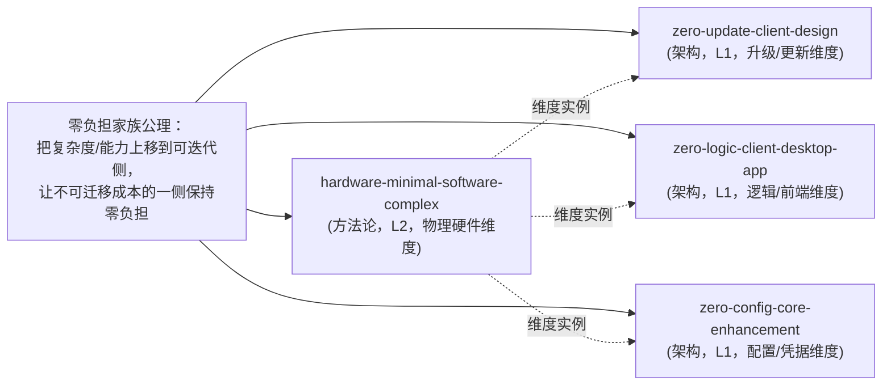

---
source:
  - "../../../patterns/architecture-patterns/zero-config-core-enhancement.md"
  - "../../../patterns/architecture-patterns/zero-logic-client-desktop-app.md"
  - "../../../patterns/architecture-patterns/zero-update-client-design.md"
  - "../../../patterns/methodology-patterns/product-growth/hardware-minimal-software-complex.md"
x-toml-ref: "../../../../../.meta/toml/docs/retrospective/reports/insight-extraction/standalone/insight-zero-patterns-synthesis-20260824.toml"
date: "2026-08-24"
type: "insight"
---

# 零负担家族跨模式洞察与萃取报告（Zero-Burden Family Synthesis）

> **方法论**：seven-concepts 方法论编排（场景4 知识沉淀，链路 R→I→E→V）
> **输入**：zero-config-core-enhancement、zero-logic-client-desktop-app、zero-update-client-design 三个架构模式 + 已有 hardware-minimal-software-complex 方法论模式

## 摘要（Executive Summary）

对分布在 `architecture-patterns/` 的三个"zero-xxx"模式进行跨模式交叉洞察后，确认三者**共享同一本质**——**"复杂度/能力上移"到可快速迭代侧，让受限、不可控、升级成本高的一侧保持"零负担"**。这一本质**并非新模式**，而是已被 `hardware-minimal-software-complex`（硬件极简软件复杂，L2/7次验证）在"物理硬件"维度实质性覆盖。

因此本报告的核心萃取决策是：**不新建重复模式**，而是将三个架构模式与已有方法论模式合并关联，形成"零负担家族"（Zero-Burden Family），通过交叉引用强化整体认知。

---

## 一、事实采集（R阶段，G1检查）

以下为对四个模式的客观事实提炼（无因果推断，纯结构描述）。

### F-001：zero-update-client-design（被控端零更新）
- 定位：架构模式，L1 实验性
- 核心机制：新能力（MCP/AI）在**控制端/服务端**实现，被控端**零修改、零升级、零感知**复用已有远控协议（画面+键鼠输入）
- 实现原理：能力上移（控制端）、复用已有被控端能力、视觉操作不依赖被控端API、协议转换在控制端完成
- 不适用：被控端内核级新能力、新数据类型采集、亚毫秒级实时、安全机制更换
- 验证：向日葵MCP/CLI官方实现（主控端V16.2.3+即可）

### F-002：zero-logic-client-desktop-app（零逻辑客户端桌面应用）
- 定位：架构模式，L1 实验性
- 核心机制：GUI 只做"展示+转发"，业务逻辑100%留在后端工具链，保持**单一事实源**；后端单源托管UI与API保证同源无CORS；进程内线程服务器使PyInstaller可冻结单文件
- 三个支柱：零逻辑客户端、单源无CORS、进程内服务器
- 验证：okf-desktop v0.3.3 实现验证

### F-003：zero-config-core-enhancement（零配置核心·可选增强降级）
- 定位：架构模式，L1 实验性
- 核心机制：按"是否本质价值"将功能划分为**核心/增强**两层；核心层零前置依赖（无Key/配置/付费/登录）开箱即用；增强层可选并优雅降级（等价降级或明确提示降级）
- 判断方法：问"用户不提供任何Key/配置，工具还能否完成本质工作？"
- 验证：okf-kit v0.3.3 源码实践（crawl零Key可用，Chat无Key回退关键词检索）

### F-004：hardware-minimal-software-complex（硬件极简软件复杂）
- 定位：方法论模式，L2 已验证，validation_count=7
- 核心机制：硬件层极简（接口少、无屏幕、零配置），**所有复杂性交给软件App和云端**；用户侧"插电→绑定→一键使用"
- 核心逻辑公式：`硬件极简（零配置）⊕ 软件/云端承载所有复杂性`
- 正例：向日葵开机盒子K3/K4、Amazon Echo、小米智能插座、Chromecast
- 现有 Related：usb-hid-emulation-plug-and-play、ipkvm-bypass-control、technology-encapsulation-user-simplicity

**G1 检查**：以上均为可验证客观描述，含来源、成熟度、验证案例，通过。

---

## 二、跨模式共性洞察（I阶段，G2检查）

### 洞察1：三个"zero-*"架构模式是同一本质在不同维度上的实例（P0）

**陈述**：zero-update、zero-logic、zero-config 三个模式虽然领域不同（远程控制/桌面应用/开发者工具），但共享完全相同的抽象结构——**"将复杂度/新能力迁移到可快速迭代、可控、富余的一侧，让受限/存量/不可控/高升级成本的一侧保持最小负担（zero-burden）"**。

**证据**：F-001（能力上移到控制端，被控端零更新）、F-002（逻辑上移到后端，GUI零逻辑）、F-003（核心价值零配置，增强可选）。

| 维度 | zero-update | zero-logic | zero-config |
|---|---|---|---|
| 受限侧 | 被控端（存量/升级不受控） | GUI前端（易变/薄壳） | 核心功能（需开箱即用） |
| 上移侧 | 控制端/服务端 | 后端/CLI | 增强层 |
| "负担"含义 | 更新负担（升级成本） | 逻辑负担（双份维护） | 配置负担（前置门槛） |

**反常识**：这三个模式各自的模式文档均独立撰写、独立验证，看似互不相关，但实际上它们解决的是同一个更抽象的问题——**"如何让不可控/受限的一端零负担"**。它们分别是该元模式（meta-pattern）在"升级维度""逻辑维度""配置维度"上的三个具体投影。

**行动**：在三个模式文档中补齐与 hardware-minimal-software-complex 及互相之间的交叉引用，标记"零负担家族"同一家族身份。

### 洞察2：跨维度的通用判据是"受限侧的不可迁移成本"（P1）

**陈述**：决定"零负担"该上移到哪一侧的普适判据，不是技术能力，而是**受限侧的无复杂度/升级成本是否不可迁移**——如果某侧存在"不可升级""不可重写""不可配置""会产生双份维护"的高成本，就应让它做零负担侧，把复杂度放到对侧。

**证据**：
- F-001：被控端升级不受控（用户几个月不升级/企业审批/无人值守）→ 升级成本不可迁移 → 被控端零更新
- F-002：前端重写业务逻辑会导致双份维护、后端升级不同步 → 逻辑不可在前端留存 → GUI零逻辑
- F-003：配置门槛挡住潜在用户（冷启动流失）→ 配置成本不可前置 → 核心零配置
- F-004：硬件升级/改版成本极高、物理受限 → 硬件零负担，复杂度上移到可OTA升级的软件/云端

**反常识**：传统直觉是"哪边能力强就把逻辑放哪边"，但本洞察相反——关键看**哪边的"负担"最难被迁移/升级**，把负担压给"负担迁移成本低"的一侧。

**行动**：在家族内沉淀一个通用判定问题："确定任一组件为'零负担侧'前，先问：它升级/重写/配置的成本是否不可迁移？若不可迁移，则让它零负担。"

### 洞察3：单案例L1模式的成熟度，可通过同族跨模式互证提升（P1）

**陈述**：三个 zero-* 架构模式各自都只有1次验证（L1），但它们在抽象本质上与 L2/7验证的 hardware-minimal-software-complex 同构。若能建立"家族"关联并互证，可以比"孤立单案例"获得更强的可信度基础——虽然成熟度等级计数仍是单独计算，但家族层面共享同一公理支撑。

**证据**：F-004（hardware-minimal，L2/7验证）与 F-001/F-002/F-003 在"复杂度上移"上的结构同构；每个 zero-* 模式独立验证了一个不同的"负担维度"，合起来覆盖了系列真实场景。

**反常识**：模式成熟度常被孤立计数（validation_count=1 → 只能 L1），但跨模式结构同构提供了一种"隐性互证"——一个模式的验证虽然来自不同场景，若与已成熟的同族模式遵循同一公理，则可提高整体置信度，同时仍需明确标注单案例。

**行动**：为家族建立"统一公理 + 多维度实例"的层级化结构，在家族索引中说明互证关系，但不虚增任何单模式的 validation_count。

**G2 检查**：3条洞察均含完整四元组（陈述/证据/反常识/行动），维度独立（实例结构/普适判据/成熟度策略），有反常识性，行动指向具体行为。通过。

---

## 三、萃取判断（E阶段，G3检查）

### 萃取结论：不新建重复模式，采用"合并关联 + 交叉引用强化"

按萃取指令集"发现模式重复/与现有模式冲突时，必须选择合并/补充/新建，禁止创建重复模式"之约束：

- 三个 zero-* 架构模式与已有 `hardware-minimal-software-complex`（L2/7验证）**共享同一本质**（复杂度上移·受限侧零负担）
- `hardware-minimal-software-complex` 已承载该本质的权威、已验证表达
- 故**不新建**"零负担"元模式（会重复），而采用**合并关联**：将三个架构模式定位为该方法论模式的"跨维度实例"，建立家族交叉引用

### 家族结构（Zero-Burden Family）

### 建议的交叉引用更新项（G3前）

| 目标文件 | 建议关联 |
|---|---|
| `zero-update-client-design.md` | related_patterns 增加 `hardware-minimal-software-complex`、`zero-logic-client-desktop-app`、`zero-config-core-enhancement`；正文"与其他模式的关系"标注同族 |
| `zero-logic-client-desktop-app.md` | related_patterns 增加 `hardware-minimal-software-complex`；已关联 zero-update 与 zero-config，补 hardware |
| `zero-config-core-enhancement.md` | related_patterns 增加 `hardware-minimal-software-complex`（当前缺此层关联，仅关联到 matrix 层） |
| `hardware-minimal-software-complex.md` | 可选：注明三个跨维度实例，若后续升级为 L3 可引入"零负担家族"索引 |

> ⚠️ 本报告为**洞察+萃取分析交付物**，交叉引用写入属于后续原子提交项，仅在用户确认后执行（避免未授权批量改动既有 L2 模式）。

---

## 四、对抗审查（V阶段）

对"不新建重复模式、建立家族关联"的结论做四视角审查。

### 🔴 魔鬼代言人（Devil's Advocate）
- **质疑**：家族关联是否过度抽象？三个模式的差异（升级/逻辑/配置）是否大到"零负担"只是牵强归纳？——**回应**：三个模式文档各自的"核心设计思想"均独立指向"零负担/零修改/零配置"，且 hardware-minimal 的 L2/7验证给出了权威锚点，收敛成立；但需保留各维度的边界差异（纯度/阈值不同），避免强同化为单模式。
- **质疑**：是否本可不必动三个孤立的 L1 模式，直接各自演化即可？——**回应**：交叉引用成本低、增益明确（互证+检索），且符合"禁止重复萃取"，非过度工程；但不应将三个模式合并成一个文件（会破坏 L1 独立验证粒度）。

### 🟢 新人视角（Newcomer）
- **追问**："零负担家族"术语对新人是否清晰？——**回应**：报告中给出了维度对照表和公理，读者能看懂"哪个侧负担难迁移→哪侧归零"；家族关系需在 README 用一句话说明。
- **追问**：具体的"下一步"是什么？——**回应**：报告已列出交叉引用更新项；是否执行写入需用户确认。

### 🟠 老板/成本视角（Boss）
- **ROI**：为三个 L1 模式建家族关联，投入小（改 frontmatter + 一段关系文字）、收益明确（消除重复萃取、提升模式库内聚度、便于检索）。不新建文件即零存储成本。
- **风险**：若不做，未来可能有人把这四个模式误解为无关，或再次提议"新建零负担模式"造成重复。成本侧无显著风险。

### 🔵 未来视角（Futurist）
- **趋势**：随着更多"zero-*"风格模式涌现，"零负担家族"可能成为模式库的一个成簇(theme)，未来升级为 hardware-minimal-software-complex 的 L3（复用）时，此家族即提供了跨维度的复用证据。
- **缺失拼图**：暂无独立"家族索引"文件；若需正式化，可建 `architecture-patterns/zero-burden-family.md` 作入口（后续按需）。

### V门检查
4视角全部覆盖；审查意见≥5条（魔鬼2、新人2、老板2、未来2，共8条），均有具体攻击点；修正结论：强调"合并关联、不合并文件、不虚增成熟度、写库需用户确认"。通过。

---

## 五、结论与建议

1. **洞察（核心）**：zero-update / zero-logic / zero-config 三个架构模式是同一元本质（复杂度上移·受限侧零负担）的跨维度实例。
2. **萃取（决策）**：不新建重复模式；与已验证的 `hardware-minimal-software-complex`（L2/7验证）建立"零负担家族"交叉引用。
3. **导出**：本报告即洞察+萃取综合交付物，存放于 `insight-extraction/standalone/`。
4. **后续可选（需确认）**：将报告"第三节"的交叉引用更新项作为原子提交写入各模式文档。

## 导航

- [zero-update-client-design.md](../../../patterns/architecture-patterns/zero-update-client-design.md)
- [zero-logic-client-desktop-app.md](../../../patterns/architecture-patterns/zero-logic-client-desktop-app.md)
- [zero-config-core-enhancement.md](../../../patterns/architecture-patterns/zero-config-core-enhancement.md)
- [hardware-minimal-software-complex.md](../../../patterns/methodology-patterns/product-growth/hardware-minimal-software-complex.md)