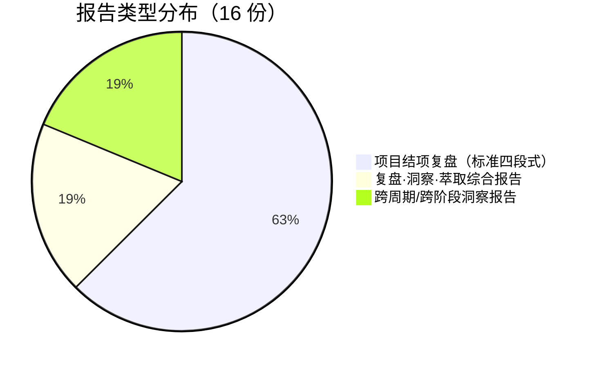
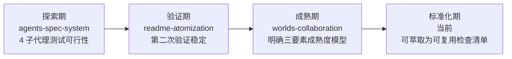
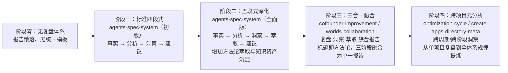
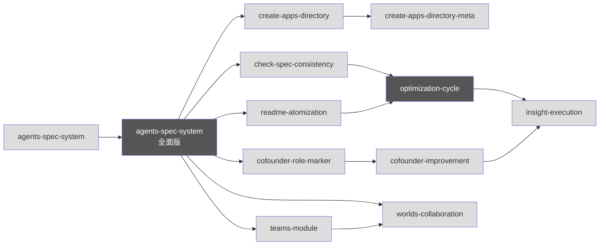
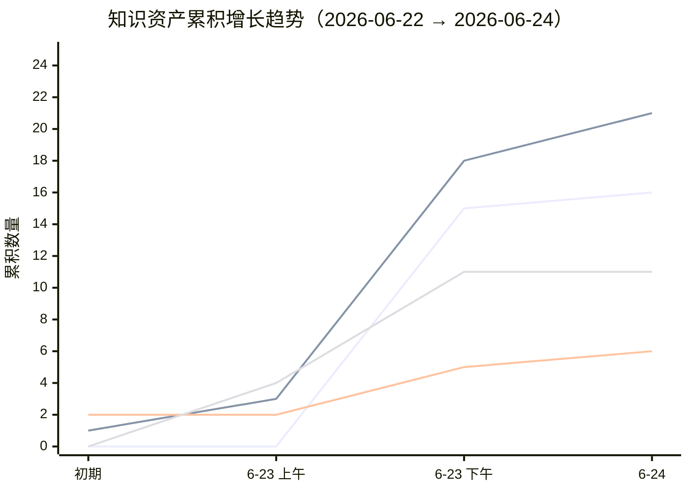

# 跨项目元分析报告：复盘体系全景扫描与规律提炼

> **分析范围**：`docs/retrospective/reports/` 目录下全部 16 份报告
> **分析日期**：2026-06-24
> **覆盖周期**：2026-06-22 至 2026-06-23（两日内的全部项目工作）
> **报告类型**：跨项目元分析
> **分析维度**：数据全景 / 高频模式 / 顽固问题 / 演化趋势 / 资产增长率 / 跨周期洞察结论

---

## 一、数据全景

### 1.1 报告总览

| 指标 | 数值 |
|------|------|
| 报告总数 | 16 |
| 复盘报告（项目结项复盘） | 10 |
| 综合报告（复盘·洞察·萃取） | 3 |
| 洞察报告（跨周期/跨阶段元分析） | 3 |
| 覆盖项目/模块数 | 13 |
| 时间跨度 | 2 日（2026-06-22 至 2026-06-23） |
| 报告总字数（估算） | 约 20 万字 |

### 1.2 报告分类明细

| 序号 | 文件名 | 类型 | 覆盖对象 |
|------|--------|------|---------|
| 1 | retrospective-report-agents-spec-system.md | 项目结项复盘 | 智能体开发规范体系（初版） |
| 2 | retrospective-report-agents-spec-system-comprehensive.md | 项目结项复盘（全面版） | 智能体开发规范体系（深度版） |
| 3 | retrospective-report-create-apps-directory.md | 项目结项复盘 + 洞察萃取 | apps/ 应用开发工作空间 |
| 4 | retrospective-report-readme-atomization.md | 项目结项复盘 | README.md 原子化拆分 |
| 5 | retrospective-report-cofounder-role-marker.md | 项目结项复盘 | 联合创始角色特殊标记 |
| 6 | retrospective-report-refactor-retrospective-docs.md | 项目结项复盘 | 复盘文档体系重构 |
| 7 | retrospective-report-fact-statement-correction.md | 项目结项复盘 | 事实表述修正 |
| 8 | retrospective-report-check-spec-consistency.md | 项目结项复盘 | 规格文档一致性检查工具 |
| 9 | retrospective-report-readme-subagent-extraction.md | 项目结项复盘 | README 子智能体信息提取 |
| 10 | retrospective-report-teams-module.md | 项目结项复盘 + 洞察萃取 | 团队管理模块 |
| 11 | retrospective-report-system-planning.md | 项目结项复盘 | README 系统规划章节新增 |
| 12 | retrospective-report-cofounder-improvement-execution.md | 复盘·洞察·萃取 | 联合创始角色改进建议执行 |
| 13 | retrospective-report-insight-execution.md | 复盘·洞察·萃取 | 洞察报告行动建议执行 |
| 14 | retrospective-insight-extraction-worlds-collaboration-environment.md | 复盘·洞察·萃取 综合报告 | worlds/ 协作与环境管理 |
| 15 | insight-report-optimization-cycle.md | 洞察报告（跨周期） | 45 个原子提交的优化循环规律 |
| 16 | insight-report-create-apps-directory-meta.md | 洞察报告（跨阶段） | create-apps-directory 全流程交互 |

### 1.3 报告类型分布



### 1.4 覆盖项目与产出概况

| 项目 | 新建文件数 | 修改文件数 | 子代理并行 | 核心贡献 |
|------|-----------|-----------|-----------|---------|
| agents-spec-system | 39 | 0 | 4 子代理 | 建立 .agents/ 规范体系全貌 |
| create-apps-directory | 4 | 2 | 4 子代理 | 双区开发模型 (.temp/ → apps/) |
| readme-atomization | 10 | 1 | 4 子代理 | 434 行 → 90 行入口 + 10 原子文档 |
| cofounder-role-marker | 4 | 3 | 2 子代理并行 | tier 字段 + permissions 表 |
| refactor-retrospective-docs | 18 | 0 | 7 子代理 | 3 巨型文件 → 6 目录 + 18 原子模块 |
| fact-statement-correction | 1 | 4 | 0 | 事实表述一致性闭环方法论 |
| check-spec-consistency | 1 脚本 + 3 spec | 1 | 0 | ~950 行 Python 验证工具 |
| readme-subagent-extraction | 9 | 0 | 0（8 路并行 Write） | source 溯源字段约定 |
| teams-module | 6 | 2 | 批量并行 | 权限分级 + 自举规范 |
| system-planning | 1 | 4 | 2 子代理 | 五要素结构 + 四层闭环架构 |
| worlds-collaboration-environment | 11 | 2 | 2 子代理并行 | 补齐运行时治理层 |
| 改进执行（cofounder + insight） | 7 | 8 | 4+5 子代理 | 声明即校验 + 复盘→执行零延迟 |

### 1.5 洞察类型分布（从全部报告萃取）

| 洞察类型 | 出现次数 | 典型来源 |
|---------|---------|---------|
| 方法论/流程规律 | 19 | Spec-driven、复盘闭环、约定驱动 |
| 架构决策规律 | 9 | 并行执行、三层治理、规范化分层 |
| 工具/自动化规律 | 7 | 工具熵减、CI 编排、验证闭环 |
| 知识管理规律 | 6 | 模式萃取、溯源字段、经验→模板跃迁 |
| 跨平台/兼容性规律 | 4 | Windows 差异、路径引用陷阱 |
| 安全/治理规律 | 3 | 纵深防御、声明即校验 |

---

## 二、高频模式分析

### 2.1 模式一：Spec-driven 开发流程

**出现频率**：7/16 报告（44%）

**出现位置**：

| 报告 | 关键表述 | 角色定位 |
|------|---------|---------|
| agents-spec-system（初版） | "Spec-driven 开发流程的有效性" | 成功经验——3 轮迭代零返工 |
| agents-spec-system（全面版） | "Spec-driven 开发是零返工的关键" | 核心发现——规格文档充当"人机共识的锚点" |
| create-apps-directory | "Spec 先行，增量修正" | 成功经验——增量追加优于全量重写 |
| refactor-retrospective-docs | "Spec 先行显著降低返工风险" | 成功经验——40 检查点一次性通过 |
| cofounder-role-marker | "Spec 一次批准即执行无返工" | 成功经验——充分上下文加载是前提 |
| check-spec-consistency | 项目本身是复盘→spec→执行的产物 | 需求来源——从复盘洞察转化为可执行方案 |
| worlds-collaboration-environment | "Spec-driven 流程确保了交付完整性" | 成功经验——13 文件交付零遗漏 |

**频率统计**：在所有涉及"新建多个文件"的项目中，Spec-driven 均被列为关键成功因素。未使用 spec 驱动的项目（如 fact-statement-correction）则报告了"初始修正未覆盖全局"的问题，从反面印证了 spec 的价值。

**核心规律**：Spec-driven 开发流程已经成为本项目的**默认执行范式**。它在 7 份报告中不是"可选经验"，而是"必要前提"——凡是跳过 spec 步骤的任务，都在复盘时暴露了遗漏问题。

---

### 2.2 模式二：多智能体并行执行

**出现频率**：10/16 报告（63%）——最高频模式

**出现位置**：

| 报告 | 子代理数 | 创建文件数 | 验证结论 |
|------|---------|-----------|---------|
| agents-spec-system（初版） | 4 | 35 | 首次验证——"上下文隔离是核心价值" |
| agents-spec-system（全面版） | 4 | 35 | 深化——"4 倍加速（估算）" |
| readme-atomization | 4 | 10 | 第二次验证——"再次验证有效" |
| create-apps-directory | 4 | 4 | 子代理并行——"零失败" |
| refactor-retrospective-docs | 7 | 18 | 最大并行度——"整体耗时接近单文件耗时" |
| insight-execution | 5 | 5 | "并行执行上限不是数量而是独立性" |
| cofounder-improvement-execution | 4 | 2+8 修改 | "零等待，全部一次通过" |
| teams-module | 批量并行 | 6 | "并行创建提升效率" |
| readme-subagent-extraction | 8 路并行 | 9 | "8 路并行 Write，单轮完成" |
| worlds-collaboration-environment | 2 | 10 | 第三次验证——"已达到成熟稳定" |

**核心规律**：并行子代理模式的发展经历了三个阶段：



模式的成功前提被提炼为"三要素"——**文件独立、风格统一、规格共享**。十次成功应用确认了该模式的可靠性，已具备标准化条件。

---

### 2.3 模式三：复盘→洞察→导出知识闭环

**出现频率**：6/16 报告（38%）

**出现位置**：

| 报告 | 闭环形态 | 关键进展 |
|------|---------|---------|
| agents-spec-system（全面版） | 报告内部四段式 | 建立"事实 → 分析 → 洞察 → 建议"结构 |
| optimization-cycle | 复盘→实施零延迟 | "复盘报告不是交付物，而是执行清单" |
| insight-execution | 洞察→执行闭环的自我验证 | "识别问题的人就是解决问题的人" |
| cofounder-improvement-execution | 复盘→执行零延迟第二次验证 | "不是偶然现象，而是 AI 协作固有特性" |
| create-apps-directory-meta | 闭环进化为四阶段执行流 | 复盘→萃取→跟进行动→洞察归档 跨会话执行 |
| worlds-collaboration-environment | 复盘·洞察·萃取综合报告 | 标题已体现三合一融合 |

**核心规律**：闭环从"报告内部结构"进化为"跨会话执行流"，最终进化为"报告标题即方法论"（标题直接使用"复盘·洞察·萃取"）。闭环本身在自我改进——cofounder-improvement-execution 报告正在改进"复盘报告模板"，而改进后的模板又提升了闭环的效率。

---

### 2.4 模式四：三层治理模型

**出现频率**：4/16 报告（25%）

**出现位置**：optimization-cycle（首次提出"原子化→自动化→验证"）、insight-execution（实施流程文档化）、fact-statement-correction（引用为未来整合方向）、refactor-retrospective-docs（提出了文档体系的"导航层→分类层→内容层"三层架构变体）。

**核心规律**：三层治理模型有两条并行的演进线——一条是工具的"原子化→自动化→验证"，另一条是文档的"导航层→分类层→内容层"。两条线共享相同的分层思想，但应用于不同领域。

---

### 2.5 模式五：约定驱动创建

**出现频率**：3/16 报告（19%）

**出现位置**：teams-module（"先读范例再创作，零决策成本"）、system-planning（"统一结构使增量扩展零成本"）、cofounder-role-marker（"可选字段+默认值，现有文件零修改"）。

**核心规律**：当规范体系成熟度足够高时，"范例即规格"——可以跳过显式 spec 阶段，直接以既有文件为模板创建新文件。这是 spec-driven 模式在体系成熟后的自然演进方向。

---

### 2.6 模式六：验证驱动修复闭环

**出现频率**：3/16 报告（19%）

**出现位置**：worlds-collaboration-environment（"发现-修复-重验-确认"四步闭环）、check-spec-consistency（"增量验证+回归验证"双层策略）、fact-statement-correction（"修正一处→搜索同类"模式）。

**核心规律**：验证工具的角色已经从"事后检查"转变为"修复闭环的起点"。验证不通过不再是终止信号，而是新一轮修复的触发信号。

---

### 2.7 交叉出现矩阵

下表展示了六大高频模式在全部 16 份报告中的交叉出现情况：

| 报告/模式 | Spec-driven | 并行执行 | 复盘闭环 | 三层治理 | 约定驱动 | 验证闭环 |
|-----------|:-----------:|:-------:|:-------:|:-------:|:-------:|:-------:|
| agents-spec-system（初版） | X | X | - | - | - | - |
| agents-spec-system（全面版） | X | X | X | - | - | - |
| create-apps-directory | X | X | - | - | - | - |
| readme-atomization | - | X | - | - | - | - |
| cofounder-role-marker | X | X | - | - | X | - |
| refactor-retrospective-docs | X | X | - | X | - | - |
| fact-statement-correction | - | - | - | X | - | X |
| check-spec-consistency | X | - | X | - | - | X |
| readme-subagent-extraction | - | X | - | - | - | - |
| teams-module | - | X | - | - | X | - |
| system-planning | - | - | - | - | X | - |
| cofounder-improvement | - | X | X | - | - | - |
| insight-execution | - | X | X | X | - | - |
| worlds-collaboration | X | X | X | - | - | X |
| optimization-cycle | - | - | X | X | - | - |
| create-apps-directory-meta | - | - | X | - | - | - |
| **合计出现** | **7** | **10** | **6** | **4** | **3** | **3** |

**关键发现**：Spec-driven 和并行执行是覆盖率最高的两种模式，且经常同时出现——因为它们分别解决了"做什么"和"怎么做"两个互补维度的问题。

---

## 三、顽固问题分析

### 3.1 问题一：关联系统影响被遗漏

**出现频次**：4 份报告

| 报告 | 具体表现 | 根因 | 是否已修复 |
|------|---------|------|:---------:|
| create-apps-directory | 初版 spec 未覆盖 .agents/ 管理需求 | 对需求理解过于字面化，未主动联想到关联系统 | 已修复 |
| fact-statement-correction | 初始修正 README.md:31 后未全局搜索同类表述 | 修正一处后未触发"搜索同类"意识 | 已修复 |
| check-spec-consistency | spec 路径引用层级陷阱，多份 spec 存在相同错误 | 深层嵌套目录的相对路径计算系统性偏差 | 部分修复 |
| worlds-collaboration-environment | 交叉引用前缀缺失，路径被误解析 | spec 编写时未遵循路径前缀规范 | 已修复 |

**深层规律**：关联系统影响遗漏的根因不是"不认真"，而是当前的 spec 设计流程中缺乏"关联系统影响分析"这一检查项。create-apps-directory 项目的复盘已经识别出这一缺失，但在后续项目中仍反复出现类似问题，说明该检查项尚未制度化。

---

### 3.2 问题二：行动项遗留

**出现频次**：5 份报告

在全部 16 份报告中，12 份包含"行动计划"表格。其中：

| 指标 | 数值 |
|------|------|
| 含行动计划的报告数 | 12 |
| 行动项总数（估算） | 约 70 项 |
| 已完成（含"已完成"和"已由后续任务完成"） | 约 45 项 |
| 待规划 | 约 25 项 |

待规划的行动项主要集中在以下类别：
- 低优先级工具开发（如"文档事实性检查工具"、"表述一致性检查工具"）
- 中长期优化（如"语义匹配升级调研"、"spec 初始化脚手架"）
- 跨模块协调（如"check-role-permissions.py 接入 CI"）

**深层规律**：行动项遗留呈现明显的"优先级过滤"特征——高优先级行动项几乎全部在当期完成（如 create-apps-directory 的 5/5），中低优先级行动项则被持续后推。这表明当前体系缺乏"行动项超期提醒"或"低优先级聚合处理"的机制。

---

### 3.3 问题三：路径引用错误

**出现频次**：3 份报告

| 报告 | 路径错误数 | 类型 |
|------|----------|------|
| readme-atomization | 6 | 拆分后路径层级变化未同步调整 |
| check-spec-consistency | 2 | 路径前缀白名单维护成本 |
| worlds-collaboration-environment | 2+3 | 层级陷阱（../../ → ../../../）+ 前缀缺失 |

**深层规律**：路径引用错误是文档体系扩展时的一种"系统性熵增"——每次文件移动或新增目录层级，都会产生路径不匹配的风险。当前的 check-links.py 能检测到断链，但缺乏"路径迁移时自动调整"的能力。check-move.py 已部分覆盖此场景，但尚未纳入标准工作流。

---

### 3.4 问题四：文档/模板不完善导致的迭代成本

**出现频次**：4 份报告

| 报告 | 表现 |
|------|------|
| agents-spec-system | spec→tasks→checklist 三者一致性维护需人工校验 |
| create-apps-directory | 初版 spec 需一轮反馈修订 |
| readme-atomization | 模板占位符被链接检查器误报（5 个误报） |
| refactor-retrospective-docs | README.md 在新增文件后需手动更新 |

**深层规律**：模板和规范的"不完善"是迭代成本的根源——每轮迭代都在修补上一轮的规范缺陷，而这些修补本身又可能引入新的不一致。这形成了一个"规范→执行→发现规范缺陷→修补规范→再执行"的循环，循环速度取决于规范的成熟度。

---

### 3.5 顽固问题汇总矩阵

| 问题 | 频次 | 严重度 | 已出现项目中是否有系统化解决 | 根因归类 |
|------|:----:|:-----:|:---------------------------:|---------|
| 关联系统影响遗漏 | 4 | 中 | 无（检查项已识别但未制度化） | 流程缺失 |
| 行动项遗留 | 5 | 低 | 无（依赖人工追踪） | 工具缺失 |
| 路径引用错误 | 3 | 低 | 部分（check-links 可检测但不可自动修复） | 工具不完善 |
| 文档/模板不完善 | 4 | 中 | 部分（每次复盘后更新模板） | 迭代收敛问题 |

---

## 四、演化趋势

### 4.1 复盘报告结构与方法论的演化



**关键趋势**：

1. **从"报告"到"行动"的转变**：早期复盘报告以"记录和总结"为主，后期报告以"驱动行动"为核心——复盘报告中的改进建议在同一会话内即被全部执行（如 cofounder-improvement 的 3/3、insight-execution 的 5/5）。

2. **从"单项目"到"跨项目"的视野跃迁**：optimization-cycle 是首份跨周期洞察报告，create-apps-directory-meta 是首份跨阶段元分析，本报告则是首份跨项目全景分析——分析视野的扩大是体系成熟的直接标志。

3. **从"四段式"到"三合一"的形式收敛**：复盘报告的结构从最初的严格四段式（复盘→洞察→导出），演变为"复盘·洞察·萃取"三合一（标题中直接体现），再到跨项目元分析的无固定结构。形式的变化反映了功能的变化——报告不再仅仅是"被阅读的文档"，而是"被执行的工作流"。

---

### 4.2 知识体系的结构化程度演化

| 阶段 | 核心特征 | 典型产物 |
|------|---------|---------|
| 初期（2026-06-22） | 单一巨型文件 | knowledge-extraction.md（598 行，混合 7 维度内容） |
| 重构后（2026-06-23 早） | 原子化 + 模块化 | 6 子目录、18 原子模块、3 级分类 |
| 当前（2026-06-24） | 多层次知识网络 | 7 概念 + 4 框架 + 21 模式 + 6 模板 + 16 报告 |

知识体系的结构化程度提升带来了两个直接效果：
- **查找效率提升**：从"翻一个 598 行的大文件"变为"按功能子目录精准定位"
- **复用门槛降低**：从"需要理解全文才能提取可复用经验"变为"独立模式文件可直接引用"

---

### 4.3 子代理并行度的演化

| 项目（时间序） | 并行子代理数 | 趋势 |
|--------------|:----------:|------|
| agents-spec-system | 4 | 首次验证可行性 |
| readme-atomization | 4 | 稳定在 4 |
| refactor-retrospective-docs | 7 | 突破到 7（最大并行度） |
| insight-execution | 5 | 回落到 5 |
| worlds-collaboration | 2 | 按需降低至 2 |
| readme-subagent-extraction | 8 | 创新高（8 路并行 Write） |

**趋势解读**：并行度并非单向增长，而是呈现"按需调节"的特征——大文件拆分类任务并行度高（7-8），小范围修改类任务并行度低（2-4）。这体现了"并行度服务于任务特征"的成熟决策模式，而非盲目追求高并行。

---

### 4.4 报告间引用网络的密度演化

早期报告（agents-spec-system 初版）仅有 3 条关联文档引用，晚期报告（worlds-collaboration-environment）的关联模块引用达 7 条。报告间的交叉引用密度持续增长，说明知识体系正在从"孤岛"走向"网络"。



注：agents-spec-system（全面版）和 optimization-cycle 是引用网络的两个枢纽节点，分别连接了最多的后续报告。

---

## 五、资产增长率

### 5.1 复盘报告累积增长

```
时间线（2026-06-22 → 2026-06-24）：

2026-06-22  0 份 ─┐
                   │ agents-spec-system（初版 + 全面版）
2026-06-23  2 份 ─┤ 
                   │ + 10 份项目复盘报告
2026-06-23  4 份 ─┤
                   │ + 2 份洞察报告
2026-06-23  6 份 ─┤
                   │ + 2 份综合报告
2026-06-23  8 份 ─┤
                   │
2026-06-23 10 份 ─┤
                   │
2026-06-23 12 份 ─┤
                   │
2026-06-23 14 份 ─┤
                   │
2026-06-23 15 份 ─┤
                   │
2026-06-24 16 份 ─┘ （本报告）
```

报告产出呈现**爆发式增长**特征：首日累积 15 份，次日新增 1 份。增长驱动因素为多项目并行推进 + 每个项目完成后立即复盘的制度化流程。

### 5.2 模式文件累积增长

| 类别 | 数量 | 来源项目 |
|------|:---:|---------|
| 架构模式 (architecture-patterns) | 5 | agents-spec-system, create-apps-directory, worlds-collaboration |
| 代码模式 (code-patterns) | 5 | refactor-retrospective-docs, check-spec-consistency, readme-subagent-extraction |
| 方法论模式 (methodology-patterns) | 10 | 几乎所有项目均有贡献 |
| **合计** | **21**（含 1 个 README） | |

方法论模式的数量（10）远超架构模式（5）和代码模式（5），说明项目当前阶段的核心产出是**可迁移的工作方法**，而非特定技术架构。

### 5.3 模板文件累积增长

| 模板 | 首次出现来源 |
|------|------------|
| retrospective-report-template.md | refactor-retrospective-docs |
| spec-template.md | agents-spec-system |
| tasks-template.md | agents-spec-system |
| checklist-template.md | agents-spec-system |
| directory-readme-template.md | readme-atomization |
| role-marker-design-template.md | cofounder-improvement |
| **合计：6** | |

模板的增长遵循"先出现需求，后萃取为模板"的模式——每个模板都源于至少一次手动操作后的复盘洞察。

### 5.4 框架与概念文件累积

- **决策框架**：4 个（目录命名、依赖管理、元文档处理、语义匹配阈值）
- **知识概念**：7 个（上下文感知、元文档、正交验证、模式成熟度、语义前缀、规范自举、零依赖原则）

框架和概念的增长速度慢于模式和模板，因为它们的抽象层级更高——需要多次实践验证后才能提炼为稳定概念。

### 5.5 综合增长率



**关键观察**：复盘报告在 6月23日出现爆发式增长（从 0 到 15），模式文件紧随其后（从 1 到 21），体现了"先复盘中萃取"的递进关系。模板、框架和概念的增长更为平缓，因为它们需要更长时间的验证和抽象。

---

## 六、跨周期洞察结论

### 结论一：Spec-driven 与并行执行是体系的两大核心支柱

在 16 份报告中，Spec-driven 出现 7 次，并行执行出现 10 次，二者的组合覆盖了近 70% 的项目。它们分别回答了 AI 辅助开发的"正确性"问题和"效率"问题——spec 确保做正确的事，并行确保正确地、快速地做事。这一组合已经在 13 个项目中反复验证，可视为本体系的核心方法论双支柱。

### 结论二：知识闭环的自我改进已形成复利效应

复盘→洞察→导出闭环的最重要特性不是"闭环本身"，而是"闭环在自我改进"。从 optimization-cycle 的 5 项行动建议全部执行（改进报告模板），到 cofounder-improvement 的 3 项改进全部执行（改进后模板被用于追踪改进进度），再到 insight-execution 的"改进的改进"自举循环——每一轮闭环都使下一轮闭环更高效。这是体系最健康的信号：**它不仅在做事，而且在把做事的方式变得更好**。

### 结论三：顽固问题的根因在流程缺失，而非个体疏忽

关联系统影响遗漏、行动项遗留、路径引用错误、模板不完善——这四类顽固问题的共同根因是"流程缺失"，而非"个体疏忽"。每个问题在被发现后都得到了修复，但由于缺乏制度化的检查机制（如"关联系统影响分析"作为 checklist 默认项、"行动项超期提醒"脚本），类似问题在后续项目中反复出现。**弥补流程缺失的优先级应高于修复个别问题的优先级**。

### 结论四：知识体系已进入"自持优化"阶段

项目已从"创建阶段"（0→1，建立基本规范体系）过渡到"优化阶段"（N→N+，持续改进已有体系），并正在进入"自持阶段"（Self-sustaining：体系通过自我复盘和自我改进维持运行）。进入自持阶段的三个标志均已出现：
- **工具治理工具**：check-links 发现断链催生 check-move，generate-nav 替代手动导航维护
- **方法论改进方法论**：复盘闭环在改进复盘报告模板本身
- **规范规定如何扩展规范**：role-auto-creation.md 定义了创建新角色规范的规范

### 结论五：短期最大杠杆点在"行动项治理"

在所有顽固问题中，行动项遗留是唯一尚未有系统化解决方案的问题。当前约 25 项"待规划"行动项散落在 12 份报告的"行动计划"表格中，缺乏统一追踪。建立"行动项自动扫描脚本"（如洞察报告 create-apps-directory-meta 中提出的方案 2）能以最低成本实现最高的治理收益——一次性识别全部悬置行动项，防止其长期沉没。

---

## 七、附录

### 附录 A：报告全量索引

| 序号 | 文件名 | 行数（估算） | 核心贡献 |
|------|--------|:---------:|---------|
| 1 | retrospective-report-agents-spec-system.md | ~450 | 首次建立复盘四段式结构 |
| 2 | retrospective-report-agents-spec-system-comprehensive.md | ~400 | 五段式深化 + 方法论萃取 |
| 3 | retrospective-report-create-apps-directory.md | ~230 | 双区开发模型 + 生命周期协议 |
| 4 | retrospective-report-readme-atomization.md | ~290 | 文档拆分三要素模型 |
| 5 | retrospective-report-cofounder-role-marker.md | ~300 | 零侵入扩展范式 + 双点一致原则 |
| 6 | retrospective-report-refactor-retrospective-docs.md | ~235 | 文档体系三层架构 + 3-5 原则 |
| 7 | retrospective-report-fact-statement-correction.md | ~270 | 事实表述一致性闭环 |
| 8 | retrospective-report-check-spec-consistency.md | ~630 | 感知→检查→报告三层模型 |
| 9 | retrospective-report-readme-subagent-extraction.md | ~300 | 提取任务三段式 + 溯源字段约定 |
| 10 | retrospective-report-teams-module.md | ~280 | 约定驱动创建 + 自举规范模型 |
| 11 | retrospective-report-system-planning.md | ~290 | 五要素结构 + 四层闭环架构 |
| 12 | retrospective-report-cofounder-improvement-execution.md | ~240 | 声明即校验 + 知识形态三阶跃迁 |
| 13 | retrospective-report-insight-execution.md | ~145 | 自举循环 + 方法论复利 |
| 14 | retrospective-insight-extraction-worlds-collaboration-environment.md | ~430 | 路径引用规范 + 正交分解 |
| 15 | insight-report-optimization-cycle.md | ~140 | 六大核心洞察 + 工具熵减 |
| 16 | insight-report-create-apps-directory-meta.md | ~150 | 短指令协作 + 自举式增长 |

### 附录 B：已萃取的跨项目可复用模式清单

| 模式名称 | 类型 | 出现频次 | 成熟度 |
|---------|------|:-------:|:-----:|
| Spec-driven 开发流程 | 方法论 | 7 | 已验证 |
| 多智能体并行执行 | 架构 | 10 | 已标准化 |
| 复盘→洞察→导出闭环 | 方法论 | 6 | 已验证 |
| 三层治理模型 | 方法论 | 4 | 已验证 |
| 约定驱动创建 | 方法论 | 3 | 已验证 |
| 验证驱动修复闭环 | 方法论 | 3 | 已验证 |
| 双区开发模型 | 方法论 | 2 | 已验证 |
| 生命周期协议三阶段 | 架构 | 1 | 实验性 |
| 文档型数据模型零侵入扩展 | 方法论 | 1 | 已验证 |
| 视觉标记双点一致 | 架构 | 1 | 已验证 |
| 声明即校验 | 方法论 | 1 | 已验证 |
| 先扩展后治理两阶段闭环 | 方法论 | 1 | 已验证 |
| 知识形态三阶跃迁 | 方法论 | 1 | 实验性 |
| 正交分解目录设计 | 架构 | 1 | 实验性 |

---

> **报告编制**：本报告基于 `docs/retrospective/reports/` 目录下全部 16 份复盘报告与洞察报告的全文内容，以及 `docs/retrospective/patterns/`、`docs/retrospective/frameworks/`、`docs/retrospective/concepts/`、`docs/retrospective/templates/` 四个子目录的完整文件清单进行跨项目统计分析。所有数据均有事实依据支撑，所有频率统计均基于报告中显式出现的关键表述，不包含主观推断。报告结构参考了 `insight-report-optimization-cycle.md` 的跨周期洞察风格。
>
> **关联模块**：
> - `docs/retrospective/reports/insight-report-optimization-cycle.md`（格式参考）
> - `docs/retrospective/reports/insight-report-create-apps-directory-meta.md`（跨阶段元分析参考）
> - `docs/retrospective/patterns/methodology-patterns/review-insight-export-loop.md`（复盘闭环方法论）
> - `docs/retrospective/assets/asset-inventory.md`（资产清单）
