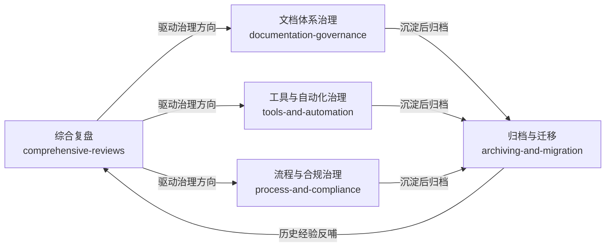

+++
id = "project-governance-index"
date = "2026-06-26"
type = "index"
+++

# 项目治理复盘报告

> 本目录存放项目治理类复盘报告，涵盖项目整体回顾、文档体系治理、工具与自动化、流程合规、归档迁移五大主题，采用二级主题分类组织，便于按治理维度查阅。

## 主题分类总览

| 主题 | 定义 | 报告数量 |
|------|------|---------|
| [comprehensive-reviews/](comprehensive-reviews/) | 项目级综合复盘，覆盖全周期里程碑与核心发现 | 3 份 |
| [documentation-governance/](documentation-governance/) | 文档体系治理，包括结构优化、命名规范、渲染修复、链接校验 | 7 份 |
| [tools-and-automation/](tools-and-automation/) | 工具与自动化治理，含工具熵优化、自动化文档生成 | 2 份 |
| [process-and-compliance/](process-and-compliance/) | 流程与合规治理，覆盖工作空间创建、建议执行闭环、启动协议合规 | 3 份 |
| [archiving-and-migration/](archiving-and-migration/) | 归档与内容迁移，含历史内容萃取、参赛作品归档、Demo流程探索 | 4 份 |

## 主题关系图



## 各主题报告详情

### [comprehensive-reviews/](comprehensive-reviews/) — 项目综合复盘

| 报告 | 日期 | 核心内容 |
|------|------|---------|
| [retrospective-comprehensive-20260623/](comprehensive-reviews/retrospective-comprehensive-20260623/) | 2026-06-23 | 智能体开发规范体系综合复盘，已原子化为6个子模块 |
| [retrospective-project-comprehensive-20260625/](comprehensive-reviews/retrospective-project-comprehensive-20260625/) | 2026-06-25 | 项目级全面复盘（3天节点），380+文件、40份报告、71个可复用模式 |
| [retrospective-specweave-full-project-comprehensive-20260626/](comprehensive-reviews/retrospective-specweave-full-project-comprehensive-20260626/) | 2026-06-26 | SpecWeave项目结项全面复盘（4天），229次提交、29个Spec、796个文档、46个模式 |

### [documentation-governance/](documentation-governance/) — 文档体系治理

| 报告 | 日期 | 核心内容 |
|------|------|---------|
| [reports-duplication-optimization-report.md](documentation-governance/reports-duplication-optimization-report.md) | 2026-06-24 | 复盘报告体系重复内容优化，移除冗余引用块、精简导航结构 |
| [retrospective-report-system-planning/](documentation-governance/retrospective-report-system-planning/) | 2026-06-23 | README系统规划章节设计，四层闭环架构 |
| [retrospective-readme-sync-and-brand-naming-20260624/](documentation-governance/retrospective-readme-sync-and-brand-naming-20260624/) | 2026-06-24 | README同步与SpecWeave品牌命名一致性修复 |
| [retrospective-report-four-topic-structure-optimization-20260624/](documentation-governance/retrospective-report-four-topic-structure-optimization-20260624/) | 2026-06-24 | 复盘报告四主题结构优化推广，24个project-overview合并、23个连接器删除 |
| [retrospective-insights-reorg-20260626/](documentation-governance/retrospective-insights-reorg-20260626/) | 2026-06-26 | 竹简悟道洞察库重组，从2个失衡文件重组为3个四层结构均衡文件 |
| [retrospective-link-fix-depth-adjustment-20260626/](documentation-governance/retrospective-link-fix-depth-adjustment-20260626/) | 2026-06-26 | 断链修复与链接自动校正工具增强，新增try_adjust_relative_depth()算法 |
| [retrospective-mermaid-rendering-fix-20260626/](documentation-governance/retrospective-mermaid-rendering-fix-20260626/) | 2026-06-26 | Mermaid渲染兼容性修复，提炼安全编码五规则与陷阱速查表，已原子化insights/和suggestions/子目录 |

### [tools-and-automation/](tools-and-automation/) — 工具与自动化治理

| 报告 | 日期 | 核心内容 |
|------|------|---------|
| [retrospective-report-tool-entropy-nonlinear-optimization/](tools-and-automation/retrospective-report-tool-entropy-nonlinear-optimization/) | 2026-06-23 | 工具熵非线性优化，自动化规模不经济规律 |
| [retrospective-report-code-wiki-generation/](tools-and-automation/retrospective-report-code-wiki-generation/) | 2026-06-24 | Code Wiki自动化文档生成任务 |

### [process-and-compliance/](process-and-compliance/) — 流程与合规治理

| 报告 | 日期 | 核心内容 |
|------|------|---------|
| [retrospective-report-create-apps-directory/](process-and-compliance/retrospective-report-create-apps-directory/) | 2026-06-23 | apps/应用开发工作空间创建与双区开发生命周期协议 |
| [retrospective-report-suggestion-execution-and-pattern-import/](process-and-compliance/retrospective-report-suggestion-execution-and-pattern-import/) | 2026-06-23 | 改进建议执行与模式导入闭环 |
| [retrospective-session-agents-md-violation-20260624/](process-and-compliance/retrospective-session-agents-md-violation-20260624/) | 2026-06-24 | AGENTS.md启动协议违反复盘，三重连锁错误根因分析 |

### [archiving-and-migration/](archiving-and-migration/) — 归档与内容迁移

| 报告 | 日期 | 核心内容 |
|------|------|---------|
| [retrospective-export-20260623/](archiving-and-migration/retrospective-export-20260623/) | 2026-06-23 | 复盘报告导出卡片 |
| [retrospective-zhujian-wudao-apps-archiving-20260625/](archiving-and-migration/retrospective-zhujian-wudao-apps-archiving-20260625/) | 2026-06-25 | 竹简悟道参赛作品归档至apps/，参赛作品归档5步法 |
| [retrospective-xinet-content-extraction-archiving-20260625/](archiving-and-migration/retrospective-xinet-content-extraction-archiving-20260625/) | 2026-06-25 | xinet目录系统性内容萃取与归档，54151文件扫描分类 |
| [retrospective-specweave-demo-production-flow-20260625/](archiving-and-migration/retrospective-specweave-demo-production-flow-20260625/) | 2026-06-25 | SpecWeave Demo制作流程探索，70%完成度判断、自指涉证据闭环三层模型 |

## 目录结构树

```
project-governance/
├── README.md                                    ← 本文件（主索引）
├── comprehensive-reviews/                       ← 项目综合复盘（3份）
│   ├── README.md                                · 主题索引
│   ├── retrospective-comprehensive-20260623/    · 智能体开发规范体系综合复盘
│   ├── retrospective-project-comprehensive-20260625/ · 项目级全面复盘（3天节点）
│   └── retrospective-specweave-full-project-comprehensive-20260626/ · SpecWeave结项全面复盘
├── documentation-governance/                    ← 文档体系治理（7份）
│   ├── README.md                                · 主题索引
│   ├── reports-duplication-optimization-report.md · 重复内容优化（独立文件）
│   ├── retrospective-report-system-planning/    · README系统规划章节
│   ├── retrospective-readme-sync-and-brand-naming-20260624/ · 品牌命名一致性
│   ├── retrospective-report-four-topic-structure-optimization-20260624/ · 四主题结构优化
│   ├── retrospective-insights-reorg-20260626/   · 洞察库重组
│   ├── retrospective-link-fix-depth-adjustment-20260626/ · 断链修复与深度调整
│   └── retrospective-mermaid-rendering-fix-20260626/ · Mermaid渲染修复（含insights/suggestions子目录）
├── tools-and-automation/                        ← 工具与自动化治理（2份）
│   ├── README.md                                · 主题索引
│   ├── retrospective-report-tool-entropy-nonlinear-optimization/ · 工具熵非线性优化
│   └── retrospective-report-code-wiki-generation/ · Code Wiki生成
├── process-and-compliance/                      ← 流程与合规治理（3份）
│   ├── README.md                                · 主题索引
│   ├── retrospective-report-create-apps-directory/ · apps/工作空间创建
│   ├── retrospective-report-suggestion-execution-and-pattern-import/ · 建议执行闭环
│   └── retrospective-session-agents-md-violation-20260624/ · 启动协议违反复盘
└── archiving-and-migration/                     ← 归档与内容迁移（4份）
    ├── README.md                                · 主题索引
    ├── retrospective-export-20260623/           · 导出卡片
    ├── retrospective-zhujian-wudao-apps-archiving-20260625/ · 竹简悟道作品归档
    ├── retrospective-xinet-content-extraction-archiving-20260625/ · xinet内容萃取归档
    └── retrospective-specweave-demo-production-flow-20260625/ · Demo制作流程
```

## 快速导航指南

| 查阅目的 | 推荐阅读路径 |
|---------|-------------|
| 了解项目整体发展脉络 | comprehensive-reviews/ → 从20260623到20260626按时间顺序阅读 |
| 解决文档相关问题（链接、Mermaid、结构） | documentation-governance/ → 先看Mermaid五规则，再看链接修复和结构优化 |
| 学习工具设计与自动化决策 | tools-and-automation/ → 工具熵优化 → Code Wiki生成 |
| 了解开发流程与合规要求 | process-and-compliance/ → apps目录创建 → 建议执行闭环 → 启动协议合规 |
| 查找历史项目与归档内容 | archiving-and-migration/ → 按归档类型选择 |
| 快速获取可复用模式与洞察 | 各报告目录下的 insight-extraction.md 和 suggestions/ 子目录 |

---
*返回上级：[复盘文档体系索引](../README.md)*
