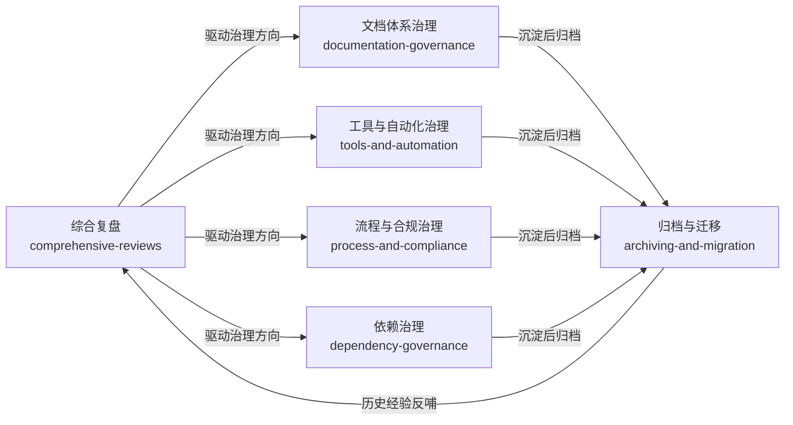

# 项目治理复盘报告

> 本目录存放项目治理类复盘报告，涵盖项目整体回顾、文档体系治理、工具与自动化、流程合规、依赖治理、归档迁移六大主题，采用二级主题分类组织，便于按治理维度查阅。
>
> **根目录独立报告**（1 份）：[retrospective-daily-20260629-full-day/](retrospective-daily-20260629-full-day/README.md) — 2026-06-29单日全面复盘（元复盘）

## 主题分类总览

| 主题 | 定义 | 报告数量 |
|------|------|---------|
| [comprehensive-reviews/](comprehensive-reviews/README.md) | 项目级综合复盘，覆盖全周期里程碑与核心发现 | 5 份 |
| [documentation-governance/](documentation-governance/README.md) | 文档体系治理，包括结构优化、命名规范、渲染修复、链接校验 | 9 份 |
| [tools-and-automation/](tools-and-automation/README.md) | 工具与自动化治理，含工具熵优化、自动化文档生成、共享代码库提取 | 7 份 |
| [process-and-compliance/](process-and-compliance/README.md) | 流程与合规治理，覆盖工作空间创建、建议执行闭环、启动协议合规、阶段守卫、数据安全治理、RACI责任矩阵与短指令上下文重建 | 7 份 |
| [dependency-governance/](dependency-governance/README.md) | 依赖与子模块治理，含 Git submodule 双模式治理框架、边界模型、访问控制 | 1 份 |
| [archiving-and-migration/](archiving-and-migration/README.md) | 归档与内容迁移，含历史内容萃取、参赛作品归档、Demo流程探索 | 4 份 |

## 主题关系图



## 各主题报告详情

### [comprehensive-reviews/](comprehensive-reviews/README.md) — 项目综合复盘

| 报告 | 日期 | 核心内容 |
|------|------|---------|
| [retrospective-comprehensive-20260623/](comprehensive-reviews/retrospective-comprehensive-20260623/README.md) | 2026-06-23 | 智能体开发规范体系综合复盘，已原子化为6个子模块 |
| [retrospective-project-comprehensive-20260625/](comprehensive-reviews/retrospective-project-comprehensive-20260625/README.md) | 2026-06-25 | 项目级全面复盘（3天节点），380+文件、40份报告、71个可复用模式 |
| [retrospective-specweave-full-project-comprehensive-20260626/](comprehensive-reviews/retrospective-specweave-full-project-comprehensive-20260626/README.md) | 2026-06-26 | SpecWeave项目结项全面复盘（4天），229次提交、29个Spec、796个文档、46个模式 |
| [retrospective-forum-automation-full-workflow-20260629/](comprehensive-reviews/retrospective-forum-automation-full-workflow-20260629/README.md) | 2026-06-29 | 论坛自动化全流程复盘，含发帖、编辑、回复等场景的完整自动化实践 |
| [retrospective-daily-review-and-forum-posting-20260630/](comprehensive-reviews/retrospective-daily-review-and-forum-posting-20260630/README.md) | 2026-06-30 | 2026-06-29全日复盘+论坛跟帖发布任务复盘，Ember composer框架感知操作、同名按钮消歧、SPA自动化模式萃取 |

### [documentation-governance/](documentation-governance/README.md) — 文档体系治理

| 报告 | 日期 | 核心内容 |
|------|------|---------|
| [reports-duplication-optimization-report.md](documentation-governance/reports-duplication-optimization-report.md) | 2026-06-24 | 复盘报告体系重复内容优化，移除冗余引用块、精简导航结构 |
| [retrospective-report-system-planning/](documentation-governance/retrospective-report-system-planning/README.md) | 2026-06-23 | README系统规划章节设计，四层闭环架构 |
| [retrospective-readme-sync-and-brand-naming-20260624/](documentation-governance/retrospective-readme-sync-and-brand-naming-20260624/README.md) | 2026-06-24 | README同步与SpecWeave品牌命名一致性修复 |
| [retrospective-report-four-topic-structure-optimization-20260624/](documentation-governance/retrospective-report-four-topic-structure-optimization-20260624/README.md) | 2026-06-24 | 复盘报告四主题结构优化推广，24个project-overview合并、23个连接器删除 |
| [retrospective-insights-reorg-20260626/](documentation-governance/retrospective-insights-reorg-20260626/README.md) | 2026-06-26 | 竹简悟道洞察库重组，从2个失衡文件重组为3个四层结构均衡文件 |
| [retrospective-link-fix-depth-adjustment-20260626/](documentation-governance/retrospective-link-fix-depth-adjustment-20260626/README.md) | 2026-06-26 | 断链修复与链接自动校正工具增强，新增try_adjust_relative_depth()算法 |
| [retrospective-mermaid-rendering-fix-20260626/](documentation-governance/retrospective-mermaid-rendering-fix-20260626/README.md) | 2026-06-26 | Mermaid渲染兼容性修复，提炼安全编码五规则与陷阱速查表，已原子化insights/和suggestions/子目录 |
| [retrospective-mermaid-rendering-regression-20260629/](documentation-governance/retrospective-mermaid-rendering-regression-20260629/README.md) | 2026-06-29 | Mermaid渲染回归治理失效复盘，识别规范落地断裂、工具覆盖盲区、点修复偏误 |
| [retrospective-mermaid-governance-closure-20260629/](documentation-governance/retrospective-mermaid-governance-closure-20260629/README.md) | 2026-06-29 | Mermaid治理闭环执行，安全模板、注释感知修复、一站式操作指南，治理成熟度L3 |
| [retrospective-report-document-dedup-insights-20260626/](documentation-governance/retrospective-report-document-dedup-insights-20260626/README.md) | 2026-06-26 | 文档去重洞察复盘，识别报告体系重复内容来源与优化策略 |

### [tools-and-automation/](tools-and-automation/README.md) — 工具与自动化治理

| 报告 | 日期 | 核心内容 |
|------|------|---------|
| [retrospective-report-tool-entropy-nonlinear-optimization/](tools-and-automation/retrospective-report-tool-entropy-nonlinear-optimization/README.md) | 2026-06-23 | 工具熵非线性优化，自动化规模不经济规律 |
| [retrospective-report-code-wiki-generation/](tools-and-automation/retrospective-report-code-wiki-generation/README.md) | 2026-06-24 | Code Wiki自动化文档生成任务 |
| [retrospective-scripts-shared-lib-extraction-20260626/](tools-and-automation/retrospective-scripts-shared-lib-extraction-20260626/README.md) | 2026-06-26 | 检查脚本共享库提取，重复发现、重构bug发现、概念域分离、Powershell编码陷阱 |
| [retrospective-test-plan-and-atomic-commit-20260629/](tools-and-automation/retrospective-test-plan-and-atomic-commit-20260629/README.md) | 2026-06-29 | 测试计划与原子提交复盘 |
| [retrospective-forum-bot-logging-20260629/](tools-and-automation/retrospective-forum-bot-logging-20260629/README.md) | 2026-06-29 | 论坛自动化脚本开发与日志增强复盘 |
| [retrospective-forum-posting-skill-optimization-20260629/](tools-and-automation/retrospective-forum-posting-skill-optimization-20260629/README.md) | 2026-06-29 | 论坛发帖Skill优化复盘，含五要素模型、三层路由任务预检、可用性启发式结构守卫等6个元洞察 |
| [retrospective-git-local-clone-bug-20260701/](tools-and-automation/retrospective-git-local-clone-bug-20260701/README.md) | 2026-07-01 | Windows 本地路径 `git clone` 触发 Git refs 事务内部异常（`BUG: refs/files-backend.c:3174`），沉淀最小破坏处置协议与 `--no-local` 规避路径 |

### [process-and-compliance/](process-and-compliance/README.md) — 流程与合规治理

| 报告 | 日期 | 核心内容 |
|------|------|---------|
| [retrospective-report-create-apps-directory/](process-and-compliance/retrospective-report-create-apps-directory/README.md) | 2026-06-23 | apps/应用开发工作空间创建与双区开发生命周期协议 |
| [retrospective-report-suggestion-execution-and-pattern-import/](process-and-compliance/retrospective-report-suggestion-execution-and-pattern-import/README.md) | 2026-06-23 | 改进建议执行与模式导入闭环 |
| [retrospective-session-agents-md-violation-20260624/](process-and-compliance/retrospective-session-agents-md-violation-20260624/README.md) | 2026-06-24 | AGENTS.md启动协议违反复盘，三重连锁错误根因分析 |
| [retrospective-stage-guardrails-logging-20260629/](process-and-compliance/retrospective-stage-guardrails-logging-20260629/README.md) | 2026-06-29 | 阶段守卫机制落地复盘，提取3个可复用模式 |
| [retrospective-ai-agent-data-security-governance-20260629/](process-and-compliance/retrospective-ai-agent-data-security-governance-20260629/README.md) | 2026-06-29 | AI智能体互联数据安全治理体系建设复盘，五层架构10份规则文档交付 |
| [retrospective-raci-governance-matrix-20260629/](process-and-compliance/retrospective-raci-governance-matrix-20260629/README.md) | 2026-06-29 | RACI治理责任矩阵落地复盘，5个指令集69行RACI标准化，五层审批模型修正 |
| [retrospective-short-command-context-rehydration-20260701/](process-and-compliance/retrospective-short-command-context-rehydration-20260701/README.md) | 2026-07-01 | 短指令在新会话中的上下文重建与参数澄清复盘，沉淀“对象/交付”二槽位治理经验 |

### [dependency-governance/](dependency-governance/README.md) — 依赖与子模块治理

| 报告 | 日期 | 核心内容 |
|------|------|---------|
| [retrospective-vendor-flexloop-governance-adjustment-20260629/](dependency-governance/retrospective-vendor-flexloop-governance-adjustment-20260629/README.md) | 2026-06-29 | flexloop子模块从第三方只读升级为自有协作模式，建立双模式子模块治理框架，萃取5个可复用模式（双模式治理、存量暴露效应、跨平台编码、条件导入、路径锚点） |

### [archiving-and-migration/](archiving-and-migration/README.md) — 归档与内容迁移

| 报告 | 日期 | 核心内容 |
|------|------|---------|
| [retrospective-export-20260623/](archiving-and-migration/retrospective-export-20260623/README.md) | 2026-06-23 | 复盘报告导出卡片 |
| [retrospective-zhujian-wudao-apps-archiving-20260625/](archiving-and-migration/retrospective-zhujian-wudao-apps-archiving-20260625/README.md) | 2026-06-25 | 竹简悟道参赛作品归档至apps/，参赛作品归档5步法 |
| [retrospective-xinet-content-extraction-archiving-20260625/](archiving-and-migration/retrospective-xinet-content-extraction-archiving-20260625/README.md) | 2026-06-25 | xinet目录系统性内容萃取与归档，54151文件扫描分类 |
| [retrospective-specweave-demo-production-flow-20260625/](archiving-and-migration/retrospective-specweave-demo-production-flow-20260625/README.md) | 2026-06-25 | SpecWeave Demo制作流程探索，70%完成度判断、自指涉证据闭环三层模型 |

## 目录结构树

```
project-governance/
├── README.md                                    ← 本文件（主索引）
├── retrospective-daily-20260629-full-day/       ← 根目录独立报告：06-29全天元复盘
├── comprehensive-reviews/                       ← 项目综合复盘（5份）
│   ├── README.md                                · 主题索引
│   ├── retrospective-comprehensive-20260623/    · 智能体开发规范体系综合复盘
│   ├── retrospective-project-comprehensive-20260625/ · 项目级全面复盘（3天节点）
│   ├── retrospective-specweave-full-project-comprehensive-20260626/ · SpecWeave结项全面复盘
│   ├── retrospective-forum-automation-full-workflow-20260629/ · 论坛自动化全流程复盘
│   └── retrospective-daily-review-and-forum-posting-20260630/ · 全日复盘+论坛发帖任务复盘
├── documentation-governance/                    ← 文档体系治理（9份）
│   ├── README.md                                · 主题索引
│   ├── reports-duplication-optimization-report.md · 重复内容优化（独立文件）
│   ├── retrospective-report-system-planning/    · README系统规划章节
│   ├── retrospective-readme-sync-and-brand-naming-20260624/ · 品牌命名一致性
│   ├── retrospective-report-four-topic-structure-optimization-20260624/ · 四主题结构优化
│   ├── retrospective-insights-reorg-20260626/   · 洞察库重组
│   ├── retrospective-link-fix-depth-adjustment-20260626/ · 断链修复与深度调整
│   ├── retrospective-mermaid-rendering-fix-20260626/ · Mermaid渲染修复（含insights/suggestions子目录）
│   ├── retrospective-mermaid-rendering-regression-20260629/ · Mermaid治理失效复盘
│   ├── retrospective-mermaid-governance-closure-20260629/ · Mermaid治理闭环执行
│   └── retrospective-report-document-dedup-insights-20260626/ · 文档去重洞察复盘
├── tools-and-automation/                        ← 工具与自动化治理（7份）
│   ├── README.md                                · 主题索引
│   ├── retrospective-report-tool-entropy-nonlinear-optimization/ · 工具熵非线性优化
│   ├── retrospective-report-code-wiki-generation/ · Code Wiki生成
│   ├── retrospective-scripts-shared-lib-extraction-20260626/ · 共享库提取
│   ├── retrospective-test-plan-and-atomic-commit-20260629/ · 测试计划与原子提交
│   ├── retrospective-forum-bot-logging-20260629/ · 论坛自动化脚本
│   ├── retrospective-forum-posting-skill-optimization-20260629/ · 论坛发帖Skill优化
│   └── retrospective-git-local-clone-bug-20260701/ · Git本地克隆异常排查复盘
├── process-and-compliance/                      ← 流程与合规治理（7份）
│   ├── README.md                                · 主题索引
│   ├── retrospective-report-create-apps-directory/ · apps/工作空间创建
│   ├── retrospective-report-suggestion-execution-and-pattern-import/ · 建议执行闭环
│   ├── retrospective-session-agents-md-violation-20260624/ · 启动协议违反复盘
│   ├── retrospective-stage-guardrails-logging-20260629/ · 阶段守卫机制落地
│   ├── retrospective-ai-agent-data-security-governance-20260629/ · AI数据安全治理体系
│   ├── retrospective-raci-governance-matrix-20260629/ · RACI治理责任矩阵
│   └── retrospective-short-command-context-rehydration-20260701/ · 短指令上下文重建复盘
├── dependency-governance/                       ← 依赖与子模块治理（1份）
│   ├── README.md                                · 主题索引
│   └── retrospective-vendor-flexloop-governance-adjustment-20260629/ · flexloop双模式治理
└── archiving-and-migration/                     ← 归档与内容迁移（4份）
    ├── README.md                                · 主题索引
    ├── retrospective-export-20260623/           · 导出卡片
    ├── retrospective-zhujian-wudao-apps-archiving-20260625/ · 竹简悟道作品归档
    ├── retrospective-xinet-content-extraction-archiving-20260625/ · xinet内容萃取归档
    └── retrospective-specweave-demo-production-flow-20260625/ · Demo制作流程
```

## 快速导航指南

| 查阅目的 | 推荐阅读路径 |
|---------|-------------|
| 了解项目整体发展脉络 | comprehensive-reviews/ → 从20260623到20260629按时间顺序阅读 |
| 解决文档相关问题（链接、Mermaid、结构） | documentation-governance/ → Mermaid一站式指南 → 链接修复 → 结构优化 |
| 学习工具设计与自动化决策 | tools-and-automation/ → 共享库提取 → 工具熵优化 → 工具自测效应 |
| 了解开发流程与合规要求 | process-and-compliance/ → apps目录创建 → 阶段守卫 → RACI责任矩阵 → 数据安全治理体系 |
| 管理外部依赖与子模块 | dependency-governance/ → 双模式治理框架 → 三区域边界模型 → 沙箱隔离 |
| 查找历史项目与归档内容 | archiving-and-migration/ → 按归档类型选择 |
| 快速获取可复用模式与洞察 | 各报告目录下的 insight-extraction.md 和 suggestions/ 子目录 |

---
*返回上级：[复盘文档体系索引](../README.md)*
