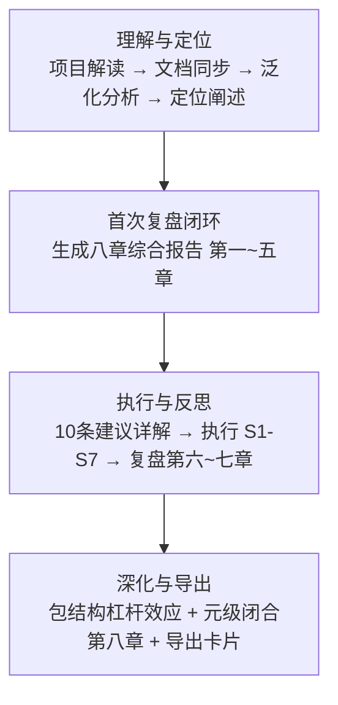

# 二、执行复盘

## 2.1 实施过程回顾

### 完整时间线

| 阶段 | 任务 | 产出 |
|------|------|------|
| 理解与定位 | 项目解读 → 文档同步 → 泛化分析 → 定位阐述 | 项目全景认知 |
| 首次复盘闭环 | 生成八章综合报告 第一~五章 | 基础复盘框架 |
| 执行与反思 | 10条建议详解 → 执行 S1-S7 → 复盘第六~七章 | 改进落地 + 深化复盘 |
| 深化与导出 | 包结构杠杆效应 + 元级闭合第八章 + 导出卡片 | 元级洞察 + 导出交付 |

## 2.2 关键节点分析

### 2.2.1 理解与定位阶段

通过项目解读、文档同步、泛化分析与定位阐述四个步骤，建立对智能体开发规范体系的完整认知，为后续的复盘与改进奠定基础。

### 2.2.2 首次复盘闭环

生成八章综合报告的第一至五章，建立基础复盘框架，识别关键改进方向。

### 2.2.3 执行与反思阶段

详解 10 条改进建议，执行其中 S1-S7 共 7 项，完成后进行第六至七章的复盘，形成"复盘→执行→再复盘"的闭环。

### 2.2.4 深化与导出阶段

深入分析包结构杠杆效应，完成元级闭合第八章，并生成会话导出卡片。

## 2.3 执行情况与结果数据

| 指标 | 数据 |
|------|------|
| 交互轮次 | 12 轮 |
| 总耗时 | ~3 小时 |
| 新增文件数 | 10 |
| 修改文件数 | 22 |
| 方法论模式数 | 5 |

### 改进建议执行矩阵

| # | 建议 | 优先级 | 状态 |
|---|------|--------|------|
| S1 | 更新文档导航表 | 🔴 高 | ✅ 已完成 |
| S2 | 统一复盘命名规范 | 🔴 高 | ✅ 已完成 |
| S3 | prompt_extraction ↔ .agents 绑定 | 🔴 高 | ✅ 已完成 |
| S4 | 合并验证脚本，提取公共库 | 🟡 中 | ✅ 已完成 |
| S5 | self-verification 可执行化 | 🟡 中 | ✅ 已完成 |
| S6 | 泛化引擎 CLI 原型 | 🟡 中 | ✅ 已完成 |
| S7 | 国际化 AGENTS.en.md | 🟡 中 | ✅ 已完成 |
| S8 | CI 管道部署 | 🟢 低 | ⬜ 待办 |
| S9 | 自我洞察仪表盘 | 🟢 低 | ⬜ 待办 |
| S10 | 跨领域角色包 | 🟢 低 | ⬜ 待办 |

**完成率**：7/10（70%）

---
