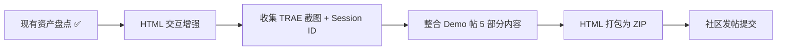

# 执行复盘：SpecWeave Demo 制作流程探索

## 一、任务概述

| 维度 | 内容 |
|------|------|
| 任务目标 | 探索 SpecWeave 参赛 Demo 的制作流程，盘点已有资产，分析差距，制定行动计划 |
| 任务日期 | 2026-06-25 |
| 触发原因 | 用户请求探索 Demo 制作流程，为初赛提交做准备 |
| 任务产出 | 资产盘点表 + 差距分析 + 3 项关键决策 + 5 步制作流程 + HTML 交互增强建议 |

---

## 二、资产盘点过程

### 2.1 盘点范围

本次探索对 SpecWeave 项目的 6 类核心资产进行了全面盘点：

| 资产类别 | 位置 | 数量 | Demo 可用性 |
|---------|------|------|------------|
| 规范体系 | `.agents/` | 80+ Markdown（7 角色/5 协议/4 工作流/8 模块/9 规则/6 指令/26 脚本） | 直接展示 |
| 复盘报告 | `docs/retrospective/reports/` | 41 份报告（173+ Markdown） | 量化证据 |
| 可复用模式 | `docs/retrospective/patterns/` | 56 方法论 + 7 代码 + 7 架构 | 核心展示内容 |
| 知识概念 | `docs/retrospective/concepts/` | 10 个 | 深度展示 |
| 决策框架 | `docs/retrospective/frameworks/` | 4 个 | 深度展示 |
| 验证脚本 | `.agents/scripts/` | 23 个（.py/.ps1/.sh） | CI 截图素材 |
| Spec 文档 | `.trae/specs/` | 23 个 spec（含 checklist/tasks） | TRAE 实践过程证据 |
| 竹简悟道 | `.temp/AI/` | 3 个 HTML + 报名帖 + AGENTS.md | 交叉叙事素材 |

### 2.2 已有 Demo 产出物分析

#### HTML 创意提案（`specweave-creative-proposal.html`，648 行）

对现有 HTML 进行了逐行分析（80→648 行完整读取），确认其结构完整性：

| 区块 | 行范围 | 内容 | 状态 |
|------|--------|------|------|
| CSS 变量定义 | 9-27 | 暗色主题（`#0f0f14`）+ 金色点缀（`#c9a84c`） | ✅ |
| Hero | 427-432 | 大赛标签 + 标题 + 标语 | ✅ |
| Dashboard | 435-456 | 5 卡片量化仪表盘（142/34/23/7/5） | ✅ |
| 四层架构 | 459-500 | Mermaid 可视化（感知→认知→执行→治理） | ✅ |
| 问题与方案 | 503-538 | 4 行对比表（困境→方案） | ✅ |
| 核心资产 | 541-566 | 4 卡片（角色/协议/模式/验证） | ✅ |
| 差异化 | 569-595 | 4 卡片（自指涉/品类独占/TRAE 延伸/临界质量） | ✅ |
| 交叉叙事 | 598-617 | SpecWeave × 竹简悟道关联展示 | ✅ |
| Footer | 620-624 | 开源信息 | ✅ |
| Mermaid 初始化 | 629-646 | dark 主题配置 | ✅ |

**设计特征**：暗色主题、金色点缀、Serif 字体（Source Serif / Noto Serif SC）、Mermaid 图表、CSS fadeUp 动画、噪声纹理叠加层。

**关键发现**：HTML 内容完整（8 区块全覆盖），但缺乏交互性——纯静态展示页，无导航、无展开折叠、无动态计数。

#### 报名帖草稿（`specweave-registration-post.md`，94 行）

对齐官方 4 部分模板：创意名称+介绍 / 目标用户及痛点 / 价值与意义 / 创意产物 HTML 说明。

#### 参赛策略（`export-suggestions.md`，v12）

包含完整的双作品策略、四维评审得分预估、全流程行动清单。

---

## 三、差距分析

### 3.1 初赛 Demo 帖 5 部分要求 vs 当前状态

> **来源**：[初赛参赛指南](https://forum.trae.cn/t/topic/22549)——Demo 帖正文至少包含 4 个部分（§1-§4），§5 为报名帖链接。

| 要求 | SpecWeave 当前状态 | 差距 | 优先级 |
|------|-------------------|------|--------|
| §1 Demo 简介（产品形态+核心用户+2-3 核心功能+截图） | ✅ 报名帖已发布，内容完整 | 需精简为 Demo 帖格式，补充产品截图 | 低 |
| §2 Demo 创作思路（灵感来源+痛点+方向判断） | ✅ 报名帖已发布，内容完整 | 需精简为 Demo 帖格式 | 低 |
| §3 Demo 体验地址（三选一：部署链接/HTML ZIP/演示视频） | ✅ HTML 已上传至报名帖附件（18.1 KB） | Demo 帖需重新上传或引用 | 低 |
| §4 TRAE 实践过程（截图≥3 + Session ID≥3） | ✅ 3 个 Session ID 已收集 + 3 张截图可截取 | 已完成 | ✅ |
| §5 报名帖链接 + 开发心得 | ✅ 报名帖已发布：[forum.trae.cn/t/topic/44402](https://forum.trae.cn/t/topic/44402) | 已完成 | ✅ |

**初赛参赛指南增量信息**（本次完整阅读补充）：
- **Session ID 获取方式**：双击 TRAE 的对话即可复制出来——此前报告中仅说"在对话历史面板中查看"，现确认具体操作方式
- **人气分计算公式**：`人气分 = 点赞数 + 评论数 × 2 + 收藏数 + 转发数`——此前报告中仅记录了 ≥500 赞门槛，现补全计分公式
- **社区发帖限制**：仅支持文字、图片、GIF、链接、20M 以内文件——视频/大文件需上传第三方平台后附链接
- **已有作品参赛规则**：允许已有作品在参赛期间完成实质性版本迭代，但开发必须用 TRAE 完成

### 3.2 核心差距：§4 TRAE 实践过程

§4 是评审中最具差异化价值的部分，要求至少 3 张截图 + 3 个 Session ID。SpecWeave 的 142 次对话分布在 3 天内，证据来源规划：

| 截图内容 | 对应阶段 | 来源 |
|---------|---------|------|
| AGENTS.md 启动协议在 TRAE 中的加载 | 早期对话 | TRAE IDE 对话记录 |
| 四层架构在 TRAE 对话中逐步成形 | 中期对话 | TRAE IDE 对话记录 |
| 验证脚本 CI 运行结果 | 后期对话 | `.agents/scripts/ci-check.ps1` 运行截图 |

---

## 四、关键决策分析

### 决策 1：HTML 文件是直接复用还是重构？

| 选项 | 优势 | 劣势 | 建议 |
|------|------|------|------|
| 直接复用 | 零成本，已完整 | 缺乏交互体验，与"展示页"无异 | 不推荐 |
| 增强交互 | 在现有基础上添加可交互元素 | 中等成本 | **推荐** |
| 完全重构 | 可打造最佳体验 | 高成本，与 80/20 原则冲突 | 不推荐 |

**决策结果**：增强交互——在现有 648 行 HTML 基础上添加侧边栏导航、模式卡片展开、数字动态计数等交互元素。

### 决策 2：TRAE 实践过程证据如何收集？

需从 TRAE IDE 对话历史中截取 3 张关键截图 + 记录 3 个 Session ID，覆盖早期/中期/后期三个阶段。

### 决策 3：Demo 帖与报名帖的关系

| 方案 | 说明 | 建议 |
|------|------|------|
| 报名帖 = Demo 帖 | 初赛提交时直接用报名帖内容 | **推荐** |
| 报名帖 ≠ Demo 帖 | 报名帖精简，Demo 帖增加 §4 | 不推荐（工作量翻倍） |

**决策结果**：报名帖 = Demo 帖——符合参赛策略中"轻量级 Demo 帖策略"（投入控制在 1 小时以内）。

---

## 五、制作流程规划

### 5 步制作流程

| 步骤 | 内容 | 预估时间 | 依赖 |
|------|------|---------|------|
| ① HTML 交互增强 | 侧边栏导航/模式卡片展开/数字动态计数/架构图交互/脚本运行模拟 | 2h | 无 |
| ② 收集 TRAE 证据 | 从 TRAE IDE 对话历史截取 3 张关键截图 + 记录 3 个 Session ID | 1h | TRAE IDE 对话记录 |
| ③ 整合 Demo 帖 | 将报名帖草稿 + §4 TRAE 实践过程合并为完整 Demo 帖 | 1h | ①② |
| ④ HTML 打包 | 将 HTML + 依赖文件打包为 ZIP | 0.5h | ① |
| ⑤ 社区提交 | 在 TRAE 论坛发帖 + 上传 HTML ZIP | 0.5h | ③④ |

**总预估：5 小时**（符合 80/20 原则中 SpecWeave 的 20% 资源分配）

---

## 六、HTML 交互增强建议

| 增强项 | 实现方式 | 价值 | 难度 |
|--------|---------|------|------|
| 侧边栏导航 | 固定位置目录，点击平滑滚动到对应区块 | 评审浏览体验 | 低 |
| 模式卡片展开 | 34 个模式以折叠列表展示，点击展开详情 | 信息密度可控 | 中 |
| 量化数字动画 | Dashboard 数字从 0 滚动到目标值 | 视觉冲击力 | 低 |
| 架构图交互 | 四层架构 Mermaid 图节点可点击展开说明 | 深度探索 | 高 |
| 脚本运行模拟 | 展示 CI 检查的输入输出示例 | 证明验证体系可用 | 中 |

---

*数据来源：SpecWeave 项目资产盘点 + 参赛策略分析报告 v12 + 大赛官方 Demo 帖要求*
