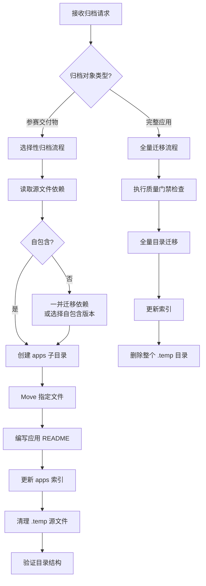

# 洞察萃取 — 竹简悟道归档至 apps/

## 概览

本次归档任务虽为单会话 5 步操作，但暴露出工作流协议与实际场景的张力，并提炼出 4 项可复用模式与 1 套参赛作品归档方法论。

| 洞察编号 | 标题 | 类型 | 成熟度 |
|---------|------|------|--------|
| INS-01 | 选择性归档模式 | 流程模式 | L2 |
| INS-02 | 自包含验证前置模式 | 技术模式 | L3 |
| INS-03 | 工作流协议的骨架与门禁分离原则 | 治理模式 | L3 |
| INS-04 | 索引同步的「首个应用」破冰原则 | 文档模式 | L2 |

---

## INS-01：选择性归档模式

### 现象

用户明确指定归档 `.temp/AI/` 下的 2 个文件（`竹简悟道_完整版.html` + `报名帖_竹简悟道.md`），而非迁移整个 `.temp/AI/` 目录。`.temp/AI/` 下仍保留 `竹简悟道.html`、`竹简悟道_展示页.html`、`.agents/` 子目录等中间产物。

### 洞察

工作流协议 `app-development-workflow.md` 设计为「全量目录迁移」（`.temp/<app-name>/` → `apps/<app-name>/`），但实际场景中，用户往往只需要归档**已定稿的交付物**，而非整个开发目录。这种「选择性归档」具有以下特征：

| 维度 | 全量迁移 | 选择性归档 |
|------|---------|-----------|
| 触发条件 | 应用开发完成，通过质量门禁 | 交付物定稿，需进入版本控制 |
| 迁移对象 | 整个 `.temp/<app-name>/` 目录 | 指定文件（通常是「完整版」「最终版」） |
| 质量门禁 | 必须（测试/审查/缺陷/文档） | 跳过（交付物本身即为验收标准） |
| 源目录处理 | 删除整个目录 | 仅删除已迁移文件 |
| 适用场景 | 正式应用开发流程 | 参赛作品、阶段性成果归档 |

### 可复用模式

```
选择性归档 = 目录创建 + 指定文件 Move + 应用 README 编写 + 索引同步 + 源文件清理
（跳过测试/审查门禁，保留 .temp/ 中间产物）
```

### 成熟度评估

**L2（已验证）**：在本次任务中验证有效，但未在不同类型交付物场景下复测。

---

## INS-02：自包含验证前置模式

### 现象

`.temp/AI/` 下存在多个 HTML 版本：
- `竹简悟道.html` — 引用 `.agents/html/` 下 3 个外部文件（styles.css、data.js、app.js）
- `竹简悟道_完整版.html` — 自包含，CSS/JS 全部内联
- `竹简悟道_展示页.html` — 另一版本

用户选择归档「完整版」，而非原版。

### 洞察

归档 HTML 资产前，**必须验证其自包含性**。原版 HTML 依赖 `.agents/html/` 目录下的 3 个文件，若直接迁移原版会导致断链。用户选择「完整版」正是规避了这一风险。

### 验证模式

迁移前用 Grep 检索外部依赖引用：

```regex
(href|src)=["']\.agents|\.css|\.js["']
```

- **命中**：存在外部依赖 → 需一并迁移依赖文件，或选择自包含版本
- **未命中**：自包含 → 可直接迁移

### 适用范围

不仅限于 HTML，任何含资源引用的文件（如引用本地图片的 Markdown、引用本地脚本的配置文件）迁移前均应执行依赖验证。

### 成熟度评估

**L3（最佳实践）**：验证手段明确、可自动化、适用于多场景。

---

## INS-03：工作流协议的骨架与门禁分离原则

### 现象

`app-development-workflow.md` 的迁移条件包含 4 项门禁：
1. 核心功能实现完毕并通过测试
2. 代码审查通过
3. 无阻塞性缺陷
4. 文档已编写

本次归档任务未执行测试与审查，但直接采用了协议的「流程骨架」：
- ✅ 迁移前检查（简化为依赖验证）
- ✅ 执行迁移（Move 操作）
- ✅ 更新索引（apps/README.md §2.3）
- ✅ 迁移后验证（目录结构确认）
- ❌ 删除暂存目录（改为删除指定源文件）

### 洞察

工作流协议可拆解为两层：

| 层级 | 内容 | 可跳过 |
|------|------|--------|
| **流程骨架** | 迁移前检查 → 执行迁移 → 更新索引 → 迁移后验证 → 清理 | ❌ 不可跳过 |
| **质量门禁** | 测试通过 / 审查通过 / 无缺陷 / 文档完善 | ✅ 可按场景跳过 |

**分离原则**：流程骨架保证「迁移动作的正确性」，质量门禁保证「迁移对象的成熟度」。参赛交付物归档场景下，交付物本身即为验收标准，门禁可跳过；但骨架必须完整执行，否则会导致索引缺失、源文件残留等问题。

### 反例预警

若「质量门禁」与「流程骨架」耦合过紧（如门禁未通过则禁止执行骨架），会导致：
- 参赛作品等非开发场景无法归档
- 用户被迫绕过协议直接手动操作，失去可追溯性

### 成熟度评估

**L3（最佳实践）**：原则清晰，已在本次任务中验证，且可推广至其他「非标准迁移场景」（如临时演示版本归档、废弃应用归档等）。

---

## INS-04：索引同步的「首个应用」破冰原则

### 现象

`apps/README.md` 原本只有 §2.1 `shared/` 与 §2.2「应用独立目录」结构说明，**没有应用清单索引章节**。本次归档是 `apps/` 目录创建后**首个实际应用入驻**，需要新建 §2.3「应用清单」。

### 洞察

索引章节的建立存在「鸡生蛋」问题：
- 没有应用时，索引章节为空，显得多余
- 有应用入驻时，若未提前建立索引章节，需临时新增

**破冰原则**：首个应用入驻时，必须同步建立索引章节（即使只有 1 行）。这为后续应用提供了追加目标，避免「先有应用再建索引」的滞后。

### 实施模式

| 阶段 | 动作 | 章节状态 |
|------|------|---------|
| apps/ 目录创建时 | 可选：预留 §2.3 占位 | 空章节或不存在 |
| 首个应用入驻时 | **必须**：建立 §2.3 并填入首行 | 1 行 |
| 后续应用入驻时 | 追加表格行 | N 行 |

### 成熟度评估

**L2（已验证）**：本次任务验证了「首个应用破冰」场景，但「后续应用追加」场景尚未验证。

---

## 方法论提炼：参赛作品归档工作流

基于本次任务，提炼出参赛作品归档的标准工作流：



### 适用范围

- 参赛作品归档（HTML Demo + 报名帖）
- 阶段性成果归档（特定版本快照）
- 临时演示版本归档（非完整应用）

---

## 机会识别

### 机会 1：apps/ 索引自动化

当前 `apps/README.md` §2.3 为手工维护。随着应用数量增加，可考虑开发脚本自动扫描 `apps/` 子目录并生成索引表格，类似 `.agents/scripts/generate-nav.py` 的模式。

### 机会 2：选择性归档的协议补丁

`app-development-workflow.md` 可补充「选择性归档」子流程，明确其适用条件与门禁跳过规则，避免未来执行者再次面临「协议设计 vs 实际场景」的张力。

### 机会 3：竹简悟道完整资产归档

当前仅归档了 2 个核心交付物。`.temp/AI/.agents/` 下还有：
- 产品规格文档（490 行）
- 全面复盘报告（279 行）
- 62 条洞察库（702 + 2353 行）
- 可迁移洞察与模板集（432 + 540 行）

这些资产具有长期复用价值，可考虑后续归档至 `apps/zhujian-wudao/docs/` 或 `docs/retrospective/patterns/`。
