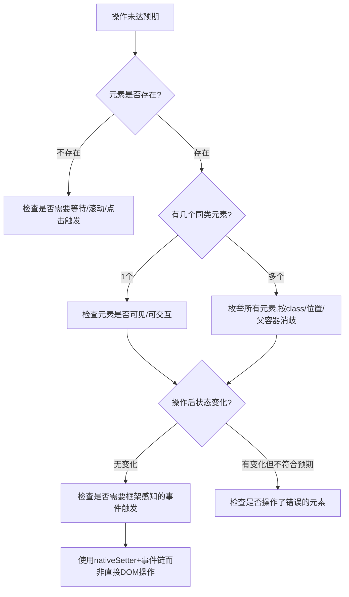

# 洞察萃取

## 一、可复用模式

### 模式1：SPA框架感知的textarea设值模式

**场景**：在Ember/React/Vue等SPA框架中，需要通过JavaScript程序化设置textarea/input值并让框架感知。

**反模式**：
```javascript
textarea.value = content;  // 仅更新DOM，框架内部状态不变
```

**正确模式**：
```javascript
const nativeSetter = Object.getOwnPropertyDescriptor(
  window.HTMLTextAreaElement.prototype, 'value'
).set;
nativeSetter.call(textarea, content);
textarea.dispatchEvent(new Event('input', {bubbles: true}));
textarea.dispatchEvent(new Event('change', {bubbles: true}));
textarea.focus();
```

**原理**：SPA框架通常通过property setter监听值变化，直接设置DOM属性(attributes)绕过了setter。必须通过原型链上的原生setter设置值，然后触发input/change事件，框架的响应式系统才能正确更新。

**成熟度**：L2（在Discourse场景验证，需在React/Vue场景进一步验证）

---

### 模式2：SPA同名按钮消歧模式

**场景**：页面中存在多个textContent和class相似的按钮（如"打开编辑器"按钮和"提交表单"按钮），需要精确区分。

**策略**：
1. **先枚举再选择**：操作前先用 `Array.from(document.querySelectorAll('button'))` 列出所有候选按钮，检查textContent、className、getBoundingClientRect()位置
2. **排除法定位**：如果知道某些按钮不是目标（如footer-button），通过 `!b.className.includes('xxx')` 排除
3. **父容器验证**：检查按钮的closest()父容器，composer内的按钮位于 `.reply-composer` 或 `.d-editor` 内，而非 `topic-footer-button`
4. **可见性判断**：结合 `offsetParent !== null` 和 `getBoundingClientRect()` 判断按钮是否在当前视口内

**成熟度**：L2（Discourse场景验证）

---

### 模式3：异步操作后多信号验证模式

**场景**：提交表单/POST请求后，需要确认操作是否成功。

**反模式**：立即刷新页面或检查单一信号。

**正确模式**：
1. **等待充分**：提交后等待3-5秒（SPA通常需要POST→响应→重定向→渲染）
2. **多信号交叉验证**：
   - URL变化（如/2→/3）
   - DOM元素数量变化（如帖子数从2→3）
   - 页面高度变化
   - 文本内容验证（搜索关键字是否出现在DOM中）
   - 截图目视确认
3. **高度变化作为早期信号**：如果body.scrollHeight突然增加，通常意味着新内容已渲染，即使URL还未更新

**成熟度**：L2（本次验证）

---

### 模式4：MCP浏览器操作故障诊断决策树

**场景**：MCP integrated_browser操作未达到预期效果，需要系统性诊断。



**成熟度**：L1（本次任务总结，需更多场景验证）

## 二、规律发现

### 规律1：浏览器自动化的"直接操作→失败→诊断→框架感知"循环

本次论坛发帖过程中，几乎每一步都经历了：直接DOM操作→失败→诊断原因→发现框架特性→使用框架感知方式→成功。这是SPA自动化的典型模式：**直觉式DOM操作在现代框架面前经常失效，必须理解框架的内部机制才能可靠操作。**

### 规律2：上下文压缩后的恢复成本

本次任务跨会话恢复，summary中包含了"在回复编辑器定位过程中"的信息但没有具体的DOM状态（比如之前找到了哪个按钮、textarea是否打开等）。恢复后需要重新探索页面状态，这带来了额外的试错成本。**上下文压缩丢失的不仅是对话历史，更是操作现场的中间状态。**

### 规律3：自动化脚本失败时的降级策略

forum-bot.py（Playwright脚本）失败后，降级到MCP integrated_browser方案是正确的。Playwright脚本虽然理论上更稳定，但一旦选择器不匹配就完全无法工作；MCP浏览器虽然操作粒度更细，但提供了evaluate能力，可以灵活诊断和适应页面变化。**双方案模式（脚本优先+MCP兜底）是论坛自动化的正确架构。**

## 三、元洞察

### 元洞察1：工具可靠性与透明度的权衡

forum-bot.py封装了复杂的Playwright操作，但当它失败时，内部状态不可见，难以诊断。MCP浏览器虽然操作步骤更多，但每一步都可以通过evaluate观察DOM状态，调试透明度高。这揭示了一个普遍规律：**封装度越高的工具，成功时越高效，但失败时越难调试；粒度越细的工具，操作越繁琐，但诊断能力越强。** 最佳实践是双方案并存，脚本作为快路径，MCP作为慢路径/诊断路径。

### 元洞察2："点错按钮"的认知偏差

本次任务中，至少3次点击了错误的按钮（分享按钮、视口外按钮、非composer的提交按钮）。根本原因是**确认偏误**——找到一个看起来符合条件的按钮就急于点击，没有系统枚举所有候选并排除。这与之前观察到的"就近规范陷阱"是同一类认知偏差：在信息不完全时，倾向于使用第一个看似合理的选项，而非穷举后选择。

### 元洞察3：非线性返工成本的再次验证

AGENTS.md中提到"跳过5分钟规范读取可能导致30分钟以上重构返工"，本次任务中跳过了"先枚举按钮再操作"这5秒钟的步骤，导致了约15分钟的反复试错（3次错误提交+2次页面刷新+重新填写内容）。这再次验证了**前置诊断的高ROI**——操作前花10秒枚举和分析，可以节省分钟级的返工。
