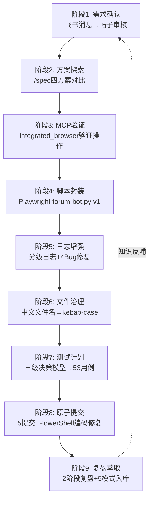

+++
id = "retrospective-forum-automation-full-workflow-20260629-readme"
date = "2026-06-29"
type = "index"
scope = "comprehensive"
+++

# 论坛自动化全工作流综合复盘

> **复盘范围**：从飞书消息访问到论坛自动化脚本开发、日志增强、测试计划、原子提交、复盘萃取的完整工作流
> **复盘日期**：2026-06-29
> **执行模式**：单智能体多轮会话，用户引导+AI迭代+自我复盘闭环
> **报告类型**：跨阶段综合复盘（meta-level）
> **前置复盘**：
> - [retrospective-forum-bot-logging-20260629](../../tools-and-automation/retrospective-forum-bot-logging-20260629/README.md) — 阶段1:脚本开发与日志增强
> - [retrospective-test-plan-and-atomic-commit-20260629](../../tools-and-automation/retrospective-test-plan-and-atomic-commit-20260629/README.md) — 阶段2:测试计划与原子提交

## 项目概览

本次工作流横跨**9个阶段**，从"访问一条飞书消息"起步，最终产出1个自动化脚本(1099行)、1份测试计划(53用例)、5个原子提交、2份阶段复盘、5个可复用模式。整个过程展现了**从偶然需求到系统化知识沉淀**的完整演进路径。

### 核心元发现

**最有价值的产出不是脚本本身，而是过程中萃取的方法论。** forum-bot.py是一个针对特定论坛的自动化工具，但其开发过程产出的"三级决策模型"、"分级日志双轨输出"、"多信号组合检测"、"会话边界提交原则"等模式，具有跨领域复用价值。**工具是消耗品，模式是资产。**

### 全工作流数据

| 维度 | 数值 |
|------|------|
| 工作流阶段 | 9个 |
| 技术方案探索 | 4种（MCP/agent-browser/REST API/Playwright） |
| 最终脚本规模 | 1099行 Python |
| 修复Bug数 | 7个（4功能+3工具链） |
| 测试用例 | 53个（9阶段，P0/P1/P2三级） |
| 原子提交 | 5个（feat/docs/test） |
| 萃取模式 | 5个（3代码/方法论+2元模式） |
| 复盘报告 | 3份（2阶段+1综合） |
| 洞察数 | 10条（6阶段+4元） |

### 工作流演进图

## 子模块导航

| 章节 | 文件 | 说明 |
|------|------|------|
| 全流程执行复盘 | [execution-retrospective.md](execution-retrospective.md) | 9阶段时间线、跨阶段决策链、演进规律分析 |
| 元洞察萃取 | [insight-extraction.md](insight-extraction.md) | 4条跨阶段元洞察、知识沉淀复利模型 |
| 导出建议 | [export-suggestions.md](export-suggestions.md) | 系统性改进建议、模式成熟度更新、后续方向 |
