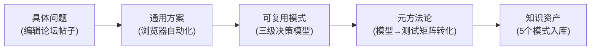

+++
id = "retrospective-forum-automation-full-workflow-execution"
date = "2026-06-29"
type = "execution-retrospective"
scope = "comprehensive"
source = "论坛自动化全工作流9阶段"
+++

# 全流程执行复盘 — 论坛自动化工作流9阶段

## 一、9阶段时间线

### 1.1 阶段概览

| 阶段 | 名称 | 触发 | 核心产出 | 耗时(估) |
|------|------|------|---------|---------|
| S1 | 需求确认 | 用户提供飞书消息链接 | 3帖子审核状态确认 | ~15min |
| S2 | 方案探索 | 用户执行/spec | 4方案对比矩阵+PRD | ~30min |
| S3 | MCP验证 | 用户建议用集成浏览器 | 编辑/回复/清草稿验证 | ~25min |
| S4 | 脚本封装 | 用户要求封装Python脚本 | forum-bot.py v1 (580行) | ~20min |
| S5 | 日志增强 | 用户要求加logger.info | forum-bot.py v2 (1099行)+4Bug修复 | ~35min |
| S6 | 文件治理 | 用户指出中文文件名不一致 | discourse-api-research.md重命名 | ~5min |
| S7 | 测试计划 | 用户要求基于三级决策模型 | 53用例测试计划(313行) | ~10min |
| S8 | 原子提交 | 用户要求原子提交 | 5个原子提交 | ~15min |
| S9 | 复盘萃取 | 用户要求复盘+洞察+萃取+更新 | 2份复盘报告+5个模式 | ~25min |

### 1.2 跨阶段决策链

整个工作流的关键决策并非孤立，而是形成了一条**决策链**，每个决策都以前序决策的产出为输入：

**决策链的三个特征**：
1. **前序产出即后序输入**：S3的MCP验证操作序列直接成为S4脚本封装的参考实现
2. **问题即下一步方向**：S5日志增强中发现的Bug，其修复模式成为S9萃取的资产
3. **用户引导是方向舵**：用户在S2、S4、S5、S7、S8、S9的关键节点提供了方向性引导

## 二、跨阶段演进规律

### 2.1 规律一：从"解决一个问题"到"沉淀一套方法"

整个工作流展现了**抽象层级递进**的规律：
- S1-S3：解决具体问题（编辑这个帖子的标题）
- S4-S5：提炼通用方案（Playwright论坛自动化脚本）
- S7：模式应用（三级决策模型→测试矩阵）
- S9：元方法论萃取（模型→测试矩阵转化模式）

**每次抽象升级都伴随着复用价值的指数级增长**：一个具体问题的解决方案只能解决同类问题，但一个方法论可以指导无数类似场景。

### 2.2 规律二：用户引导的"三波节奏"

| 波次 | 阶段 | 用户引导类型 | 特征 |
|------|------|------------|------|
| 第一波 | S1-S3 | 方向引导 | "检查帖子状态"/"探索自动发布"——指定大方向 |
| 第二波 | S4-S6 | 技术引导 | "封装Python脚本"/"加logger.info"/"文件名不一致"——指定具体技术要求 |
| 第三波 | S7-S9 | 方法引导 | "基于三级决策模型"/"原子提交"/"复盘+洞察+萃取"——指定方法论 |

**三波节奏的规律**：用户引导从"方向"到"技术"再到"方法"，抽象层级递增。AI的自主性空间在第一波最大（自由选择方案），在第三波最小（严格遵循方法论），但产出价值在第三波最高（可复用模式）。

### 2.3 规律三：Bug即资产

| Bug | 发现阶段 | 修复方式 | 萃取模式 |
|------|---------|---------|---------|
| check_login导航丢失 | S5日志增强 | 保存URL+恢复 | check-and-restore.md |
| 监听器漏注册 | S5日志增强 | 提取公共函数 | (隐含在分级日志模式中) |
| JS正则警告 | S5日志增强 | raw string | (代码细节，未萃取) |
| 静态资源刷屏 | S5日志增强 | 扩展名过滤 | dual-channel-tiered-logging.md |
| PowerShell引号失败 | S8原子提交 | -F文件参数 | (记录在复盘洞察中) |

**规律**：每个Bug的修复都隐含一个可复用的防护模式。Bug越深层（架构级>代码级>环境级），萃取出的模式复用价值越高。

## 三、量化统计与对比

### 3.1 产出分层统计

| 层次 | 产出 | 数量 | 复用价值 |
|------|------|------|---------|
| 即用层 | forum-bot.py脚本 | 1个 | 单场景使用 |
| 文档层 | 知识库/Spec/测试计划 | 4份 | 团队参考 |
| 模式层 | 可复用模式 | 5个 | 跨场景复用 |
| 方法论层 | 元洞察 | 4条 | 跨领域指导 |

### 3.2 时间投入产出比

| 阶段 | 时间占比 | 产出价值 | ROI评估 |
|------|---------|---------|---------|
| S1-S3(需求+验证) | 25% | 确认可行性 | 基础必要 |
| S4-S5(开发+增强) | 30% | 可运行脚本+4Bug修复 | 核心产出 |
| S6(文件治理) | 3% | 规范一致性 | 低成本高收益 |
| S7(测试计划) | 7% | 53用例测试矩阵 | 高ROI |
| S8(原子提交) | 10% | 5个规范提交 | 版本控制必要 |
| S9(复盘萃取) | 15% | 5模式+3复盘报告 | **最高ROI** |

**S9复盘萃取的时间占比仅15%，但产出了整个工作流中复用价值最高的资产（5个可复用模式）。** 这验证了"复盘是杠杆率最高的工程活动"这一规律。

## 四、跨阶段问题分析

### 4.1 方案探索的沉没成本

S2阶段探索了4种方案（MCP/agent-browser/REST API/Playwright），但最终只有2种被实际使用（MCP验证+Playwright封装）。agent-browser因沙箱限制放弃，REST API因无API Key未深入。

**根因**：方案探索阶段无法预知环境约束（沙箱限制），导致部分探索投入成为沉没成本。

**改进方向**：方案探索前先做"环境约束快速验证"（5分钟内确认沙箱能力），再决定探索深度。

### 4.2 日志增强的事后补救性

S5日志增强是在S4脚本封装完成后，用户主动要求"加详细logger.info"才启动的。如果S4阶段就内置分级日志，S5的4个Bug中有3个可能不会出现（导航丢失、监听器漏注册、静态资源刷屏都可通过日志快速发现）。

**根因**：脚本开发初期的"功能优先"惯性，忽视了可观测性的基础设施属性。

**改进方向**：将"分级日志系统"纳入脚本脚手架的默认配置，而非事后增强。

### 4.3 复盘的延迟性

S9复盘萃取是在S8原子提交完成后，用户主动要求"复盘+洞察+萃取+更新"才启动的。如果S5日志增强后就立即复盘，Bug修复模式可以在S7测试计划设计前就入库，测试计划可以直接引用模式而非重新发现。

**根因**：复盘被视为"收尾活动"而非"即时活动"。

**改进方向**：在每个Bug修复后立即做"微复盘"（5分钟，单条洞察），而非等整个工作流结束才做综合复盘。
